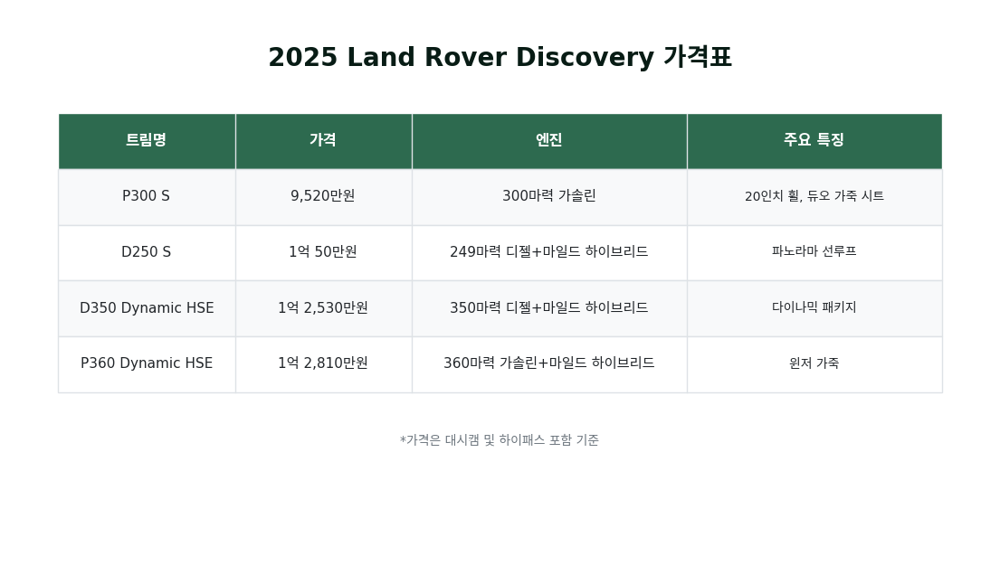
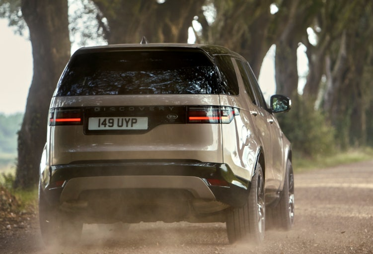

## 한 눈에 보는 디스커버리의 매력

안녕하세요, 자동차 애호가 여러분! ALLEX입니다.

오늘은 2025년형 랜드로버 디스커버리에 대해 자세히 살펴보겠습니다. 과연 이 차량이 럭셔리 SUV 시장에서 어떤 매력을 선사하는지 함께 알아보시죠!

디스커버리는 7인승 대형 SUV로, 가족 단위 사용자들에게 특히 매력적입니다. 가장 큰 장점은 진정한 오프로드 성능과 프리미엄 편안함을 동시에 제공한다는 점이에요.

도심에서는 우아하게, 험로에서는 강력하게!

이게 바로 디스커버리만의 독특한 개성입니다!

### ⚡성능, 어떤 걸 선택할까?

네 가지 엔진 옵션이 준비되어 있어요:

### 디젤 엔진 옵션

- D250 S: 249마력 3.0L 직렬 6기통 디젤 + 마일드 하이브리드
- D350 Dynamic HSE: 350마력 3.0L 직렬 6기통 디젤 + 마일드 하이브리드

### 가솔린 엔진 옵션

- P300 S: 300마력 2.0L 직렬 4기통 가솔린
- P360 Dynamic HSE: 360마력 3.0L 직렬 6기통 가솔린 + 마일드 하이브리드

특히 P360과 D350은 마일드 하이브리드 시스템까지 갖춰 뛰어난 성능을 자랑합니다.

### 실내 정숙성, 정말 조용할까?

디스커버리의 액티브 노이즈 캔슬링 기술은 정말 인상적이에요! 각 휠의 센서로 도로 진동을 감지하고, 메리디안 사운드 시스템을 통해 반대 위상의 음파를 생성해 소음을 상쇄합니다.

실제로 소음을 10dB까지 줄일 수 있어요. 와우!

볼륨을 4단계 낮춘 효과와 같다고 하니 장거리 운전이 훨씬 편해질 것 같아요!

### 실내 공간, 정말 7인승일까?

솔직히 말하면, 3열 좌석은 어린이에게 더 적합해요. 성인 7명이 편안하게 탑승하기에는 다소 아쉬운 부분이 있습니다. 하지만 1-2열의 공간과 편의성은 정말 훌륭해요!

아쉬운 점은 3열 뒤 적재공간이 제한적이어서 가족 여행 시 짐이 많다면 고려해볼 점입니다.

### 한국 출시 가격 및 트림별 특징

### 주요 편의사양

**기본 사양 (S 트림)**

- 전자식 에어 서스펜션 표준 탑재
- 3D 서라운드 카메라
- 11.4인치 Pivi Pro 인포테인먼트
- 무선 CarPlay/Android Auto
- 3존 온도 조절 시스템

**상위 트림 추가 사양 (Dynamic HSE)**

- 22인치 유광 블랙 휠
- 매트릭스 LED 헤드램프
- 윈저 가죽 시트 (20방향 전동조절)
- 헤드업 디스플레이
- 메리디안 서라운드 사운드
- 센터 콘솔 냉장고

### 오프로드 성능은 어떨까?

디스커버리는 오프로드에서 진짜 “괴물”이에요!

믈론 럭셔리 SUV를 진짜 오프로드로 사용하긴 맘이 아프지만요. 대신 스키장이나 캠핑장 가는 길이 두렵지 않을 정도로 강력합니다! ⛷

- 35인치 도강 깊이
- 전자동 지형 반응 시스템 (7가지 주행 모드)
- 힐 디센트 컨트롤
- 어댑티브 다이내믹스

### 누구에게 추천할까?

### 이런 분께 추천

- 오프로드 성능과 럭셔리를 모두 원하는 분
- 장거리 운전을 자주 하는 분 (뛰어난 정숙성!)
- 견인이 필요한 레저 활동을 즐기는 분
- 디젤의 경제성과 파워를 원하는 분

### 이런 분께는 아쉬울 수 있어요

- 성인 7명이 꾸준히 탑승해야 하는 경우
- 1억 이하 예산으로 풀옵션을 원하는 분
- 최대한 스포티한 핸들링을 원하는 분

2025 랜드로버 디스커버리는 독특한 개성을 가진 SUV입니다. BMW X5만큼 스포티하지도, 메르세데스 GLE만큼 완벽하게 조용하지도 않을 수 있어요. 하지만 오프로드 성능과 럭셔리의 조화라는 차별화된 매력이 있습니다!

특히 디젤 엔진 옵션이 있어서 연료비 부담을 덜 수 있고, 전자식 에어 서스펜션이 기본 탑재되어 있어 가격 대비 만족도가 높습니다.

만약 모험과 편안함을 모두 추구하는 미래지향적인 드라이버라면, 디스커버리는 분명 매력적인 선택이 될 거예요. 다만 구매 전 시승을 꼭 해보시길 추천드려요!

여러분의 다음 SUV 선택에 도움이 되셨길 바라며, 오늘 리뷰는 여기서 마치겠습니다!

---

궁금한 점이 있으시면 댓글로 남겨주세요! 더 자세한 정보나 다른 차량 비교도 준비해드릴게요.
