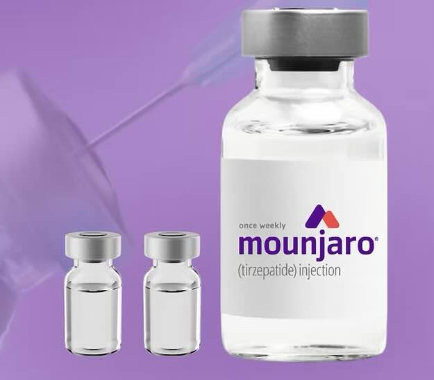
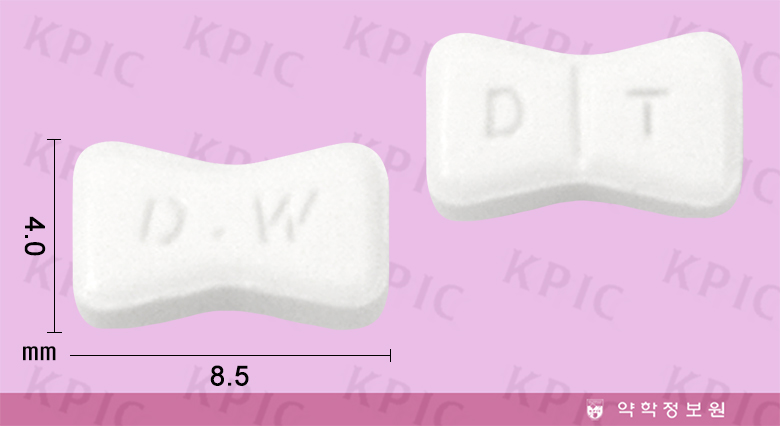
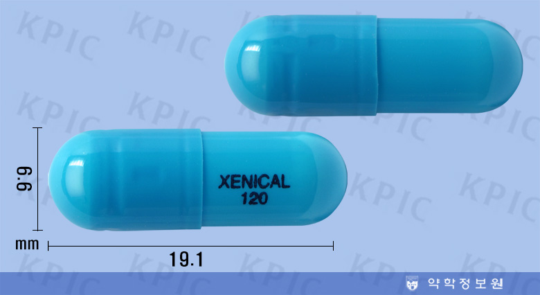
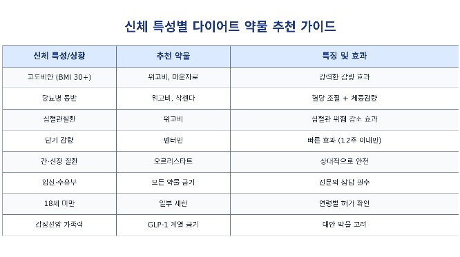

위고비 주사로 살이 빠졌다는 이야기가 주변에서도 심심찮게 들립니다. 정말 효과가 있는지, 건강에는 괜찮은지, 비용과 건강보험 적용은 어떻게 되는지 궁금해하는 분이 많습니다. 해외 임상자료와 국내 출시·가격 정보를 모아, 2026년 기준으로 다이어트 약을 객관적으로 정리했습니다.

## 약물 다이어트, 정말 효과가 있을까?

2026년 현재 약물을 이용한 다이어트는 단순한 미용을 넘어, 비만이라는 건강 문제를 다루는 의학적 방법으로 자리 잡았습니다. 특히 GLP-1(글루카곤 유사 펩타이드-1) 계열 약물이 비만 치료의 흐름을 바꿔놓았습니다.

다만 모든 약물에는 장단점이 있고, 개인의 건강 상태에 따라 적합성이 크게 달라집니다. 주변 사람이 효과를 봤다고 그대로 따라 하기 어려운 이유입니다. 병원에서 전문의 상담을 받으면 자신에게 맞는 약을 추천받을 수 있는데, 기본 지식을 갖추고 가면 상담이 한결 수월합니다.

## 다이어트 약의 종류와 특징

### 주사제 — 현재 가장 주목받는 방식

**위고비(Wegovy) · 세마글루타이드(Semaglutide)**

- 투여방법: 주 1회 배 또는 허벅지에 자가주사
- 효과: 임상시험에서 평균 약 15% 체중감량이 확인됐습니다
- 장점: 강한 감량 효과, 당뇨병·심혈관질환 개선 근거
- 단점: 구역질·설사·변비 등 위장 부작용
- 주의사항: 시신경 질환(NAION) 위험 보고가 있어 주의가 필요합니다

**마운자로(Mounjaro) · 티르제파타이드(Tirzepatide)**

- 투여방법: 주 1회 자가주사
- 효과: 임상에서 위고비보다 높은 약 20% 안팎의 체중감량이 보고됐습니다
- 특징: GLP-1과 GIP 두 가지 호르몬에 동시 작용
- 현황: **2025년 8월 국내 정식 출시**(당초 상반기 예정에서 지연)

**삭센다(Saxenda) · 리라글루타이드(Liraglutide)**

- 투여방법: 매일 1회 자가주사
- 효과: 평균 약 6~7% 체중감량
- 특징: 당뇨병 환자에게 특히 활용
- 단점: 매일 주사해야 하는 번거로움

### 경구용 약물(알약)

**펜터민(Phentermine)**

- 작용: 뇌의 식욕중추 억제
- 장점: 저렴한 비용, 단기간 빠른 효과
- 단점: 불면증, 심장 두근거림, 의존 위험
- 제한: 통상 최대 12주까지만 사용

**오르리스타트(Orlistat)**

- 작용: 장에서 지방 흡수 차단
- 장점: 장기 복용 가능, 상대적으로 안전
- 단점: 지방변, 가스, 지용성 비타민 결핍 가능

## 2026년 한국 시장 동향

- **위고비**: 2024년 10월 국내 출시 후 빠르게 시장을 주도했습니다.
- **마운자로**: 2025년 8월 출시되며 "더 강력한 비만약"으로 관심을 모았습니다.
- **삭센다**: 신약 등장으로 점유율이 예전보다 낮아졌습니다.

2024년 12월부터는 미용 목적 오남용을 막기 위해 비대면 처방이 제한되어, 원칙적으로 대면 진료를 통해서만 처방받을 수 있습니다.

해외와 비교하면, 미국·호주는 보험 적용과 처방 기준이 엄격한 편이고, 국내는 미용 목적 사용이 늘며 규제가 강화되는 흐름입니다. 공통적으로 GLP-1 계열 주사제가 전 세계 비만 치료의 표준으로 자리 잡았고, 심혈관·당뇨 예방 효과로 의학적 가치가 인정받고 있습니다.

## 주요 부작용과 위험성

시력 손상 관련해서는, 세마글루타이드(위고비) 사용 시 시신경 질환(NAION) 위험이 높아진다는 연구 보고가 있었습니다. 특히 투약 첫해에 주의가 필요하다는 지적이 있으나, 발생 빈도 자체는 낮은 수준으로 보고됩니다.

일반적인 부작용은 다음과 같습니다.

- 위장관계: 구역질·구토·설사·변비 (상당수 환자가 경험)
- 소화기계: 췌장염·담낭염 (드물지만 심각할 수 있음)
- 기타: 탈모, 피로감, 근육량 감소

증상이 심하거나 지속되면 임의로 대응하지 말고 처방 의료진과 상담하는 것이 안전합니다.

## 나에게 맞는 약물 선택 가이드

일반적인 처방 대상 기준은 다음과 같습니다.

- BMI 30 이상: 비만
- BMI 27 이상 + 동반질환(당뇨·고혈압·고지혈증 등): 과체중

다음은 대표적인 금기 사항입니다. 해당된다면 반드시 사전에 의료진에게 알려야 합니다.

- 임신·수유부
- 18세 미만(일부 예외)
- 갑상선수질암 병력·가족력
- 심각한 간·신장 질환

## 비용과 건강보험 적용 여부

비만 치료 목적의 GLP-1 약은 **모두 건강보험 비급여**로, 약값 전액을 본인이 부담합니다(2026년 기준). 비급여이기 때문에 같은 약이라도 병원·약국·용량에 따라 가격 차이가 큽니다. 아래는 2026년 7월 기준 대략적인 시세로, 실제 금액은 처방 기관에서 확인해야 합니다.

- **위고비**: 4주(1펜) 기준 약 21만~42만 원대. 용량을 올릴수록 비용이 올라갑니다. 출시 초기의 월 80만~100만 원대 고가에서, 공급 확대와 경쟁으로 가격대가 내려왔습니다(국내 출하가 약 37만 원 수준 보도).
- **마운자로**: 4주 공급가가 2.5mg 약 28만 원, 5mg 약 37만 원, 7.5mg 이상 약 52만 원 수준으로 책정됐고, 병원 판매가는 월 30만~60만 원대에서 형성됩니다.
- **삭센다**: 병원에 따라 월 수십만 원대.
- **펜터민 등 경구약**: 월 수만 원대로 상대적으로 저렴합니다.

실손보험 역시 비만 목적 처방은 일반적으로 보장되지 않습니다. 다만 당뇨 등 다른 질환 치료 목적으로 처방되는 경우에는 급여·보장 여부가 달라질 수 있으므로, 정확한 적용은 진료 의료기관과 가입한 보험사에 확인하는 것이 정확합니다.

## 성공적인 다이어트를 위한 조건

약물만으로는 한계가 있고, 생활습관 개선이 함께 가야 효과가 유지됩니다.

1. 식단 조절: 저탄수화물·고단백 위주
2. 규칙적 운동: 주 3회 이상 유산소 + 근력운동
3. 충분한 수면: 하루 7~8시간
4. 스트레스 관리: 요가·명상 등 활용

## 2026년 전망과 새로운 트렌드

주사의 불편함을 줄인 먹는 GLP-1 약물이 개발·도입 단계에 있어, 접근성을 높일 것으로 기대됩니다. 또 기존 약물의 단점인 근육량 감소를 보완하려는 신약 연구도 국내외에서 진행되고 있습니다. 다만 국내 도입 시점과 적응증은 확정 전인 경우가 많아, 출시·허가 소식은 공식 발표로 확인하는 것이 좋습니다.

## 현명한 선택을 위해

약물 다이어트는 효과적인 수단일 수 있지만 만능 해결책은 아닙니다. 약마다 장단점이 뚜렷하고, 개인의 건강 상태에 따라 적합성이 달라집니다. 인터넷 정보나 주변 경험담만으로 판단하지 말고, 비만 전문의·내분비내과 전문의와 충분히 상담한 뒤 결정하시기 바랍니다. 빠른 감량보다 안전하고 지속 가능한 방법이 더 중요합니다.

본 글은 2026년 7월 10일 기준 정보이며, 약가·제도·허가 현황은 변동될 수 있으니 공식 출처를 확인하세요.

**근거·출처**: 위고비·마운자로·삭센다의 비만 목적 처방은 건강보험 비급여(전액 본인부담) — 닥터나우 등 처방 안내 및 건강보험 급여·비급여 기준 확인(2026년 7월 10일). 마운자로 국내 출시(2025년 8월 공급 개시, 이후 처방)와 4주 공급가(2.5mg 약 28만 원·5mg 약 37만 원·7.5mg 이상 약 52만 원)는 국내 언론 보도. 위고비 2026년 시세(4주 약 21만~42만 원, 국내 출하가 약 37만 원 보도)는 다수 처방 가격 안내 자료를 교차 확인했으며, 비급여 특성상 기관별 편차가 큽니다. 임상 감량률·부작용(NAION 등)은 공개된 임상·연구 보고 기준입니다.

⚠ 이 글은 광고가 아닌 정보 제공 목적이며, 의학적 조언을 대체하지 않습니다. 약물 사용과 치료 결정은 반드시 전문 의료진과 상담한 뒤 내리시기 바랍니다.

<!-- ⚠️ [사람 검수 완료] 2026-07-10
엔진: claude-cli / 검수: 공식·언론 근거 대조 · [D] 저품질/YMYL 가드 적용
- 가격 최신화: 위고비 '월 80~100만원' → 2026 시세 4주 약 21~42만원(비급여·기관별 편차)로 정정, 초기 고가에서 하락 맥락 병기.
- 건강보험: 비만 목적 위고비·마운자로·삭센다 '비급여(전액 본인부담)' 명시, 당뇨 등 타 적응증은 급여 달라질 수 있음 하지 처리. 실손도 비만목적 비보장 안내.
- 마운자로: '2025년 출시 예정(지연)' → '2025년 8월 국내 출시', 공급가(2.5/5/7.5mg=28/37/52만) 반영.
- '2025년 현재'/'2025 시장 동향' → 2026 기준으로 갱신.
- [D] 가드: 티스토리 흔적(인사말·공감/댓글 요청) 제거, YMYL 단정어 완화, 기준일·고지문·근거·출처 병기.
- 구조: 단일 h2+과다 h3 → 주요 섹션 h2로 정규화(목차 활성). 이미지(img_1~5)는 제품 설명용이라 유지. 주소·슬러그 불변.
-->
