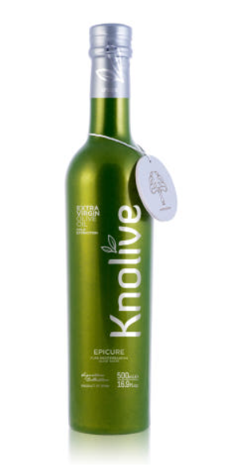
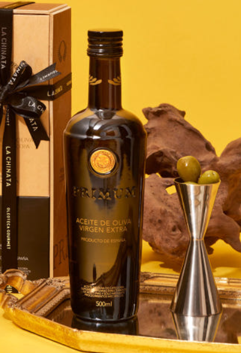
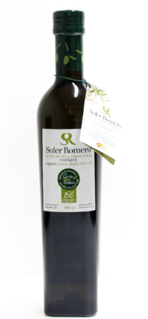
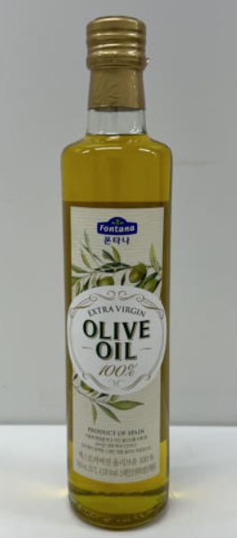
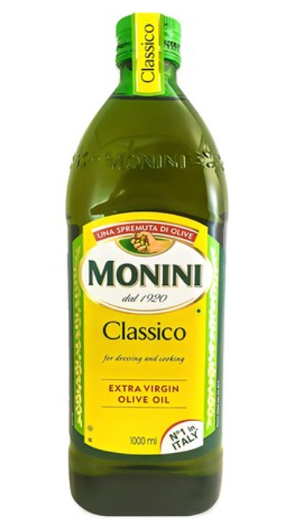

## 올리브유 종류, 품질, 가격에 대한 종합분석

안녕하세요. ALLEX입니다.

올리브유 막상 사려고 하면 종류가 너무 많아서 선택하기 참 어려우시죠?

인터넷을 찾아보면 가격, 산지, 용량, 목적에 따라 너무도 많은 종류가 나와서 제대로 선택하기가 참 어렵더라구요.

그래서! 기능과 가격대별로 체계적으로 정리해드리겠습니다!

참고로 제품광고가 아닌 제가 직접 찾아보고 경험한 조사결과임을 알려드립니다.

### 올리브유의 건강 효과

올리브유는 '신이 내린 선물'이라고 불릴 만큼 우리 몸에 좋은 효과가 많아요.

### 주요 건강 효능

- 심혈관 건강: 올레산이 나쁜 콜레스테롤(LDL)을 줄이고 좋은 콜레스테롤(HDL)을 늘려줌
- 항염 효과: 올레오칸탈 성분이 이부프로펜과 유사한 항염 작용
- 항산화 효과: 비타민 E와 폴리페놀로 노화 방지와 암 예방에 도움
- 항균 효과: 헬리코박터균 제거로 위 건강 개선
- 치매 예방: 뇌 건강 개선으로 인지 기능 향상

### 올리브유 가격 차이 이유

- 등급 차이: **엑스트라버진** > 버진 > 퓨어 > 포마스
- 산도: 낮을수록 고급 (0.8% 이하가 최고급)
- 생산 방식: 냉압착 vs 화학 정제
- 원산지: 이탈리아, 스페인, 그리스 등 프리미엄 산지
- 브랜드: 국제 인증과 수상 경력

### 올리브유 종류별 특징

그럼 가격대별로 올리브유를 추천드릴께요.

고급 제품은 건강 목적과 특별한 요리에, 중급 제품은 일상적인 좋은 요리에, 가성비 제품은 매일 사용하는 용도로 활용하시면 됩니다.

### 고급 올리브유 추천 (10만원 이상)

**1. 브루아오로 올리브오일 750ml**

- 가격: 145,000원 (750ml)
- 특징: 올레오칸탈 750mg 함유, 세계 10대 올리브오일 선정
- 산도: 0.15% 이하
- 선정 이유: 최고 수준의 올레오칸탈 함량으로 건강 기능성이 뛰어나며, 100% 유기농 냉압착으로 프리미엄 품질을 자랑

**2. 널리브 에피큐어 엑스트라버진 올리브오일 500ml**

- 가격: 110,000-120,000원 (500ml)
- 특징: 160년 역사, 국제 대회 다수 수상
- 산도: 0.15%
- 선정 이유: 국제적으로 검증된 품질과 긴 역사를 바탕으로 한 신뢰성, 풍부한 폴리페놀과 올레오칸탈 함량

**3. 라치나타 유기농 엑스트라버진 올리브오일 500ml**

- 가격: 120,000-150,000원 (500ml)
- 특징: 스페인 단일 품종, 유기농 인증
- 산도: 0.2% 이하
- 선정 이유: 단일 품종으로 일관된 풍미를 제공하며, 엄격한 유기농 인증으로 순수성 보장

### 중급 올리브유 추천 (3-10만원)

**1. 솔레르 로메로 유기농 엑스트라버진 올리브오일 500ml**

- 가격: 55,000-65,000원 (500ml)
- 특징: 6대째 전통 방식, 유기농 인증
- 산도: 0.15%
- 선정 이유: 가족 농장의 전통 제조법과 합리적 가격의 균형, 확실한 유기농 인증

**2. 폰타나 엑스트라버진 올리브유 500ml**

- 가격: 24,000-30,000원 (500ml)
- 특징: 샘표 수입, 스페인산
- 산도: 0.19%
- 선정 이유: 낮은 산도 대비 합리적 가격으로 가성비 최고, 대기업 유통으로 안정적 품질

**3. 모니니 클라시코 엑스트라버진 올리브유 500ml**

- 가격: 32,000-35,000원 (500ml)
- 특징: 이탈리아 100년 브랜드, 자체 농장
- 산도: 0.8% 이하
- 선정 이유: 오랜 전통과 노하우가 집약된 브랜드, 안정적인 품질과 접근성

### 가성비 올리브유 추천 (3만원 이하)

**1. 바쏘 엑스트라버진 올리브유 1L**

- 가격: 23,000-28,000원 (1L)
- 특징: 이탈리아산, 대용량
- 산도: 0.8% 이하
- 선정 이유: 대용량 기준 가장 합리적인 가격, 일상 사용에 적합한 안정적 품질, 국내에서 가장 인기 있는 가성비 제품

**2. 커클랜드 시그니처 엑스트라버진 올리브유 1L**

- 가격: 22,000-25,000원 (1L)
- 특징: 코스트코 자체 브랜드, 이탈리아/스페인산
- 산도: 0.3% 수준
- 선정 이유: 산도 대비 매우 저렴한 가격, 불투명 용기로 보관에 유리, 대용량 가성비 최고

**3. 해표 압착 올리브유 900ml**

- 가격: 17,000-20,000원 (900ml)
- 특징: 국내 대기업 제품, 안정적 유통
- 산도: 엑스트라버진 등급
- 선정 이유: 가장 저렴한 가격대의 엑스트라버진 등급, 마트에서 쉽게 구입 가능, 일관된 품질

### 용도별 추천

- 건강 목적: 고급 제품 (브루아오로, 널리브)
- 일상 요리: 중급 제품 (폰타나, 솔레르 로메로)
- 대량 사용: 가성비 제품 (바쏘, 커클랜드)

### 체크포인트

1. 산도 확인: 0.8% 이하 (0.3% 미만이면 더 좋음)
2. 냉압착 여부: 'Cold Pressed' 표기 확인
3. 포장: 어두운 유리병 선택
4. 원산지: 이탈리아, 스페인, 그리스산 우선

### 보관법

- 서늘하고 어두운 곳에 보관
- 개봉 후 6개월 이내 사용
- 냉장고 보관 시 굳을 수 있음 (정상)

올리브유는 단순한 식용유가 아니라 건강을 지키는 기능성 식품입니다. 여러분의 용도와 예산에 맞는 올리브유를 선택해서 건강한 식생활을 시작해보세요!

건강한 하루를 위해 오늘부터 올리브유 한 스푼 어떠세요?

[올리브유와 음식 궁합(레몬즙 포함)](/entry/올리브오일-4편-올리브유와-음식-궁합레몬즙-포함)

[올리브유의 효능 종합 정리](/entry/올리브오일-3편-올리브유의-효능)
