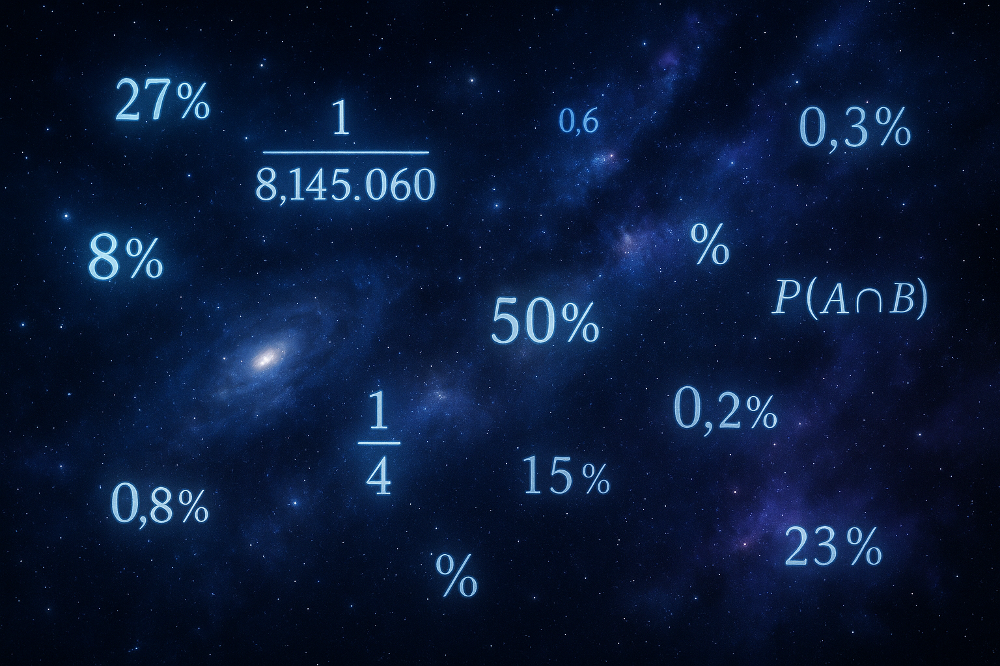

안녕하세요. ALLEX입니다.

## 여러분 아래 상황을 생각해볼까요?

1. 아침에 내가 살아서 & 2. 눈을 떴을때 & 3. 내가 사랑하는 사람이 & 4.역시나 살아있고 & 5. 내가 사랑하는 사람도 눈을 떠서 & 6. 함께 하루를 시작하고 & 7. 이런 생활을 적어도 1년 이상 할 수 있는 확률은 얼마나 될까요?

수학적으로 위 1~7번까지의 확률을 모두 곱하면 계산기는 그냥 0.00000000000이라고 나올겁니다. 하지만 우리의 삶이고 매일 일어나는 Fact이죠. 기적이 Fact입니다.

### 그래서 전 아무리 확률이 낮아도 기적을 믿습니다!

많은 사람들이 확률을 막연하고 믿기 어려운 숫자로 여깁니다. 실제로 일어날 수 있는 사실적 수치입니다. 로또 1등에 당첨될 확률이 814만 5,060분의 1(0.000012%)이라는 것은 단순한 추측이 아닙니다. 이는 과학적으로 계산된 정확한 사실이며, 바로 이 순간에도 누군가에게는 현실이 되고 있습니다.

우리가 살아가는 이 세상은 극히 낮은 확률의 기적들로 가득 차 있습니다. 그리고 이러한 기적들은 우리 삶에 깊은 의미를 부여합니다. 특히 사람과 사람이 만나는 인연, 그리고 그 인연이 사랑으로 발전하는 과정에서 말입니다.

### 0.00001% 이하의 우주적 기적들

우주는 우리에게 상상할 수 없을 정도로 낮은 확률의 선물들을 제공합니다. 대형 소행성이 지구에 충돌할 확률은 연간 10억분의 1 이하입니다. 초희귀 유전질환을 앓을 확률은 1억분의 1 이하입니다. 이러한 극한의 확률들은 우리 존재 자체가 얼마나 소중한 기적인지를 보여줍니다.

당신이 지금 이 글을 읽고 있다는 것, 건강하게 살아 숨쉬고 있다는 것 자체가 이미 수많은 낮은 확률을 뚫고 일어난 기적입니다. 은하 내 초신성 폭발을 맨눈으로 관측할 확률은 1억분의 1 이하이지만, 당신이 이 순간 존재한다는 것은 그보다 훨씬 더 놀라운 일입니다.

### 일상 속의 소중한 우연들

우리가 매일 경험하는 일상 속에도 놀라운 확률들이 숨어 있습니다:

로또 1등 당첨: 814만 5,060분의 1 (0.000012%)

번개에 맞을 확률: 28만~600만분의 1

홀인원 골프 확률: 1만 2,500분의 1

4잎 클로버 발견: 1만분의 1 (0.01%)

운석에 맞을 확률: 8억 4,000만분의 1

우주 파편에 맞을 확률: 21조분의 1

이 중에서도 특히 주목할 만한 것은 일란성 쌍둥이가 태어날 확률입니다. 동양인 기준으로 400분의 1, 일란성 사둥이는 4,000만분의 1입니다. 두 사람의 지문이 완전히 같을 확률은 640억분의 1에 이릅니다. 이는 우리 각자가 얼마나 독특하고 특별한 존재인지를 보여줍니다.

### 인연이라는 이름의 기적

그런데 이 모든 낮은 확률들 중에서 가장 놀라운 것은 바로 인연입니다. 길에서 스쳐 지나간 사람을 1년 내에 다시 만날 확률은 대도시 기준으로 0.001% 이하입니다. 하지만 그 낮은 확률이 현실이 되었을 때, 우리는 그것을 단순한 우연이 아닌 '운명'이라고 부릅니다.

두 사람이 만나 서로를 알아가고, 공통점을 발견하고, 결국 사랑에 빠지는 과정을 확률로 계산해보면 어떨까요? 세상에서 나와 공통점이 있는 사람을 만날 확률은 20만분의 1, 그 사람과 친구가 될 확률은 200만분의 1, 그리고 연인이 되는 확률은 2,000만분의 1이라는 계산도 있습니다.

하지만 이러한 극히 낮은 확률에도 불구하고, 매일 수많은 사람들이 새로운 인연을 만들고 있습니다. 이는 확률이 단순한 숫자가 아니라, 우리 삶에 실제로 작용하는 힘이라는 것을 보여줍니다.

### 사랑의 기적적 가치

사랑은 확률론적으로 볼 때 가장 놀라운 기적입니다. 70억 인구 중에서 한 사람을 선택하고, 그 사람 역시 나를 선택할 확률은 천문학적으로 낮습니다. 하지만 그 기적이 일어났을 때의 가치는 로또 1등보다 훨씬 큽니다.

로또 1등에 당첨될 확률과 평생의 반려자를 만날 확률을 비교해보면, 후자가 훨씬 더 소중한 기적임을 알 수 있습니다. 돈은 다시 벌 수 있지만, 진정한 사랑은 그 자체로 대체 불가능한 가치를 갖습니다.

**"확률은 우리에게 가능성을 보여주지만, 사랑은 그 가능성을 현실로 만듭니다."**

### 매일 매일의 소중함

평생 비행기 사고를 당할 확률은 7,178분의 1입니다. 상대적으로 높은 확률이지만, 그럼에도 불구하고 우리는 매일 안전하게 하루를 보내고 있습니다. 이는 우리가 얼마나 많은 '안전'이라는 기적을 누리고 있는지를 보여줍니다.

가족과 함께 저녁 식사를 하는 것, 친구와 웃으며 대화하는 것, 연인과 손을 잡고 걷는 것. 이 모든 일상의 순간들은 수많은 위험과 불확실성을 뚫고 일어나는 작은 기적들입니다.

### 다시한번, 확률은 Fact입니다.

그리고 이 Fact가 우리에게 가르치는 것은 명확합니다.

**우리의 존재, 우리가 만나는 인연, 그리고 우리가 나누는 사랑은 모두 극히 낮은 확률을 뚫고 일어나는 기적**들입니다.

이러한 깨달음은 우리로 하여금 매 순간을 더욱 소중히 여기게 만듭니다. 오늘 만난 사람, 오늘 나눈 대화, 오늘 받은 사랑은 모두 천문학적 확률을 뚫고 일어난 기적입니다.

그러므로 우리는 인연을 소중히 여겨야 하고, 사랑을 깊이 간직해야 합니다. 확률이 알려주는 것은 단순한 숫자가 아니라, 우리 삶의 모든 순간이 얼마나 특별하고 의미 있는지에 대한 깊은 진실입니다.

여러분이 지금 이 글을 읽고 있다는 것, 그리고 누군가를 사랑하고 있다는 것 자체가 이미 우주적 규모의 기적입니다. 이 기적을 결코 당연하게 여기지 마세요.

**확률은 우리에게 말하고 있습니다 - 모든 순간을 감사하며, 모든 인연을 소중히 여기라고.**
