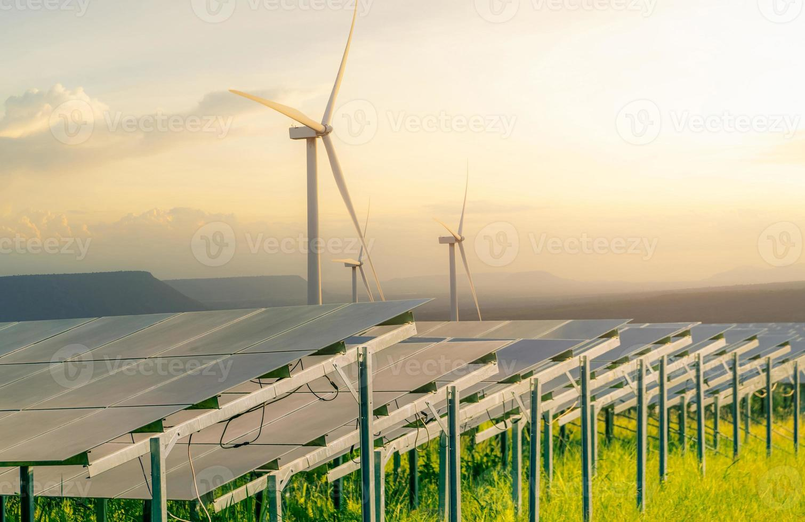

## 2025년 이거 하면 돈 번다! 유망 직업 TOP 4

안녕하세요! ALLEX입니다.

요즘 경제가 어려워서 많은 분들이 미래에 대한 걱정이 크실 텐데요.

오늘은 2025년에 정말 유망한 직업과 개인이 할 수 있는 사업 아이템들을 소개해드리려고 해요.

그리고 왜 이런 분야들이 뜰 수밖에 없는지, 이재명 정부의 정책 방향도 함께 알아볼게요!

### AI 관련 직업 - 이제 선택이 아니라 필수!

요즘 ChatGPT 많이 써보셨죠? AI 기술이 이제 일상이 되면서 관련 직업들이 정말 핫해요.

특히 개인이 도전할 수 있는 분야들이 많아졌답니다.

- **프롬프트 엔지니어**: AI한테 일을 잘 시키는 사람이에요. 컴퓨터 전공 안 해도 괜찮아요!
- **데이터 분석가**: 숫자로 된 정보를 분석해서 인사이트를 찾으면서 경영에 필요한 컨설팅을 제공할 수 있어요
- **AI 콘텐츠 마케터**: AI 도구를 활용해서 마케팅 콘텐츠를 만들고 수익으로 연결하는 케이스가 많이 발생해요
- **AI 교육 강사**: 일반인들에게 AI 사용법 교육 수요가 높아지고 있어요. 특히 시니어 계층의 수요가 굉장해요

### 친환경 에너지 분야 - 지구도 살리고 돈도 번다!

환경 문제가 심각해지면서 친환경 에너지 분야가 정말 뜨고 있어요. 이제는 자본이 많은 대기업이 아니더라도 소규모 토지를 가진 개인, 농촌 생활자, 소자본 여러 명이 함께 충분히 시작할 수 있는 분야들이 많답니다.

- **태양광 설치 전문가**: 집이나 건물에 태양광 패널 설치하는 일을 지원한 전문가가 더 필요해집니다.
- **에너지 컨설턴트**: 전기요금 절약 방법을 알려주는 일에 대해도 전기발전 방식에 따라 다양한 컨설팅이 가능해요
- **전기차 충전소 운영**: 전기차 충전 인프라 사업에 투자하실 수 있어요
- **에너지 저장 시스템 설치**: 배터리 시스템과 저장장치, 설비/배선 설치도 이젠 더 전문성이 높아졌어요

### 콘텐츠 크리에이터 - 1인 미디어 시대의 주인공

유튜브, 틱톡, 인스타그램... 이제 개인도 방송국이 될 수 있는 시대예요. 특히 짧은 영상 콘텐츠가 대세라서 기회가 많아요.

- **쇼츠/틱톡 전문 크리에이터**: 짧은 영상 콘텐츠 제작
- **영상 편집 전문가**: 다른 사람들의 영상을 편집해 주는 일
- **라이브 스트리밍 진행자**: 실시간 방송 진행
- **콘텐츠 기획자**: 어떤 콘텐츠를 만들지 기획하는 일

### 실버 케어 서비스 - 고령화 사회의 새로운 기회

우리나라가 빠르게 고령화되면서 어르신들을 위한 서비스가 정말 필요해요. 마음 따뜻한 사람들에게 좋은 기회가 될 수 있어요.

- **시니어 IT 교육 강사**: 어르신들에게 스마트폰 사용법 가르치기
- **홈케어 서비스 제공자**: 집에서 어르신 돌봄 서비스
- **시니어 여행 코디네이터**: 어르신 맞춤 여행 상품 기획
- **건강 관리 도우미**: 어르신 건강 체크 및 관리

### 개인이 시작할 수 있는 유망 사업 아이템

### 1. AI 기반 개인 서비스

- **AI 활용 콘텐츠 제작 대행**: 블로그 글, 광고 문구 등을 AI로 만들어주는 서비스라서 쉽게 콘텐츠를 작성할 수 있어요
- **맞춤형 AI 설루션 제공**: 소상공인을 비롯해서 AI가 필요하지 않다고 생각한 사람들에게도 AI 도구를 지원해 줘요
- **AI 교육 서비스**: 온라인으로 AI 사용법 가르치는 강의인데요. 요즘 수요가 엄청납니다.

### 2. 소규모 에너지 사업

- **가정용 태양광 설치업**: 개인 주택 대상 태양광 패널 설치하고 개인이 한국전력으로부터 수익을 얻는 방식이에요.
- **에너지 절약 컨설팅**: 전기요금 절약 방법 상담해 주는 전문가 컨설팅이에요
- **전기차 충전 서비스**: 소규모 충전소 운영에 필요한 투자를 여러 명이 함께 할 수 있어요.

### 3. 디지털 콘텐츠 제작

- **쇼츠/틱톡 제작 대행**: 사업자들의 홍보 영상 제작해 주는데 요즘은 AI로 쉽게 만들어서 진입장벽이 점점 낮아지고 있어요
- **온라인 교육 콘텐츠**: 자신의 전문 분야 강의 제작하는 일이고요. 역시 AI로 크게 발전하고 있어요
- **디지털 마케팅 대행**: 소상공인이 익숙하지 못한 SNS 마케팅을 도와서 매출을 확대해 주는 일이에요

### 4. 케어 서비스 사업

- **시니어 맞춤 서비스**: 어르신 전용 배달, 청소 서비스는 점점 고령화시대에 중요해지고 수요도 높아지고 있어요.
- **반려동물 케어**: 반려동물이 이제는 가족인 시대가 되었어요. 펫시팅, 펫택시 서비스도 이제 노려볼만해요.
- **건강 관리 서비스**: 소득 수준이 올라가면서 개인 맞춤 건강 체크 서비스도 이젠 수요가 생겨나고 있어요.

### 왜 이런 분야가 뜰까? 이재명 정부 정책이 답이다!

위에서 소개한 분야들이 왜 유망할까요? 바로 이재명 정부의 정책 방향과 딱 맞아떨어지기 때문이에요.

정부가 밀어주는 분야라서 기회가 많을 수밖에 없답니다!

### AI 3대 강국 프로젝트 - 100조 원 대박 투자!

이재명 정부가 가장 강조하는 게 바로 AI예요. 무려 100조 원 투자로 우리나라를 AI 세계 3대 강국으로 만들겠다고 했어요.

이 정도면 관련 일자리가 폭발적으로 늘어날 수밖에 없겠죠?

- 국가 AI 데이터센터 구축 (AI 고속도로)
- 국가대표 AI 기업 육성 (K-미스트랄)
- 전 국민 AI 접근권 보장
- AI 관련 일자리 대폭 확대

### 친환경 에너지 대전환 - 에너지 고속도로 건설!

기후 변화에 대응하기 위해 재생에너지 중심으로 사회를 바꾸겠다고 했어요. 2030년까지 서해안에, 2040년까지는 전국을

연결하는 '에너지 고속도로'를 만든다네요!

- RE100 정책 추진 (재생에너지 100% 사용)
- 농가 태양광 설치 대폭 지원
- 햇빛소득마을 조성
- 기후에너지부 신설

### K-콘텐츠 세계 정복 - 300조 원 시장 만들기!

한강 작가 노벨상, 오징어 게임 세계적 인기... 이제 K-콘텐츠가 진짜 돈이 되는 시대예요. 정부가 2030년까지 K-컬처 시장을 300조 원까지 키우겠다고 했어요!

- 문화 재정 대폭 확대
- K-콘텐츠 세계 시장 진출 지원
- 50조 원 문화 수출 목표
- 세계 5대 문화강국 도약

### 고령화 사회 대응 - 실버산업 육성!

우리나라가 빠르게 고령화되면서 어르신들을 위한 정책이 많아지고 있어요. 이 과정에서 실버산업 관련 기회들이 많이 생겨날 거예요.

- 기본사회 정책 (보편적 복지 확대)
- 시니어 맞춤 서비스 지원
- 디지털 접근성 향상
- 건강 관리 서비스 확대

### 기회는 준비된 자에게!

지금까지 2025년 유망 직업과 사업 아이템, 그리고 이를 뒷받침하는 정부 정책을 살펴봤어요. 중요한 건 이런 정보를 아는 것도 중요하지만, 실제로 준비하고 행동하는 것이에요!

변화의 시대에는 위기도 있지만 기회도 많아요.

정부 정책의 흐름을 잘 파악하고, 자신만의 강점을 살려서 새로운 도전을 해보세요.

2025년에는 여러분 모두 성공하시길 바라요! 파이팅!

※ 본 글은 공개된 정부 정책 자료와 산업 전망 자료를 바탕으로 작성되었습니다.

투자나 창업 결정 시에는 충분한 검토와 전문가 상담을 받으시길 권합니다.

여러분의 따뜻한 댓글이 많은 정보를 제공하는 힘이 됩니다.
