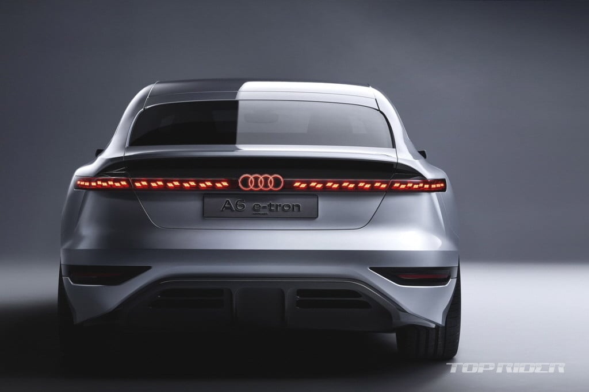
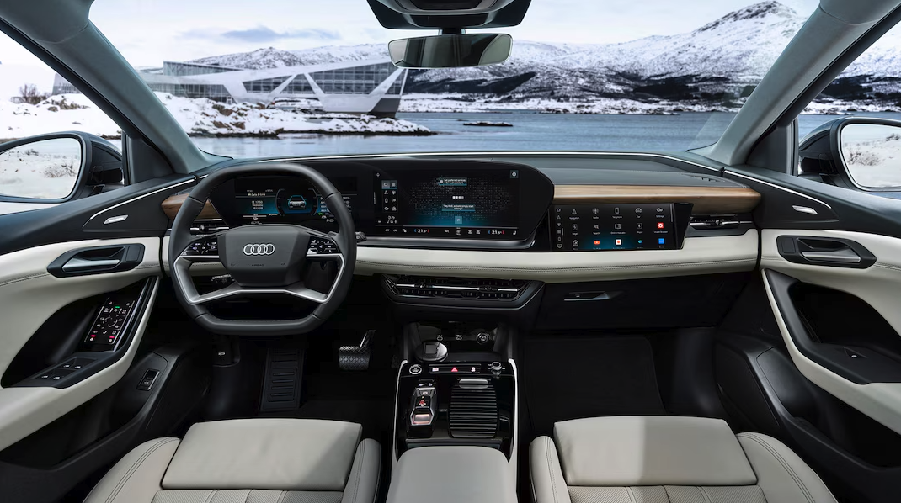

안녕하세요. ALLEX입니다.

오늘은 2025 아우디 A6에 대한 분석인데요. 이 녀석이 정말 대단한 변화를 보여줄 것 같아서 기대가 됩니다!

(특히 아우디 A6 e-트론이 오늘 글의 보이지 않는 주인공입니다. )

아우디 A6 e-트론

### 두 얼굴의 2025 A6: 전통과 혁신의 만남

먼저 중요한 사실부터 짚고 넘어가야겠어요. '2025 아우디 A6'라는 이름 하나로 완전히 다른 두 개의 차가 존재한다는 점!

하나는 6세대 완전 변경 내연기관 A6이고, 다른 하나는 순수 전기차 A6 e-트론입니다. 아우디가 전통도 지키고 미래도 잡겠다는 야심 찬 이중 전략을 펼치고 있는 거죠!

### A6 e-트론: 미래에서 온 게임 체인저

A6 e-트론은 정말 압도적입니다! PPE 플랫폼 기반의 800V 시스템으로 270kW 초고속 충전이 가능해요. 10%에서 80%까지 충전하는 데 단 21분! 커피 한 잔 마시는 동안 300km 주행이 가능하다니. 대박! 정말 놀랍지 않나요?

성능도 장난이 아닙니다. 콰트로 모델은 456마력으로 0-100km/h를 4.3초에 주파하고, 고성능 S6 e-트론은 543마력으로 3.7초라는 스포츠카 수준이에요. 게다가 최대 630km 주행거리로 서울-부산 왕복도 충전 걱정 없이 가능합니다!

### 국내 반응은 뜨겁습니다.

특히 유튜브와 온라인 커뮤니티에서의 반응은 정말 뜨겁습니다! 디자인은 CLS를 넘어섰다, BMW 5시리즈보다 젊고 감각적, 가격 대비 구성이 너무 강력하다는 찬사가 쏟아지고 있어요.

특히 A6 e-트론의 세련된 스포트백 실루엣과 OLED 테일라이트, 트리플 스크린 인테리어는 과하지 않으면서도 미래적이라는 평가를 받고 있습니다. 승차감도 매우 조용하고 부드럽다는 리뷰가 대부분이에요!

스포트백 실루엣과 테일라이트

트리플 스크린 인테리어

### 현재 프로모션: 역대급 기회가 왔다!

지금 주목해야 할 건 2025년식 현행 ICE A6 모델에 대한 파격적인 프로모션입니다!

### 할인 현황

- A6 45 TFSI 프리미엄: 8,030만 원 → 6,365만 원 (1,665만 원 할인)
- A6 45 TFSI qu 프리미엄: 8,324만 원 → 6,656만 원 (1,668만 원 할인)
- A6 40 TDI 프리미엄: 7,883만 원 → 6,220만 원 (1,663만 원 할인)

참고로 A6 e-트론은 9500-1억 5000천만 원으로 예산하고 있습니다.

A6 출고가 대비 약 20% 할인이라는 파격적인 조건! 이는 신형 모델 출시를 앞두고 현행 모델 재고를 소진하려는 아우디의 전략적 움직임으로, 소비자들에게는 럭셔리 세단을 합리적 가격에 만날 절호의 기회가 되고 있습니다.

시간이 지나면 금방 프로모션이 종료되니 빨리 알아봐 주세요.

### 출시 전망

글로벌 일정을 보면, A6 e-트론은 2025년 여름 미국 출시가 예정되어 있고, 신형 ICE A6는 2025년 5월 말 유럽 출시가 계획되어 있어요.

한국 시장에서는 2025년 하반기에서 2026년 상반기 사이에 만나볼 수 있을 것으로 예상됩니다. 조금 기다려야 하지만, 그만큼 완성도 높은 모델을 경험할 수 있겠죠!

### 경쟁력 분석: 독일 3사의 새로운 균형

BMW 5시리즈, 메르세데스-벤츠 E-클래스가 지배하는 시장에서 A6의 경쟁력은 어떨까요? 성능 면에서 A6가 상당한 우위를 보입니다. 0-96km/h 가속 5.0초 vs BMW 530i 5.6초, 스키드패드 테스트 0.93G vs 0.89G로 더 뛰어난 핸들링을 자랑해요.

특히 뒷좌석 안전벨트 프리텐셔너, 전동식 아동 안전 잠금장치 등 경쟁사에서는 옵션이거나 없는 기능들이 표준으로 제공되는 점도 큰 장점입니다.

### 아우디의 미래 청사진

아우디의 이번 전략은 정말 흥미롭습니다. 현행 모델의 공격적 프로모션으로 즉시 구매 고객을 확보하고, 동시에 혁신적인 신형 모델로 미래 고객을 유치하는 투트랙 전략이죠. 이는 전통적 가치와 미래 기술의 조화라는 아우디만의 철학을 잘 보여줍니다.

2025 아우디 A6는 단순한 신차가 아닙니다. 아우디가 제시하는 미래 모빌리티의 비전이자, 프리미엄 세단 시장의 새로운 기준이 될 모델이에요.

지금 당장 럭셔리 세단이 필요하다면 현재 프로모션 중인 2025년식 ICE A6가 최고의 선택이 될 것이고, 미래 기술을 경험하고 싶다면 A6 e-트론을 기다리는 것도 좋은 전략입니다.
