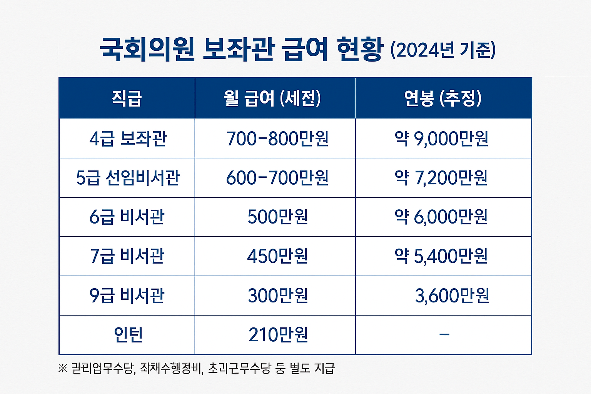

안녕하세요! ALLEX입니다.

최근 강선우 여성가족부 장관 후보자의 보좌관 '갑질' 논란이 연일 화제가 되고 있습니다. 이 사건을 계기로 많은 분들이 국회의원 보좌관이 어떤 일을 하는지, 급여는 얼마나 받는지 궁금해하고 계실 텐데요.

오늘은 우리가 평소 잘 모르지만 대한민국 정치의 숨은 조력자들, 바로 국회의원 보좌관에 대해 자세히 알아보겠습니다!

국회에서 일하는 보좌관

### 화제의 중심, 강선우 위원 보좌관 갑질 논란

최근 강선우 여성가족부 장관 후보자를 둘러싼 보좌관 '갑질' 의혹이 연일 언론을 장식하고 있습니다. 주요 쟁점들을 살펴보면요.

### 잦은 인력 교체 의혹

- 2020년 국회의원 당선 후 5년간 보좌진 총 51명 임용, 46명 면직
- 20대 국회 평균 보좌진 재직 수는 15.8명(임기 4년)과 비교해 이례적으로 높은 수치
- 5년 동안 약 6회에 걸쳐 전체 보좌진 교체에 해당

### 사적 업무 지시 의혹

- 자택 쓰레기 분리수거 및 배출 지시
- 고장 난 변기 수리 지시
- 의정활동과 무관한 개인적 업무 강요
- 전직 보좌진들의 증언: "집사처럼 부렸다"

### 강선우 위원 측의 반박과 해명

하지만 강선우 위원 측은 이러한 의혹들에 대해 적극적으로 해명하고 있습니다:

### 사적 업무 지시 관련 해명

- 가사도우미 고용 사실: "자택에 가사도우미가 있어 집안일을 보좌진에게 시킬 필요가 없었다"
- 변기 수리 부인: "변기 수리를 부탁한 적이 없다"
- 문맥 오해 가능성: 일부 문자 메시지가 본래 의도와 다르게 해석되었을 수 있다는 입장

### 인력 교체 관련 해명

- 중복 집계 가능성: 국회 사무처 자료에 개인별 직급 변동 내역이 포함되어 동일인이 승진 등의 사유로 중복 집계되었을 가능성
- 정상적인 인사 순환: 보좌진의 개인적 사정, 이직, 승진 등이 복합적으로 작용
- 과장된 해석: 실제 교체 횟수가 언론 보도만큼 과도하지 않다는 주장

이번 논란은 개인의 문제를 넘어 국회 보좌진 제도 전반의 개선 필요성을 제기하는 계기가 되고 있습니다.

### 국회의원 보좌관, 도대체 몇 명이나 있을까?

이제 보좌관 제도 전반에 대해 자세히 알아보겠습니다. 우리나라 국회의원 300명 × 1인당 보좌진 9명 = 약 2,700명이 전국에서 활동하고 있습니다.

국회의원 1인당 배정되는 보좌진 구성을 보면:

- 4급 보좌관 2명 (최고위직)
- 5급 선임비서관 2명
- 6급~9급 비서관 각 1명씩
- 유급 인턴 1명

이들은 모두 별정직 공무원 신분으로, 의원의 의정활동을 전방위적으로 지원하는 핵심 인력들입니다.

### 보좌관들은 정확히 뭘 하는 사람들인가요?

보좌관의 업무는 직급에 따라 다르지만, 공통적으로 다음과 같은 일들을 담당합니다:

### 정책 및 법안 업무

- 국회의원이 발의할 법안 초안 작성
- 국정감사 질의서 준비
- 정책 자료 조사 및 분석
- 보도자료 및 연설문 작성

### 의정활동 지원

- 상임위원회 회의 자료 준비
- 예산 관련 부처 협의
- 매일 아침 뉴스 브리핑
- 각종 회의 및 행사 준비

### 지역구 관리

- 지역 민원 접수 및 처리
- 지역 행사 참여 지원
- 주민과의 소통 창구 역할

### 홍보 및 소통

- 소셜미디어 관리
- 유튜브 영상 제작
- 의정활동 홍보 자료 제작

특히 '글 쓰는 역량'이 가장 중요한 능력으로 꼽힙니다. 보도자료부터 법안까지 모든 공식 문서를 작성하는 것이 보좌관의 핵심 업무이기 때문입니다.

### 가장 궁금한 부분, 급여는 얼마나 될까요?

많은 분들이 궁금해하시는 급여 수준을 직급별로 정리해 보겠습니다. (2024년 기준)

보좌관 급여 수준

여기에 관리업무수당, 직책수행경비, 초과근무수당 등이 별도로 지급됩니다.

대기업 평균 급여가 1억 196만원 수준임을 고려하면, 보좌관의 급여는 결코 낮지 않은 수준입니다. 특히 6급 비서관의 연봉 5,300만 원은 대기업 신입사원 수준이라고 볼 수 있죠.

보좌관들은 별정직 공무원이므로 공무원연금 수령 대상에도 해당합니다. 2016년 법 개정으로 연금 수령을 위한 최소 재직기간이 20년에서 10년으로 단축되면서, 장기 근속하는 보좌관들은 연금 혜택도 받을 수 있게 되었습니다.

### 보좌관의 현실, 그리 녹록지 않은 이유들

### 극심한 고용 불안정성

보좌관들은 흔히 '파리 목숨'이라고 불립니다. 21대 국회에서 면직된 보좌관의 평균 근속기간이 1.2년에 불과하다는 통계가 이를 보여줍니다. 의원의 판단 하나로 언제든 해고될 수 있는 구조이기 때문입니다.

### ⚖ 법적 보호의 사각지대

별정직 공무원이지만 근로기준법의 직접적인 보호를 받지 못합니다. 일반 직장인에게 적용되는 해고 예고, 면직 수당 등의 보호 조항이 없어 갑작스러운 해고에 무방비로 노출되어 있습니다.

### 높은 업무 강도

국정감사나 법안 심사 기간에는 밤늦도록 일하는 것이 일상입니다. 휴일에도 국회가 쉴 수 없어 '워라밸'을 기대하기 어려운 환경이죠.

높은 급여는 이러한 불안정성과 높은 업무 강도에 대한 보상적 성격이 강합니다. 하지만 돈으로 해결되지 않는 직업적 불안정성과 인권 문제는 여전히 해결되지 않고 있는 상황입니다.

### 연령대는 어떻게 될까요?

2017년 공개된 통계에 따르면, 보좌진의 직급별 평균 연령은:

- 4급 보좌관: 평균 47세
- 5급 비서관: 평균 42세
- 6급 비서: 평균 39세
- 7급 비서: 평균 37세
- 9급 비서: 평균 32세

전체적으로 30대 후반~40대 초반에 집중되어 있으며, 고위직일수록 연령이 높은 구조입니다. 2017년 자료이지만 국회 보좌진의 연령대 구조는 현재도 비슷한 수준으로 유지되고 있는 것으로 알려져 있습니다.

강선우 위원 논란을 계기로 국회의원 보좌관 제도의 개선 필요성이 다시 한 번 부각되고 있습니다.

가장 시급한 과제는 면직 예고제 도입을 통해 보좌관들이 갑작스러운 해고로부터 보호받을 수 있는 최소한의 안전장치를 마련하는 것입니다. 또한 직장 내 괴롭힘 방지 시스템을 구축하고 효과적인 신고 및 구제 절차를 마련하여 갑질 행위에 대한 실질적인 대응 수단을 제공해야 합니다.

의원의 절대적 임면권을 일정 부분 견제할 수 있는 투명하고 객관적인 인사 시스템을 도입하여 보좌관들의 직업적 안정성을 높이는 것도 중요한 과제입니다. 무엇보다 보좌관들이 단순한 의원의 수족이 아닌 전문성을 갖춘 정책 파트너로서 존중받을 수 있는 문화적 변화가 필요합니다.

강선우 위원 논란은 개인의 문제를 넘어 우리 민주주의 시스템의 건전성을 점검하는 계기가 되고 있습니다. 논란의 진위를 떠나 이번 기회를 통해 보좌관들의 근무 환경이 개선되고, 이들이 더욱 안정적으로 전문성을 발휘할 수 있는 환경이 조성되기를 기대합니다.

국회의원 보좌관들은 우리 민주주의의 숨은 조력자들입니다. 법안 하나하나, 정책 하나하나에 이들의 노고가 스며있죠. 결국 보좌관들의 역량 향상과 안정적인 근무 환경은 국회 전체의 효율성을 높이고, 궁극적으로 국민에게 더 나은 입법 서비스를 제공하는 길이기 때문입니다.

여러분도 이제 국회의원 보좌관이 어떤 사람들인지 조금 더 이해하게 되셨나요? 앞으로도 건전한 비판과 개선을 통해 우리 정치 시스템이 더욱 발전하기를 기대합니다!

*이 글이 도움이 되셨다면 널리 공유해주세요! 균형 잡힌 시각으로 우리 정치 시스템을 이해하는 것이 건전한 민주주의의 첫걸음입니다.*
