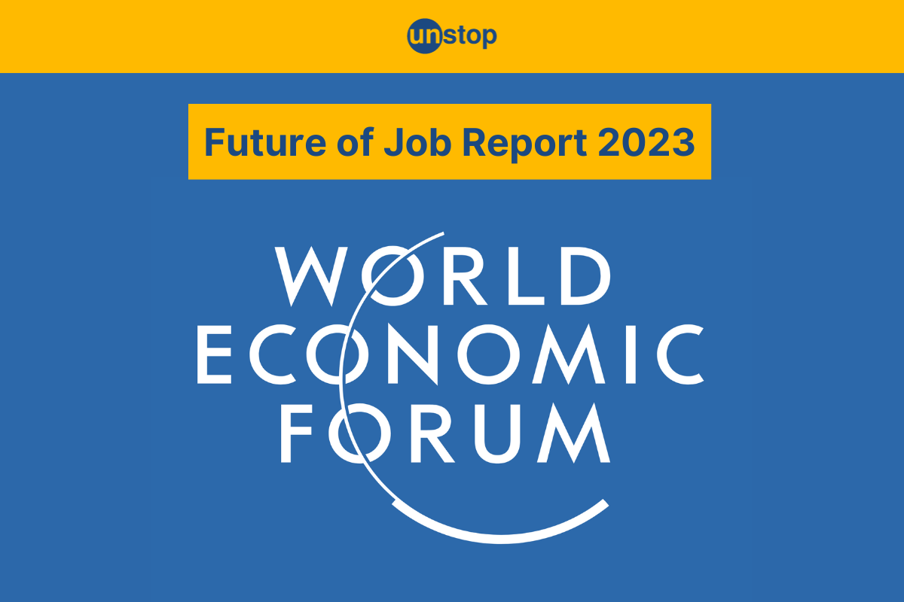

안녕하세요! ALLEX입니다.

오늘은 정말 중요한 이야기를 해드리려고 해요.

세계 최고의 교육 전문가들이 모인 OECD와 세계경제포럼(WEF)에서 발표한 연구 결과를 바탕으로,

우리 아이들이 어떤 교육을 받아야 할지 친근하고 구체적으로 알려드릴게요!

**참고 자료:**

- [World Economic Forum - Future Workforce Development](https://www.weforum.org/stories/2024/12/from-classroom-to-career-building-a-future-ready-global-workforce/)
- [OECD Education 2030 Project](https://www.oecd.org/en/about/projects/future-of-education-and-skills-2030.html)

OECD

세계경제포럼(WEF)

## 깜짝 놀랄 미래 예측! 우리가 알아야 할 현실

**세계경제포럼이 발표한 충격적인 사실**: 현재 우리 아이들 중 **65%가 아직 세상에 없는 직업**을 갖게 될 거래요!

"우리 때는 안정적인 직장이 최고였는데..."라고 생각하시는 부모님들 많으시죠?

하지만 이제는 완전히 다른 세상이 펼쳐지고 있어요.

예를 들어볼게요:

- **구글에서는 4년제 대학 졸업장 없이도 수습생 프로그램으로 입사 가능**
- **아마존, 마이크로소프트도 학벌보다 실력 중심 채용(이제는 너무 당연한 분위기랍니다)**
- **말레이시아 젊은이들은 소셜미디어 인플루언서를 꿈의 직업으로 생각**

## 전 세계가 주목하는 교육 혁신 사례들

### 독일의 놀라운 성공 비결

독일은 **견습생 제도 + 학업**을 결합해서 **92%의 취업률**을 달성했어요!

우리나라 마이스터고와 비슷한 개념이지만, 우리의 마이스터고는 기존 공고, 상고의 개념을 벗어나지 못하고 있지요.

독일은 훨씬 더 체계적이고 사회적 인정도가 높아요. 굳이 대학을 왜 가는지에 대한 의문을 가진 학생이 매우 많아요.

정말 우리와는 다른 분위기지요?

### 말리의 기적 같은 변화

아프리카 사하라 서부 쪽 말리라는 나라. 들어보셨나요? 2025년 현재 GDP가 587불이랍니다.

이 생소하고 가난한 나라에서는 **AI 멘토링 프로그램**을 통해 젊은이들의 소득이 **44%나 증가**했어요.

기술 교육이 얼마나 중요한지 보여주는 사례죠! 물론 한계가 있을 수 있지만 44% 소득 증가는 정말 엄청난 거죠.

### 싱가포르의 교육 균형

싱가포르는 **기술 교육 + 다문화 소통 능력**을 동시에 기르는 교육으로 높은 취업률과 글로벌 적응력을 모두 잡았어요.

우리가 보통 기술교육을 중요하게 생각하고 있지만, 싱가포르와 관이 다양한 국가가 모여서 무역중심도시로 운영되고 있는 곳에서 다문화 소통능력은 매우 어린 시절부터 교육해야 습득 가능하지요. 싱가포르의 미래가 부럽네요.

그렇다면 미래에 어떤 직업이 유망한 지 알아볼까요?

## 구체적으로 뜨고 있는 미래 직업들

### 1. 인간의 마음을 이해하는 Job

- **AI 심리 상담사**: AI와 함께 사람의 마음을 치료하는 전문가
- **로봇 감정 디자이너**: 로봇이 인간다운 감정을 표현하도록 설계
- **가상현실 치료사**: VR 환경에서 트라우마나 공포증 치료

### 2. 지구를 살리는 Job

- **탄소 발자국 추적관**: 기업과 개인의 환경 영향 측정 및 개선
- **재생에너지 시설 관리자**: 태양광, 풍력 발전소 운영 전문가
- **친환경 제품 개발자**: 플라스틱 대체재, 친환경 포장재 개발

### 3. 새로운 창작 분야의 Job

- **메타버스 공간 설계자**: 가상세계 속 건물, 도시 설계
- **AI 창작 디렉터**: AI와 협업해서 영화, 음악, 소설 제작
- **개인 브랜딩 컨설턴트**: 개인의 SNS, 온라인 이미지 관리

그렇다면 우리 아이들의 미래를 위해 바로 시도해 볼 수 있는 방법은 무엇인지 알아볼까요?

## 집에서 지금 당장 시작할 수 있는 교육법

### 1. 호기심 폭발 프로젝트

**매주 하나씩 "왜?" 프로젝트해보세요!**

- 월요일: "왜 하늘은 파란색일까?" → 과학 원리 찾아보기
- 화요일: "왜 사람마다 목소리가 다를까?" → 성대 구조 알아보기
- 수요일: "왜 김치가 시큼해질까?" → 발효 과정 체험하기

### 2. 디지털 도구 활용법

**코딩 배우기보다 이런 것들부터!**

- **ChatGPT로 영어 회화 연습**: "너는 미국 친구야. 같이 대화해 줘"와 같은 방식으로 AI와 대화하기
- **캔바로 포스터 만들기**: 학교 과제를 예쁘게 디자인하며 디지털 창의성 길러보기
- **스크래치로 간단한 게임 만들기**: 논리적 사고 기르며 AI/DT 사고 확장

### 3. 글로벌 친구 만들기

**온라인으로 세계 친구들과 교류**

- **펜팔 앱 활용**: 안전한 환경에서 외국 친구들과 편지 교환
- **국제 학생 프로젝트 참여**: 유네스코 같은 기관의 청소년 프로그램
- **외국 유튜버 따라 하기:** 영어 공부도 되고 문화도 배워요

학년별로 어떤 교육 방식을 적용하면 좋을지에 대해서도 알려드릴게요.

## 학년별 맞춤 교육 로드맵

### 초등학교 (호기심 대장 시기)

**"뭐든지 해보자!" 정신으로**

- 매달 새로운 취미 활동 도전 (요리, 원예, 목공 등)
- 동네 박물관, 과학관 정기 방문
- 아이가 좋아하는 것에 대해 함께 깊이 파고들기

### 중학교 (탐험가 시기)

**"내가 좋아하는 게 뭔지 찾아보자!"**

- 다양한 직업 체험 프로그램 참여
- 온라인 강의 플랫폼에서 관심 분야 수업 듣기
- 지역 커뮤니티 봉사활동 참여

### 고등학교 (전문가 준비 시기)

**"이제 좀 더 깊이 들어가 보자!"**

- 관심 분야의 전문가 멘토 찾기
- 소규모 창업 프로젝트 시도
- 해외 교환학생이나 국제 프로그램 참여

## 부모님들이 꼭 기억해야 할 마음가짐

### "틀려도 괜찮다" 분위기 만들기

"시험에서 100점 맞았니?"보다 "오늘 뭘 새로 배웠니?"가 더 중요해요.

### 아이의 관심사를 진지하게 받아들이기

"게임만 하지 말고 공부해"보다 "어떤 게임이 재미있어? 왜 그런 것 같아?"

### 실패를 축하하는 문화

"실패했구나! 그럼 뭘 배웠을까? 다음엔 어떻게 해볼까?"

## 우리 아이만의 특별한 길 만들기

OECD와 WEF 전문가들이 한 목소리로 강조하는 것은 "평생 학습 능력"이에요.

한 번 배워서 평생 써먹는 시대는 끝났어요.

**가장 중요한 것은 아이가 스스로 배우고 싶어 하는 마음**을 키워주는 거예요.

그러면 어떤 변화가 와도 우리 아이는 자신만의 길을 멋지게 만들어갈 거예요!

오늘부터 시작해 보세요. 작은 변화가 우리 아이의 밝은 미래를 만들어낼 거예요!

---

이 글이 도움이 되셨다면 하트 눌러주시고, 댓글로 여러분의 교육 고민도 나눠주세요!

함께 우리 아이들의 미래를 응원해요!
