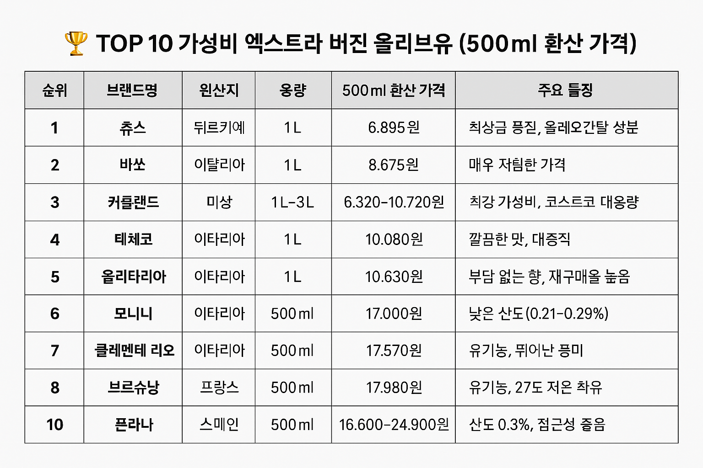

## 건강한 식탁의 필수템! 3만원 이하 엑스트라 버진 올리브유 TOP 10

안녕하세요! ALLEX입니다.

건강한 라이프스타일을 추구하는 여러분을 위해 준비했습니다.

요즘 건강에 대한 관심이 높아지면서 엑스트라 버진 올리브유는 단순한 식재료를 넘어 필수 건강 아이템으로 자리잡고 있죠. 하지만 가격은 점점 오르고, 선택지는 너무 많아서 고민이 되시나요?

올리브와 올리브유

걱정 마세요! 오늘은 3만원 이하로 뛰어난 가성비를 자랑하는 엑스트라 버진 올리브유 TOP 10을 소개해드릴게요.

### 스마트한 올리브유 선택 기준

올리브유를 선택할 때는 단순히 가격만 보면 안 됩니다. 진정한 가성비를 위해서는 이런 요소들을 체크해보세요:

✅ 산도 (Acidity): 0.8% 이하가 엑스트라 버진의 기준이며, 낮을수록 좋습니다.

✅ 유기농 인증: 건강과 환경을 생각하는 현명한 선택이죠.

✅ 냉압착/저온추출: 영양소 파괴 없이 올리브의 순수한 맛을 보존합니다.

✅ 용기: 불투명한 용기가 산패 방지에 유리해요.

### 가격대별 올리브유 완벽 정리

### TOP 10 가성비 엑스트라 버진 올리브유 (500ml 환산 가격)

가성비 엑스트라버진 레벨 올리브유

### 용도별 맞춤 추천

### 샐러드 & 드레싱용

- 솔레르 로메로 (산도 0.15%): 극저산도로 신선한 향이 일품
- 브로슈낭 (냉압착): 은은한 과일향으로 샐러드에 완벽

### 요리용 (파스타, 볶음)

- 커클랜드 (산도 0.3%): 대용량으로 부담 없이 사용
- 데체코: 깔끔한 맛으로 어떤 요리에나 잘 어울림

### 건강 목적 공복 섭취

- 주스: 올레오칸탈 성분으로 건강 효과 극대화
- 클레멘테 리오: 진한 풍미로 만족감 높음

### 선물용

- 브로슈낭: 고급스러운 병 디자인으로 선물 적합

### 똑똑한 구매 팁

### 1. 대용량 구매 전략

커클랜드, 데체코, 올리타리아 등 대용량 제품은 총액이 3만원을 넘어도 단위당 가격이 훨씬 저렴해요!

### 2. 산도 체크

솔레르 로메로(0.15%), 모니니(0.21~0.29%), 폰타나·커클랜드(0.3%) 순으로 낮은 산도를 자랑합니다.

### 3. 유통기한 체크

바쏘처럼 저렴한 제품은 유통기한이 짧을 수 있으니 소비 계획을 세워보세요.

### 4. 보관 방법

투명 용기 제품은 어둡고 서늘한 곳에 보관하여 산패를 방지하세요.

### 5. 맛 선호도

올리브유 특유의 향이 부담스럽다면 데체코나 올리타리아를 추천해요.

올리브유는 이제 단순한 식재료가 아닌 건강 투자라는 관점에서 접근해야 합니다. 3만원 이하의 예산으로도 충분히 고품질의 엑스트라 버진 올리브유를 만날 수 있어요.

최고의 가성비를 원한다면 커클랜드나 주스를, 유기농 프리미엄을 추구한다면 솔레르 로메로나 브로슈낭을 선택해보세요. 특히 산도가 낮은 제품일수록 신선도와 품질이 우수하니 참고하시길 바랍니다!

건강한 오늘, 더 건강한 내일을 위해 지금 바로 시작해보세요! ?✨

---

이 글이 도움이 되셨다면 공감과 댓글로 응원해주세요! 다음에는 더 유용한 건강 정보로 찾아뵙겠습니다.

[올리브유와 음식 궁합(레몬즙 포함)](/entry/올리브오일-4편-올리브유와-음식-궁합레몬즙-포함)

[올리브유의 효능 종합 정리](/entry/올리브오일-3편-올리브유의-효능)
