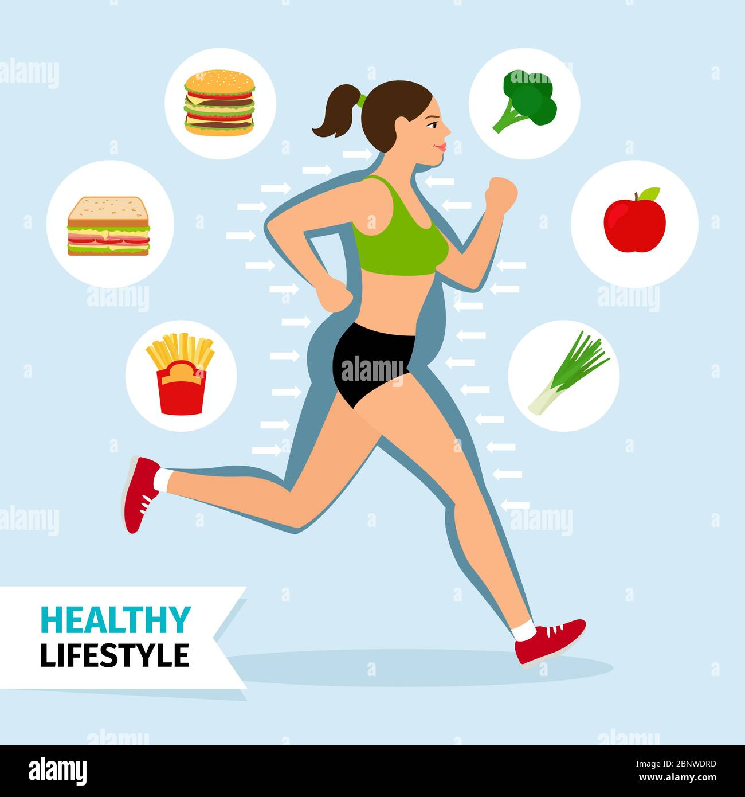
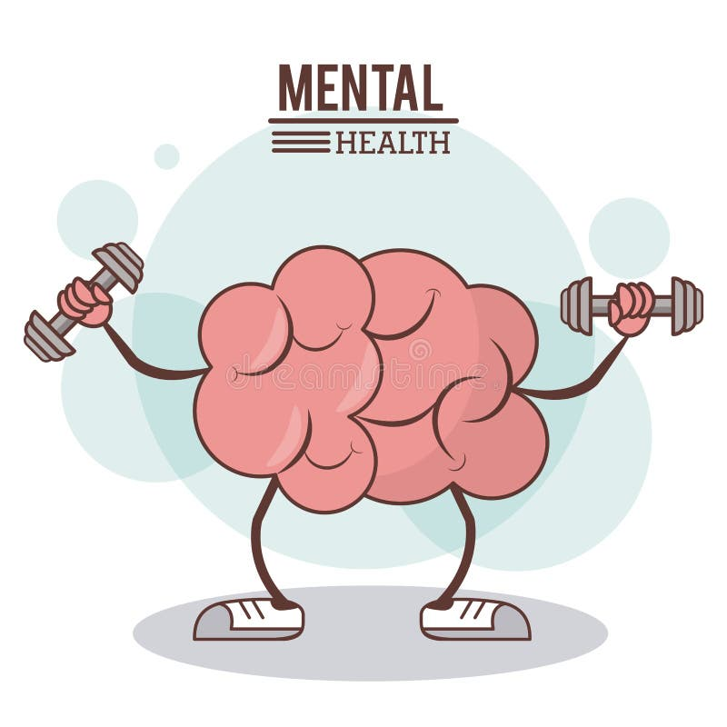

안녕하세요. ALLEX입니다.

요즘 날씨가 많이 더워지긴 했지만 여전히 한강 러닝 코스가 인산인해를 이루고 있죠?

국내 러닝 인구가 무려 1,000만 명을 넘어섰다니, 정말 대단하지 않나요?

하지만 잠깐! 모든 일에는 두 얼굴이 있듯이, 러닝도 마찬가지예요.

유튜브를 비롯한 여러 매체에서는 대부분 좋은 얘기 일색인데요.

러닝의 놀라운 효과와 함께 조심해야 할 부작용까지 솔직하게 이야기해보려고 해요.

우선! 1편은 저도 좋은 얘기를 먼저 해볼까해요. (부작용과 대안은 다음편에서 말씀드릴께요)

## 심장이 고마워해요.

달리기를 시작하면 가장 먼저 변화를 느끼는 곳이 바로 바로 바로

네! 지구를 둘러쌀 정도로 긴 혈관 속 혈액을 움직이는 강력한 엔진 심장입니다.

러닝은 심장 근육을 강화하여 심장의 펌프 기능을 향상시킵니다. 규칙적인 달리기는 심박수를 낮추고 혈압을 감소시켜

심장의 효율성을 높입니다. 제가 조사해본 심혈관 개선 효과를 한번 볼까요?

**구체적인 심혈관 건강 효과:**

- 달리기를 하는 사람들은 그렇지 않은 사람들보다 약 3년 더 오래 살아요
- 심장 관련 질환으로 사망할 확률이 45% 낮아집니다
- 전체 질환으로 인한 사망률도 30% 감소합니다
- 좋은 콜레스테롤(HDL)은 증가하고 나쁜 콜레스테롤(LDL)은 감소합니다
- 인슐린 저항성이 개선되어 당뇨병 예방에 도움이 됩니다

## 체중 조절의 든든한 파트너? 러닝입니다.

러닝은 체중 감량의 가장 확실한 방법 중 하나입니다.

하지만 단순히 살을 빼는 것뿐만 아니라 전반적인 대사 건강을 개선합니다.

**체중 조절 및 대사 개선 효과:**

- 체중 감량과 유지에 효과적입니다
- 내장지방 감소로 성인병 예방에 큰 도움이 되지요
- 기초대사율 향상시키는 마법
- 지방 연소 능력 증가 (땡큐!)
- 근육량 유지 및 증가 (땡큐!)

## 러닝 과정은 즉, 뼈와 근육이 더 튼튼해지는 과정

러닝은 체중부하 운동의 대표주자로, 뼈와 근육을 동시에 강화시킵니다.

뼈의 칼슘 수요를 늘려 칼슘이 뼛속으로 빨리 흡수되도록 하여 골다공증 예방에 도움이 됩니다.

**근골격계 강화 효과:**

- 골밀도 증가로 골다공증을 예방해줍니다. 러닝 후 칼슘 흡수 효과가 더 좋아지는 것도 있어요
- 근육량과 골량 증가 효과가 있습니다. 지속적으로 허벅지, 종아리에 강한 하중을 주거든요.
- 다리 근육의 쇠퇴 방지 효과가 있어요. 특히 어르신들은 정말 중요해요
- 관절 주변 근육을 강화시켜요. 관절이 안좋아져도 근육이 퇴화를 어느정도 지연시켜줘요.
- 균형감각 향상효과도 있어요.

## 뇌가 더 똑똑해지는 순간, 러닝의 순간!

일본 쓰쿠바대학 연구진이 발견한 사실에 따르면, 단 10분간의 중등도 달리기만으로도 뇌의 인지력이 향상됩니다.

뇌를 위해 약을 먹는 분도 많은데요. 그럴바엔 지금 당장 나가서 러닝하세요~~

전전두엽 피질로의 혈류량이 증가하여 실행 기능이 개선되고, 기억력과 집중력이 향상됩니다.

**뇌 건강에 미치는 구체적 효과:**

- 기억력, 집중력, 사고력, 실행 기능이 향상됩니다.
- 정보 처리 속도 증가는 우리가 바라는 진정한 효과 아닐까요?
- 새로운 뇌세포 생성을 촉진시킵니다. (해마 신경세포 생성이 2-3배 증가)
- BDNF(뇌유래신경영양인자) 분비를 증가시켜서 뇌 건강을 더 잘 유지시킬 수 있어요.
- 뇌로의 혈류량과 산소 공급 증가로 골고루 뇌 전반에 에너지와 영양분을 전달해줘요.
- 해마 용량 증가 및 뇌 피질 두께 유지 효과가 있어요. 즉 머리가 좋아진다는 말씀!

**인지 기능 향상에 대한 연구 결과:**

- 스웨덴 옌세핑 병원 연구: 중강도 또는 고강도 유산소 운동이 기억력 및 집중력 향상
- 운동 중 5분 정도의 짧은 휴식이 장기 기억력, 집중력, 주의력을 더욱 높임
- 12세 아동 대상 연구: 10분간의 전력질주 후 실행기능 테스트에서 좋은 결과

## 러너스 하이라는 천연 행복 호르몬

30분 이상 달리다 보면 갑자기 기분이 좋아지는 경험을 하게 됩니다. 이것이 바로 '러너스 하이'입니다.

**러너스 하이 시 분비되는 호르몬:**

- 엔도르핀: 천연 진통제이자 행복 호르몬
- 세로토닌: 우울감을 날려주는 호르몬
- 아난다마이드: 불안감 해소
- 도파민: 성취감과 동기부여
- 노르에피네프린: 각성과 집중력 향상

**정신 건강 개선 효과:**

- 우울증과 불안 증상 완화
- 스트레스 해소와 기분전환
- 긍정적 정서 촉진 및 부정적 정서 억제
- 심리적 스트레스에 대한 생물학적 반응 감소

## 면역력 향상과 질병 예방

러닝을 하면 혈액순환이 좋아지고 혈중 백혈구 숫자가 증가하여 감염에 대한 회복속도가 빨라집니다.

특히 스트레스로 인해 면역력이 떨어진 우리 같은 현대인들에게는 더욱 효과적입니다.

**면역력 및 질병 예방 효과:**

- 감염 회복 속도 증가
- 혈액순환 개선으로 대장 움직임 활발
- 변비 개선 및 치질, 정맥류 예방
- 불면증 완화 및 수면의 질 개선
- 치매 위험 28%, 알츠하이머병 위험 45% 감소

## 언제 달려야 가장 효과적인가

아침과 저녁 러닝은 좀 차이가 있었어요. 조사하기 전엔 몰랐거든요.

저도 지금 저녁 러닝을 하려던 차인데 좀 살살 달려야겠어요.

**아침 러닝의 장점:**

- 낮 동안 활력 제공 및 밤 숙면 도움
- 햇빛 노출로 비타민 D 합성 증가
- 수면 호르몬 사이클 개선
- 교감신경 자극 적어 수면 방해 없음
- 기상 후 30-60분 후 시작하는 것이 최적

**저녁 러닝의 경우:**

- 오후 5-7시 사이가 최적
- 신체가 하루 중 가장 활성화된 시간
- 잠들기 최소 3시간 전 운동 완료 필요
- 고강도보다 저강도 달리기 권장

마라톤 영웅 이봉주 선수 아시죠? 이봉주 선수는 '꾸준함'을 달리기의 기본으로 꼽았습니다.

매일 규칙적으로 달리는 것이 무엇보다 중요합니다. 사실 매일 러닝은 하는 것이 현실적으로는 많이 어렵죠.

그래서 전 일주일에 두번은 러닝하는 걸 목표로 하고 있어요.

운동 효과는 지속적으로 할 떄 누적되어 나타난다고 해요.

그러니 너무 처음부터 무리하지 말고 페이스 유지하며 꾸준히 계속하는 것이 핵심이라고 생각해요.

러닝은 정말 놀라운 운동입니다.

심장 건강부터 뇌 기능 향상, 정신 건강 개선까지 이 모든 것을 한 번에 얻을 수 있는 운동이 또 있을까요?

특히 뇌 건강에 미치는 영향은 정말 주목할 내용이죠. 발이 하는 일로 머리가 좋아지는 거잖아요?

단 10분의 달리기도 인지 기능을 개선시킬 수 있다고 하니 안할 이유가 없습니다!

다음 편에서는 러닝의 부정적인 효과와 주의사항에 대해 이야기해드릴 예정입니다.

양날의 검처럼 좋은 면이 있으면 조심해야 할 부분도 있거든요!

오늘부터 러닝화 끈을 단단히 매고, 여러분만의 건강한 변화를 시작해보세요!
