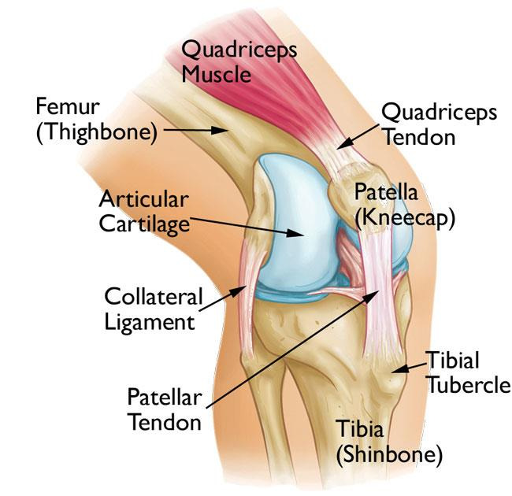
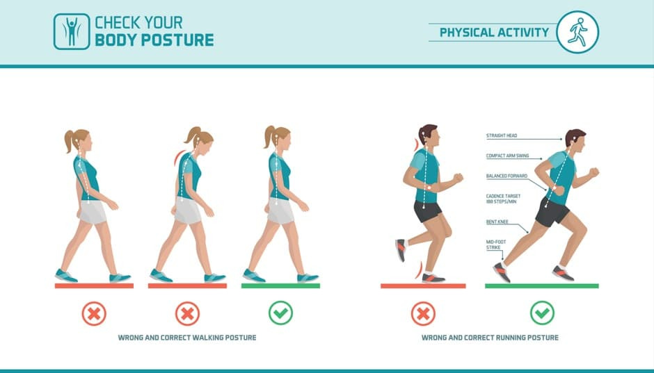

안녕하세요! 다시 돌아온 ALLEX입니다.

러닝의 놀라운 효과를 알려드린 1편에 이어, 이번에는 조금 더 신중하게 접근해야 할 이야기를 해보려고 합니다.

"뭐든지 과하면 좋지 않다"는 말, 들어보셨죠? 러닝도 마찬가지입니다. 몸에 좋다고 해서 무작정 많이 하면 오히려 독이 될 수 있거든요. 오늘은 러닝의 부작용과 안전하게 달리는 방법을 알려드리겠습니다.

러닝에 관심 없던 시절에는, 주변 동료가 러닝 시작한 지 두 달도 안되어 무릎에 무리가 와서 두 달을 쉬는 모습을 보며 사실 조금 비웃었는데요. 제가 러닝을 막상 시작하고 나니 매번 부상이 걱정되는 게 사실입니다.

" 넘어지면 어쩌지? " " 무릎에 살짝 무리가 오는데 내일도 뛸 수 있을까?"

"너무 숨이 차는데 무리를 해서라도 더 뛰는 게 나을까?... 오만 생각이 다 듭니다.

자 이제 알아보겠습니다!

## 과도한 러닝이 심장에 미치는 역효과

1편에서는 러닝이 심장에 좋다고 했는데, 뭐라고?라고 하실 수 있습니다.

네 이번엔 심장에 나쁘다고 할 수 있습니다. 과도한 달리기는 오히려 심장에 부담을 줄 수 있습니다.

특히 중장년층이 주의해야 합니다.

**중장년층의 심혈관 위험 요소:**

- 40-60세 중장년층의 마라톤 같은 고강도 달리기는 운동유발성고혈압 위험 증가
- 중년 남성의 운동유발성고혈압 유병률: 40%
- 마라톤을 즐기는 중년층: 56%까지 증가
- 심장 돌연사의 원인이 될 수 있음

**고강도 운동의 부작용:**

- 심장 근육 비대로 인한 유연성 저하
- 심방세동 위험 5배 증가
- 일주일에 3시간 이상 마라톤 같은 고강도 운동을 10년 이상 지속 시 심방세동 연관성 증가
- 심장 근육의 딱딱함으로 인한 펌프 기능 저하

## 무릎과 관절이 보내는 위험 신호

러닝을 하면서 가장 흔히 겪는 문제가 바로 근골격계 부상입니다. 제가 가장 우려하는 부분이기도 합니다.

**충격적인 하중 데이터를 보시죠! 이러니 무릎에 무리가 갈 수밖에요.**

- 러닝 시 무릎에 가해지는 하중: 체중의 3-4배
- 발목에 가해지는 하중: 체중의 8-11배
- 2023년 건강보험심사평가원 자료: 러닝으로 인한 슬개골 연골연화증 환자 중 20-40세가 35% 차지

**주요 러닝 부상 유형:**

1. **러너스 니(Runner's Knee)**
  - 슬개골 연골연화증: 무릎뼈 아래 연골이 손상되어 발생
  - 장경인대 증후군: 무릎 외측 통증
  - 증상: 무릎 주변 통증, 계단 오르내림 시 악화
2. **족저근막염**
  - 발바닥 뒤꿈치 부위 통증
  - 아침 첫걸음 시 심한 통증
  - 발바닥 아치 부위 염증
3. **아킬레스건염**
  - 발목 뒤쪽 통증과 염증
  - 과도한 압박으로 인한 발생
  - 아침 기상 시 경직감
4. 신스플린트
  - 정강이뼈 주변 통증
  - 운동 중 및 운동 후 통증 지속
  - 딱딱한 표면에서 달리기 시 악화
5. **피로골절**
  - 주로 발등, 발목, 정강이에 발생
  - 반복적인 스트레스로 인한 미세 균열
  - 점진적으로 악화되는 통증

온갖 문제가 다 발생하는군요. 이뿐만이 아닙니다.

## 뇌도 과부하 상태가 될 수 있습니다

놀랍게도 과도한 운동은 뇌에도 부정적인 영향을 줄 수 있습니다.

**프랑스 소르본대 연구 결과:**

- 과도한 운동이 뇌의 전전두엽 피질 활성화를 감소시킴
- 인지 기능 저하 유발
- 집중력 및 판단력 저하

**Over Training 증후군 증상:**

- 운동 성적, 성과 저하
- 회복되지 않는 만성 피로감
- 안정 시 심박수 상승
- 식욕 저하 및 체중 감소
- 집중력 저하
- 수면 패턴 변화
- 감정 기복 증가

## 마약 같은 러너스 하이의 어두운 면도 있습니다.

1편에서 천연 행복 호르몬이라고 했던 러너스 하이도 양날의 검입니다.

**중독성의 위험:**

- 러너스 하이 주요 물질인 엔도카나비노이드는 대마의 정신 활성 화합물과 유사 (충! 격!)
- 마약과 같은 중독성 존재
- 하루라도 달리지 않으면 불안감과 짜증 발생
- 심한 경우 부상이 있어도 달리기를 멈추지 못함

**운동 중독의 부작용:**

- 인대 손상이나 근육 파열 위험 증가
- 면역 기능 이상 (엔도카나비노이드 과활성화)
- 자가면역 질환 위험 증가
- 사회적 고립 (혼자 오랜 시간 달리기)
- 달리기 번아웃 (정신적 탈진)

**대사 이상 위험:**

- 러너스 하이를 자주 느끼는 선수들 중 대사 이상 호소
- 과도한 신경 활성화로 식욕 증가
- 지방 축적 촉진
- 비만과 대사 증후군 위험 증가

## 그래서! 안전한 러닝을 위한 Golden Rule을 소개합니다.

이제 무서운 이야기는 그만하고, 안전하게 달리는 방법을 알려드리겠습니다.

### 적절한 운동량 가이드

**미국 스포츠의학회 권장사항:**

- 주당 150분 이상의 중강도 유산소 운동
- 성인 기준: 하루 20-60분, 주 3-5회
- 최대 산소소비량의 40-80% 강도 유지
- 일주일에 50km 이상 달리지 않기
- 주간 거리 증가는 10% 이내로 제한

**점진적 강도 증가 원칙 (중요합니다!)**

- 초보자: 1주 차 걷기 + 가벼운 조깅부터 시작
- 2-3주 차: 조깅 시간 점진적 증가
- 4주 차 이후: 강도 조절 시작
- 매주 10% 이내로 거리 증가
- 월 1회 디로드 주간 설정

### 올바른 달리기 자세

**시선과 상체 자세:**

- 시선: 10-15미터 전방 주시
- 상체: 똑바로 세우고 어깨를 편 상태 유지
- 팔: 90도 각도로 자연스럽게 스윙
- 손: 가볍게 주먹을 쥔 상태

**하체 자세와 착지:**

- 중족부 착지로 충격 35% 감소
- 발소리가 크게 나지 않도록 부드럽게 착지
- 케이던스: 분당 170-180회 스텝 유지
- 보폭은 과도하게 크지 않게 조절

### 부상 예방 체크리스트

**운동 전후 관리:**

- 준비운동 10-15분 필수 (동적 스트레칭)
- 정리운동 10-15분 필수 (정적 스트레칭)
- 별도의 근력운동 주 2-3회 병행
- 특히 코어 근육 강화 운동 중요

**휴식과 회복:**

- 주 1-2일의 완전 휴식일 확보
- 적절한 수면 시간 (7-9시간) 유지
- 충분한 수분 섭취
- 균형 잡힌 영양 섭취

**장비 관리:**

- 적절한 러닝화 착용 (발 타입에 맞는 신발)
- 러닝화 교체 주기: 500-800km 또는 3-6개월
- 러닝복은 통기성 좋은 소재 선택
- 날씨에 맞는 복장 준비

### 특별 주의사항

**40세 이후 러닝 시작자:**

- 마라톤 시작 전 심전도, 심장 초음파 등 심장 검사 필수
- 운동부하 검사를 통한 안전한 운동 강도 확인
- 갑작스러운 운동량 증가 절대 금지
- 무릎, 발목 등 관절 상태 사전 점검

**기존 질환 보유자:**

- 심장 질환, 당뇨병, 고혈압: 의사와 상담 후 운동 계획 수립
- 관절염, 골다공증: 저 충격 운동부터 시작
- 과거 부상 이력이 있는 경우: 재활 전문가와 상담

**위험 신호 인식:**

- 가슴 통증, 호흡 곤란, 어지러움 발생 시 즉시 중단
- 관절 통증이 2-3일 지속되면 휴식
- 만성 피로, 수면 장애 등 오버트레이닝 증상 주의
- 부상 발생 시 RICE 원칙 적용 (Rest, Ice, Compression, Elevation)

## 최적의 러닝 타이밍

**아침 러닝 (추천):**

- 교감신경 자극 최소화로 수면 방해 없음
- 하루 종일 활력과 에너지 제공
- 햇빛 노출로 비타민 D 합성 증가
- 기상 후 30-60분 후 시작이 최적
- 러닝 30분 전 물 한 컵 섭취 권장

**저녁 러닝 시 주의사항:**

- 오후 5-7시 사이가 최적 시간대
- 잠들기 최소 3시간 전 운동 완료
- 고강도보다 저강도 러닝 선택
- 운동 후 충분한 쿨다운 시간 확보

## 오늘 드리는 말씀은 결국! 현명한 러너가 되자입니다.

러닝은 정말 좋은 운동이지만, 현명하게 접근해야 합니다.

**핵심 원칙:**

- 욕심은 금물, 천천히 꾸준히가 답
- 몸의 신호를 듣고 통증이 있으면 즉시 휴식
- 의심스러우면 전문가(의사, 트레이너)와 상담
- 개인의 체력 수준에 맞는 맞춤형 운동 계획 수립
- 안전을 최우선으로 생각하는 마음가짐

러닝은 마라톤처럼 긴 여정입니다.

빨리 가려고 하다가 다치면 오히려 더 늦어집니다. 천천히, 꾸준히, 안전하게! 이것이 평생 건강한 러닝을 즐기는 비결입니다.

1편과 2편을 통해 러닝의 양면을 모두 알아보았으니, 이제 여러분만의 안전하고 효과적인 러닝 라이프를 시작해 보세요.

시간이 되면, 관심이 많은 러닝 자세, 러닝 후 관리방법도 알아보겠습니다.

여러분 모두 건강하세요~
