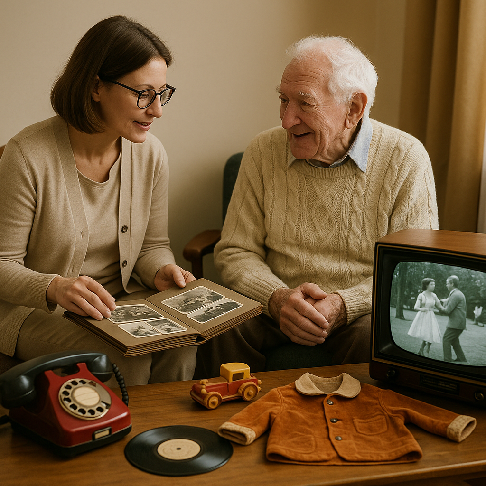

초고령사회로 빠르게 진입하는 우리나라에서 치매 관련 정책은 매우 중요한 이슈인데요. 특히 올해부터 달라진 지원 내용을 통해 더 많은 분들이 혜택을 받을 수 있게 되었습니다. 함께 자세히 알아볼까요?

## 치매 국가책임제, 무엇이 변했을까?

대한민국 정부는 '치매 국가책임제'를 통해 치매를 개인이나 가족만의 문제가 아닌 국가적 차원에서 관리해야 할 사회적 과제로 인식하고 있습니다. 이 정책은 치매 환자에게 맞춤형 사례 관리와 의료비 부담 완화, 치매 친화적 환경 조성 등 포괄적인 지원을 약속하고 있죠.

**치매 치료관리비 소득기준 대폭 확대!**

가장 주목할 만한 변화는 바로 **치매 치료관리비 지원 사업의 소득기준이 기준 중위소득 120%에서 140%로 확대**되었다는 점입니다. 이는 「2025년 치매정책 사업안내」를 통해 공식화된 내용으로, 더 많은 치매 환자와 가족이 경제적 지원을 받을 수 있게 되었습니다.

**2025년 기준 중위소득 140% 소득기준표**

- 1인 가구: 3,349,000원
- 2인 가구: 5,506,000원
- 3인 가구: 7,036,000원
- 4인 가구: 8,537,000원
- 5인 가구: 9,952,000원

이전에는 중산층 가구 중 소득이 기준을 약간 초과해 지원에서 제외되었던 분들도 이제 혜택을 받을 수 있게 되어, 소득 증가가 오히려 복지 혜택 상실로 이어지는 '복지 절벽' 현상이 완화될 것으로 기대됩니다.

다만, 일부 지방자치단체에서는 여전히 기준 중위소득 120% 이하를 적용하거나 지역 상황에 따라 기준이 다를 수 있으니, 신청 전 꼭 거주지 관할 보건소나 치매안심센터에 문의하시는 것이 좋습니다.

### 치매 치료관리비 지원, 어떻게 받을 수 있나요?

치매 치료관리비 지원 사업은 치매 환자의 진료비와 약제비 본인부담금을 월 최대 3만원(연간 36만원)까지 지원해주는 사업입니다. 이 지원을 받기 위해서는 다음 세 조건을 모두 충족해야 합니다.

**지원 자격 요건**

1. 연령 기준: 만 60세 이상 (2025년 기준, 1965년 12월 31일 이전 출생자)
- 초로기 치매환자는 예외적으로 선정 가능
2. 진단 및 치료 기준: 의료기관에서 치매로 진단받고, 치매치료제를 꾸준히 복용 중인 자
3. 소득 기준: 기준 중위소득 140% 이하 (의료급여수급권자, 기초생활수급자, 차상위계층은 소득심사 없이 충족)

**신청 방법과 필요 서류**

- 신청 장소: 관할 보건소나 치매안심센터 방문 (일부 지역 우편 접수 가능)
- 신청 기간: 연중 수시 접수
- 필요 서류:
- 치매치료관리비 지원 신청서
- 개인정보동의서 및 행정정보공동이용동의서
- 본인 명의 입금 통장 사본
- 신분증
- 약 처방전 또는 약국 영수증 (치매 관련 상병코드 필수)
- 가족관계증명서 (필요시)

### 치매관리주치의 시범사업 확대

또 하나의 중요한 변화는 치매관리주치의 시범사업의 확대입니다. 2024년 7월부터 시작된 이 사업은 2025년 7월 22일부터 대상 지역이 22개 시군구에서 37개 시군구로, 참여 주치의도 219명에서 284명으로 대폭 확대되었습니다.

이 시범사업을 통해 치매 환자는 살던 곳에서 계속 거주하면서 다음과 같은 서비스를 받을 수 있습니다:

- 맞춤형 치료·관리 계획 수립 (연 1회)
- 대면 교육 및 상담 (연 8회 이내)
- 전화나 화상통화를 통한 비대면 관리 (연 12회 이내)
- 거동이 불편한 환자를 위한 방문진료 (연 4회 이내)

보건복지부는 이 사업을 2026년까지 전국으로 확대할 계획이라고 합니다. 환자 본인부담률은 20%로, 치매 환자의 지속적인 관리와 가족의 부담을 경감하는 데 큰 도움이 될 것으로 기대됩니다.

### 알아두면 좋은 치매 관련 지원 프로그램

치매 환자와 가족을 위한 정부 지원은 다양하게 마련되어 있습니다. 대표적인 지원 사업을 소개해 드립니다.

**치매 조기 검진 및 진단비 지원**

만 60세 이상 어르신을 대상으로 무료 치매선별검사를 제공하며, 검사 결과 이상 소견이 있을 경우 진단 및 감별검사비를 지원해 드립니다. 중위소득 120% 이하 권고이나, 일부 지방자치단체에서는 소득기준 없이 지원하는 경우도 있습니다.

**장기요양보험 치매 특별등급 (5등급)**

신체 기능은 비교적 양호하지만 치매로 인해 일상생활에 어려움을 겪는 경증 치매 환자를 위한 등급입니다. 인지활동형 방문요양, 주야간보호 등의 서비스와 함께 연간 160만원 한도 내에서 복지용구를 구입할 수 있도록 지원합니다.

**치매안심센터 서비스**

전국 각지의 치매안심센터에서는 다양한 서비스를 제공합니다:

- 치매예방교실 및 조기검진
- 맞춤형 사례관리
- 쉼터 및 인지재활 프로그램
- 조호물품 제공
- 실종노인 발생예방 및 찾기 서비스

**치매가족 지원 프로그램**

치매 환자를 돌보는 가족을 위한 프로그램도 다양합니다:

- 가족교실 운영
- 자조모임 지원
- 힐링 프로그램
- 가족요양비 (월 15만원)
- 치매가족휴가제 (연간 6일)
- 간병비 지원 (지역에 따라 상이)

중앙부처의 치매 정책은 권고 기준을 제시하지만, 실제 적용은 각 지방자치단체의 조례와 예산 상황에 따라 다를 수 있습니다. 특히 소득기준, 구비서류, 지원 범위 등에서 지역별 차이가 있으니, 반드시 거주지 관할 보건소나 치매안심센터에 문의하여 최신 정보를 확인하시길 권장합니다.

더 자세한 정보가 필요하시면 치매상담콜센터(☎ 1899-9988)나 관할 보건소/치매안심센터에 문의하시면 됩니다.

치매는 개인이나 가족만의 문제가 아닌, 우리 사회가 함께 풀어가야 할 과제입니다. 정부의 지속적인 정책 개선과 함께 국민의 적극적인 관심과 지원 제도 활용이 치매 친화적인 사회를 만드는 데 필수적입니다. 여러분의 가족과 주변에 치매로 어려움을 겪고 계신 분들이 있다면, 이러한 지원 프로그램을 적극 활용하시길 권해드립니다.

오늘도 건강한 하루 보내세요! 다음 포스팅에서는 치매 예방을 위한 생활 수칙에 대해 알아보겠습니다.

#치매정책 #치매국가책임제 #치매치료관리비 #치매관리주치의 #소득기준확대 #치매안심센터 #치매가족지원 #복지정책
