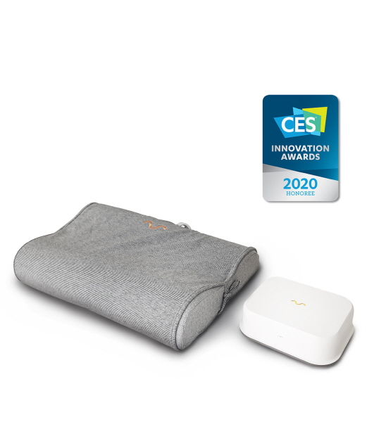
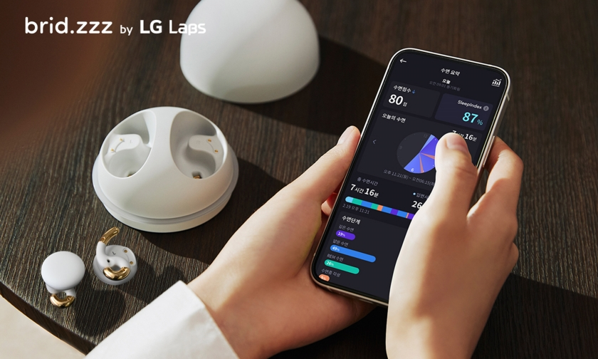

안녕하세요. ALLEX 입니다.

현대인에게 숙면은 선택이 아닌 필수가 되었어요. 과거 '잠을 줄여서 열심히'라는 인식에서 '잠이 곧 투자, 성과의 기초'로 패러다임이 완전히 바뀌었답니다. 이러한 변화와 함께 수면 산업도 폭발적으로 성장하고 있어요.

### 생체 기능 회복과 건강 유지

수면은 우리 삶의 약 3분의 1을 차지하는 어마어마한 시간투입이 필요한 필수적인 생리 작용이에요. 겉으로는 수동적인 상태로 보이지만, 실제로는 체내 기능을 유지하기 위한 복잡하고 역동적인 변화가 일어나는 소중한 시간이랍니다.

**잠을 자는 동안 우리 몸에서는 이런 놀라운 일들이 일어나요**

- 신체 기능 회복: 뇌를 비롯한 몸의 장기들이 낮 동안 쌓인 피로를 회복하고 면역력을 키워줘요
- 호르몬 분비: 멜라토닌, 성장호르몬 등이 분비되어 우리 몸의 리듬을 조절해요
- 기억 저장과 감정 조절: 낮에 배운 내용들이 정리되어 중요한 기억들만 오래 남도록 도와줘요
- 뇌 독성물질 제거: 뇌에서 쌓인 노폐물들이 깨끗하게 청소되어 치매 예방에 도움을 준답니다

**수면 부족이 가져오는 무서운 결과들**

서울대병원 연구결과를 보면 불면증 환자의 심혈관계 질환 사망률이 1.8배나 높다는 충격적인 사실이 밝혀졌어요.

**수면 부족은 단순한 피로감을 넘어 정말 심각한 건강 문제들을 가져와요:**

- 심혈관계 질환: 혈관이 수축되면서 고혈압, 심근경색, 뇌졸중 위험이 크게 늘어나요
- 당뇨병: 인슐린이 제대로 작동하지 않아 혈당 수치가 올라가요
- 비만: 배고픔을 느끼게 하는 호르몬은 늘고, 포만감을 주는 호르몬은 줄어들어 살이 찌기 쉬워져요
- 뇌 질환: 뇌에 나쁜 물질들이 쌓여서 알츠하이머 같은 질병 위험이 높아진답니다

**과학적으로 검증된 숙면 비법들**

### 규칙적인 수면 습관이 가장 중요해요

**1. 매일 같은 시간에 일어나기**

서울대병원 이유진 교수님은 "아침에 일어나는 시간이 그날 밤 잠들 수 있는 시간을 결정한다”고 말씀하세요. 주말에도 비슷한 시간에 일어나는 것이 중요하고, 아침에 햇빛을 본 뒤 약 15시간 후에 잠이 오는 호르몬이 나오기 때문에 일찍 자려면 일찍 일어나야 해요.

**2. 햇빛을 충분히 쬐어주세요**

아침과 낮에 햇빛을 많이 쬐면 밤에 잠이 오는 호르몬인 멜라토닌이 더 많이 나와서 꿀잠을 잘 수 있어요. 맑은 날에는 20분 이상, 흐린 날에는 30-40분 정도 햇빛을 쬐는 것이 좋답니다.

### 완벽한 수면 환경 만들기

**침실을 꿀잠 공간으로 바꿔보세요**

- 실내 온도는 18-23℃로 시원하게 유지해요
- 침실은 조용하고 깜깜하게 만들어주세요
- 침대는 오직 잠자는 용도로만 사용해서 우리 뇌가 '침대=잠'으로 기억하도록 해요

**잠들기 전 이렇게 준비해보세요**

- 잠자기 2시간 전에 따뜻한 물로 반신욕이나 족욕을 하면 체온이 올라갔다 떨어지면서 자연스럽게 졸음이 와요
- 가벼운 스트레칭이나 명상으로 몸과 마음을 편안하게 만들어주세요

**수면을 방해하는 것들 피하기**

- 카페인: 오후부터는 커피, 초콜릿, 콜라, 홍차 등을 피해주세요 (몸속에 4-12시간 동안 남아있어요)
- 술: 잠들 때는 도움이 될 것 같지만 깊은 잠을 방해해요
- 늦은 시간 운동: 잠자기 4-5시간 전에는 운동을 마쳐주세요
- 수면 강박: 15분 안에 잠이 안 오면 침실에서 나와서 조용한 활동을 하며 졸음을 기다려보세요

### 지금 가장 뜨거운 슬리포노믹스 시장

다양한 수면 유도 제품이 출시중입니다

### 놀라운 시장 성장세

슬리포노믹스(Sleeponomics)는 '수면'과 '경제학'을 합친 신조어로, 좋은 잠을 위해 기꺼이 돈을 투자하는 새로운 소비 문화를 말해요.

- 국내 시장: 2011년 4,800억원에서 2021년 3조원으로 무려 10년 만에 6배나 성장했어요
- 글로벌 시장: 2026년까지 40조원 규모로 커질 것으로 예상돼요
- 수면장애 시장: 2024년부터 2034년까지 매년 10.1%씩 성장할 전망이에요

**2025년 매트리스 트렌드: 'S.L.E.E.P'**

씰리침대가 제안한 올해 매트리스 시장의 핵심 키워드예요:

**S - 스마트한 수면 솔루션**

센서가 달린 매트리스, 수면 앱과 연동되는 시스템 등 첨단 기술이 접목된 제품들이 인기예요

**L - 라이프스타일과의 만남**

침실이 단순한 잠자는 공간을 넘어 홈 오피스, 홈 시네마, 휴식 공간이 모두 합쳐진 멀티 공간으로 변하고 있어요

**E - 인체공학과 건강 중심**

척추 건강을 생각한 매트리스와 허리 아픔, 불면증을 개선해주는 제품들에 대한 관심이 높아지고 있어요

**E - 경험을 중요시하는 마케팅**

팝업스토어나 쇼룸에서 직접 체험해볼 수 있는 마케팅이 대세가 되었어요

**P - 프리미엄의 시대**

좋은 잠을 위한 투자를 아끼지 않는 사람들이 늘면서 고급 매트리스 수요가 폭증하고 있답니다

### 기업들의 혁신적인 수면 마케팅 사례들

**

대기업들의 차별화된 전략**

**삼성전자: 갤럭시로 24시간 건강 관리**

- 갤럭시 워치와 갤럭시 링을 함께 써서 하루 종일 건강을 체크해요
- 수면무호흡까지 진단할 수 있는 기능으로 의료기기 분야까지 진출했어요
- "고 울트라 챌린지" 캠페인으로 2024년 광고대상까지 받았답니다

**코웨이: BTS와 함께한 스마트 매트리스**

- "잘 자는 건 중요하니까 매트리스도 스마트하게"라는 메시지로 BTS를 모델로 기용했어요
- 4개 구역의 단단함을 각각 조절할 수 있는 첨단 기술을 선보였어요
- 렌탈과 관리 서비스를 함께 제공하는 새로운 비즈니스 모델을 만들었답니다

**나비엔: '단꿈상점'으로 관계 중심 마케팅**

- 수면 전문 의사들과 함께 일해서 전문성을 높였어요
- 무료 체험 프로그램을 통해 **무려 65%의 구매 전환율**을 달성했어요

### 정말 신기한 수면 솔루션들

혁신적인 수면 솔루션이 제공되고 있어요

**놀라운 슬립테크 제품들**

- 텐마인즈 AI 베개: 코골이 소리를 듣고 자동으로 머리 위치를 바꿔주는 똑똑한 베개예요 (93.7%가 코골이 개선 효과를 봤어요!)
- LG전자 브리즈: 무선 이어폰으로 뇌파를 측정해서 개인맞춤 수면 솔루션을 제공해요
- 포켓몬 슬립: 잠만보를 키우는 게임을 하면서 자연스럽게 수면 습관을 개선할 수 있어요

**수면 음료의 인기**

- 코자아(COZA): 우리나라 수면 음료 1등 브랜드예요
- 야쿠르트 1000: 일본에서 하루에 157만 병이나 팔릴 정도로 인기가 많아요

### 앞으로의 전망과 기회

수면 산업은 이제 단순한 '휴식'을 넘어서 건강한 삶을 위한 필수 투자 분야로 완전히 자리잡았어요.

**앞으로 주목해야 할 것들**

- 더 똑똑한 AI 기술: 수면을 더 정밀하게 분석하고 개선해주는 솔루션들
- 스마트 홈과의 연결: 침실 환경이 자동으로 조절되는 미래
- 전 세계 공통 기준:수면 데이터를 전 세계가 함께 쓸 수 있는 시스템
- 디지털 치료제: 앱으로 처방받는 수면 치료의 새로운 시대

**성공하는 수면 마케팅의 비밀**

1. 과학적 증거: 실험과 데이터로 효과를 확실히 보여주기
2. 진짜 경험: 실제 사용자들의 솔직한 후기 중심으로 마케팅하기
3. 믿을 수 있는 브랜드: 의사들, 전문가들과 함께 일하기
4. 개인 맞춤: AI 기술로 나만을 위한 솔루션 제공하기
5. 쉽고 합리적 접근: 복잡하지 않고 부담되지 않는 가격으로 접근하기

현대인들의 "꿀잠"에 대한 간절한 마음은 계속 커질 거예요. 그리고 이런 마음을 해결해주는 혁신적인 기술과 마케팅 전략들이 앞으로도 계속 나타날 것 같아요.

수면은 이제 건강한 미래를 위한 가장 확실하고 똑똑한 투자가 되었답니다!

글이 도움이 되셨다면 좋은 반응 부탁드립니다. 앞으로 더 좋은 정보 제공에 큰 힘이 될거에요.
