## 지역별 지원 혜택과 가격 알아보기

**대상포진이란? 왜 예방접종이 필요할까요?**

대상포진은 수두-대상포진 바이러스가 우리 몸에서 재활성화되어 발생하는 질병입니다. 특히 면역력이 저하된 60세 이상 고령층에서 발병률이 높으며, 심각한 통증을 동반하는 발진과 물집이 특징입니다. 많은 분들이 걱정하시는 '대상포진 후 신경통(PHN)'은 치료 후에도 통증이 지속되는 합병증으로, 일상생활에 큰 지장을 줍니다.

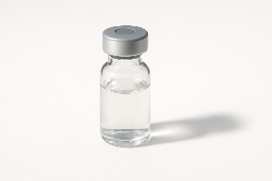

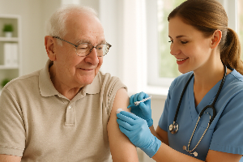

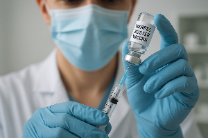

예방접종은 대상포진 발생률을 50~90% 감소시키고, 이러한 합병증의 위험을 크게 낮출 수 있는 가장 효과적인 방법입니다. 하지만 현재 한국에서는 대상포진 백신이 국가예방접종사업(NIP)에 포함되어 있지 않아 접종 비용을 본인이 부담해야 하는 상황입니다.

[대상포진 원인, 대상포진 종류, 위험성](/entry/대상포진-원인-대상포진-종류-위험성)

### 대상포진 예방접종, 얼마나 할까요?

대상포진 예방접종 비용은 백신 종류와 의료기관에 따라 차이가 있습니다:

### 1. 생백신(조스타박스)

- 1회 접종: 평균 15만원~20만원
- 60세 이상 접종 권장
- 1회 접종으로 완료

### 2. 사백신(싱그릭스)

- 2회 접종: 회당 평균 20만원~25만원(총 40만원~50만원)
- 50세 이상 접종 권장
- 2~6개월 간격으로 2회 접종 필요

이처럼 평균 15만원에서 최대 50만원에 이르는 고가의 접종 비용은 특히 고정 수입이 적은 고령층이나 취약계층에게 큰 부담이 됩니다. 이로 인해 많은 분들이 필요한 예방접종을 포기하는 경우가 발생하고 있습니다.

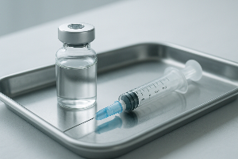

### 지방자치단체별 지원 제도: 내가 사는 지역은 혜택이 있을까?

다행히 일부 지방자치단체에서는 주민들의 경제적 부담을 덜어주기 위해 대상포진 예방접종 비용을 지원하는 제도를 운영하고 있습니다.

### 성남시 대상포진 예방접종 지원 사례

성남시는 대상포진 예방접종 지원에 있어 선도적인 모델을 보여주고 있습니다. 크게 두 가지 집단에 대한 지원이 이루어지고 있어요.

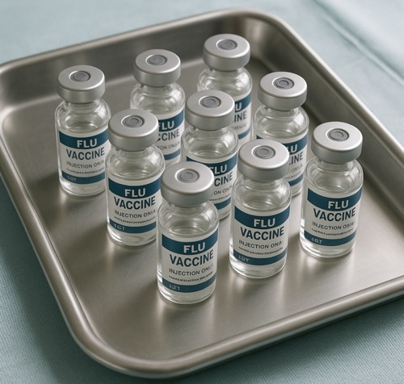

1. 60세 이상 기초생활수급자 및 차상위계층
- 보건소에서 백신 전액 무료 접종
- 접종 후 이상반응 발생 시 진료비 지원 혜택
2. 65세 이상 일반 성남시민
- 위탁 의료기관에서 접종 가능
- 본인 부담금: 19,610원 (대부분의 비용 지원)
- 접종 후 이상반응 발생 시 진료비 지원 혜택

성남시 지원 모델의 가장 주목할 만한 점은 예방접종 후 이상반응 발생 시 진료비를 명시적으로 지원한다는 것입니다. 이는 다른 지자체와 차별화된 포인트로, 접종 후 발생할 수 있는 예상치 못한 의료비 부담까지 고려하여 시민의 건강을 보호하려는 의지를 보여줍니다.

### 다른 지역의 지원 현황은 어떨까요?

지역에 따라 지원 대상과 혜택이 다양합니다. 몇 가지 주요 사례를 살펴볼게요:

- 울산 울주군: 50세 이상 모든 군민에게 생백신 1회 접종 지원 (기초수급자/차상위계층 무료, 일반주민 본인부담금 약 19,000원)
- 전남 나주시: 65세 이상 저소득층 무료, 일반 시민 38,000원 할인 적용
- 대전 유성구: 70세 이상 기초생활수급자에게 사백신(2회) 전액 무료 제공
- 서울 영등포구: 75세 이상 기초생활수급자에게 생백신 전액 무료 제공

지역별로 지원 연령과 소득 기준, 백신 종류와 지원 금액에 차이가 있기 때문에 거주 지역 보건소나 동주민센터에 문의하시는 것이 좋습니다.

### 지원받기 위한 방법

거주하시는 지역의 대상포진 예방접종 지원을 받기 위한 방법을 알아보세요:

1. 거주 지역 보건소 홈페이지 확인
2. 보건소 또는 동주민센터 전화 문의
3. 지원 대상 확인 및 필요 서류 준비
4. 지정된 의료기관에서 예약 후 접종

대상포진 예방접종은 고가의 비용으로 인해 접종을 망설이시는 분들이 많지만, 다양한 지방자치단체의 지원 제도를 통해 부담을 줄일 수 있습니다. 특히 성남시의 경우, 접종 비용 지원뿐 아니라 이상반응 발생 시 진료비까지 지원하는 포괄적인 제도를 운영하고 있어 참고할 만한 모범 사례입니다.

국가 차원의 예방접종 지원이 아직 이루어지지 않는 상황에서, 각 지자체의 지원 정책은 더욱 중요합니다. 본인이 거주하는 지역의 지원 혜택을 꼼꼼히 확인하여 건강한 노후 생활을 준비하시기 바랍니다.

오늘은 대상포진 예방접종 가격과 지역별 지원 제도에 대해 알아보았습니다. 특히 성남시의 포괄적인 지원 모델은 다른 지자체에서도 참고할 만한 좋은 사례임을 알 수 있었습니다. 여러분의 건강한 생활을 응원합니다!

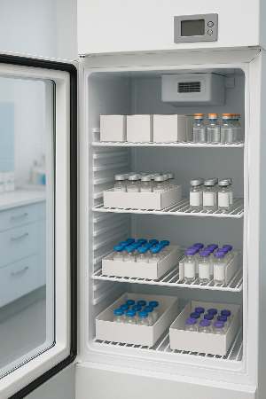

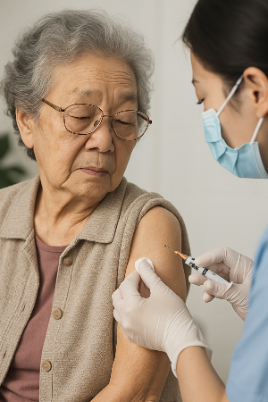

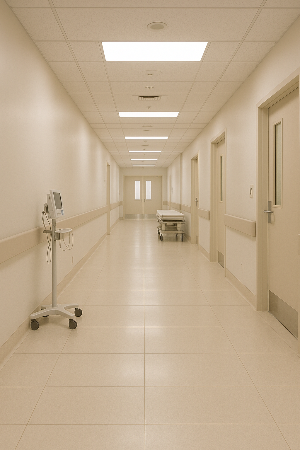

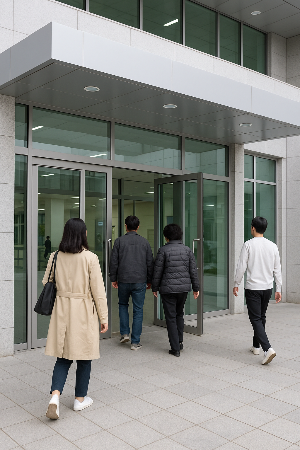

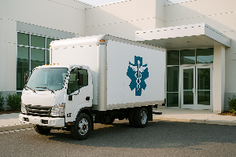

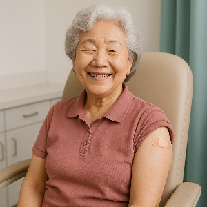

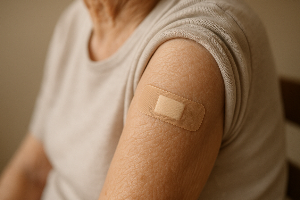

[장년층 건강의 핵심, 질병 예방과 관리로 똑똑하게 건강 챙기기](/entry/중장년층-건강의-핵심-질병-예방과-관리로-똑똑하게-건강-챙기기)

[고혈압, 당뇨 등 만성 질환 맞춤형 식단 레시피](/entry/고혈압-당뇨-등-만성-질환-맞춤형-식단-레시피)

[현대인을 위한 스트레스 관리와 마음건강 가이드](/entry/현대인을-위한-스트레스-관리와-마음건강-가이드)
