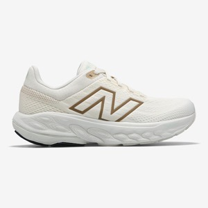
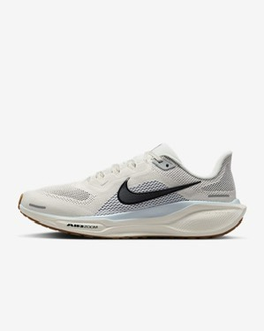
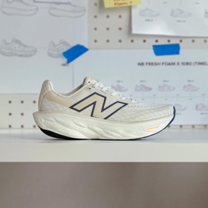
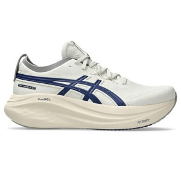
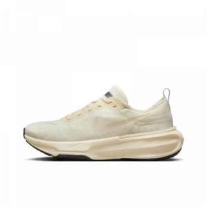
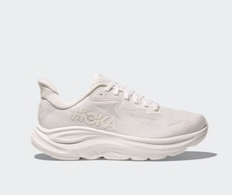

나에게 맞는 러닝화 선택법을 알려드리겠습니다.

### 왜 올바른 러닝화 선택이 중요한가?

러닝은 건강 증진과 스트레스 해소에 탁월한 운동이지만, 부상 위험을 최소화하고 운동 효과를 극대화하기 위해서는 적절한 장비 선택이 필수적입니다. 그중에서도 러닝화는 단순히 발을 보호하는 것을 넘어, 달리기 효율을 높이고 부상을 예방하는 데 핵심적인 역할을 수행합니다.

러닝화는 발에 가해지는 충격을 효과적으로 흡수하고 분산하며, 발의 형태와 발목의 꺾임 정도에 따라 안정적인 달리기를 지원하도록 설계됩니다. 올바른 러닝화는 부상 위험을 줄이고, 더 건강하며 오래 지속 가능한 러닝 활동을 가능하게 합니다.

### 잘못된 러닝화 선택의 위험성

부적절한 러닝화는 다양한 신체 부위의 통증과 부상으로 이어질 수 있습니다. 대표적으로 발바닥 근막염, 무릎 통증, 정강이 부상(Shin Splints) 등이 발생할 위험이 커집니다. 러닝 시 발에 가해지는 하중은 평상시 체중의 2~3배 이상으로 증가하며, 언덕을 내려갈 때는 더욱 늘어납니다.

일반 운동화는 이러한 반복적이고 강한 충격을 지탱하도록 설계되지 않았기 때문에, 러닝에 사용하면 무릎, 허리, 발 등 전신에 통증과 부상을 초래할 가능성이 높습니다.

### 내 발과 러닝 스타일 이해하기

최적의 러닝화를 선택하기 위한 첫걸음은 자신의 발과 러닝 스타일을 정확히 파악하는 것입니다. 발의 형태와 움직임은 러닝화 선택에 결정적인 영향을 미칩니다.

### 발 아치 유형 및 회내 정도 진단법

발 아치는 발바닥에서 활 모양으로 굽은 부분을 의미하며, 회내(Pronation)는 발이 땅에 닿을 때 안쪽으로 꺾이는 자연스러운 움직임을 말합니다.

**간단한 자가 진단법:**

- 젖은 발자국 테스트: 발을 물에 적신 후 마른 종이 위에 서서 발자국을 찍어보면 발 아치 모양을 한눈에 파악할 수 있습니다
- 신발 닳는 부위 확인: 평소 신는 신발 밑창의 닳는 부위를 확인하면 발의 압력 분포를 파악할 수 있습니다
- 볼펜 테스트: 발 안쪽 아치 아래에 볼펜을 넣어봅니다. 볼펜이 잘 들어가면 아치가 높은 편이고, 걸리면 평발일 가능성이 높습니다

### 발 유형별 러닝화 추천

### 평발(로우 아치) - 과내전 유형

- 특징: 발바닥 아치가 낮거나 거의 없으며, 달릴 때 발목이 안쪽으로 과도하게 꺾입니다.
- 추천 러닝화: 안정화(Stability Shoes), 제어화(Motion Control Shoes)
- 대표 모델: ASICS GEL-Kayano, Brooks Addiction 시리즈, Nike Air Zoom Structure, New Balance 860

ASICS GEL-Kayano

ASICS GEL-Kayano

### 정상발(미들 아치) - 정상 회내

- 특징: 발이 충격을 고르게 분산하는 일반적인 발 모양입니다.
- 추천 러닝화: 안정화, 쿠션화(Cushioned Shoes)
- 대표 모델: Nike Pegasus, Brooks Ghost, ASICS GEL-Cumulus, New Balance 1080

나이키 페가수스

나이키 페가수스

### 요족(하이 아치) - 과외 전 유형

- 특징: 발바닥이 아치형으로 높게 굽어 있으며, 충격 흡수 능력이 떨어집니다.
- 추천 러닝화: 쿠션화(Cushioned Shoes)
- 대표 모델: ASICS GEL-Nimbus, Nike ZoomX Invincible, Hoka Clifton 시리즈

ASICS GEL-Nimbus

ASICS GEL-Nimbus

ASICS GEL-Nimbus

### 러닝화 구조와 핵심 기술

### 미드솔 - 러닝화의 심장

미드솔은 충격 흡수와 에너지 반환을 담당하는 핵심 부위입니다. 2024년 현재 나이키의 ZoomX 폼과 카본 플레이트 기술이 대표적이며, 높은 에너지 반환성을 제공하지만 개인의 발 형태와 러닝 스타일에 따라 선택해야 합니다.

### 브랜드별 특징

- 나이키: 반응성과 경량성에 특화
- 아디다스: Boost 폼의 뛰어난 에너지 반환
- 아식스: 젤 기술의 우수한 안정성
- 뉴발랜스: 다양한 발볼 옵션 제공

### 올바른 피팅 가이드

### 정확한 사이즈 측정

오후 4-6시 발이 부어있을 때 측정하는 것이 정확합니다. 러닝화는 발끝에 엄지 한 마디 정도의 여유 공간이 필요하며, 종이 위에 발을 올리고 길이와 폭을 측정하여 정확한 사이즈를 파악할 수 있습니다.

### 전문 피팅 서비스 활용

플릿러너, 러너스클럽 등 전문 러닝샵에서 제공하는 슈피팅 서비스를 통해 발 분석과 보행 패턴을 정확히 확인할 수 있습니다. 약 30,000원의 피팅비는 신발 구매 시 할인되는 경우가 많아 실질적인 부담이 적습니다.

### 발 착지 방식별 고려사항

### 힐 스트라이크(뒤꿈치 착지)

초보 러너에게 흔한 착지 방식으로, 충분한 힐 쿠셔닝이 있는 러닝화가 적합합니다.

### 미드풋/포어풋 착지

발의 중간이나 앞부분이 먼저 지면에 닿는 방식으로, 전족부 활성화 및 강화를 위한 보강 운동을 병행하는 것이 좋습니다.

러닝화 선택은 개인의 발 형태, 보행 패턴, 러닝 목적에 따라 달라집니다. 단순히 브랜드나 디자인으로 선택하기보다는 자신의 발 특성을 정확히 파악하고, 전문가의 도움을 받아 최적의 러닝화를 찾는 것이 중요합니다. 올바른 러닝화는 부상을 예방하고 러닝의 즐거움을 오래도록 지속할 수 있게 해주는 소중한 투자입니다.

[런닝 자세 가이드, 런닝 발, 다리, 팔, 머리](/entry/러너를-위한-완벽-자세-가이드-머리-어깨-팔-몸통-그리고-발)

[런닝 통증과 안전한 러닝 가이드](/entry/러닝-2편-양날의-검-조심해야-할-부작용과-안전한-달리기-가이드)

[달리기 건강 효과 종합 정리](/entry/러닝-1편-러닝의-마법-몸과-마음이-변하는-놀라운-순간)
