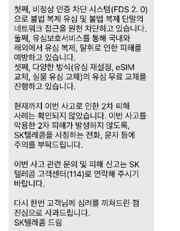
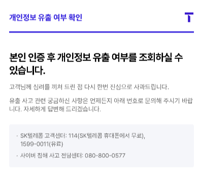
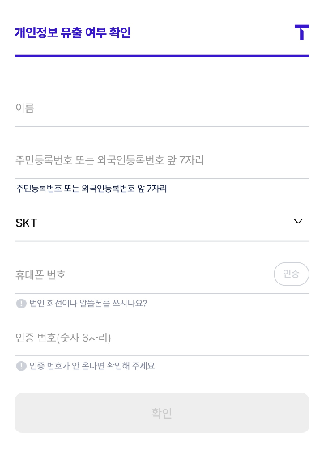
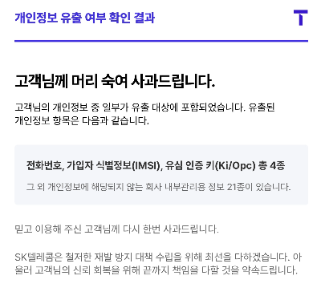

지난 4월 발생한 SK텔레콤 유심 해킹 사태는 국내 통신업계 역사상 최대 규모의 개인정보 유출 사건으로 기록되고 있습니다. 이번 사건으로 인해 최대 2,500만 명의 가입자 정보가 유출될 가능성이 제기되면서, SKT는 지난 7월 28일부터 개인정보 유출 조회 서비스를 정식 개시했습니다.

### 개인정보 유출 조회 서비스란?

SKT 개인정보 유출 조회 서비스는 4월 18일 해킹 공격으로 유출된 고객 정보를 개별적으로 확인할 수 있는 전용 온라인 서비스입니다. 아래와 같은 문자를 받아보셨을 텐데요. 많이 놀라셨을 듯합니다.  T월드 홈페이지를 통해 본인 인증 후 개인정보 유출 여부를 직접 확인할 수 있습니다.

### 조회 가능한 개인정보 유형과 범위

이번 해킹 사건으로 유출된 정보는 다음과 같습니다:

- 휴대전화 번호
- 가입자 식별번호(IMSI)
- 유심 인증키 2종(Ki/OPc)

다행히 성명, 주소, 주민등록번호 등의 민감한 개인정보는 포함되지 않은 것으로 확인되었습니다. 하지만 유출된 정보만으로도 위험이 존재하기 때문에 각별한 주의가 필요합니다.

개인정보 유출 조회 서비스 이용 방법

클릭해서 조회하기

### 조회 절차

**1. T월드 홈페이지 접속 (m.tworld.co.kr/v0/infocheck)

2. 본인 인증진행 (만 14세 이상 가입자 대상)**

본인인증 절차

**

3. 개인정보 유출 여부 확인

**저는 유출이 되었다는 걸 확인했습니다.ㅠㅠ

[SKT 개인정보 유출 소송 방법](/entry/SKT-개인정보-유출-소송-방법)

### 유의사항

- 본인 인증이 불가능한 회선은 조회할 수 없습니다
- 만 14세 미만 고객은 필요 서류를 지참하여 T월드 매장이나 고객센터에서 확인 가능합니다
- 조회 대상은 2025년 4월 18일 기준 전화번호를 보유한 고객입니다

SKT는 이번 사건의 재발 방지를 위해 보안 시스템 강화와 함께 피해 고객 배상 방안도 검토 중입니다. 개인정보 유출이 확인된 고객들은 무료 유심 교체 서비스를 제공받을 수 있으며, 필요에 따라 법적 구제 절차도 진행할 수 있습니다.

이번 SKT 개인정보 유출 조회 서비스는 고객들의 알 권리를 보장하고 투명한 정보 제공을 위한 중요한 조치입니다. 해당 서비스를 통해 본인의 개인정보 유출 여부를 확인하고, 필요한 보안 조치를 취하시기 바랍니다.
