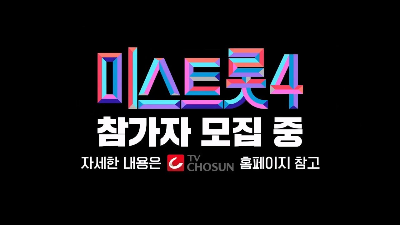
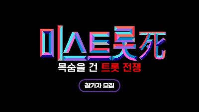

안녕하세요, 트롯 애호가 여러분! 드디어 우리가 기다리던 미스트롯4의 소식이 본격적으로 들려오고 있습니다. TV조선의 대표 오디션 프로그램 '미스트롯' 시리즈가 네 번째 시즌을 맞아 2025년 하반기 방송을 앞두고 있는데요, 이번에는 어떤 놀라운 변화와 감동을 선사할지 함께 살펴보겠습니다.

### 미스트롯4, 무엇이 달라졌을까?

### “죽을 사(死)의 정신"으로 무장한 새로운 도전

이번 미스트롯4에서 가장 주목할 만한 변화는 제작진의 각별한 각오입니다. 단순히 '4번째 시즌'이 아닌 '죽을 사(死)의 정신으로 중무장한 독기 품은 참가자들의 지원'을 요청하며, 역대급 무대와 "한 차원 높은 4차원급 퀄리티"를 약속했습니다.

이러한 표현은 프로그램이 기존의 성공에 안주하지 않고, 시청자들이 느낄 수 있는 트롯 오디션에 대한 피로감을 완전히 해소하겠다는 강력한 의지를 보여줍니다. 무대 연출부터 음악적 완성도, 참가자들의 서사까지 모든 면에서 한층 업그레이드된 모습을 기대할 수 있겠네요.

### 나이 제한 철폐, 모든 세대가 하나

미스트롯4는 시리즈 최초로 나이 제한을 두지 않았습니다. "트롯을 사랑하는 대한민국 여성이라면 누구나" 지원할 수 있다는 이 정책은 잠재적 참가자 풀을 대폭 확장시키는 전략적 결정입니다.

젊은 신예부터 오랜 경력의 베테랑까지, 다양한 연령대와 배경을 가진 여성 트롯 가수들이 한 무대에서 경쟁하게 됨으로써 더욱 풍부하고 다채로운 무대를 만날 수 있을 것입니다. 이는 자연스럽게 경쟁의 강도를 높여 예측 불가능한 재미와 감동을 선사할 것으로 기대됩니다.

### 미스트롯4 참가자 모집 및 방송 일정

### 참가자 모집 현황

- 모집 기간: 2025년 7월 17일 ~ 8월 15일 (1차)
- 지원 방법: TV조선 홈페이(broadcast.tvchosun.com)
- 지원 자격: 트롯을 사랑하는 대한민국 여성 누구나

### 예상 방송 일정

과거 시즌들의 편성 패턴을 분석해보면, 미스트롯4는 2025년 11월 넷째 주 목요일 또는 12월 중 첫 방송될 가능성이 높습니다. 전통적으로 매주 목요일 밤 10시에 편성되어 온 미스트롯 시리즈의 전통을 이어받을 것으로 예상됩니다.

### 시청자 참여가 핵심! 투표 방법

미스트롯4에서 시청자 투표는 단순한 응원을 넘어 참가자들의 운명을 좌우하는 핵심 요소입니다. 미리 준비해두시면 좋을 투표 방법들을 정리해드렸습니다.

### 온라인 사전 투표

- 예상 플랫폼: '미스&미스터트롯' 앱, '마이트롯' 앱, 네이버 NOW, 티빙 등
- 투표 횟수: 하루 1회 (예상)
- 중요 팁: 방송 시작 전 미리 앱 설치 및 계정 인증 완료 권장

### 생방송 문자 투표

- 예상 번호: #4560 (과거 시즌 기준)
- 투표 형식: '1번 홍길동' 형태
- 주의사항: 정확한 형식으로 실시간 제출 필수
- 중요도: 최종 순위에 결정적 영향을 미치는 높은 배점

팬덤 여러분들은 알람 설정, 인증샷 공유 등 조직적인 투표 전략을 통해 응원하는 참가자를 든든하게 지원해주세요!

### 심사위원(마스터) 구성은 어떻게 될까?

현재까지 미스트롯4의 심사위원 명단은 공식 발표되지 않았지만, 역대 시즌들을 통해 예상해볼 수 있습니다. 장윤정, 조영수, 진성, 김연자, 붐 등 트롯계의 거목들이 꾸준히 참여해온 만큼, 이번에도 장윤정의 합류는 매우 유력하게 점쳐집니다.

미스터트롯3에서 19인이라는 역대 최다 마스터 군단이 참여했던 것처럼, 미스트롯4 역시 다양한 분야의 전문가들로 구성된 대규모 마스터 군단을 꾸릴 가능성이 높습니다. 이들은 단순한 심사를 넘어 참가자들의 멘토 역할을 수행하며, 프로그램의 서사를 이끌어가는 중요한 축이 될 것입니다.

### 현역부X 부서의 도입 전망

이전 시즌인 미스터트롯3에서 도입되어 성공을 거둔 '현역부X' 부서가 미스트롯4에도 그대로 도입될 가능성이 높게 점쳐지고 있습니다. 이 부서는 기존 미스트롯 시리즈 출신 재도전자들은 물론, 현역가왕과 같은 타 방송사 트롯 오디션 프로그램 출신 가수들까지 지원할 수 있도록 문호를 개방합니다.

이러한 전략적 캐스팅은 이미 대중에게 얼굴을 알린 실력파 가수들의 재도전으로 시청자들에게 익숙함과 동시에 새로운 기대감을 안겨주며, 기존 팬덤의 유입을 촉진합니다. 또한 다른 프로그램 출신 가수들의 합류는 프로그램 간의 경쟁 구도를 무대 위로 끌어올려 더욱 치열한 대결과 예측 불가능한 드라마를 연출할 수 있을 것입니다.

### 시청률 전망

미스트롯4는 과거 미스트롯3와 현역가왕(2023년), 미스터트롯3와 현역가왕2(2024년)가 동시간대 경쟁을 펼쳤던 것처럼, 이번에도 현역가왕3와 치열한 경쟁을 벌일 것으로 예상됩니다. 이러한 경쟁 구도는 트롯 오디션 시장의 활성화와 동시에 각 프로그램의 차별화 노력을 촉진하는 요인으로 작용합니다.

그럼에도 불구하고 트롯 오디션 프로그램은 다른 예능 장르에 비해 비교적 높은 시청률을 꾸준히 유지하는 경향을 보입니다. 이는 트롯 장르에 대한 견고한 팬덤과 대중적 수요를 반영하며, TV조선은 '원조 트롯 오디션'으로서의 입지를 바탕으로 경쟁 프로그램과의 차별화를 통해 시청자들을 사로잡고 시장 지배력을 유지하려 할 것입니다.

### 트롯 오디션의 미래를 이끌 미스트롯4

미스트롯4는 단순한 오디션 프로그램을 넘어 대한민국 트롯 장르의 지속적인 발전을 이끌어갈 중요한 문화 플랫폼입니다. 송가인, 임영웅, 양지은 등 현재 방송계를 주도하는 스타들을 배출한 '원조 트롯 오디션'의 명성에 걸맞게, 이번에도 새로운 전설을 써내려갈 것으로 기대됩니다.

나이 제한 철폐와 '현역부X' 도입을 통해 더욱 다양한 참가자들이 경연에 참여하게 되면서, 트롯 음악이 모든 세대를 아우르는 문화 콘텐츠로서의 입지를 더욱 공고히 할 것입니다. 또한 동시간대 경쟁 프로그램들과의 선의의 경쟁은 트롯 오디션 시장 전체의 질적 향상을 유도하며, 시청자들에게 더욱 풍성한 볼거리를 제공할 것입니다.

시청자 투표의 높은 비중과 팬덤의 조직적인 참여는 프로그램의 성공에 결정적인 요소로 작용하며, 이는 시청자들이 단순한 관객을 넘어 프로그램의 결과와 서사를 함께 만들어가는 능동적인 주체임을 보여줍니다. 이러한 상호작용은 미스트롯4의 화제성과 시청률을 지속적으로 견인할 것입니다.

미스트롯4는 과거의 영광에 안주하지 않고 더욱 치열하고 수준 높은 무대, 감동적인 참가자들의 서사를 통해 트롯의 새로운 미래를 그려낼 준비를 마쳤습니다. 2025년 하반기, 우리가 만나게 될 새로운 트롯 스타들과 그들이 선사할 감동적인 순간들을 벌써부터 기대하지 않을 수 없네요.

트롯을 사랑하는 여러분들의 뜨거운 관심과 응원이야말로 미스트롯4를 더욱 빛나게 만들 원동력입니다. 방송 시작 전부터 투표 준비를 철저히 하시고, 함께 새로운 트롯 전설의 탄생을 지켜봐 주시기 바랍니다!

미스트롯4 관련 최신 소식과 참가자 모집 정보는 TV조선 공식 홈페이지에서 확인하실 수 있습니다. 트롯의 미래를 함께 만들어가요!
