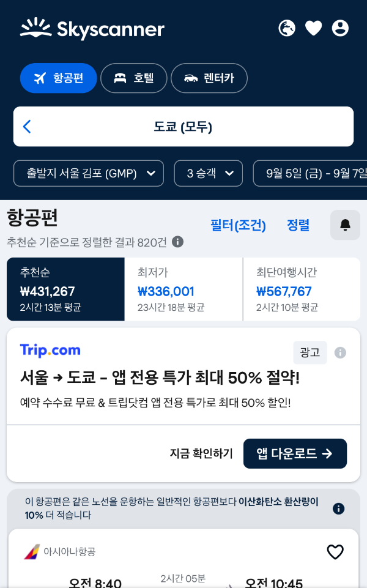

## 여행 준비의 첫걸음, 항공권 저렴하게 구입하기

여행 예산에서 가장 큰 비중을 차지하는 것이 바로 항공권이죠. 조금만 신경 쓰면 같은 노선, 같은 좌석이라도 훨씬 저렴하게 구매할 수 있습니다. 보통 국내포탈에서 찾으시는 경우가 많은데요. 고수들은 좀더 해외 사이트를 검색한답니다!

오늘은 제가 직접 사용해 본 방법과 믿을 만한 가격 비교 사이트를 정리해 드릴게요.

읽고 나시면, 다음 여행 때는 ‘최저가 항공권 사냥꾼’이 되어 계실 거예요.

### 항공권 싸게 사는 기본 전략

### 1. 예약 시기 잡기

• 국내선은 출발 36주 전, 국제선은 26개월 전에 예약하는 것이 유리합니다.

• 특히 화요일과 수요일 예약이 평균보다 저렴한 경우가 많아요.

### 2. 시즌 선택

• 여행객이 적은 비수기나 성수기 직전·직후의 ‘어깨 시즌(shoulder season)’을 노려보세요.

• 같은 지역이라도 시기에 따라 가격 차이가 30~50%까지 납니다.

### 3. 익명 모드 검색

• 이건 진짜 비밀인데요. 항공권 검색 시 크롬 ‘시크릿 모드’를 활용하면, 반복 조회로 인한 가격 인상 가능성을 줄일 수 있습니다.

### 가격 비교에 강한 추천 사이트 5곳

1. Google Flights — [https://www.google.com/travel/flights](https://www.google.com/travel/flights)

• 달력·그래프 형태로 한 달치 가격을 한눈에 볼 수 있어요.

2. 스카이스캐너(Skyscanner) — [https://www.skyscanner.co.kr/](https://www.skyscanner.co.kr/)

• “모든 지역”, “모든 날짜” 검색 기능으로 일정·목적지를 유연하게 바꿀 수 있습니다.

3. 카약(Kayak) — [https://www.kayak.co.kr/](https://www.kayak.co.kr/)

• 가격 변동 예측, “Hacker Fare” 기능(두 편도 결합해 절약) 지원

4. 모몬도(Momondo) — [https://www.momondo.com/](https://www.momondo.com/)

• 직관적인 인터페이스와 다양한 필터로 세부 검색이 편리합니다.

5. 트립닷컴(Trip.com) — [https://kr.trip.com/](https://kr.trip.com/)

• 모바일 앱 전용 단독 특가가 많아요.

⸻

### 타이밍과 검색 팁

• 항공사 공식 홈페이지도 함께 확인하기

비교 사이트에 표시되지 않는 특별 할인이나 프로모션이 있을 수 있습니다.

• 출발·도착 공항 유연성

인천 대신 김포·부산 출발로 변경하면 요금이 달라질 때가 있어요.

• 가격 알림 기능 활용

가격이 떨어졌을 때 바로 알 수 있도록 알림을 설정하세요.

• 뉴스레터 구독

한정 특가나 오류 운임 소식을 제일 먼저 받을 수 있습니다.

⸻

### ❓ 자주 묻는 질문 (FAQ)

**Q1. 가장 저렴한 요일이 있나요?**

A. 화요일·수요일 출발 항공편이 저렴한 경우가 많습니다.

**Q2. ‘오류 운임’이란 무엇인가요?**

A. 시스템 오류로 정상가보다 낮게 책정된 항공권입니다. 다만 항공사에서 취소할 수도 있습니다.

**Q3. 하루에 몇 번 검색하는 게 좋을까요?**

A. 반복 검색보다는 가격 알림 기능을 활용하는 것이 효율적입니다.

⸻

### 마무리

항공권을 싸게 사는 건 운이 아니라 전략입니다.

• 예약 시기와 요일을 잘 고르고

• 가격 비교 사이트를 활용하고

• 알림·뉴스레터로 타이밍을 잡으면

누구나 저렴하게 항공권을 구매할 수 있습니다.

다음 여행 준비할 때 오늘 소개한 방법을 꼭 써먹어 보세요.

여행 예산이 훨씬 여유로워질 거예요. ✈
