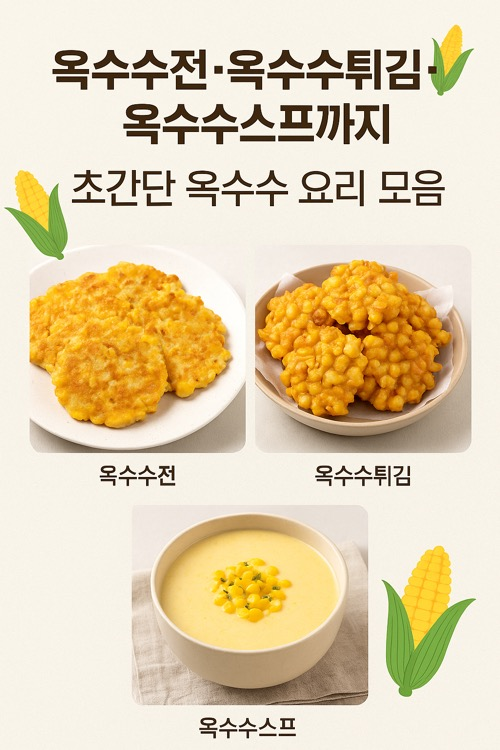

---

## 옥수수전·옥수수튀김·옥수수스프까지! 초간단 옥수수 요리 모음

옥수수로 만드는 간단한 집밥 요리 3종 — 옥수수전, 옥수수튀김, 옥수수스프 레시피를 한 번에! 10분~20분이면 완성되는 간식·반찬·아침메뉴.

---

### 옥수수, 간단하게 변신하는 마법 재료

여름철 단맛 가득한 생옥수수부터 사계절 내내 구할 수 있는 캔옥수수까지, 옥수수는 그 자체로도 맛있지만 여러 요리로 변신시킬 수 있는 매력적인 재료입니다.

오늘은 **옥수수전, 옥수수튀김, 옥수수스프** 세 가지 레시피를 소개할게요. 모두 간단한 재료와 짧은 조리 시간으로 완성할 수 있어 바쁜 날 간식이나 반찬으로 딱입니다.

---

### 1⃣ 달콤·고소한 옥수수전

**준비 재료**

- 생옥수수 알 1컵(또는 캔옥수수 150g)
- 부침가루 1컵
- 물 3/4컵
- 소금 약간, 설탕 약간
- 식용유

**만드는 법**

1. 옥수수 알은 체에 밭쳐 물기를 빼주세요.
2. 볼에 부침가루, 물, 소금·설탕을 넣고 걸쭉하게 반죽합니다.
3. 옥수수를 반죽에 넣어 잘 섞습니다.
4. 달군 팬에 기름을 두르고 반죽을 한 숟가락씩 올려 앞뒤로 노릇하게 부칩니다.

**팁**

- 부침가루 대신 밀가루 + 전분을 사용해도 됩니다.
- 마지막에 치즈를 살짝 올리면 풍미가 배가됩니다.

---

### 2⃣ 바삭함의 유혹 옥수수튀김

**준비 재료**

- 옥수수 알 1컵
- 튀김가루 1컵
- 찬물 3/4컵
- 소금 약간
- 식용유

**만드는 법**

1. 옥수수는 물기를 제거한 뒤 키친타월로 한번 더 닦아주세요.
2. 튀김가루와 찬물을 섞어 묽은 반죽을 만듭니다.
3. 옥수수를 반죽에 넣어 고루 묻힌 뒤 한 숟가락씩 뜨셔서 170℃ 기름에 넣습니다.
4. 노릇하게 튀겨내면 완성!

**팁**

- 기름 온도가 너무 낮으면 바삭함이 덜하고, 너무 높으면 금방 타니 주의하세요.
- 매콤한 맛을 원한다면 고춧가루를 반죽에 살짝 넣어도 좋습니다.

---

### 3⃣ 부드럽고 든든한 옥수수스프

**준비 재료**

- 캔옥수수 1캔(약 200g)
- 양파 1/4개(다진 것)
- 우유 2컵
- 버터 1큰술
- 소금·후추

**만드는 법**

1. 냄비에 버터를 녹이고 다진 양파를 투명해질 때까지 볶습니다.
2. 옥수수와 우유를 넣고 중약불에서 5분간 끓입니다.
3. 블렌더나 핸드블렌더로 곱게 갈아줍니다.
4. 다시 냄비에 옮겨 소금·후추로 간하고, 원하는 농도가 될 때까지 끓입니다.

**팁**

- 생옥수수를 사용할 경우, 먼저 살짝 삶아 알을 발라 쓰면 됩니다.
- 빵과 함께 먹으면 아침 식사로 든든합니다.

---

### 옥수수 요리 맛있게 즐기는 팁

**생옥수수 vs 캔옥수수**

생옥수수는 씹는 식감과 자연스러운 단맛이 뛰어나고, 캔옥수수는 조리 시간을 단축할 수 있어 간편합니다.

**남은 옥수수 활용**

한 번에 많이 조리한 옥수수는 냉동 보관 후 필요할 때 꺼내 요리에 활용하세요.

**조미료 선택**

옥수수는 단맛이 강해 소금, 버터, 치즈와 잘 어울립니다.

---

### 요약

- **옥수수전**: 고소하고 달콤한 간식형 전
- **옥수수튀김**: 바삭하게 즐기는 별미
- **옥수수스프**: 부드럽고 든든한 한 끼 모두 10~20분이면 완성 가능한 초간단 레시피입니다.

---

여러분도 오늘 집에 있는 옥수수로 한 가지부터 시작해 보세요.

달콤하고 고소한 옥수수 향이 집안을 가득 채우면, 그 순간이 바로 작은 행복이 될 거예요.

[옥수수 요리 찜기 없이 맛있게 먹기](/entry/초당옥수수-완벽하게-먹기-집에-찜기가-없다고요)

[최고급 올리브유 한병이 15만원](/entry/기름을-마신다고-올리브유-무슨-종류가-이렇게-많아)

[올리브유의 효능 종합 정리](/entry/올리브오일-3편-올리브유의-효능)

[올리브유와 음식 궁합(레몬즙 포함)](/entry/올리브오일-4편-올리브유와-음식-궁합레몬즙-포함)
