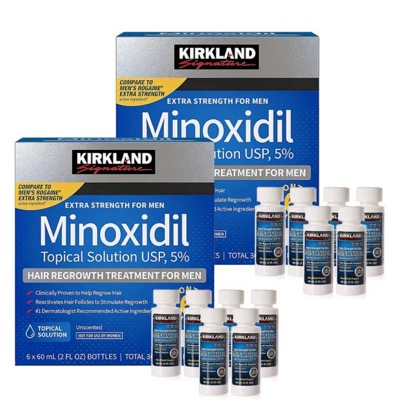
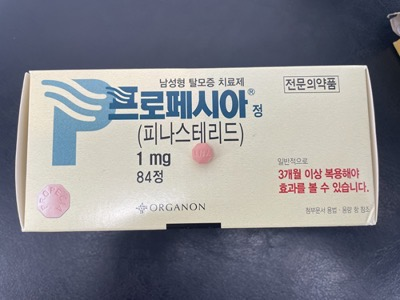
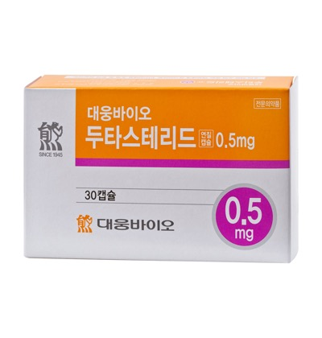
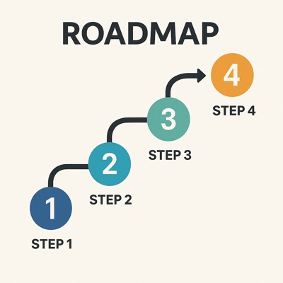

남성 탈모 종류와 흔한 유형, 약물(미녹시딜·피나스테리드·두타스테리드), 시술, 생활습관, 부작용 피하는 법까지 쉽게 정리해봤어요.

### 1. 남성 탈모, 어떤 종류가 있나

• 남성형 탈모(AGA): 가장 흔함. 이마·정수리부터 숱이 줄며 서서히 진행

• 원형 탈모: 동전처럼 뚝 떨어지는 형태. 면역 관련.

• 휴지기 탈모: 큰 스트레스·질병·다이어트 후 2~3개월 지나 머리가 확 빠지는 타입

• 반흔성(흉터성) 탈모: 염증·외상으로 모낭이 망가지는 경우로 바로 진료 필요

시작 단계일수록 되돌리기 쉽습니다. 주기적으로 변화되는 모습을 “사진으로 기록”하면 치료와 처방에 큰 도움이 됩니다.

### 2. 기본 치료 3종

### 2-1. 미녹시딜(바르는 약)

• 역할: 모발 성장 신호 업! 빠지는 속도 다운!

• 사용: 하루 2회, 마른 두피에 바르고 완전히 말리기

• 포인트: 3개월은 참고 써야 변화를 느낄 수 있어요

### 2-2. 피나스테리드(먹는 약)

• 역할: 탈모 유발 호르몬(DHT) 줄여 진행을 정지

• 사용: 보통 하루 1정(처방필요)

• 포인트: 유지가 생명. 끊으면 원래 속도로 다시 진행

### 2-3. 두타스테리드(먹는 약)

• 역할: DHT를 더 강하게 낮춤

• 사용: 처방약. 피나스테리드 효과가 약한 분 추천

• 포인트: 효과는 강한 편, 대신 끊어도 몸에서 빠지는 데 시간이 좀 걸림

### 3. 약물 부작용, 이렇게 피하세요

### 미녹시딜

• 흔한 증상: 두피 따가움, 비듬, 초기에 머리카락이 더 빠지는 느낌

• 줄이는 법 : 처음엔 소량·저빈도로 시작해 서서히 늘리기, 취침 2~3시간 전 사용(얼굴로 흐르며 자극되는 것 예방), 손은 바로 씻기, 눈썹·수염에 묻지 않게 주의 필요

### 피나스테리드

• 가능 증상: 성욕 저하, 발기 어려움, 유방 통증, 드물게 기분 변화

• 시작 전 기본 상태 체크(성기능·기분) → 이상 생기면 즉시 상담, 술·과로·수면부족 줄이기(컨디션이 부작용 체감에 영향), 임신 가능성이 있는 파트너가 부서진 정제를 만지지 않도록 보관

### 두타스테리드

• 가능 증상: 피나스테리드와 유사. 반감기가 길어 회복에 시간이 더 걸릴 수 있음

• 처음부터 교체하지 말고 의사와 단계 조정정기적으로 경과·부작용 체크 설문 작성해 비교

팁: “국소 피나스테리드 혼합제”는 아직 안전성·효과가 충분히 정리되지 않았습니다. 반드시 의료진과 상의해 결정하세요.

### 4. 시술·기기 치료 시기

• PRP(자가혈 주사): 약과 함께 할 때 만족도가 높으나 개인차 큼

• LLLT(저출력 레이저 모자/빗): 집에서 꾸준히 쓰면 모발 수가 늘었다는 보고 다수. 꾸준함이 핵심

• 마이크로니들링: 두피에 미세 구멍을 내 성장 신호를 자극. 보통 미녹시딜과 병행

• 모발이식(FUE/FUT): 빈 부분이 넓거나 디자인을 확실히 바꿔야 할 때 추천

• FUE: 점점이 흉터, 회복 빠름

• FUT: 한 번에 많은 모낭 확보

• 선택 기준: 의사 숙련도·공여부(뒤통수) 품질·예산·흉터 선호

### 5. 생활 습관·두피 케어 확인사항

• 지루성 두피(가렵고 기름짐)엔 케토코나졸 샴푸 주 23회(35분 두피에 머무른 뒤 헹굼)

• 단백질·철·아연이 들어간 균형 식사, 무리한 다이어트·야식 줄이기

• 수면 7시간 이상, 흡연·과음 줄이기

• 강한 파마·염색·열기구 빈도 낮추기, 자외선 차단 모자

• 매달 같은 각도·조명으로 정면/정수리 사진 기록 → 변화 확인

### 6. 12주 로드맵 & FAQ

### 12주 로드맵

1–2주: 진단(유형·가족력·약 복용 확인) → 미녹시딜 시작

3–4주: 피나스테리드 또는 두타스테리드 고려(의사 상담)

6주: 자극·부작용 체크, 사용법 교정

12주: 사진 비교(시작 전 vs 12주), 필요 시 LLLT/PRP 추가 논의 → 계속 유지

### FAQ

Q. 언제 시작할까요?

A. 지금이 가장 빠릅니다. 진행형이라 멈춰 세우는 게 우선입니다.

Q. 끊으면 어떻게 되나요?

A. 대개 몇 달에 걸쳐 원래 진행 속도로 돌아갑니다.

Q. 이식은 누구에게?

A. 약·보조요법에도 빈 곳이 넓거나 헤어라인 디자인을 바꿔야 할 때 고려합니다.
