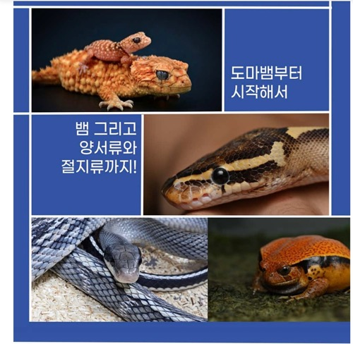
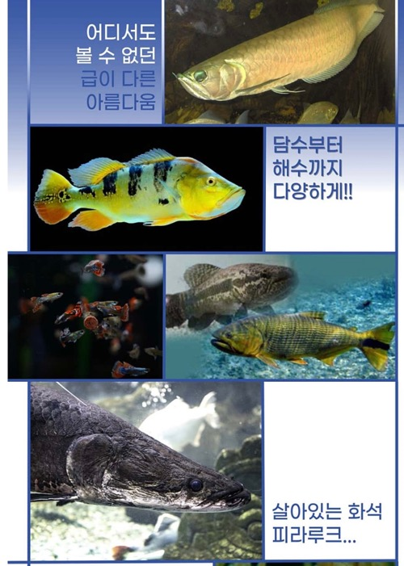
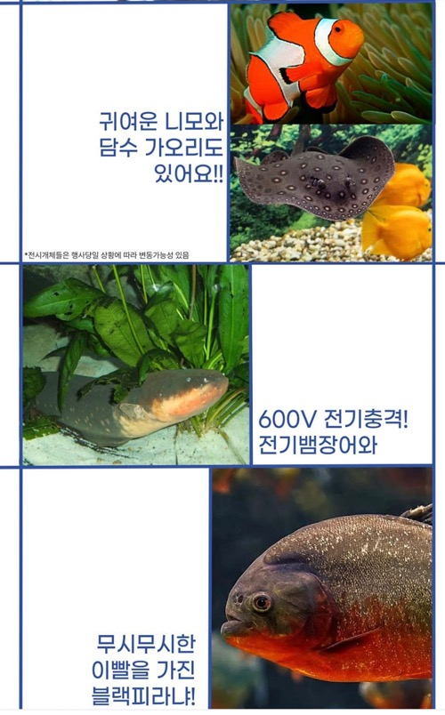
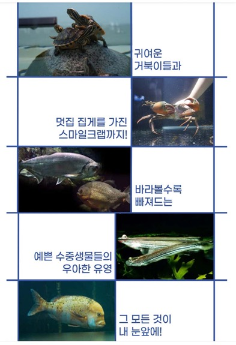

## 2025 관상어 박람회 티켓 가격, 일정·관전 포인트 총정리

2025년 8월, 고양 킨텍스에서 열리는 ‘한국 관상어 산업 박람회’. 관상어 전시, 신기술 소개, 품평회와 체험 프로그램까지 한눈에 알려드립니다.

2025년 8월 15일부터 17일까지, 수족관 애호가들과 업계 종사자 모두를 위한 ‘2025 한국 관상어 산업 박람회’가 경기도 고양 킨텍스에서 열립니다. 수조 인테리어, 희귀 어종부터 최신 수질관리 기술까지, 물생활의 모든 것이 모이는 이번 행사를 준비했어요.

### 1. 행사 개요

• 일정: 2025년 8월 15일(금) ~ 17일(일), 총 3일간

• 시간: 오전 10시 ~ 오후 6시 (입장마감 오후 5시)

• 장소: 경기도 고양시 킨텍스 제1전시장 5홀

• 입장료 (티켓링크 기준)

• 성인: 12,000원

• 청소년(중·고등학생): 8,000원

• 어린이(36개월 이상~초등학생): 6,000원

• 36개월 미만: 무료 (증빙서류 필요)

### 2. 주요 프로그램 & 전시 내용

### 전시 품목

• 관상어 및 수생 생물류 (담수·해수·희귀 어종 등)

• 수조 및 기자재 (여과기, 조명, 냉각기, 장식품 등)

• 사료, 약품, 수질관리 제품과 수생식물, 아쿠아스케이핑 자재

• 특별 프로그램

• 품평회 (Competition & Judging Show): 국내외 전문가가 참여해 우수 품종 및 사육 기술을 평가·시상하며, 관상어 산업 경쟁력 강화와 글로벌 시장 진출 기반 마련

• 체험 프로그램: 아쿠아스케이핑 전시, DIY 키트, 현장 시연, 콘텐츠 체험 등 다양한 참여형 구성

• 산업 트렌드 소개: 신품종, 친환경 수조 시스템, 수질관리 기술, 차세대 LED 조명 등 최신 트렌드 전시

### 3. 사전예약 꿀팁 & 입장료 정리

• 티켓 가격

• 성인: 12,000원

• 청소년: 8,000원

• 어린이: 6,000원

• 36개월 미만: 무료

• TIP : 주말에는 혼잡할 수 있으니 평일 오전 입장 추천, 현장과 온라인 가격 동일, 온라인 사전 구매 시 입장 대기 시간 단축 가능

### 4. 참가 팁 & 추천 관람 코스

### 관람 순서 추천

1. 품평회 먼저 관람 — 전문가 시연 관람 후 신제품 & 트렌드 확인
2. 아쿠아스케이핑 존 — 수조 인테리어 영감 얻기
3. 기자재 & 수초 부스 — 직접 만지고 비교하며 쇼핑
4. 체험 코너 — DIY 키트, 시연, 체험 콘텐츠 참여

• 최신 트렌드 체크 포인트

• 친환경 필터·시스템

• AI 기반 수질관리

• 고효율 LED 조명

• 신품종 전시 부스 (사진 포인트!)

• 초보 관람객 팁

• 미취학 아동은 무료 입장 가능 (증빙 필요)

• 편한 복장과 촬영 장비 준비 — 인생샷 포인트 많음

2025년 8월 15~17일, 고양 킨텍스 제1전시장 5홀에서 열리는 ‘한국 관상어 산업 박람회’는 관상어 전시, 전문가 품평회, 기술 콘텐츠, 체험 프로그램이 어우러진 국내 최대 규모의 아쿠아 박람회입니다.

관상어에 관심 있거나 수조에 영감을 받고 싶다면, 티켓링크를 통해 미리 예매하고 일정 맞춰 방문해보세요. 물속 작은 세계가 한층 더 특별해질 거예요.

### 참고 링크

• [한국관상어협회 공식 홈페이지](https://kafaco.kr/)

• [킨텍스 교통·주차 안내 페이지](https://www.kintex.com/web/ko/service/parking_user.do)

• [티켓링크 예매 페이지](https://m.ticketlink.co.kr/product/57129)

