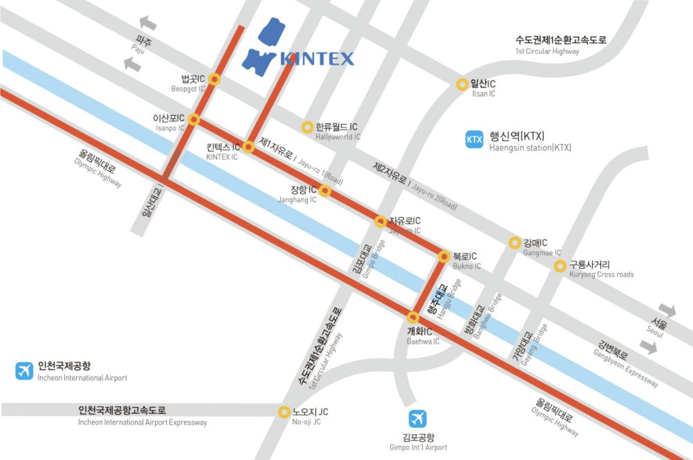
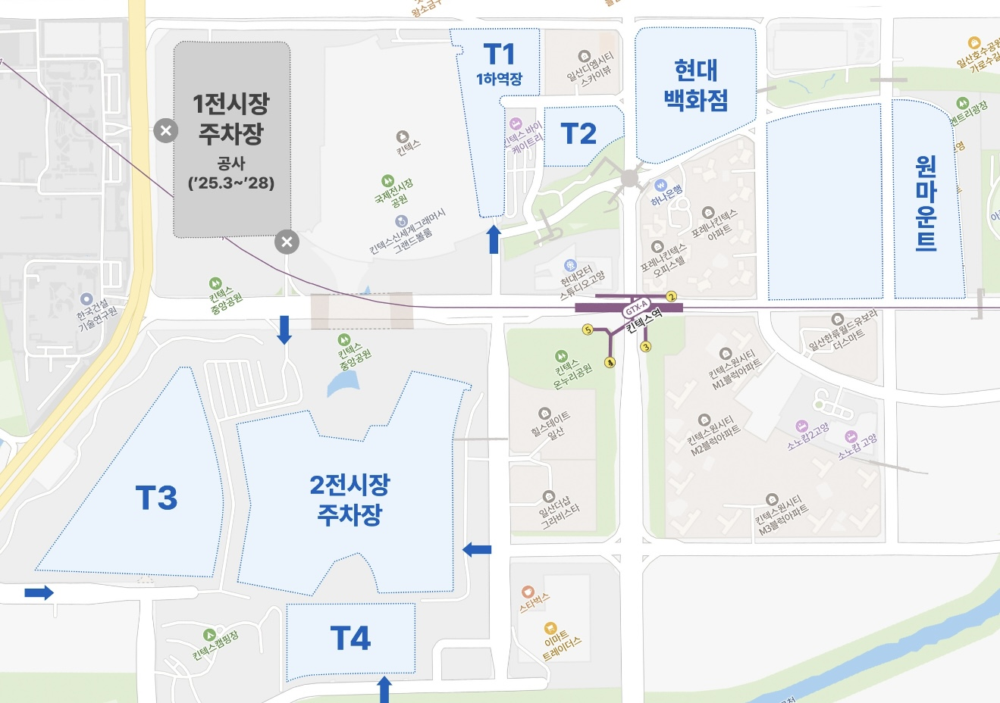
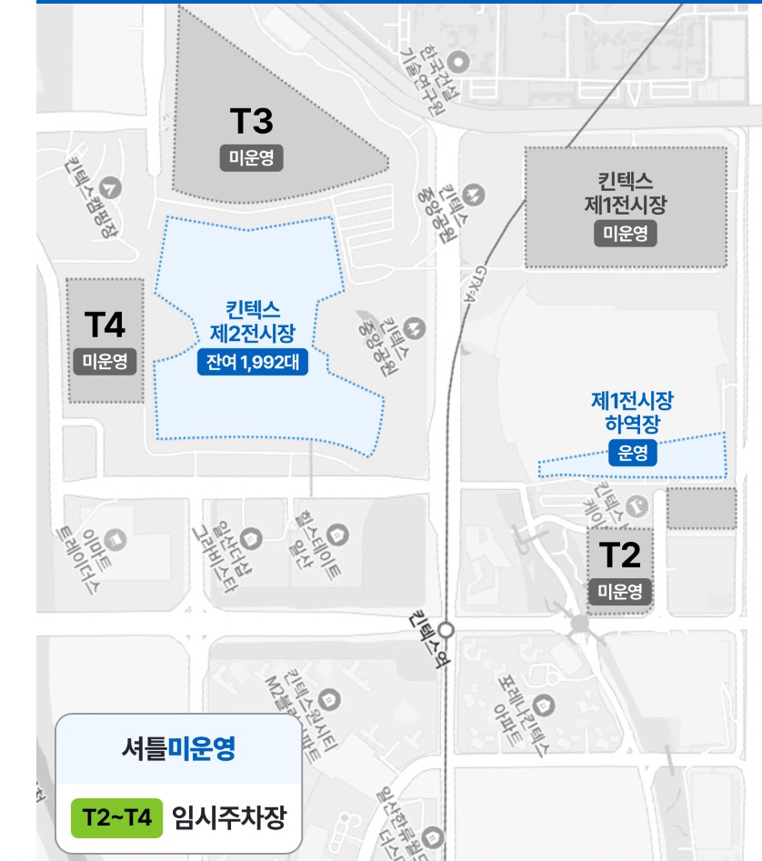
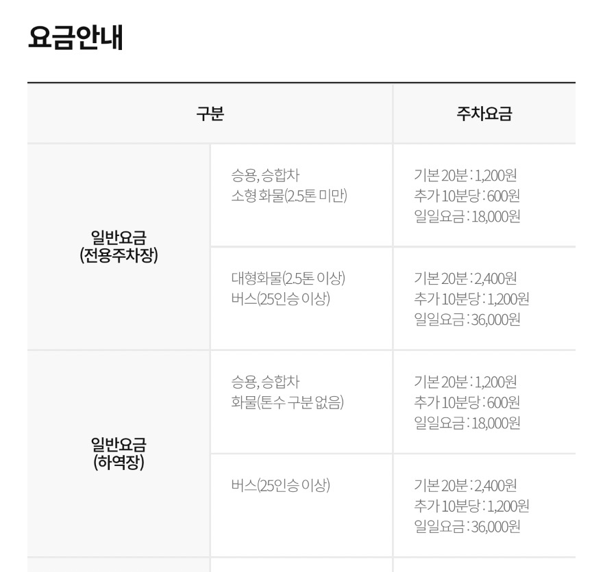

## 킨텍스 주차 완벽 가이드 (2025 최신) — 요금·위치·팁 총정리

고양 킨텍스 주차 요금, 위치, 대체주차장, 공영주차장, 할인 팁까지 한눈에 정리한 2025년 최신 주차 가이드입니다.

### 킨텍스 주차장 개요

경기도 고양시 일산서구 킨텍스로 217-60에 위치한 킨텍스(KINTEX)는 국내 최대 규모 전시·컨벤션 센터로,

대규모 행사 시 수만 명이 방문하기 때문에 주차 혼잡이 심한 편입니다.

사전 정보 확인과 동선 계획이 필수예요.

### 1. 공식 주차장 요금 (2025 기준)

• 승용·소형 화물차: 기본 30분 1,500원 / 10분당 500원 / 1일 최대 12,000원

• 대형차·버스: 기본 30분 3,000원 / 10분당 1,000원 / 1일 최대 24,000원

• 할인 대상: 국가유공자, 장애인, 경차, 저공해 차량 (50% 할인)

⸻

### 2. 임시주차장 (T2·T3·T4) 요금

• 10분당 600원 / 1일 최대 6,000원

• T3 주차장 주의사항: 지정 게이트로 입출차해야 최대 요금 6,000원 적용

(잘못된 게이트 이용 시 일반 요금 부과 → 현장 정정 요청 가능)

**3. 1전시장 주차장 폐쇄 & 대체 주차장**

2025년 6월 17일부터 제3전시장 건설로 인해 1전시장 지상 주차장(1,568면)이 폐쇄되었습니다.

대신 아래 대체 주차장이 운영 중입니다.

-1전시장 뒤편 하역장: 약 375면

-바이 케이트리 호텔 옆 공터 : 약 217면

-창고 부지 : 약 357면

-3전시장 B동 예정지 (9월 이후 600면) 일부 운영

-원마운트 인근 공터 : 약 1,400면

-2전시장 뒤 캠핑장 옆 야외 전시장 부지 : 약 700면

※ 일부 구역은 셔틀버스 운영 → 이동 시간 여유 필요

### 4. 주변 공영주차장 추천 (혼잡 시 대안)

• 킨텍스 공영주차장 (1전시장 옆) : 1시간 1,200원

• 고양체육관 공영 : 1시간 1,000원

• 일산호수공원 공영 : 1시간 960원 (산책 겸 가능)

### 5. 방문객들이 추천하는 주차 꿀팁

• 대형 행사 시 → 행사 시작 최소 1시간 전 도착 필수

• 이마트 트레이더스 킨텍스점: 구매 금액에 따라 최대 5시간 무료

• 고양시 등록 차량: KINTEX 멤버십 가입 시 30% 할인 가능

### 6. 주차 요금 정리 표

킨텍스 주차는 행사 규모·요일·시간에 따라 체감 난이도가 크게 달라집니다.

공식·임시·공영주차장 위치를 미리 확인하고, 필요 시 대중교통이나 셔틀버스를 적극 활용하는 것이 좋습니다.

[삼성역 스타필드 코엑스 주차 요금, 할인, 가까운 입구 총정리](/entry/삼성역-코엑스-주차장-완벽-가이드)
