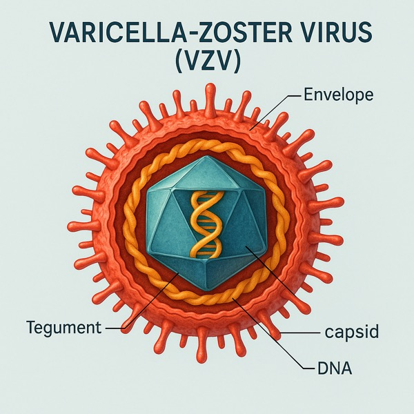
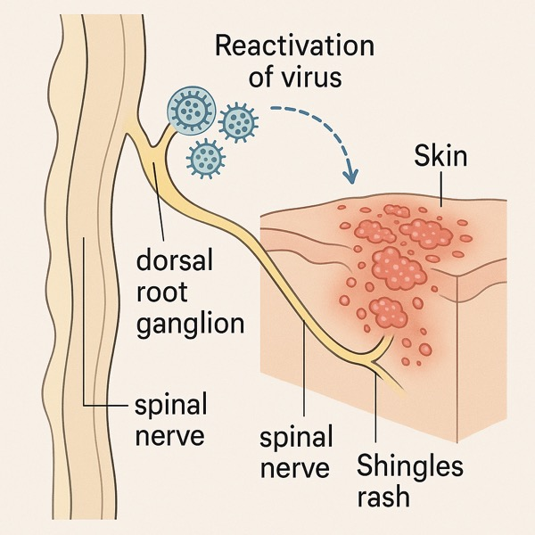
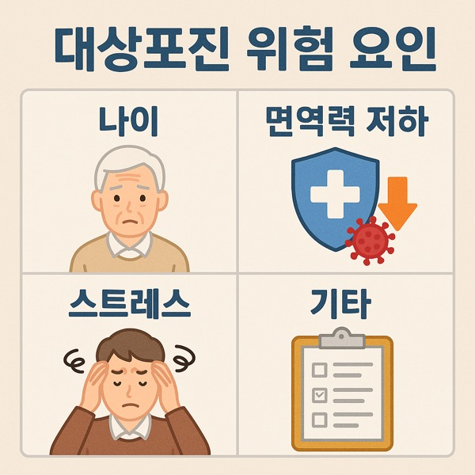
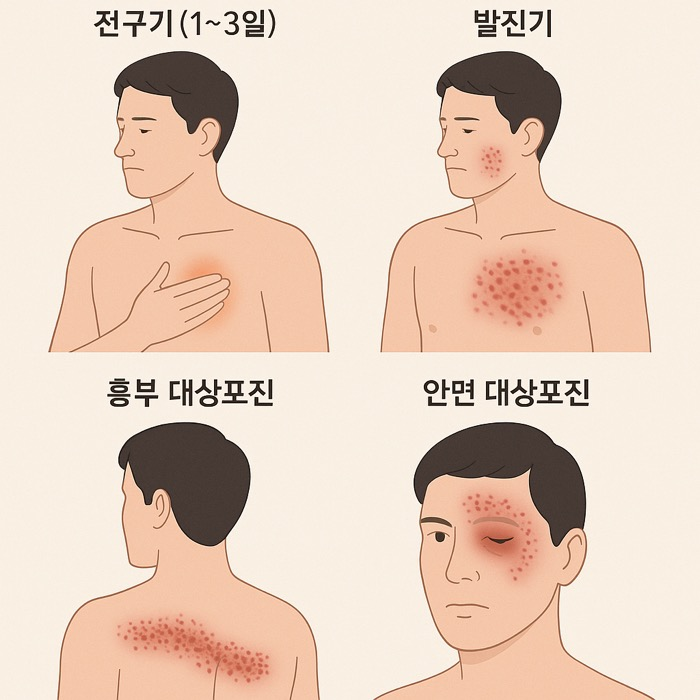
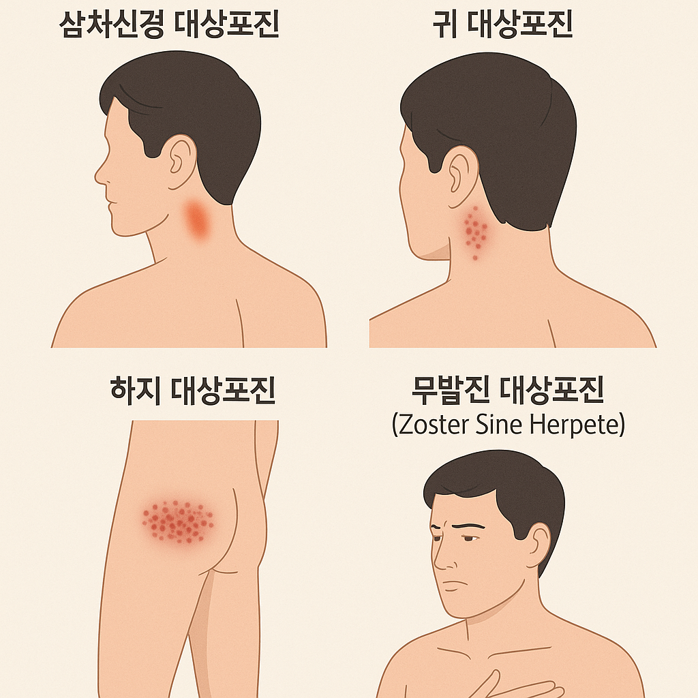
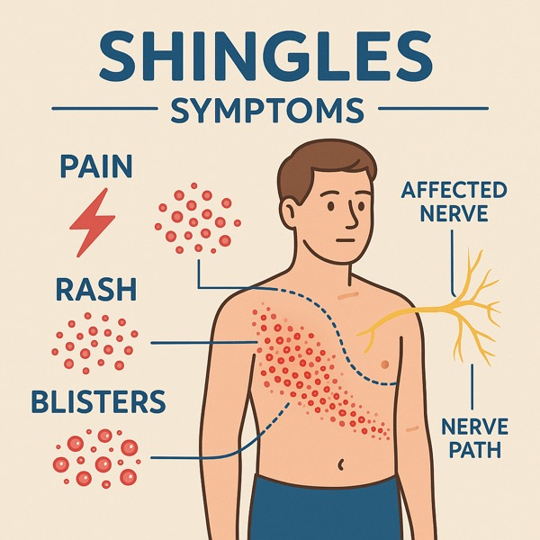

## 대상포진 종류·원인·위험성

대상포진의 원인, 증상, 다양한 종류와 합병증 위험성, 예방 방법까지 최신 정보로 정리했습니다.

### 1. 대상포진이란?

대상포진(herpes zoster)은 수두-대상포진 바이러스(Varicella Zoster Virus)가 원인인 피부 질환입니다.

어릴 때 수두를 앓고 나면 바이러스가 척수 신경절에 잠복해 있다가, 면역력이 떨어질 때 다시 활성화되며 신경을 따라 피부에 발진과 통증을 일으킵니다.

### 2. 대상포진의 주요 원인

• 면역력 저하: 과로, 스트레스, 노화, 만성질환, 항암 치료 등

• 급격한 체력 소모: 수술 후 회복기, 출산, 장기 여행

• 기저질환: 당뇨병, 암, 자가면역질환 등

• 고령: 50세 이상에서 발병률 급증

**TIP: 50대 이후에는 대상포진 예방접종이 권장됩니다.**

### 3. 대상포진의 종류

대상포진은 발병 부위와 양상에 따라 구분됩니다.

### 3-1. 피부 발진 부위별

1. 흉부 대상포진

• 가장 흔한 형태

• 갈비뼈를 따라 띠 모양으로 발진

2. 안면 대상포진

• 얼굴, 특히 눈 주위 발병

• 시력 저하·실명 위험

3. 삼차신경 대상포진

• 안면 신경 중 삼차신경에 발생

• 심한 통증, 구강 점막 병변 가능

4. 귀 대상포진(람지헌트 증후군)

• 귀 주위 발진, 청력 저하·어지럼증 동반

5. 하지 대상포진

• 허리~다리 쪽 신경 분포에 따라 발진

### 3-2. 임상 양상별

• 전형적 대상포진: 수포·발진·통증이 함께 나타남

• 무발진 대상포진(Zoster Sine Herpete): 발진 없이 심한 신경통만 나타나는 경우

• 재발성 대상포진: 드물지만 같은 부위나 다른 부위에 재발 가능

### 4. 증상 진행 단계

1. 전구기 (1~3일)

• 감각 이상, 저림, 가벼운 통증

• 일부는 오한·피로감 동반

2. 발진기 (약 7~10일)

• 붉은 발진 → 물집 → 딱지 형성

• 심한 작열통(타는 듯한 통증)

3. 회복기

• 피부 병변 호전

• 하지만 신경통(대상포진 후 신경통)이 수개월~수년 지속 가능

### 5. 대상포진의 위험성 & 합병증

대상포진 자체도 고통스럽지만, 합병증이 더 큰 문제입니다.

• 대상포진 후 신경통 (PHN): 발진이 사라진 후에도 지속되는 심한 통증

• 시력 저하·실명: 안구 침범 시

• 청력 손실·안면마비: 귀 대상포진(람지헌트 증후군)

• 뇌염, 척수염: 면역저하 환자에서 드물지만 치명적

• 피부 흉터·색소 침착: 발진 후 흔적 남을 수 있음

**50세 이상 환자의 약 10~20%에서 신경통이 장기화된다는 보고가 있습니다.**

### 6. 예방 방법

• 예방접종: 50세 이상 성인, 면역저하자에게 권장

• 면역력 관리: 충분한 수면, 균형 잡힌 식사, 규칙적인 운동

• 스트레스 조절: 명상·산책·취미 활동

• 기저질환 관리: 당뇨·고혈압 등 철저히 관리

### 7. 치료 방법

• 항바이러스제: 발병 후 72시간 이내 복용 시 효과 극대화 (아시클로버, 발라시클로버 등)

• 진통제·소염제: 통증 완화

• 습포·피부 관리: 2차 감염 방지

• 신경차단술: 대상포진 후 신경통 완화 목적

대상포진은 단순 피부병이 아니라 신경질환이자 면역력 저하의 경고 신호입니다.

특히 50세 이상, 만성질환자, 면역저하자는 예방접종과 면역력 유지가 중요합니다.

조기 치료만으로도 합병증 위험을 크게 줄일 수 있으니,

증상 의심 시 바로 전문의 진료를 받으시길 권합니다.

[대상포진 예방접종 가격과 신청방법](/entry/대상포진-예방접종-가격과-신청방법)

[40대부터 챙겨야 할 건강 검진 항목](/entry/40대부터-챙겨야-할-건강-검진-항목)

[간 건강을 지키는 해독 식단](/entry/간-건강을-지키는-해독-식단)

[활기찬 노년을 위한 식단과 영양](/entry/활기찬-노년을-위한-식단과-영양)
