## 2025년 하반기 독감 예방접종 가이드 - 3가 백신 무료 접종 대상·병원별 가격까지 한눈에

이번 글에서는 2025년 하반기 기준 한국의 독감 예방접종 제도를 쉽고 친절하게 정리해드립니다. 3가 백신 전환, 무료 대상자, 병·의원의 가격 차이, 동시 접종 정보까지 한 번에 확인해보세요.

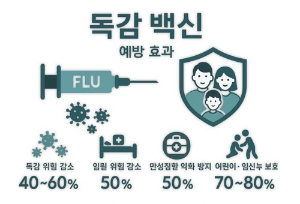

### 1. 2025년도 하반기 독감 백신 주요 변화

• 2025년 하반기부터 국내에 3가 독감 백신이 주로 공급됩니다. WHO 권고에 따른 것으로, B형 야마가타 계열 바이러스 비검출을 근거로 한 결정입니다.

• 총 약 2,700~2,800만 명분이 국가출하승인 예상 물량입니다.

• 이에 따라 백신 가격이 전보다 낮아지고, 민간 시장 경쟁도 치열해지고 있습니다.

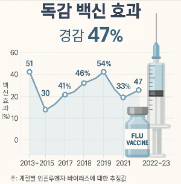

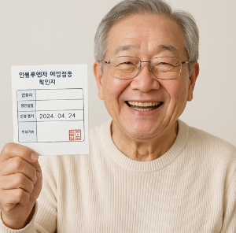

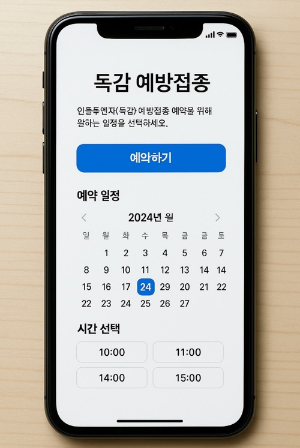

### 2. 무료 접종 대상 및 일정 (2025 하반기)

• 국가예방접종(NIP) 무료 대상:

• 소아: 생후 6개월~13세 (2011.1.1.~2025.8.31. 출생) — 기초 접종 미완료 시 2회, 완료자는 1회 접종

• 임신부: 임신 주수 무관

• 65세 이상 어르신: 연령대별 순차 시작

• 75세 이상: 10월 초중

• 70–74세: 10월 중순

• 65–69세: 10월 중말

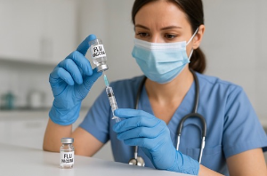

### 3. 유료 접종 가격과 병원 간 차이

• 2024–25절기 기준: 병·의원별 2만~3만 5천 원, 일부 4만 원 이상

• 서울 평균 약 38,649원, 최저가 12,000원 사례도 있음

• 2025년에는 3가 백신 전환과 가격 인하로 비용 부담이 줄어들 전망

• 다만 면역증강 고령자용 백신 등 프리미엄 제품은 비급여로 공급되며 5만 원 전후가 형성될 가능성 있음

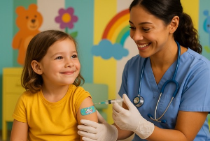

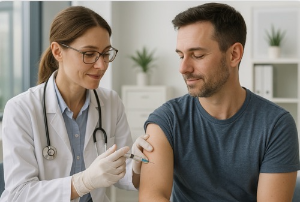

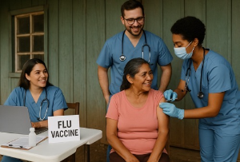

### 4. 백신 종류별 특징 (3가 vs 4가, 스프레이형)

• 3가 백신: A형 2종 + B형 1종 포함, 올해부터 대부분 전환

• 4가 백신: B형 2종까지 포함하나, 국내 NIP에서는 올해부터 제외

• 스프레이형 백신(FluMist): 비급여로 재도입, 소아·청소년·주사 기피자 대상 선택지

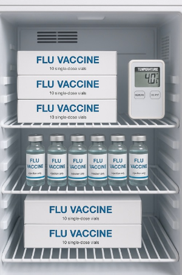

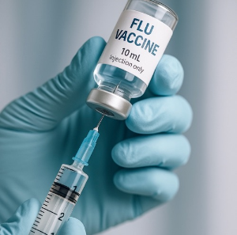

### 5. 부작용과 안전성

• 일반적 이상반응: 접종 부위 통증·발적·미열·근육통 등, 대부분 1~2일 내 호전

• 중대 이상반응: 아나필락시스, 길랭-바레 증후근 등 드물게 발생

• 고령층·기저질환자: 인플루엔자 감염 시 중증화 위험이 커 접종 이득이 큼

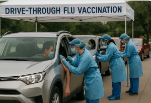

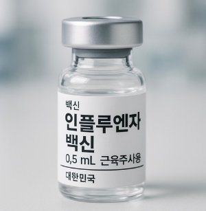

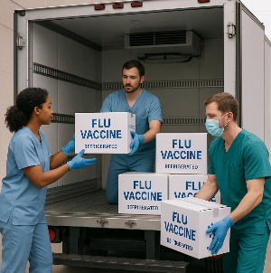

### 6. 코로나19 백신과 동시 접종은?

• 인플루엔자 백신과 코로나19 백신 동시 접종 가능

• 동일한 날, 다른 부위(양팔) 접종 권장

• 고령층·기저질환자에게 특히 유용

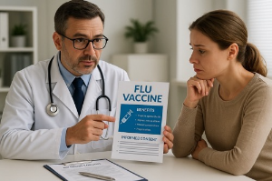

### 7. FAQ

**Q1. 독감 백신 3가로 바뀌면 효과가 떨어지나요?**

→ WHO 권고에 따라 유행형을 반영한 백신이므로 효과는 충분히 기대됩니다.

**Q2. 프리미엄 백신(면역증강형)은 누구에게 추천되나요?**

→ 고령자나 면역 약화된 분에게 추가 보호를 위해 권장되며, 비급여입니다.

**Q3. 무료 접종 대상인데 유료로 접종해도 되나요?**

→ 가능합니다. 다만 무료 일정 내 접종이 비용 부담이 없습니다.

이번 시즌은 3가 백신 전환, 가격 안정, 선택지 확대가 특징입니다. 무료 대상자는 정해진 시기에 접종을 꼭 마치고, 유료 접종은 병·의원별 가격과 백신 종류를 비교해 선택하는 것이 좋습니다.

올겨울, 독감과 코로나19 모두 대비해 건강한 시즌을 보내시길 바랍니다.

[대상포진 원인, 대상포진 종류, 위험성](/entry/대상포진-원인-대상포진-종류-위험성)

[현대인을 위한 스트레스 관리와 마음건강 가이드](/entry/현대인을-위한-스트레스-관리와-마음건강-가이드)
