## 2026년 하반기 독감 예방접종 가이드 - 3가 백신 무료 접종 대상·병원별 가격까지 한눈에

이번 글에서는 2026년 8월 1일 기준으로 한국의 독감 예방접종 제도를 쉽고 친절하게 정리해드립니다. 3가 백신 체계, 무료 대상자, 병·의원의 가격 차이, 동시 접종 정보까지 한 번에 확인해보세요. 매년 접종 시기·대상·물량은 질병관리청 발표에 따라 조정되므로, 실제 접종 전에는 반드시 예방접종도우미(nip.kdca.go.kr) 또는 가까운 보건소·병의원에서 최신 공고를 확인하시길 권장합니다.

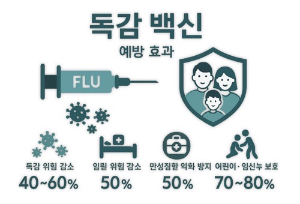

### 1. 독감 백신 3가 체계, 이제는 정착 단계

• 2025년 하반기부터 국내에는 3가 독감 백신이 도입되어 국가예방접종(NIP)의 기본 체계로 자리 잡았습니다. WHO 권고에 따라 B형 야마가타 계열 바이러스가 장기간 검출되지 않은 점을 근거로 한 결정이었습니다.

• 2026년 하반기 시즌의 국가출하승인 물량, 백신 종류별 공급 비중 등 구체적인 수치는 아직 본문 작성 시점에 공식 확정 자료로 확인되지 않았습니다. 정확한 물량과 공급 일정은 질병관리청 보도자료 또는 예방접종도우미 공지사항에서 확인하시기 바랍니다. (공식 출처 확인 필요, 기준일 2026.08.01)

• 3가 백신 전환 이후 민간 시장 경쟁이 이어지며 가격 안정화 흐름이 계속되는 것으로 보이나, 연도별 실제 가격은 병·의원마다 차이가 있어 아래 3번 항목을 참고하세요.

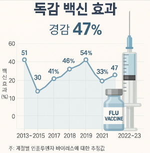

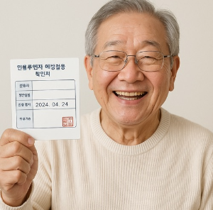

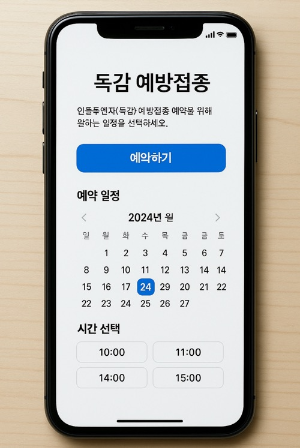

### 2. 무료 접종 대상 및 일정 (2026 하반기)

• 국가예방접종(NIP) 무료 대상은 매년 동일한 큰 틀(소아·임신부·어르신)을 유지하되, 세부 출생연도 구간과 순차접종 날짜는 해마다 갱신됩니다. 아래는 참고용 기본 틀이며, **정확한 출생연도 구간과 일자는 반드시 질병관리청 예방접종도우미(nip.kdca.go.kr) 또는 관할 보건소 공지에서 확인**하세요. (공식 출처 확인 필요)

• 소아: 생후 6개월~13세 대상 — 기초 접종 미완료 시 2회, 완료자는 통상 1회 접종이 권장됩니다.

• 임신부: 임신 주수와 무관하게 접종 대상에 포함되는 것이 일반적입니다.

• 65세 이상 어르신: 통상 연령대별로 순차 시작되며, 75세 이상 → 70~74세 → 65~69세 순으로 시행된 사례가 있었습니다. 2026년 하반기의 구체적 시작일은 아직 확정 공고 기준으로 확인되지 않았으므로 공식 출처를 확인하세요.

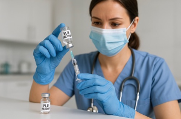

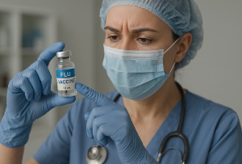

### 3. 유료 접종 가격과 병원 간 차이

• 참고(과거 절기 기준): 2024–25절기에는 병·의원별로 대략 2만~3만 5천 원, 일부 4만 원 이상이었고, 서울 평균은 약 38,649원, 최저가 12,000원 사례도 보고된 바 있습니다. 이는 과거 시점의 참고 자료이며 현재 시세와 다를 수 있습니다.

• 3가 백신 체계 정착 이후 전반적인 비용 부담이 다소 완화된 것으로 알려져 있으나, 2026년 하반기의 정확한 병·의원별 가격은 지역·의료기관마다 차이가 크므로 방문 전 전화 문의나 건강보험심사평가원·지자체 공지 등 공식 출처를 통해 확인하시길 권장합니다.

• 면역증강 고령자용 백신 등 프리미엄 제품은 비급여로 공급되는 경우가 많아 상대적으로 높은 가격대(과거 기준 5만 원 전후)가 형성될 수 있습니다. 정확한 가격은 접종 기관에 직접 확인하세요.

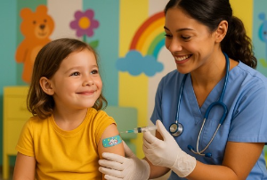

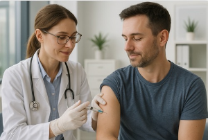

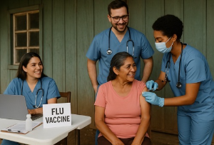

### 4. 백신 종류별 특징 (3가 vs 4가, 스프레이형)

• 3가 백신: A형 2종 + B형 1종을 포함하며, 2025년 하반기부터 국내 NIP의 기본 백신으로 전환되었습니다.

• 4가 백신: B형 2종까지 포함하던 기존 백신으로, 2025년 하반기부터 국내 NIP 대상에서는 제외되었습니다. 개인적으로 4가 백신 접종을 원하는 경우 비급여로 공급되는지 여부는 의료기관에 별도 확인이 필요합니다.

• 스프레이형 백신(FluMist 등): 비급여로 도입되어 소아·청소년이나 주사 기피자를 위한 선택지로 소개된 바 있습니다. 다만 국내 유통 현황과 접종 가능 여부는 시기에 따라 달라질 수 있으므로, 접종 전 의료기관이나 식품의약품안전처 허가 정보를 통해 최신 여부를 확인하세요. (공식 출처 확인 필요)

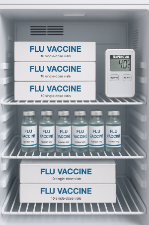

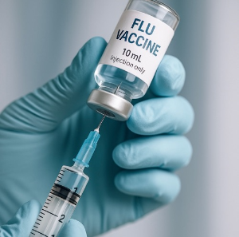

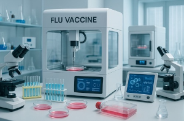

### 5. 부작용과 안전성

• 일반적 이상반응: 접종 부위 통증·발적·미열·근육통 등이 나타날 수 있으며, 대부분 1~2일 내 호전되는 경향이 있습니다.

• 중대 이상반응: 아나필락시스, 길랭-바레 증후군 등이 매우 드물게 보고된 바 있습니다. 접종 후 이상 증상이 있으면 즉시 의료진과 상담하세요.

• 고령층·기저질환자: 인플루엔자 감염 시 중증화 위험이 상대적으로 높아, 접종을 통한 예방 효과가 클 수 있다는 것이 일반적인 의견입니다. 개인의 건강 상태에 따라 접종 여부는 담당 의사와 상의하시길 권장합니다.

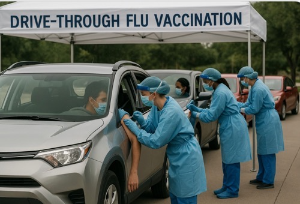

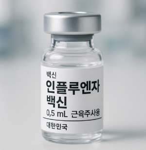

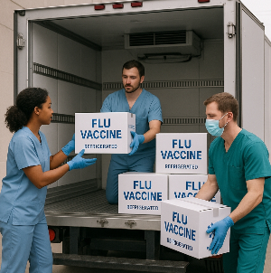

### 6. 코로나19 백신과 동시 접종은?

• 인플루엔자 백신과 코로나19 백신은 같은 날 동시 접종이 가능한 것으로 안내되고 있습니다.

• 통상 같은 날, 서로 다른 부위(양팔)에 나누어 접종하는 방식이 권장됩니다.

• 고령층·기저질환자의 경우 두 접종을 함께 계획하면 병원 방문 횟수를 줄일 수 있어 유용할 수 있습니다. 다만 개인의 건강 상태나 최근 백신 접종 이력에 따라 담당 의료진과 상의 후 결정하는 것이 안전합니다.

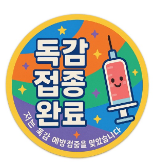

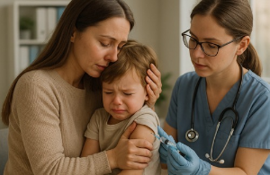

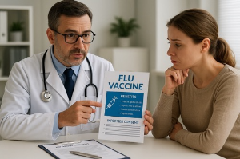

### 7. FAQ

**Q1. 독감 백신이 3가로 바뀌면서 효과가 떨어지지 않나요?**

→ WHO 권고와 실제 유행 바이러스 분석을 반영해 구성이 조정된 것으로, 일반적으로 예방 효과가 충분히 기대되는 것으로 안내되고 있습니다. 다만 개인별 면역 반응에는 차이가 있을 수 있어 절대적인 보장을 의미하지는 않습니다.

**Q2. 프리미엄 백신(면역증강형)은 누구에게 추천되나요?**

→ 주로 고령자나 면역력이 저하된 분들에게 추가적인 보호 효과를 기대하며 권장되는 편이며, 비급여로 공급됩니다. 접종 여부는 담당 의사와 상담 후 결정하시길 권장합니다.

**Q3. 무료 접종 대상인데 유료로 접종해도 되나요?**

→ 가능합니다. 다만 정해진 무료 접종 기간 내에 접종하면 비용 부담 없이 접종할 수 있으므로, 대상자라면 해당 기간을 확인해 접종하는 것이 유리합니다.

**Q4. 2026년 하반기 무료 접종 시작일과 대상 출생연도는 어디서 확인하나요?**

→ 질병관리청 예방접종도우미(nip.kdca.go.kr) 공지사항이나 관할 보건소, 가까운 지정 의료기관을 통해 확인하는 것이 가장 정확합니다. 매년 발표 시점과 세부 기준이 조정될 수 있어 본문의 연도별 예시는 참고용으로만 활용하세요.

**Q5. 작년(2025년 하반기)에 접종을 못 했는데 올해 다시 맞아야 하나요?**

→ 독감 백신의 예방 효과는 접종 후 시간이 지나면서 감소하는 경향이 있어, 매 절기(시즌)마다 새로 접종하는 것이 일반적으로 권장됩니다. 개인의 건강 상태나 이전 접종 이력에 따라 다를 수 있으니 의료진과 상의하세요.

이번 시즌은 3가 백신 체계의 정착과 함께 가격·선택지 측면에서 안정화가 이어지고 있는 것으로 보입니다. 무료 대상자는 공식 공고를 통해 정확한 접종 시기를 확인해 기간 내 접종을 완료하고, 유료 접종을 고려하는 경우 병·의원별 가격과 백신 종류를 비교해 선택하시길 권장합니다. 본문에 안내된 구체적 수치·일정 중 최신 공식 자료로 확인되지 않은 부분은 반드시 질병관리청 등 공식 출처를 통해 재확인하시기 바랍니다.

올겨울, 독감과 코로나19 모두 대비해 건강한 시즌을 보내시길 바랍니다.

[대상포진 원인, 대상포진 종류, 위험성](/entry/대상포진-원인-대상포진-종류-위험성)

[현대인을 위한 스트레스 관리와 마음건강 가이드](/entry/현대인을-위한-스트레스-관리와-마음건강-가이드)
