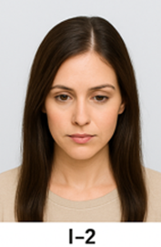
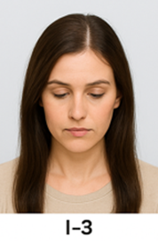
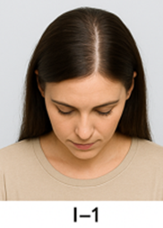
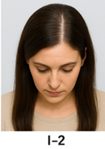
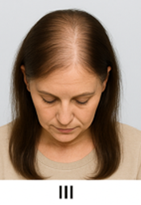
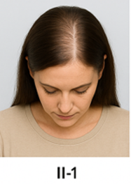
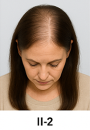
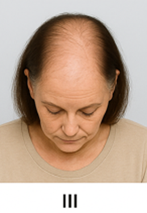

## 여성 탈모 종합 가이드 — 증상·원인·예방·치료 완전 정복

여성에게 탈모는 단순히 머리카락 문제를 넘어 자신감과 삶의 질에 큰 영향을 미치는 민감한 고민입니다.

이번 글에서는 여성 탈모의 대표 증상·원인부터 생활 속 예방법, 치료법, 그리고 약물 사용 시 주의사항까지 한 번에 정리했습니다.

조기 발견과 꾸준한 관리가 답입니다.

### 1. 여성 탈모의 주요 증상

**구분 주요 특징**

**여성형 탈모** 정수리·가르마 숱 감소, 앞머리선 유지

**확산성 탈모** 머리 전반적 숱 감소, 모발 가늘어짐

**휴지기 탈모** 스트레스·출산 후 갑작스러운 대량 탈모

**원형 탈모** 둥글게 모발 빠짐, 자가면역 반응 의심

포인트: 하루 100개 이상 빠짐이 6개월 이상 지속되면 진료가 필요합니다.

Ludwig 분류

Ludwig 분류

Ludwig 분류

### 2. Ludwig 분류에 따른 조치방법

### 1단계 (Type I)

• 가르마가 살짝 넓어지는 정도로 시작

• 정수리 부위에서 모발이 약간 가늘어짐

• 일반적인 헤어스타일로는 잘 티 나지 않을 수 있음

• 초기 발견하면 생활습관 관리, 약물치료로 개선 가능

### 2단계 (Type II)

• 가르마 확장이 뚜렷, 정수리 숱이 전반적으로 줄어듦

• 두피가 눈에 띄게 비치기 시작

• 모발 굵기와 밀도가 전반적으로 감소

• 약물·비수술 치료와 병행해 적극적 관리 필요

### 3단계 (Type III)

• 정수리 부위 탈모가 심하고 넓은 범위로 진행

• 모발 밀도 감소가 육안으로 명확히 보임

• 일부 여성은 앞머리선 근처까지 영향

• 약물 효과가 제한적, 모발이식 등 수술적 치료 고려

### 3. Ludwig 분류의 활용

• 진단 기준: 의사가 여성형 탈모의 진행 정도를 평가하는 기준

• 치료 계획 수립: 단계별로 치료 강도와 방법 결정

(예: I단계 → 생활습관 + 외용제, II단계 → 약물치료 + 주사요법, III단계 → 수술 고려)

• 경과 추적: 치료 전후 변화 비교

### 4. 원인 — 호르몬부터 생활습관까지

• 호르몬 변화: 폐경, 출산, 다낭성 난소 증후군(PCOS)

• 유전적 요인: 모계 영향이 강함

• 기타 원인: 갑상선 질환, 영양 결핍(철분·아연), 스트레스, 급격한 다이어트, 약물 부작용

### 5. 예방법과 생활 관리 팁

**✅ 해야 할 것**

• 단백질·비타민·미네랄 균형 섭취

• 하루 1-2L 물 마시기

• 6~8시간 숙면

• 규칙적 운동과 스트레스 완화

**❌ 피해야 할 것**

• 잦은 파마·염색·탈색

• 강한 자외선 노출

• 머리카락을 세게 묶는 스타일

• 무리한 다이어트와 흡연·과음

### 6. 치료 방법과 시술 종류

### 외용제 미녹시딜

6개월 이상 꾸준히 사용, 초기 쉐딩 가능

### 경구약 스피로노락톤·피나스테리드

가임기 여성 금기, 부작용 주의

### 주사 치료 PRP·메조테라피

영양·성장인자 직접 주입

### 모발이식 수술

다른 치료 무반응 시 고려

### 7. 치료약 부작용 및 주의사항

• 미녹시딜: 두피 가려움·건조·얼굴 잔털 증가

• 스피로노락톤: 월경불순·유방통·전해질 불균형

• 피나스테리드/두타스테리드: 임신·수유 절대 금기

• 영양제: 과잉 섭취 시 오히려 탈모 악화 가능

### 8. 모발 건강에 좋은 영양소·식품

비오틴: 달걀, 시금치, 견과류

아연 : 해조류, 콩류, 견과류

철분 : 시금치, 간, 붉은살 생선

비타민 D : 연어, 달걀 노른자

오메가-3 : 고등어, 연어, 호두

### 9. 병원에 가야 할 시점

• 하루 100개 이상 빠짐 지속

• 6개월 이내 숱 급감

• 원형 탈모반 발견

• 두피 염증·가려움 동반

• 월경불순·여드름 등 동반 증상

### 10. FAQ — 여성 탈모 궁금증

**Q1. 탈모 샴푸만 써도 효과가 있나요?**

A. 증상 완화에는 도움 되지만, 원인 치료는 불가능하므로 약물·생활 관리 병행이 필요합니다.

**Q2. 출산 후 빠진 머리는 다시 나나요?**

A. 대부분 6개월~1년 내 자연 회복되지만, 회복이 더디면 전문 진료가 필요합니다.

**Q3. 모발이식은 여성도 가능한가요?**

A. 가능합니다. 다만 공여 모발 상태에 따라 이식 가능 여부가 결정됩니다.

여성 탈모는 원인과 양상이 다양하지만, 조기 진단과 꾸준한 관리가 핵심입니다.

민간요법보다는 전문의 상담과 맞춤형 치료를 통해 개선할 수 있으며, 생활습관 관리가 장기적인 예방과 유지에 큰 도움이 됩니다.

✨ TIP: 머리카락 건강은 몸 전체 건강의 거울입니다. 오늘부터 식습관·수면·스트레스 관리로 모발과 삶의 질을 함께 지켜주세요.

[남성탈모 종류, 탈모약, 탈모 치료 총정리 — 탈모약 부작용과 예방까지](/entry/남성탈모-종류-탈모약-탈모-치료-총정리-—-탈모약-부작용과-예방까지)

[중장년층 건강의 핵심, 질병 예방과 관리로 똑똑하게 건강 챙기기](/entry/중장년층-건강의-핵심-질병-예방과-관리로-똑똑하게-건강-챙기기)

[현대인을 위한 스트레스 관리와 마음건강 가이드](/entry/현대인을-위한-스트레스-관리와-마음건강-가이드)
