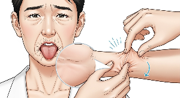
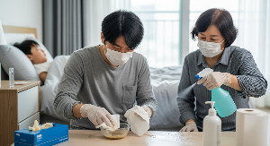
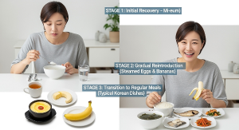

## 장염 증상부터 빨리 낫는 법·좋은 음식·전염성·약, 수액만드는 방법 가이드

장염 증상, 원인균별 특징, 빨리 낫는 방법, 회복에 좋은 음식, 전염성, 장염약, WHO 경구수액 만들기까지! 2025년 최신 의학 정보와 전문가 팁을 담았습니다.

여름철 상한 음식, 겨울철 노로바이러스… 장염은 계절 가리지 않고 찾아옵니다.

이번 글에서는 장염의 주요 증상과 전염성, 원인균별 특징, 빨리 낫는 법, 회복에 좋은 음식, 약물 사용 시 주의사항, 그리고 WHO 경구수액 만드는 법까지 종합적으로 정리했습니다.

영유아·고령자·면역저하자는 특히 주의가 필요하니 끝까지 읽어주세요.

### 1. 장염 발생 원인과 전염성

장염은 장에 염증이 생기는 질환으로, 감염성(세균·바이러스·원충)과 비감염성(알레르기, 약물 등)으로 나뉩니다.

### 주요 원인균 및 특징적인 증상

• 세균성: 살모넬라, 대장균, 장염비브리오, 캄필로박터

• 바이러스성: 노로바이러스(겨울철 대표), 로타바이러스

• 원충성: 아메바, 지아르디아

**노로바이러스**

• 잠복기: 24~48시간

• 증상: 갑작스러운 구토·설사, 소아는 구토 위주, 성인은 설사 위주, 발열 드묾.

• 특징: 전염력 매우 강함, 겨울철 많이 발생.

**로타바이러스**

**•**잠복기: 1~4일

• 증상: 발열 → 구토 → 하루 10회 이상 물 설사, 탈수 위험 매우 높음.

• 특징: 영유아 감염 다수, 심하면 입원 치료 필요.

**살모넬라균**

• 잠복기: 6~72시간

• 증상: 38℃ 이상 고열, 복통, 설사(혈변 가능), 구토, 오한·근육통 동반 가능.

• 특징: 날계란·충분히 익히지 않은 육류·가금류, 오염된 유제품 섭취 후 발생. 여름철 식중독의 대표 원인균.

**대장균(병원성)유형**

장출혈성 대장균(EHEC), 장독소성 대장균(ETEC), 장병원성 대장균(EPEC) 등

**장출혈성 대장균(EHEC)**

• 잠복기: 1~10일

• 증상: 혈변, 복통, 발열은 경미하거나 없음.

• 특징: 용혈성 요독증후군 위험 높음, 항생제 사용 시 증상 악화

**장독소성 대장균(ETEC)**

• 잠복기: 1~3일

• 증상: 대량의 물 설사, 복통, 구토, 발열 거의 없음.

• 특징: ‘여행자 설사’의 흔한 원인, 오염된 물·채소·과일로 감염.

**캄필로박터**

• 잠복기: 2~5일

• 증상: 39℃ 이상 고열, 혈변, 장이 꼬일듯 심한 복통

• 특징: 덜 익힌 닭고기·오염된 물이 원인.

• 장염비브리오

• 잠복기: 2~48시간

• 증상: 물 설사, 복통, 구토, 미열.

• 특징: 여름철 날 해산물 섭취 후 발생.

• 포도상구균

• 잠복기: 1~8시간

• 증상: 심한 구토, 설사, 발열 거의 없음.

• 특징: 조리 후 오래 방치된 음식에서 독소 섭취로 발병

### 2. 장염 증상 및 위험 신호

### 공통 증상

• 복통 (배꼽 주변 또는 전체 복부)

• 하루 3회 이상 묽은 변

• 구토·메스꺼움

• 발열(37.5℃ 이상)

• 복부 팽만감, 식욕부진

### 위험 신호 – 즉시 병원 방문

• 8시간 이상 소변 없음 (심한 탈수)

• 혈변·점액변

• 38℃ 이상 고열

• 의식 저하, 극심한 복통

### 3. 장염의 전염

### 성과 감염 경로

오염된 음식·물 섭취, 감염자의 대변·구토물 접촉, 오염된 표면(화장실, 손잡이, 식기 등), 밀접 접촉 모두 전염 가능한 주요 수단입니다.

전염성은 바이러스성 장염에서 특히 강하지만, 세균성 장염도 사람 간 전파가 가능합니다.

• 바이러스성 장염(노로, 로타 등): 소량의 바이러스만으로 감염되고, 대변·구토물·오염된 표면을 통해 매우 쉽게 퍼집니다.

• 세균성 장염(살모넬라, 시겔라, 장출혈성 대장균 등): 주로 오염된 음식·물로 감염되지만, 위생이 나쁜 환경에서는 환자의 대변이 직접 또는 간접적으로 다른 사람에게 전파될 수 있습니다. 특히 시겔라균, 장출혈성 대장균은 전염력이 높아 집단 식중독을 일으키기도 합니다.

즉, 바이러스가 전염력 1위이긴 하지만, 일부 세균성 장염도 사람 간 전파가 가능해 위생 관리가 중요합니다.

### 노로바이러스의 전염성은 특히 강력합니다.

소량 접촉만으로도 감염될 수 있고, 환경에서도 오랫동안 살아남아 쉽게 퍼집니다.

### 로타바이러스는 영유아에게 주로 발생합니다.

장난감이나 수건 같이 여러 사람이 공유하는 물건을 통해 쉽게 전파됩니다.

손씻기는 감염 예방의 첫 번째 방어선입니다. 음식 준비 전, 화장실 이용 후엔 반드시 20초 이상 비누와 물로 손을 씻어야 합니다.

### 4. 장염 빨리 낫는 방법 5가지

1. 설사 억지로 막지 않기 – 독소 배출 과정
2. 수분·전해질 보충 – WHO 경구수액 또는 이온음료 활용(만드는 법 아래 참조)
3. 단계별 식이 – 금식 X, 미음→죽→밥 순
4. 충분한 휴식 – 1~2일은 무리하지 않기
5. 유익균 보충 – 항생제 복용 후 프로바이오틱스

### 5.?WHO 경구수액(ORS)이란?

WHO 경구수액은 세계보건기구가 권장하는, 탈수 시 마시는 특별한 수분 보충액입니다.

쉽게 말해, 물에 설탕과 소금을 ‘몸이 흡수하기 좋은 비율’로 섞어 만든 보충음료예요.

장염이나 식중독으로 설사·구토가 심할 때는 물만 마셔서는 전해질이 보충되지 않아 회복이 늦어집니다.

ORS는 수분뿐 아니라 나트륨·칼륨 같은 전해질을 함께 채워줘 탈수를 빠르게 막을 수 있습니다.

### 만드는 법 (가정용 간단 버전)

• 물 1리터

• 소금 1/2 티스푼

• 설탕 2 큰술

• (선택) 오렌지즙 약간 넣어 맛·칼륨 보충

주의: 너무 짜거나 달면 효과가 떨어지고 설사를 악화시킬 수 있으니 비율을 지켜야 합니다.

### 마시는 요령

• 한 번에 많이 말고 소량씩 자주

• 성인: 하루 1.5~2리터, 소아: 체중에 맞춰 조절

• 구토 심하면 아주 조금씩 천천히

### 6. 장염에 좋은 음식 & 피해야 할 음식

### 좋은 음식 – 단계별

• 급성기: 묽은 죽, 미음, 끓인 보리차, 매실청(희석)

• 회복기: 흰쌀밥, 계란찜, 두부, 잘 익은 바나나, 생선찜

• 회복 후: 플레인 요거트, 발효식품(김치, 된장)

### 피해야 할 음식

• 고섬유질: 현미, 잡곡, 과일 껍질

• 유제품: 우유, 치즈(유당불내증 유발 가능)

• 자극성: 카페인, 매운 음식, 기름진 음식

• 고당분: 사탕, 달달한 음료

• 질긴 채소: 시금치, 미나리, 콩나물

### 7. 장염약 종류와 주의사항

### 약 종류

• 지사제: 로페라마이드, 비스무트 화합물 (세균성·발열 시 사용 금지)

• 정장제: 비오플, 유산균 제제

• 진경제: 트리메부틴(복통 완화)

• 전해질 보충제: ORS

### 주의사항

• 감염성 설사에 지사제 남용 금지 (독소 배출 지연)

• 항생제는 세균성·고위험군에서만 사용

• 약물 복용 전 전문가 상담 필수

### 8. 장염 예방법

### 개인위생

• 화장실 사용 후·식사 전 손씻기(비누+물 20초 이상)

• 음식 75℃ 이상 가열, 2시간 내 섭취

### 환경관리

• 식수는 반드시 끓이기

• 오염 의심 식품 폐기

• 주방도구 소독 및 구분 사용

### FAQ

Q1. 장염은 여름에만 걸리나요?

아니요. 여름에는 세균성 식중독, 겨울에는 노로바이러스 장염이 주로 발생합니다.

**Q2. 장염 걸리면 금식해야 하나요?**

완전 금식은 권장하지 않습니다. 미음·죽 등 부드러운 음식을 소량 섭취하며 회복하세요.

**Q3. 장염 전염성은 얼마나 지속되나요?**

바이러스성 장염은 회복 후 3일간 전염성이 남으며, 노로바이러스는 2주 이상 배출될 수 있습니다.

장염은 대부분 일주일 내 호전되지만, 탈수와 합병증 위험이 높아 주의가 필요합니다.

특히 원인균별 증상을 알아두면 빠른 대처와 회복에 도움이 됩니다.

증상 초기부터 수분 보충과 단계별 식이요법을 지키고, 필요 시 WHO 경구수액을 활용하면 회복 속도를 높일 수 있습니다.

무엇보다 예방이 최선이니, 손 씻기와 음식 위생 습관을 생활화하세요.

[탈수증 증상과 대처방법 완전 가이드](/entry/탈수증-증상과-대처방법-완전-가이드)

[중장년층 건강의 핵심, 질병 예방과 관리로 똑똑하게 건강 챙기기](/entry/중장년층-건강의-핵심-질병-예방과-관리로-똑똑하게-건강-챙기기)

[수분 섭취의 중요성. 특히 중년이상은 더 중요](/entry/수분-섭취의-중요성-특히-중년이상은-더-중요)
