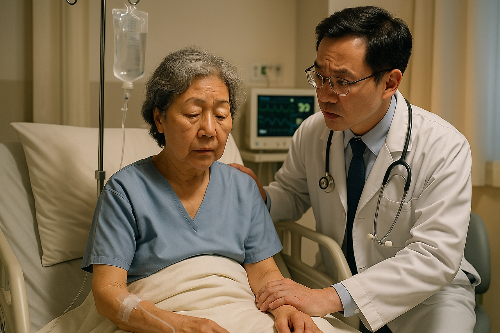
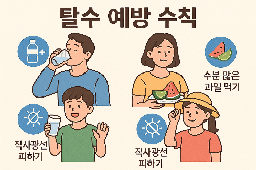

탈수증은 몸속의 수분과 전해질(나트륨, 칼륨 등)이 정상 범위보다 부족해진 상태입니다.

원인은 다양해요. 단순히 물을 적게 마신 경우뿐 아니라, 땀·구토·설사·발열·격한 운동으로도 쉽게 생깁니다.

### 1. 증상별 자가진단표

### 경증

갈증, 입 마름, 소변량 감소·진한 노란색, 피부 건조

시원한 물·이온음료 마시기, 휴식

### 중경증

두통, 어지럼, 심박수 상승, 피로감, 집중력 저하 WHO 경구수액 복용, 서늘한 곳에서 휴식

### 중증

의식 혼돈, 혈압 저하, 빠른 호흡, 무기력, 피부 탄력 저하

즉시 응급실 이동, 수액 치료

**Tip: 아침 첫 소변 색이 ‘진한 호박색’이라면 이미 탈수 신호입니다.**

### 2. WHO 경구수액(ORS) 간단 레시피

### 집에서 쉽게 만드는 방법 (성인·아동 공용)

• 물: 1리터

• 설탕: 6작은술(약 30g)

• 소금: 0.5작은술(약 2~3g)

• 잘 저어 완전히 녹인 후 24시간 이내 섭취

• 설탕·소금 비율을 잘 지켜야 전해질 농도가 적정하게 맞아요.

**주의: 너무 짜거나 달면 삼투압이 맞지 않아 흡수율이 떨어지고, 오히려 설사를 악화시킬 수 있습니다.**

### 3. 위험군 체크리스트

• 하루 소변량이 평소보다 확 줄었다

• 입술이 건조하고 갈라졌다

• 땀을 많이 흘렸는데 물을 거의 안 마셨다

• 설사·구토가 1일 이상 지속됐다

• 고열(38℃ 이상)이 동반됐다

→ 위 항목 중 2개 이상 해당되면 경구수액 섭취 또는 병원 진료를 권장합니다.

### 4. 대처방법 요약

### 경증·중등도

• 시원한 물, 묽은 이온음료, WHO 경구수액 복용

• 직사광선 피하고 서늘한 장소에서 휴식

• 카페인·알코올은 탈수 악화 가능성 있으니 피하기

### 중증

• 의식 저하·심한 무기력·혈압 저하는 응급상황

• 즉시 119 또는 응급실로 이동

• 정맥 수액 치료와 원인 질환 치료 병행

### 5. 예방 습관

• 하루 1.5~2L 수분 섭취 (여름·운동 시 500ml 추가)

• 목마르기 전에 물 마시는 습관

• 야외활동 시 1~2시간마다 이온음료·물 보충

• 고령층·어린이·환자는 주변에서 정기 체크

### 탈수 예방 4단계

1. 색: 소변 색 확인
2. 시간: 2시간 이상 물 안 마셨으면 한 컵
3. 활동: 운동·더운 날씨엔 전해질 보충
4. 증상: 두통·피로·어지럼은 초기 경고음

[장염 증상, 빨리 낫는 법, 전염, 좋은 음식·약](/entry/장염-증상-빨리-낫는-법-장염에-좋은-음식·약)

[장 건강이 면역력의 시작! 유산균과 프리바이오틱스 섭취법](/entry/장-건강이-면역력의-시작-유산균과-프리바이오틱스-섭취법)

[수분 섭취의 중요성. 특히 중년이상은 더 중요](/entry/수분-섭취의-중요성-특히-중년이상은-더-중요)
