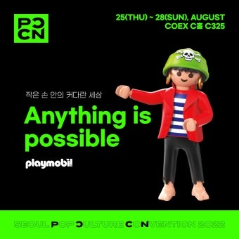

## 2025 서울팝콘(Seoul POPCON) 일정·티켓·프로그램 총정리

팝 컬처 팬들이 1년 동안 기다린 축제, 2025 서울팝콘(Seoul POPCON)이 드디어 찾아옵니다!

게임·애니메이션·영화·웹툰·음악은 물론, 메타버스와 AI까지 한 번에 즐길 수 있는 국내 최대 규모의 팝 컬처 행사인데요.

이번 글에서는 서울팝콘 일정, 티켓 가격, 프로그램, 교통편을 한 번에 정리해 드립니다.

### 행사 개요

• 행사명: 2025 서울팝콘(Seoul Pop Culture Convention)

• 기간: 2025년 9월 12일(금) ~ 14일(일)

• 운영시간: 오전 10시 ~ 오후 6시 (마지막 날은 오후 5시 종료)

• 장소: 코엑스 A홀 (서울 강남구 영동대로 513)

• 특징: 팝 컬처와 미래 기술(AI·XR·버추얼 휴먼 등)이 어우러진 글로벌 문화 축제

### 주요 프로그램

• 게임 & 코믹존: 최신 게임 시연, 웹툰·코믹 작가 특별 전시

• 라이브 스테이지: 아티스트 공연, 버스킹, 토크쇼

• 코스플레이 배틀: 글로벌 코스플레이어들의 경연 무대

• 스타패스 프로그램: 인기 배우·크리에이터와 Q&A, 팬미팅

• 포토존 & 체험존: 굿즈 쇼핑, 캐릭터 전시, XR·메타버스 체험

### 티켓 안내

**원데이티켓 28,000원(1일권)**

**올데이티켓 80,000원(3일권)**

**주니어티켓 19,000원(만19세 미만)**

**패밀리티켓 75,000원(성인2+청소년1)**

**스타패스 원데이 170,000원(스타 교류 포함)**

**스타패스 올데이 130,000원(3일간 스타 교류)**

**만6세 미만 무료(증빙 필수)**

• 예매 방법: 예스24·네이버 등 온라인 사전 예매 또는 현장 구매 가능

• 유의사항: 주니어·무료 입장객은 신분증·증빙서류 지참 필수

### 교통편 안내

• 지하철

• 2호선 삼성역 5·6번 출구 → 코엑스몰 경유 A홀 연결

• 9호선 봉은사역 7번 출구 → 아셈플라자 경유

• 버스

• 코엑스아티움·그랜드 인터컨티넨탈 호텔 앞 하차

• 자가용

• 주차 요금: 15분당 1,500원 (대중교통 이용 권장)

### 마무리

2025 서울팝콘은 전 세계 팝 컬처 팬과 창작자들이 한자리에 모이는 글로벌 문화 축제입니다.

티켓 예매와 프로그램, 교통편을 미리 확인하고 방문하면 더욱 알찬 시간을 보낼 수 있습니다.

최신 라인업과 티켓 정보는 [서울팝콘 공식 홈페이지](https://seoulpopcon.org/)에서 꼭 확인하세요.

[삼성역 코엑스 주차장 완벽 가이드](/entry/삼성역-코엑스-주차장-완벽-가이드)
