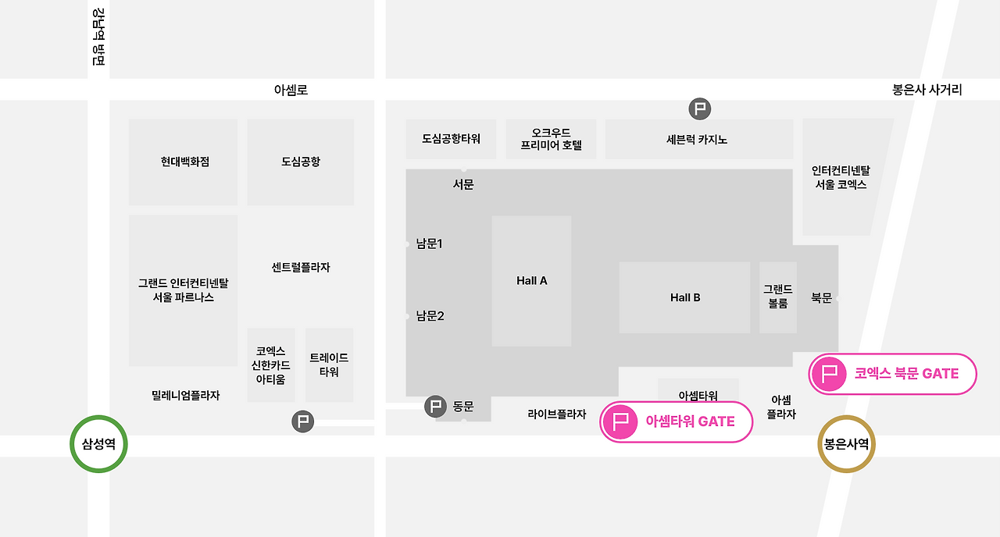
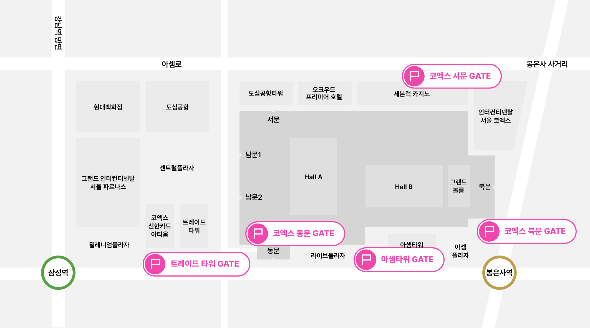
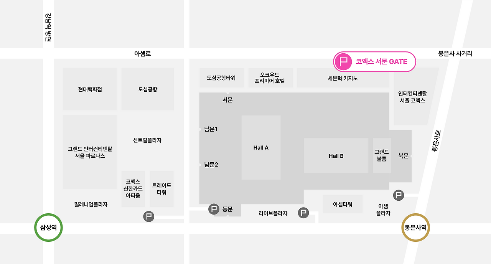
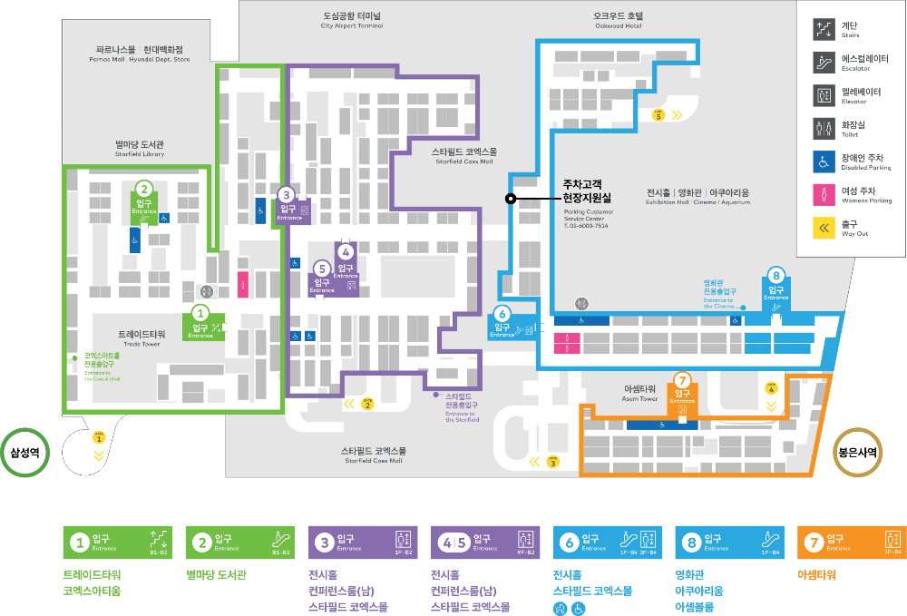
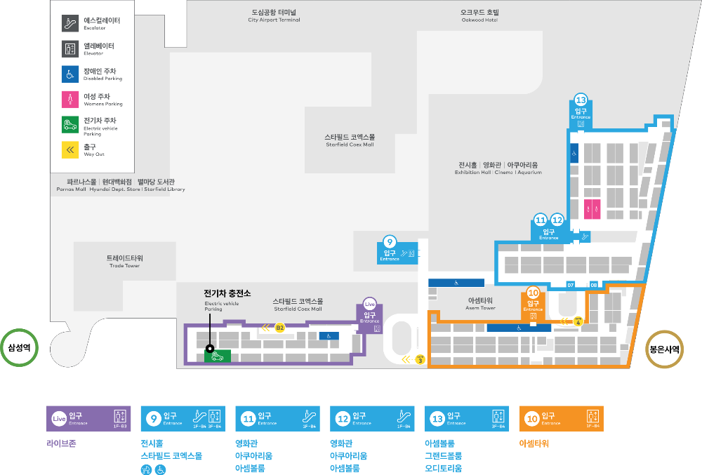
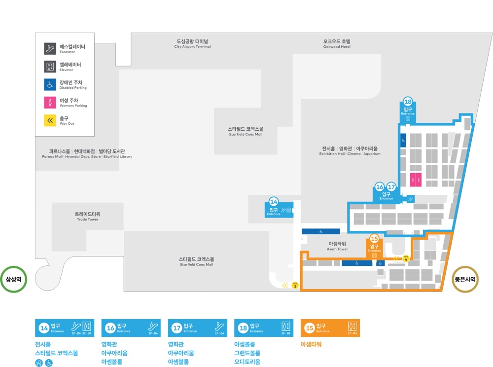
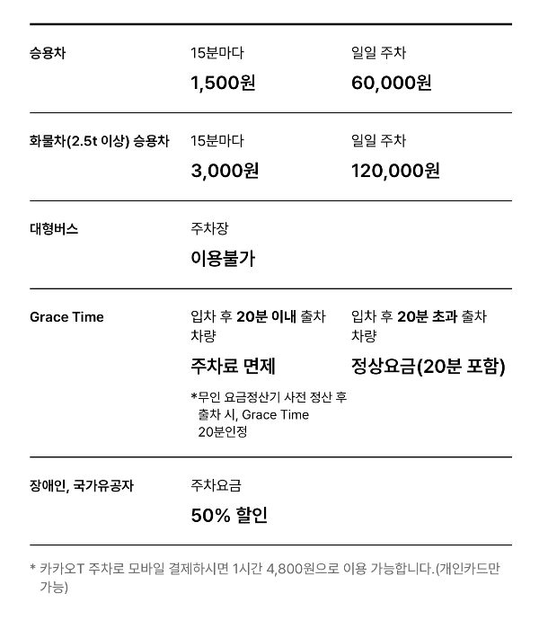
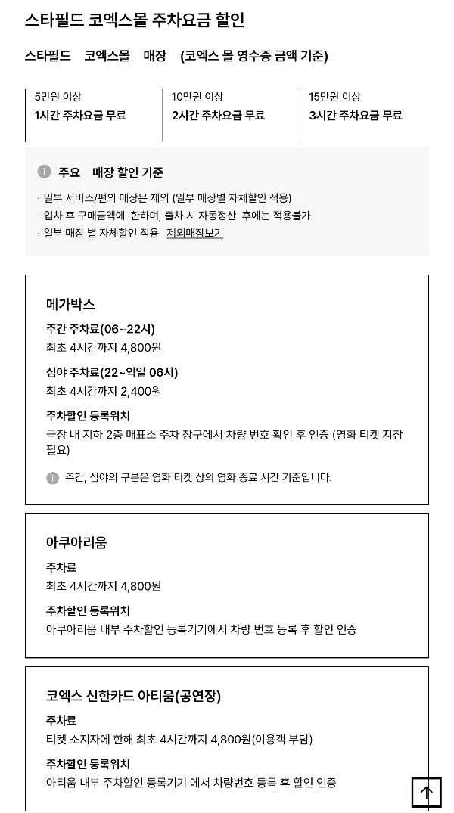

## 삼성역 코엑스 주차장 완벽 가이드 - 호텔·백화점·공항터미널 주차 혼동 없이 주차하는 법

삼성역 코엑스 주차장 진입구, 호텔·백화점·공항터미널 주차장 구분, 주차 요금 할인까지 한 번에 정리! 혼잡한 코엑스 주변 주차를 스마트하게 이용하는 꿀팁을 알려드립니다.

코엑스 주변은 현대백화점, 오크우드 호텔, 도심공항터미널 등 다양한 주차장이 모여 있어 진입로와 요금 체계가 복잡합니다. 이 글에서는 코엑스 주차장 구조, 호텔·백화점 주차장 구분, 진입로별 특징, 주차 할인 정보를 상세히 알려드려서 행사·쇼핑·영화·전시 방문 시 헷갈리지 않도록 도와드립니다.

### 1. 코엑스 주차장 구조와 주요 진입구

🗺 [네이버 지도에서 코엑스 보기](https://map.naver.com/p/search/%EC%BD%94%EC%97%91%EC%8A%A4) — 길찾기·주변 주차장을 지도에서 바로 확인할 수 있습니다.

코엑스 주차장은 B1~B4층까지, A~K 구역으로 나뉜 대규모 주차장입니다. 각 진입구별로 접근 가능한 시설이 다르기 때문에 목적지에 맞춰 선택하는 것이 좋습니다.

**아셈타워 게이트(영동대로)**

스타필드 코엑스몰, 전시홀 인근 행사 시 혼잡 심함

**북문 게이트**

메가박스·아쿠아리움 인근 지하 4층까지 주차 가능

**동문/트레이드 타워 게이트**

트레이드타워·별마당도서관 인근 쇼핑·도서관 이용객 많음

**서문 게이트 (Gate 5)**

대형차·전시장·아쿠아리움 접근 최적,

진입로 넓고 접근성 최고

### 2. 호텔·백화점·공항터미널 주차장 구분

초행길 방문자들은 코엑스 주차장에 진입하는 과정에 주변 빌딩으로 잘못 진입하시는 경우가 가금 발생해요. 빌딩별로 진입로가 차이가 있으니 주의해주세요.

### 오크우드 호텔 주차장

• 코엑스 차단기 지나 우측, 별도 차단기

• 프리미엄 카드로 5시간 무료

• 지하 1층 연결, 메가박스·전시장 가까움

### 현대백화점 주차장

• 파르나스호텔 입구 쪽 별도 진입

• 현대백화점 앱 사용 시 2시간 무료

• 코엑스 주차장과 완전히 분리

### 공항터미널 주차장

• 카지노 게이트 5 근처, 공항 리무진·출국객 중심

• 코엑스와 요금 체계 다름

### 3. 목적지별 최적 주차위치 추천

**Hall A·C (전시장)**

서문(Gate 5) C~D 구역이 전시·박람회 방문객에게 최적

**Hall B·D**

서문(Gate 5) E~K구역이 대형 행사 주로 사용

**코엑스몰·아쿠아리움·메가박스**

서문(Gate 5) E~K 구역이 영화·가족 나들이에게 추천

**오크우드 호텔 이용**

P1 또는 P2 호텔 전용 구역(프리미엄 카드 혜택 가능)

### 4. 코엑스 주차 요금·할인 혜택

**기본 요금**

• 30분 무료, 이후 10분당 1,000원(일반 승용차 기준)

• 전시회·행사 기간에는 특별 요금제 적용 가능

**할인 혜택 예시**

• 메가박스: 4시간 4,800원

• 현대백화점 앱: 2시간 무료(백화점 주차장 전용)

• 오크우드 호텔: 비자 시그니처 카드 5시간 무료

### 5. 주차 시 주의사항과 꿀팁

• Gate 5(서문) 이용이 가장 확실하고 혼잡도 대비 효율적

• 호텔·백화점·공항터미널 주차장은 진입로와 요금체계가 다름

• 전기차 충전소는 B3층

• 주말·공휴일·대형 행사 기간은 최소 30분~1시간 여유 필요

### 6. FAQ

**Q1. 코엑스 주차장은 사전 정산이 가능한가요?**

A. 각 층 엘리베이터 주변과 주요 출입구 근처에 사전 정산기가 있습니다.

**Q2. 행사 당일 주차 자리가 없으면 어디로 가야 하나요?**

A. 인근 공영주차장(봉은사, 삼성역 인근)을 이용하거나, 현대백화점·오크우드 호텔 주차장을 대안으로 고려하세요.

**Q3. 호텔 주차장도 코엑스몰과 연결되나요?**

A. 네, 오크우드 호텔 주차장은 지하로 코엑스몰 및 전시장과 연결되어 있습니다.

코엑스 주변 주차는 구조와 진입로를 알면 훨씬 편리해집니다. 이 가이드대로 목적지에 맞춰 진입구를 선택하고 할인 혜택을 챙기면 시간·비용 모두 절약할 수 있습니다. 오늘 알려드린 팁을 저장해두면 다음 방문 시 헷갈릴 일이 없습니다.
