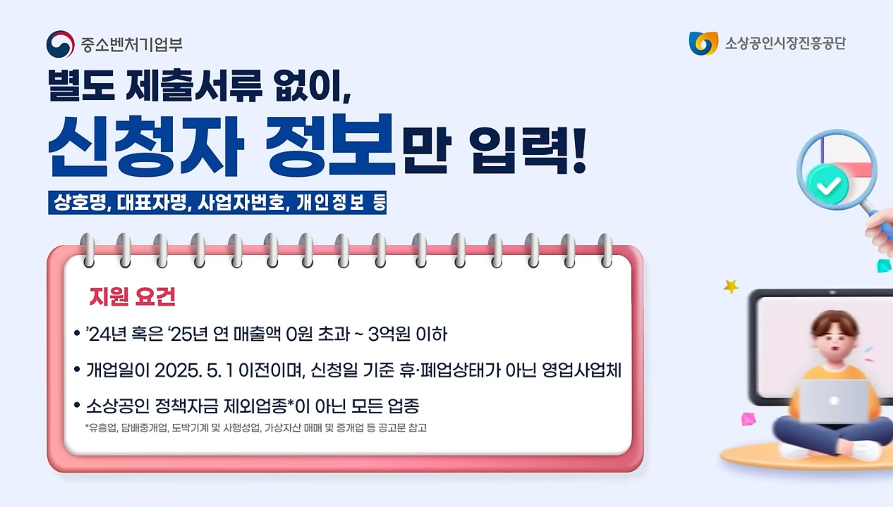
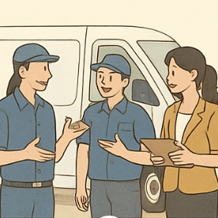

## 소상공인 부담경감 크레딧 신청방법·자격·사용처 총정리

### 소상공인 부담경감 크레딧이란?

사업을 하다 보면 매달 나가는 전기세, 가스비, 4대 보험료, 통신비, 차량 연료비까지…고정비 부담이 큽니다.

이런 소상공인의 고민을 줄여주기 위해 정부가 최대 50만 원의 디지털 바우처(크레딧)를 지원합니다.

이 크레딧은 등록한 카드로 해당 항목을 결제할 때 자동 차감되어 환급 절차 없이 바로 혜택을 받을 수 있습니다.

2025년 하반기 현재, 소상공인들에게 꼭 필요한 경영비 절감 지원 제도로 주목받고 있습니다.

### ✅ 신청 자격 (누가 받을 수 있나요?)

아래 조건을 모두 충족하면 신청 가능합니다.

**1. 매출 조건**

• 2024년 또는 2025년 연 매출 0원 ~ 3억 원 이하

**2. 개업일 기준**

• 2025년 5월 1일 이전 개업

**3. 영업 상태**

• 신청일 현재 휴·폐업이 아닌 정상 영업 중

**4. 업종 제한**

• 유흥업, 도박·사행성, 가상자산 관련 일부 업종 제외

**5. 카드 조건**

• 본인 명의 개인 신용·체크카드만 가능

• 법인카드·일부 특수카드는 불가

### 사용처

소상공인 부담경감 크레딧은 사업 운영에 필요한 고정비 결제에만 사용할 수 있습니다.

등록한 카드로 결제하면 자동으로 차감됩니다.

### 1) 공과금

사업장 운영에 필요한 전기, 수도, 가스 요금 결제 가능

• 전기요금: 한국전력 청구서 명의가 사업자(상호명 또는 대표자명)일 경우, 카페·식당·공방·사무실 등 사업장 전기료 납부 가능

• 수도요금: 지자체·수도사업본부 명의 청구서 결제 가능, 상수도·하수도·정수도 요금 포함

• 가스요금: 도시가스·LPG 가스 청구서 결제 가능

❗**사용 불가: 아파트 관리비 공과금, 개인 명의 주택 요금**

### 2) 4대 보험료 (사업주 부담분)

• 국민연금 보험료

• 건강보험료 (장기요양보험료 포함)

• 고용보험료

• 산재보험료

**❗사용 불가: 직원 급여에서 원천징수되는 근로자 부담분**

### 3) 통신비 (2025년 8월부터 확대)

• 유선전화: 사무실 전화, 고객센터 전화

• 무선전화(휴대폰): 대표 휴대폰, 직원 업무용 휴대폰

• 인터넷 요금: 광랜, Wi-Fi, 유선 인터넷

• 팩스 서비스 요금: 인터넷 팩스 포함

❗**사용 불가: 가족 개인 휴대폰 요금, 사업 무관 개인 인터넷**

### 4) 차량 연료비 (2025년 8월부터 확대)

• 휘발유·경유: 주유소 결제

• LPG: 충전소 결제

• 전기차 충전요금

• 수소차 충전요금

**❗사용 불가: 개인 차량이라도 사업용으로 쓰면 가능(유가보조금과 중복 사용 불가)**

### 5) 결제 시 유의사항

• 반드시 등록한 카드로 결제

• 일시불 결제만 가능 (할부, 현금, 포인트 결제 불가)

• 사용 기한 내 미사용분은 국고 환수

### 신청 방법 (온라인 신청)

**가장 간편한 건 온라인 신청입니다.**

**1. 홈페이지 접속**

• 부담경감 크레딧 공식 사이트 또는 [소상공인24(클릭)](https://credit.sbiz24.kr/)

**2. 회원가입 및 로그인**

• 본인 인증 후 사업자등록번호 입력

**3. 자격 자동 확인**

• 매출·개업일·영업 여부 자동 조회

**4. 카드 등록**

• 본인 명의 신용·체크카드 선택 및 인증

**5. 신청 완료**

• 서류 제출 없이 클릭 몇 번이면 끝

**6. 심사 및 지급**

• 2~3일 후 문자·알림톡으로 결과 안내

**7. 사용**

• 등록 카드로 해당 비용 결제 시 자동 차감

### 방문 신청 방법

온라인 신청이 어려운 경우, 가까운 소상공인 지원센터를 방문해 신청할 수 있습니다. - [전국 소상공인지원센터 위치 보기(클릭)](https://www.semas.or.kr/web/ORG01/ORG0111/ORG011102.kmdc#tbl_info)

방문 시에는 사업자등록증, 신분증, 카드 등의 관련 서류를 지참해야 하며, 현장에서 직원 안내를 받아 수기 작성 또는 컴퓨터로 접수합니다.

다만, 온라인에 비해 대기 시간이 발생할 수 있고, 접수 가능 시간이 영업일·업무시간으로 제한됩니다.

직접 상담이 필요한 경우 방문 신청이 유리하지만, 빠르고 편리하게 하려면 온라인 신청을 추천합니다.

### 신청 기간 & 사용 기한

• 신청 기간: 2025년 7월 14일(월) 09:00 ~ 11월 28일(금) 18:00 (2025년 신규 개업자는 8월 1일부터 신청 가능)

• 사용 기한: 2025년 12월 31일까지

### 정리 & 팁

• 지원금: 최대 50만 원

• 사용 가능: 전기·수도·가스, 4대 보험료, 통신비, 차량 연료비

• 신청 방법: 온라인(추천) 또는 방문

• 조건: 매출·개업일·영업 상태·업종 제한 모두 충족

• 주의: 사용 기간 내 반드시 사용

소상공인 부담경감 크레딧은 절차가 간단하고, 실제 경영에 꼭 필요한 비용에 바로 쓸 수 있습니다.

조건만 맞으면 신청부터 사용까지 5분이면 가능하니,

올해 안에 꼭 신청해서 사업 부담을 줄이는 혜택을 챙기세요.

