## 2025 보라매공원 서울국제정원박람회 가이드-기간·프로그램·교통·야간개장 총정리

주말에 연인과 어디를 갈지 고민이시죠?

아이들 데리고 잠시 나갔다 오고 싶은데 오늘도 키즈카페인가요? 2025 보라매공원 서울국제정원박람회(5월 22일~10월 20일) 무료 입장! 입니다.

둘러보며 힐링되고, 산책하며 연인과 아이들과 편안한 시간 보내시고 싶다면 추천합니다.

------

자연과 정원이 주는 힐링을 한껏 느낄 수 있는 2025 서울국제정원박람회가 보라매공원에서 열립니다. 올해 주제는 ‘Seoul, Green Soul’로, 세계 각국의 정원 문화와 첨단 정원산업을 한자리에서 경험할 수 있는데요. 무료 입장에다 야간 정원투어까지 준비되어 있으니, 가족·연인·친구 모두에게 추천하는 올봄 최고의 나들이 코스입니다.

### 2025 서울국제정원박람회 기본 정보

• 기간: 2025년 5월 22일(목) ~ 10월 20일(월)

• 장소: 서울 동작구 보라매공원

• 주제: Seoul, Green Soul

• 입장료: 무료 (일부 체험·프로그램 유료)

• 운영시간:

- 5~6월, 9~10월: 12:00 ~ 19:00 (야간개장 없음)
- 7~8월: 14:00 ~ 21:00 (야간 개장 실시)

이번 박람회는 서울시가 주최하는 국내 최대 규모의 정원 축제로, 총 111개의 정원이 전시되며 전 세계 20여 개국이 참여합니다.

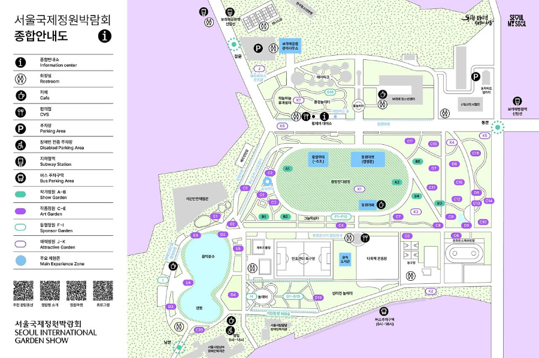

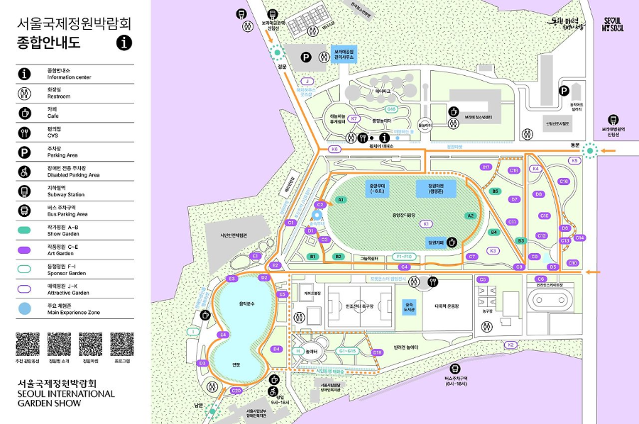

### 교통 및 주차 꿀팁

• 지하철: 7호선 보라매역, 2호선 신대방역,신림선 보라매공원역·보라매병원역 이용 가능

• 버스: 동작05, 153, 5531, 5623 등 다수 노선

• 주차장: 주차공간이 매우 협소하여 대중교통을 추천합니다.

- 정문주차장: 5분당 360원, 1일 정액 14,000원 (78면)
- 동문주차장: 5분당 250원

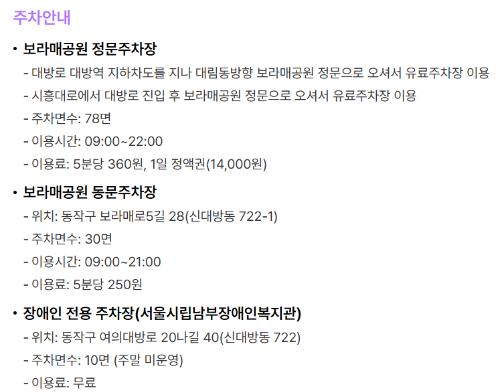

### 주요 볼거리와 프로그램

**① 초청정원 & 작가정원**

• 독일 Mark Krieger의 Aviators Garden

• 한국 박승진 작가의 The Third Track

세계적으로 주목받는 정원 디자이너의 작품을 서울에서 직접 만날 수 있습니다.

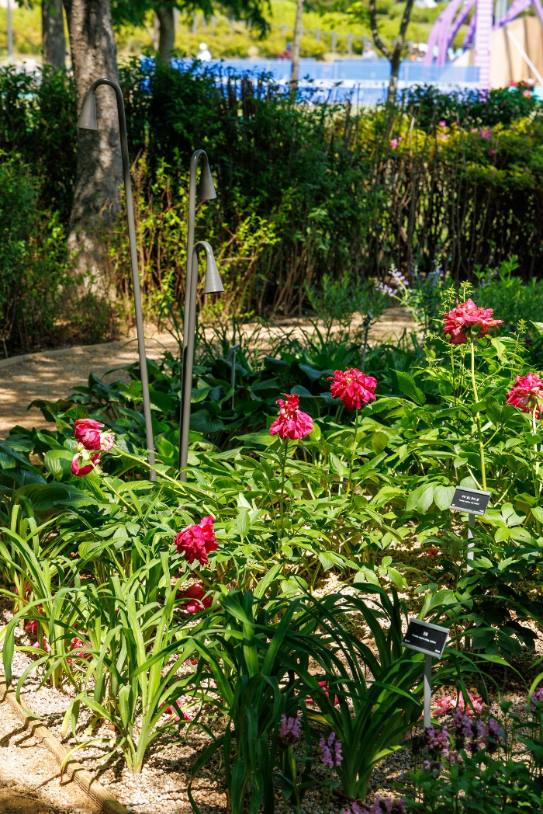

서울국제정원박람회 사이트(초청정원)

서울국제정원박람회 사이트(초청정원)

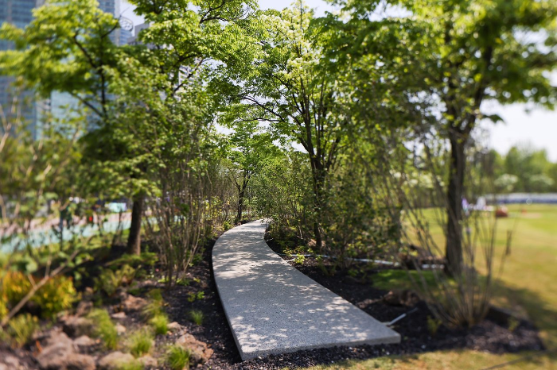

서울국제정원박람회 사이트(초청정원)

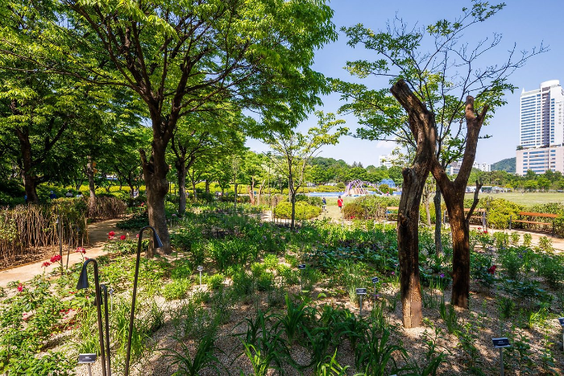

서울국제정원박람회 사이트(초청정원)

**② 세계 각국 정원 & 혁신정원**

• 20여 개국의 전통과 현대 정원

• 스마트 정원, 버티컬 가든, 빗물 이용 친환경 정원

**③ 기업정원 & 정원산업전 PLUS+**

• 20개 기업 참여

• 가든퍼니처, 조경 신기술 전시

• 70여 개 업체의 정원 산업 트렌드 마켓

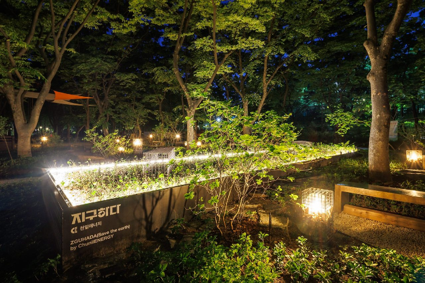

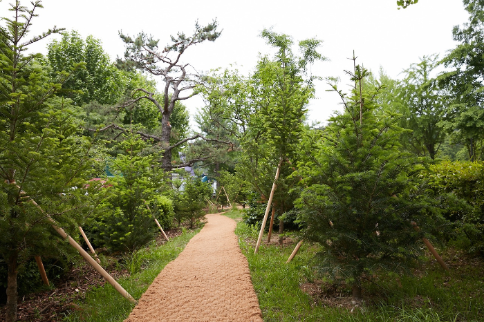

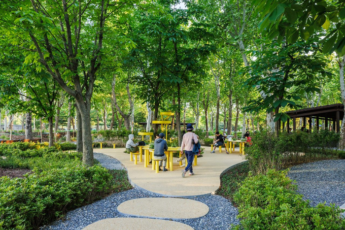

**④ 시민참여 정원 & 치유정원**

• 시민, 학생, 다문화 가족이 함께 만든 정원

• 심신 안정과 힐링을 위한 휴식 공간

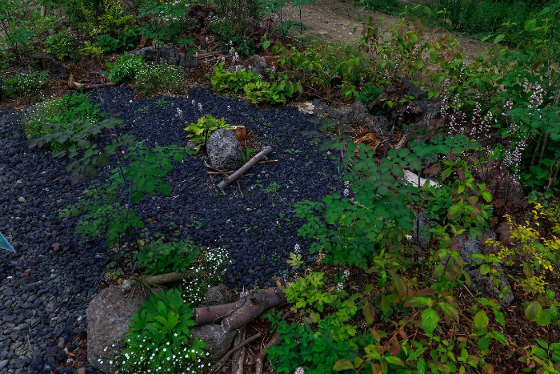

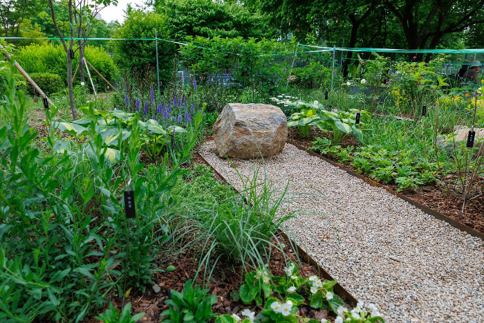

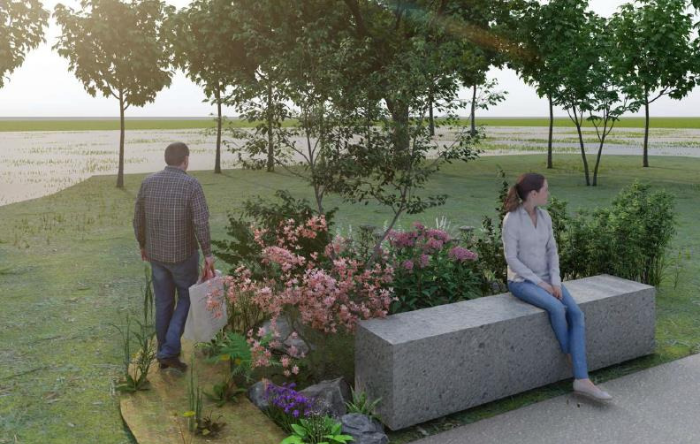

**⑤ 야간 정원투어 & 문화공연** [(클릭)](https://festival.seoul.go.kr/garden/program/garden-culture-program/commentary-program#paging:number=10|paging:currentPage=0)

• 7~8월에는 LED 조명과 함께 즐기는 야간 투어

• 숲속 무대 공연, 오픈가든 클래스, 플랜트플루언서 강연까지

포토존 추천: “메타몽 가든”은 포켓몬 캐릭터 테마 정원으로 젊은 층에게 인기 만점!

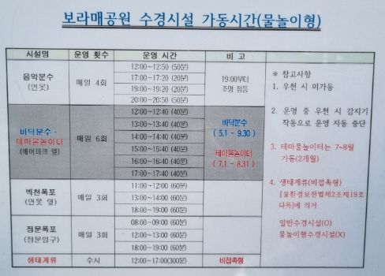

### 도슨트 투어 프로그램 [(클릭)](https://festival.seoul.go.kr/garden/program/garden-culture-program/commentary-program?article=34428)

• 운영 횟수: 하루 3회 (하절기 야간 포함)

• 특징: 일반인·외국인·고령자·장애인 맞춤 해설

• 내용: 정원문화, 조경기법, 작품 해설

• 접수: 사전 및 현장 가능 (단체는 사전 예약 필수) [(접수 클릭)](https://festival.seoul.go.kr/garden/program/advance-registration#paging:number=10|paging:currentPage=0)

• 전통 복장 체험 프로그램도 포함되어 색다른 즐거움을 줍니다.

### 준비물 & 방문 꿀팁

• 여름: 모자, 선크림, 휴대용 선풍기

• 봄·가을: 얇은 겉옷, 돗자리

• 비 오는 날: 우산·방수 신발

• 반려동물 동반 가능 (목줄 필수, 일부 구역 제한)

• 촬영 자유 (상업적 이용 제외)

• 평일 오전 관람 추천, 인기 체험은 사전 예약 필수

### FAQ

**Q1. 입장료는 무료인가요?**

네, 입장료는 무료입니다. 단, 일부 체험 프로그램은 유료입니다.

**Q2. 야간에도 관람할 수 있나요?**

네, 7, 8월에는 오후 14:00~21:00까지 야간 개장이 운영되며 LED 조명과 공연을 즐길 수 있습니다.

**Q3. 반려동물 동반이 가능한가요?**

네, 목줄 착용 시 동반 가능합니다. 단, 일부 구역은 출입이 제한됩니다.

2025 서울국제정원박람회는 단순한 전시회가 아니라, 정원을 통해 자연·문화·산업이 어우러지는 축제입니다. 낮에는 다양한 정원과 체험을, 밤에는 LED와 공연이 어우러진 야경을 즐길 수 있죠. 이번 봄·여름·가을, 보라매공원에서 자연과 함께 특별한 시간을 보내보세요.

[2025 서울팝콘(Seoul POPCON) 일정·티켓·프로그램 총정리](/entry/2025-서울팝콘Seoul-POPCON-일정·티켓·프로그램-총정리)

[킨텍스 주차요금·위치·가까운 주차장](/entry/킨텍스-주차-완벽-가이드-주차요금·위치·가까운-주차자리)

[2025 관상어 박람회 티켓 가격, 일정·관전 포인트 총정리](/entry/2025-관상어-박람회-티켓-가격-일정·관전-포인트-총정리)

[삼성역 스타필드 코엑스 주차 요금, 할인, 가까운 입구 총정리](/entry/삼성역-코엑스-주차장-완벽-가이드)
