## 2025 보라매공원 서울국제정원박람회 가이드-기간·프로그램·교통·야간개장 총정리

> ※ 안내: 이 글에서 다루는 「2025 서울국제정원박람회」는 2025년 5월 22일부터 10월 20일까지 보라매공원에서 열렸던 행사로, 현재는 종료되었습니다. 아래 내용은 2025년 개최 당시 기준의 기록이며, 2026년 이후 후속 행사 개최 여부·일정·요금 등은 반드시 [서울시 공식 정원박람회 사이트](https://festival.seoul.go.kr/garden) 또는 서울시(동작구) 공식 채널에서 최신 공지를 확인하시기 바랍니다. (본문 갱신 기준일: 2026-08-02)

주말에 연인과 어디를 갈지 고민이시죠?

아이들 데리고 잠시 나갔다 오고 싶은데 오늘도 키즈카페인가요? 2025년 보라매공원에서는 서울국제정원박람회(5월 22일~10월 20일)가 무료로 열렸습니다.

둘러보며 힐링되고, 산책하며 연인과 아이들과 편안한 시간을 보낼 수 있는 행사였던 만큼, 후속 정원 행사를 찾고 계신 분들께 참고용으로 정리해 두었습니다.

------

자연과 정원이 주는 힐링을 한껏 느낄 수 있었던 2025 서울국제정원박람회는 보라매공원에서 열렸습니다. 당시 주제는 ‘Seoul, Green Soul’로, 세계 각국의 정원 문화와 첨단 정원산업을 한자리에서 경험할 수 있었는데요. 무료 입장에다 야간 정원투어까지 진행되어, 가족·연인·친구 모두에게 인기가 많았던 나들이 코스였습니다.

### 2025 서울국제정원박람회 기본 정보 (종료된 행사, 2025년 개최 당시 기준)

• 기간: 2025년 5월 22일(목) ~ 10월 20일(월) — 현재는 종료

• 장소: 서울 동작구 보라매공원

• 주제: Seoul, Green Soul

• 입장료: 무료 (일부 체험·프로그램 유료)

• 운영시간:

- 5~6월, 9~10월: 12:00 ~ 19:00 (야간개장 없음)
- 7~8월: 14:00 ~ 21:00 (야간 개장 실시)

당시 박람회는 서울시가 주최한 국내 최대 규모의 정원 축제로, 총 111개의 정원이 전시되었고 전 세계 20여 개국이 참여했습니다. 2026년 이후 유사 행사 개최 여부는 아직 공식적으로 확인되지 않았으므로, 방문 계획이 있다면 서울시 공식 발표를 먼저 확인해 주세요.

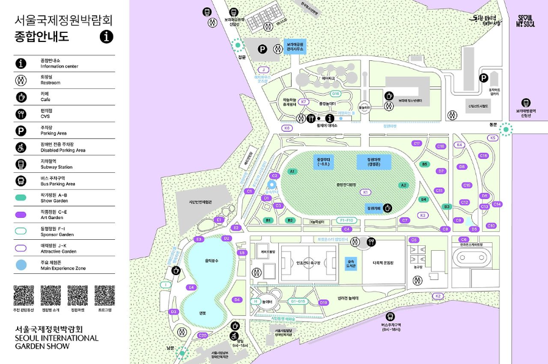

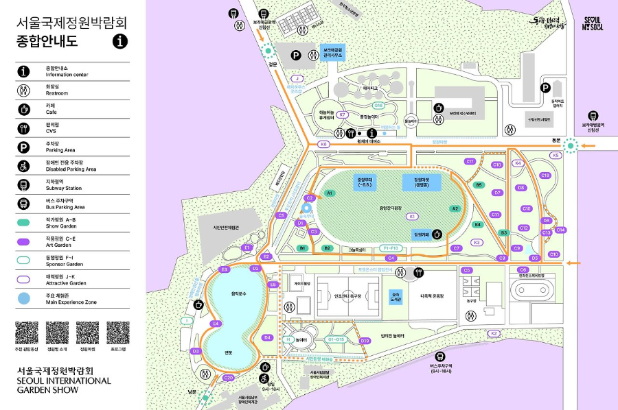

### 교통 및 주차 꿀팁 (참고용, 최신 요금·노선은 재확인 필요)

• 지하철: 7호선 보라매역, 2호선 신대방역, 신림선 보라매공원역·보라매병원역 이용 가능

• 버스: 동작05, 153, 5531, 5623 등 다수 노선 (노선 개편 여부는 카카오맵/네이버지도 등에서 최신 정보 확인 권장)

• 주차장: 보라매공원 주차공간은 상시 협소한 편으로, 대중교통 이용을 권장합니다.

- 정문주차장: 5분당 360원, 1일 정액 14,000원 (78면) — 행사 당시 기준 요금으로, 현재 요금은 변경되었을 수 있으니 서울시설공단 등 공식 채널에서 확인하세요.
- 동문주차장: 5분당 250원 (상동)

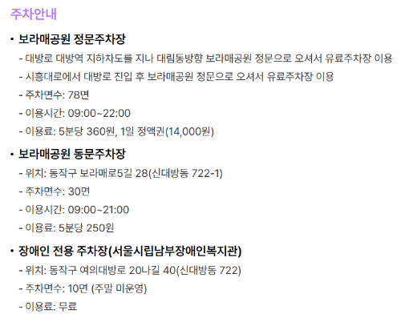

### 주요 볼거리와 프로그램 (2025년 행사 기록)

**① 초청정원 & 작가정원**

• 독일 Mark Krieger의 Aviators Garden

• 한국 박승진 작가의 The Third Track

당시 세계적으로 주목받는 정원 디자이너의 작품을 서울에서 직접 만날 수 있었습니다.

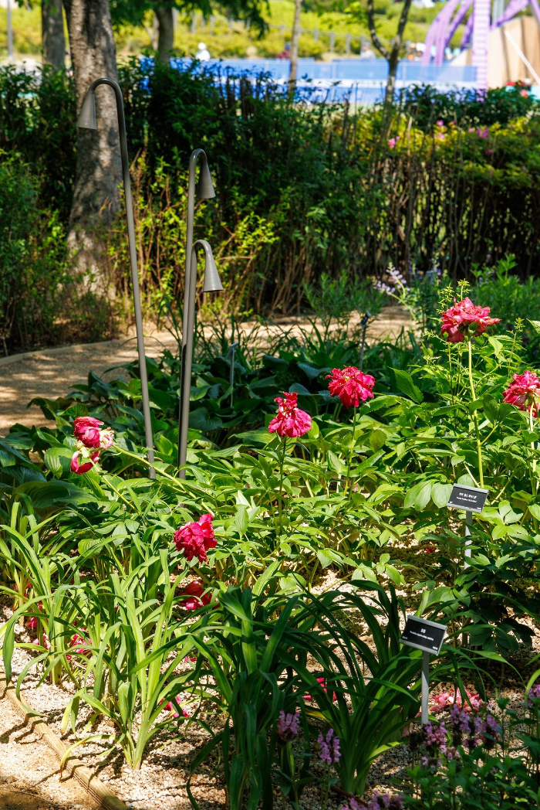

서울국제정원박람회 사이트(초청정원)

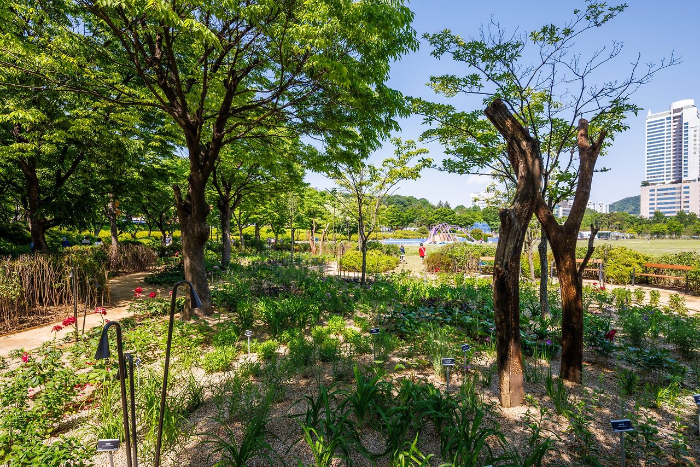

서울국제정원박람회 사이트(초청정원)

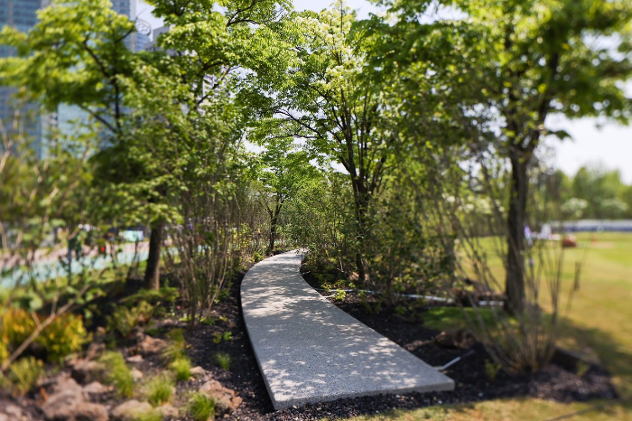

서울국제정원박람회 사이트(초청정원)

서울국제정원박람회 사이트(초청정원)

**② 세계 각국 정원 & 혁신정원**

• 20여 개국의 전통과 현대 정원

• 스마트 정원, 버티컬 가든, 빗물 이용 친환경 정원

**③ 기업정원 & 정원산업전 PLUS+**

• 20개 기업 참여

• 가든퍼니처, 조경 신기술 전시

• 70여 개 업체가 참여한 정원 산업 트렌드 마켓

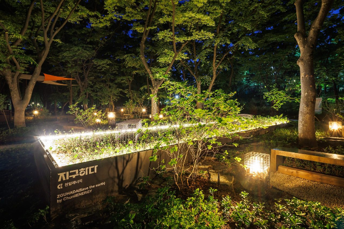

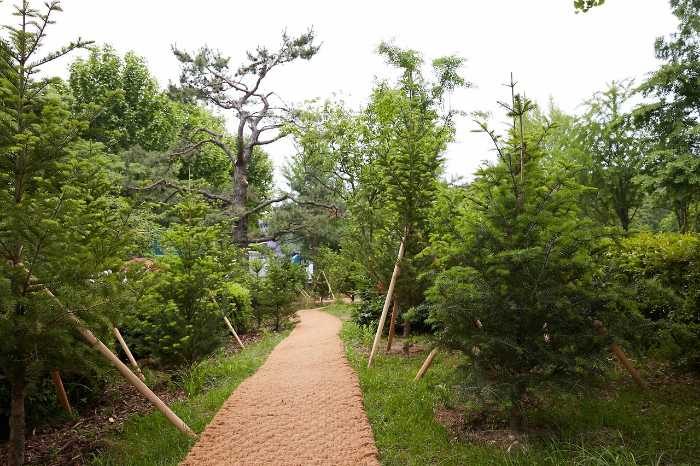

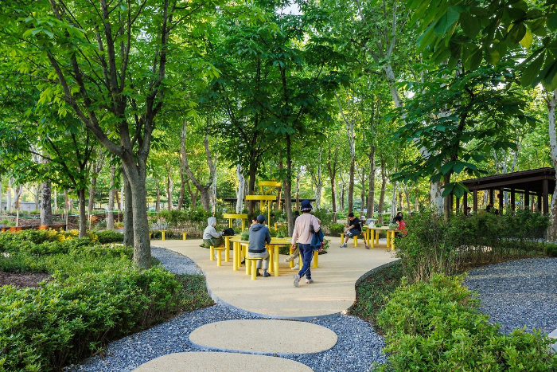

**④ 시민참여 정원 & 치유정원**

• 시민, 학생, 다문화 가족이 함께 만든 정원

• 심신 안정과 힐링을 위한 휴식 공간으로 운영

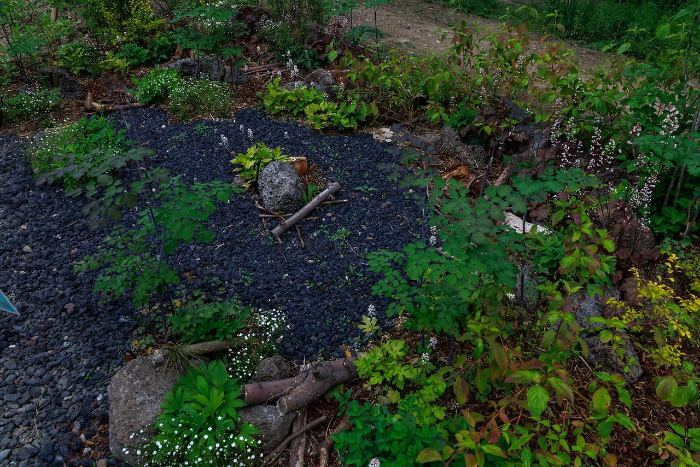

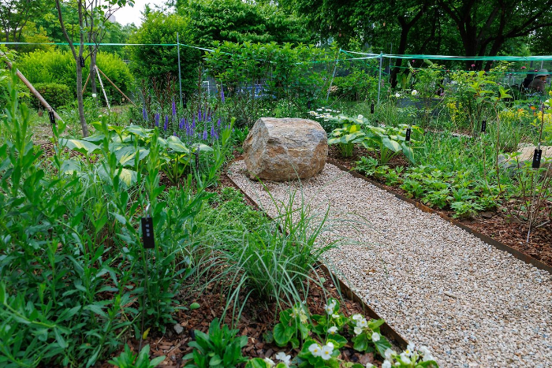

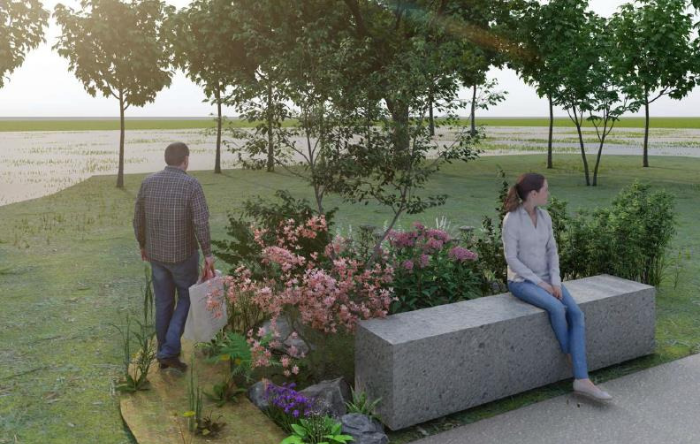

**⑤ 야간 정원투어 & 문화공연** [(당시 프로그램 페이지, 만료 가능)](https://festival.seoul.go.kr/garden/program/garden-culture-program/commentary-program#paging:number=10|paging:currentPage=0)

• 7~8월에는 LED 조명과 함께 즐기는 야간 투어가 진행됨

• 숲속 무대 공연, 오픈가든 클래스, 플랜트플루언서 강연 등 운영

포토존: 포켓몬 캐릭터 테마의 “메타몽 가든”이 젊은 층 사이에서 특히 인기가 있었습니다. (링크는 행사 종료로 접속이 되지 않을 수 있습니다.)

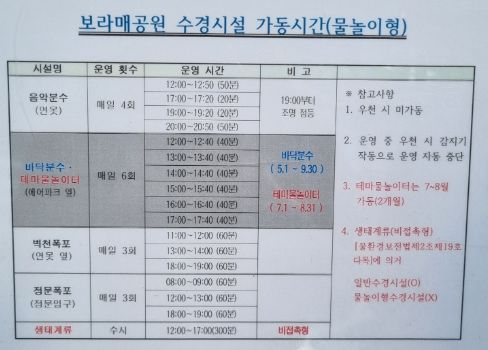

### 도슨트 투어 프로그램 (2025년 행사 기준, 링크 만료 가능) [(당시 페이지)](https://festival.seoul.go.kr/garden/program/garden-culture-program/commentary-program?article=34428)

• 운영 횟수: 하루 3회 (하절기 야간 포함)

• 특징: 일반인·외국인·고령자·장애인 맞춤 해설

• 내용: 정원문화, 조경기법, 작품 해설

• 접수: 사전 및 현장 접수 병행, 단체는 사전 예약 필요 [(당시 접수 페이지)](https://festival.seoul.go.kr/garden/program/advance-registration#paging:number=10|paging:currentPage=0)

• 전통 복장 체험 프로그램도 함께 운영되었습니다.

행사가 종료되어 위 접수 페이지는 더 이상 유효하지 않을 수 있습니다. 유사한 정원 관련 프로그램을 찾는다면 서울시 공식 홈페이지 또는 보라매공원 관리사무소 공지를 확인해 주세요.

### 준비물 & 방문 꿀팁 (유사 야외 행사 방문 시 참고)

• 여름: 모자, 선크림, 휴대용 선풍기

• 봄·가을: 얇은 겉옷, 돗자리

• 비 오는 날: 우산·방수 신발

• 반려동물 동반은 행사·시기에 따라 허용 여부가 다를 수 있어(목줄 필수, 일부 구역 제한) 방문 전 확인이 필요합니다.

• 촬영은 통상 자유롭지만 상업적 이용은 별도 허가가 필요할 수 있습니다.

• 평일 오전 관람이 비교적 여유로웠고, 인기 체험은 사전 예약이 필요했던 것으로 확인됩니다.

### FAQ

**Q1. 2025 서울국제정원박람회는 지금도 진행 중인가요?**

아니요. 2025년 5월 22일부터 10월 20일까지 진행되었고 현재는 종료되었습니다. 후속 행사 개최 여부는 서울시 공식 채널을 통해 확인하는 것이 안전합니다.

**Q2. 2026년에도 비슷한 정원박람회가 열리나요?**

이 글 갱신 시점(2026-08-02) 기준으로 2026년 개최에 대한 공식 발표 내용을 확인할 수 없었습니다. 정확한 개최 여부·일정·입장료는 [서울시 공식 정원박람회 사이트](https://festival.seoul.go.kr/garden)나 서울시·동작구청 공지사항에서 확인하시기 바랍니다.

**Q3. 행사가 끝난 지금, 보라매공원에서 정원을 볼 수 있나요?**

일부 조성된 정원과 시설은 상설 공간으로 남아 있을 수 있으나, 행사 당시의 전체 규모(111개 정원, 야간 조명 등)와는 다를 수 있습니다. 방문 전 보라매공원 관리사무소나 서울시 공원 안내 페이지에서 현재 운영 현황을 확인하는 것을 권장합니다.

**Q4. 반려동물 동반이 가능했나요?**

행사 기간 중에는 목줄 착용 시 동반이 가능했고 일부 구역은 출입이 제한되었습니다. 다만 이는 2025년 행사 당시 기준이므로, 앞으로 열릴 행사나 공원 일상 이용 시의 반려동물 동반 규정은 별도로 확인하는 것이 좋습니다.

2025 서울국제정원박람회는 단순한 전시회를 넘어, 정원을 통해 자연·문화·산업이 어우러졌던 축제로 기억됩니다. 낮에는 다양한 정원과 체험을, 밤에는 LED와 공연이 어우러진 야경을 즐길 수 있었죠. 유사한 정원 행사나 후속 박람회 소식이 궁금하다면 서울시 공식 채널을 주기적으로 확인해 보시길 권합니다.

[2025 서울팝콘(Seoul POPCON) 일정·티켓·프로그램 총정리](/entry/2025-서울팝콘Seoul-POPCON-일정·티켓·프로그램-총정리)

[킨텍스 주차요금·위치·가까운 주차장](/entry/킨텍스-주차-완벽-가이드-주차요금·위치·가까운-주차자리)

[2025 관상어 박람회 티켓 가격, 일정·관전 포인트 총정리](/entry/2025-관상어-박람회-티켓-가격-일정·관전-포인트-총정리)

[삼성역 스타필드 코엑스 주차 요금, 할인, 가까운 입구 총정리](/entry/삼성역-코엑스-주차장-완벽-가이드)
