## 주류별 칼로리와 칼로리를 태우기 위한 러닝 거리 정리

오늘 저녁 술한잔 하려고 하는데... 아차! 다이어트중이셨나요? 술한잔 한다고 하면 대부분 와인, 맥주, 소주, 막걸리 정도일 것 같은데요. 각각 칼로리가 얼마나 되는지 궁금하신 분이 계시더라구요.

다이어트 또는 러닝 트레이닝 중인데 음주가 걱정되신다면 꼭 참고하세요!

“와인 한 잔은 가볍다?” “소주가 막걸리보다 칼로리가 낮다?”

여러 얘기가 있더군요. 하지만, 사실은 다릅니다! 술 종류마다 칼로리가 다르고, 이를 소모하려면 달려야 하는 러닝 거리도 각각 차이가 큽니다.

### 1. 와인 칼로리

### 화이트 와인

• 한잔 (150ml): 120~130 kcal

• 한병 (750ml): 550~700 kcal

### 레드 와인

• 한잔 (150ml): 120~150 kcal

• 한병 (750ml): 600~750 kcal

와인은 ml당 칼로리가 가장 높은 주류 중 하나입니다. 한 병 기준으로 보면 약 9km 러닝과 비슷합니다.

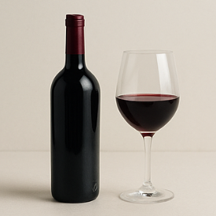

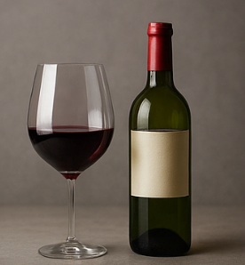

### 2. 맥주 칼로리

### 라거 맥주 (일반 맥주)

• 한잔 (355ml): 120~163 kcal

• 큰 한캔 (500ml): 200~230 kcal

### 흑맥주 (스타우트)

• 한잔 (355ml): 149~189 kcal

• 큰 한캔 (500ml): 210~270 kcal

일반 맥주보다 약간 높은 편입니다.

### 밀맥주 (헤페바이젠)

• 한잔 (330ml): 130~140 kcal

• 큰 한캔 (500ml): 200~210 kcal

라거와 큰 차이는 없습니다.

맥주 큰 한캔(500ml)은 평균 230kcal로, 러닝 3.5km와 비슷합니다.

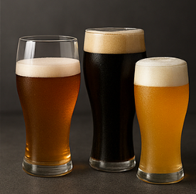

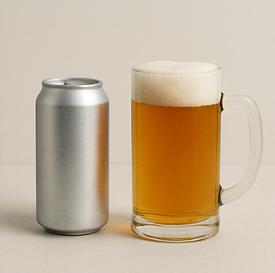

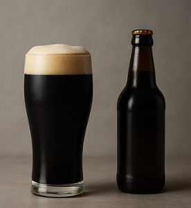

### 3. 소주와 막걸리 칼로리

### 소주 (도수별)

• 16~17도 소주

• 한잔 (50ml): 55~70 kcal

• 한병 (360ml): 400~500 kcal

• 20도 소주

• 한잔 (50ml): 70~80 kcal

• 한병 (360ml): 500~600 kcal

소주 한 병은 약 6~8km 러닝에 해당합니다.

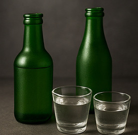

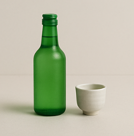

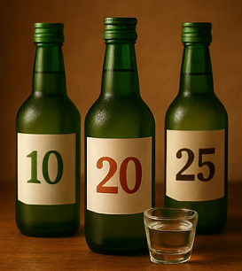

### 장수 막걸리

• 한잔 (150ml): 약 69 kcal

• 한병 (750ml): 320~345 kcal

### 백순당 막걸리 (국순당)

• 한잔 (150ml): 약 65 kcal

• 한병 (750ml): 322~330 kcal

의외로 막걸리는 ml당 칼로리가 낮은 술입니다. 한 병은 약 5km 러닝과 비슷합니다.

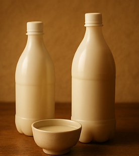

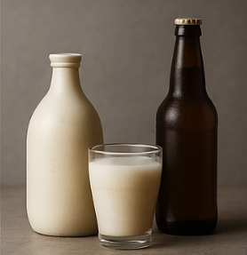

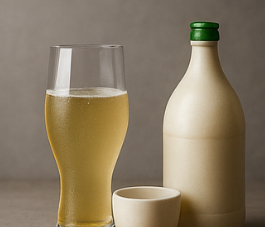

### 4. 칼로리 비교 요약 & 러닝 환산

### 100ml 기준 칼로리 순위 (낮은 순)

1. 막걸리: 약 43 kcal
2. 맥주: 약 47 kcal
3. 소주: 약 60 kcal
4. 와인: 약 80~100 kcal

**와인 > 소주 > 맥주 > 막걸리 순으로 칼로리가 높습니다.**

그렇다면 이 칼로리를 소모하기 위해선 얼마나 많이 뛰어야할까요? 이해하기 쉽게 70kg 몸무게를 기준으로 알려드릴께요. 몸무게가 70kg보다 많으면 같은거리라 하더라도 소모되는 칼로리를 더 크다고 보시면 됩니다.

### 러닝 거리 환산 (1km ≈ 65kcal)

• 와인 한 병(600kcal) → 약 9km 러닝

• 소주 한 병(400~600kcal) → 6~9km 러닝

• 맥주 한 캔(230kcal) → 3.5km 러닝

• 막걸리 한 병(320kcal) → 5km 러닝

### 5. ✅ 건강 음주와 운동 팁

• 술은 적당히 한두 잔만 즐기는 게 가장 현명합니다.

• 안주가 칼로리를 더 끌어올리니, 기름진 안주 대신 가벼운 안주를 선택하세요.

• 음주 후에는 바로 격렬한 러닝보다 수분 보충 + 가벼운 걷기를 먼저 추천합니다.

• 다음 날 가볍게 러닝이나 자전거 타기를 하면 칼로리 균형에 도움이 됩니다.

### FAQ

**Q1. 소주 한 병을 마시면 꼭 6km를 뛰어야 하나요?**

→ 꼭 그렇진 않습니다. 일상 활동에서도 칼로리를 소모하기 때문에, 균형 있게 조절하는 게 중요합니다.

**Q2. 맥주보다 와인이 더 살찐다고요?**

→ 네, 칼로리는 맥주보다 와인이 더 높습니다. 하지만 맥주는 먹다보면 많은 양을 마시는 경우가 많아 실제 총 섭취 칼로리는 더 높아질 수 있습니다.

**Q3. 막걸리가 의외로 칼로리가 낮은 이유는?**

→ 알코올 도수가 낮고 수분 함량이 많아, 같은 양 대비 칼로리가 낮게 측정됩니다.

술마다 칼로리 차이가 크다는 사실, 이제 감이 오시죠? 너무 죄책감 느끼지 마시구요! 전 이제 한잔 했으니 뛰러 나갑니다!!

• 와인 한 병은 9km 러닝,

• 소주 한 병은 6~9km 러닝,

• 맥주 한 캔은 3.5km 러닝,

• 막걸리 한 병은 5km 러닝에 해당합니다.

오늘 마신 술, 내일 가볍게 운동으로 균형을 맞춰보세요

이 글이 도움이 되셨다면 댓글이나 공유 부탁드립니다!

[런닝 자세 가이드, 런닝 발, 다리, 팔, 머리](/entry/러너를-위한-완벽-자세-가이드-머리-어깨-팔-몸통-그리고-발)

[런닝 통증과 안전한 러닝 가이드](/entry/러닝-2편-양날의-검-조심해야-할-부작용과-안전한-달리기-가이드)

[런닝 통증과 안전한 러닝 가이드](/entry/러닝-2편-양날의-검-조심해야-할-부작용과-안전한-달리기-가이드)
