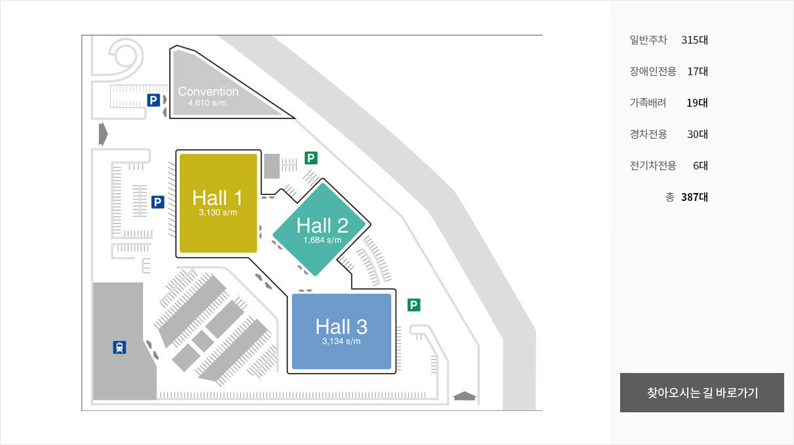
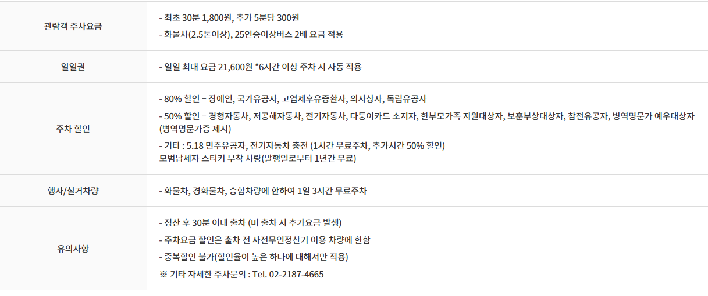
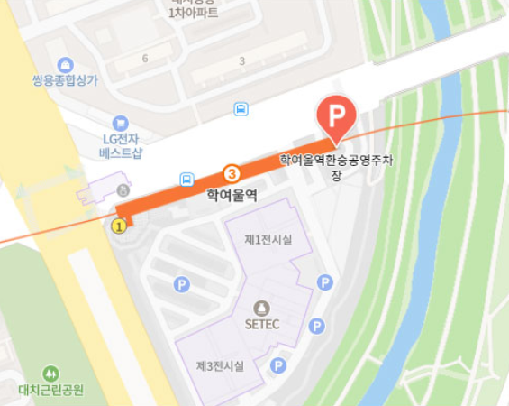
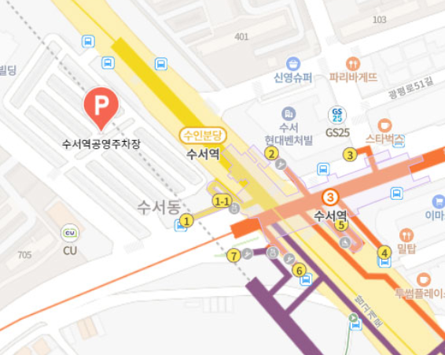
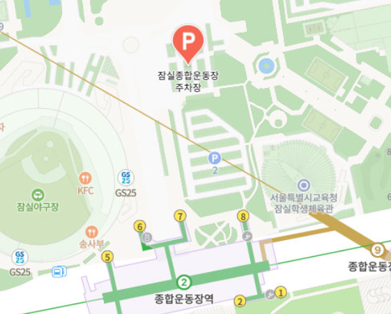
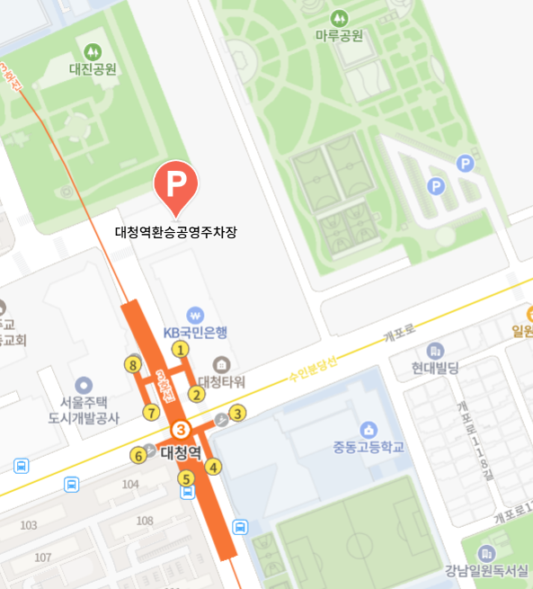

## 학여울역 SETEC 주차 총정리

SETEC(서울무역전시컨벤션센터)은 전시회·박람회가 자주 열리는 강남 대표 전시장입니다. 하지만 학여울역 인근 주차장은 행사 때마다 금세 만차가 되는 경우가 많죠.

이번 글에서는 SETEC 전용 주차장, 학여울역 공영주차장, 은마상가 주차장, 대체 주차장, 그리고 대중교통 이용 꿀팁까지 모두 정리했습니다.

### 1. SETEC 전용 주차장 안내

### 위치: 서울 강남구 남부순환로 3104

주차 가능: 총 420대 (일반 369 / 장애인 17 / 여성전용 20 / 경차 10 / 전기차 4)

### 요금 체계

• 최초 30분: 1,800원

• 추가: 5분당 300원 (1시간 3,600원)

• 일일 최대: 21,600원 (6시간 이상 주차 시 자동 적용)

• 화물차·대형버스: 2배 요금

### 할인 혜택

• 80%: 장애인, 국가유공자, 독립유공자

• 50%: 경차, 전기차, 다둥이카드 소지자

• 전기차 충전 시: 1시간 무료 + 추가 50% 할인

• 모범납세자 차량: 1년간 무료

### ⚠ 주의사항

• 행사 기간에는 오전 9시 이전 도착 필수(9시 넘어가면 주차 진입로 줄이 엄청납니다)

• 정산 후 30분 이내 출차해야 추가 요금 없음

### 2. 학여울역 환승공영주차장 ⭐ (추천)

### 위치: 강남구 대치동 514-1 (SETEC 도보 3분 거리)

주차 가능: 180대

⏰ 운영시간: 05:00 ~ 01:00

학여울역 환승공영주차장

### 요금 체계

• 5분당 260원 (1시간 3,120원)

• 환승 할인 시 50% (대중교통 이용 후 30분 내 결제)

• 정기권: 일반 14만원 / 환승 7.2만원

### 할인 혜택

• 80%: 장애인, 국가유공자

• 50%: 경차, 전기차, 다둥이카드, 환승 이용객

• 20%: 참전유공자, 병역명문가

**➡ 가성비 최고! SETEC 바로 옆이면서 요금도 저렴합니다.**

### 3. 은마아파트 상가 주차장 & 휴무일 팁

### 위치: 강남구 대치동 316 (은마종합상가)

수용: 약 380~400대

### 요금 체계

• 기본 90분 무료 (영수증 없어도 적용)

• 초과 시 10분당 500원

• 카드 전용, 무인정산기 결제

### 상가 휴무일(2,4주차 일요일)

• 주차 가능 ✅

• 무료·할인 ❌ → 전액 유료 운영

• 이용객이 적어 여유로운 대신 장기 주차 요금은 높음

**➡ 행사 날 만차일 경우 “비상 주차장”으로 활용 가능! 상가 휴무일에는 무료주차와 할인이 없으니 주의 필요**

### 4. 인근 대체 주차장

### 수서역 공영주차장 (약 1.5km)

• 요금: 5분당 300원

• 비교적 여유, 버스 환승 편리 (거리는 버스로 15분)

수서역 공영주차장

### 잠실종합운동장 주차장 (약 3km)

• 대규모 수용

• 전시 기간엔 셔틀버스 운영 가능

잠실종합운동장 주차

### 대청역 환승공영주차장

• 3호선 환승 용이

• 정기주차권 저렴하나 자리가 많지 않아요

대청역 환승공영주차장

### 5. 주말·축제•전시 기간 주차 꿀팁

• 혼잡 시간: 오전 11시~오후 3시

• ⏰ 도착 전략: 개장 1시간 전 or 폐장 1시간 전

• 앱 활용: 카카오T, 모두의주차장 등으로 미리 확인

• 할인 준비: 교통카드·증빙서류 챙기기

• 출차 전략: 행사 종료 직전은 피해야 정체 없음

### 6. 대중교통 이용법 (가장 추천!)

• 지하철: 3호선 학여울역 1번 출구 바로 연결

• 버스: 401, 408, 440, 470 / 3412, 4319 / 광역 9407 등

• 분당선: 수서역 → 버스 환승 or 도보 15분

**➡ 행사 성수기에는 대중교통이 가장 확실한 방법입니다.**

### 주차 요금 비교 (종합)

### SETEC 전용 주차장

· 30분: 1,800원

· 1시간: 3,600원

· 4시간: 15,000원

· 특징: 전시장 내부 위치, 총 420대 수용

### 학여울역 환승공영주차장

· 30분: 1,560원

· 1시간: 3,120원

· 4시간: 12,480원

· 특징: 도보 3분 거리, 180대 수용, 환승 할인 가능

### 은마아파트 상가 주차장

· 기본 90분 무료

· 초과 시 10분당 500원 (약 1시간 3,000원 수준)

· 4시간 주차 시 약 9,000원 내외

· 특징: 상가 방문객 무료 혜택, 휴무일엔 전액 유료

학여울역과 SETEC은 전시·박람회 방문객이 많아 주차 혼잡은 감수하셔야 해요. 꼭 본인 상황에 맞는 전략을 세워서, 주차 스트레스 없이 즐거운 전시회 관람하시길 바랍니다. ?✨

**비용 절약: 학여울 공영주차장 + 환승할인**

**편의성: SETEC 전용**

**여유로운 선택: 대중교통**

[삼성역 스타필드 코엑스 주차 요금, 할인, 가까운 입구 총정리](/entry/삼성역-코엑스-주차장-완벽-가이드)

[킨텍스 주차요금·위치·가까운 주차장](/entry/킨텍스-주차-완벽-가이드-주차요금·위치·가까운-주차자리)
