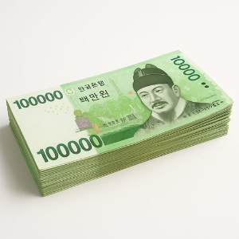
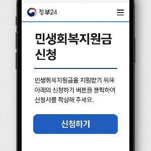
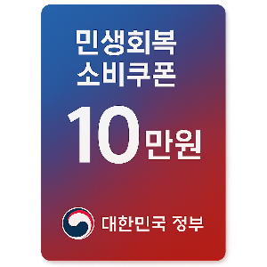
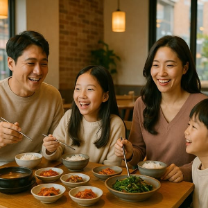
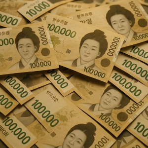

## 2025 민생회복지원금 2차지원금 기준 총정리

2025년 하반기, 정부가 민생경제 안정을 위해 민생회복지원금(민생회복 소비쿠폰) 2차 지원을 시행합니다. 1차 지원금은 소득수준, 차상위•한부모가족, 기초수급자에 따라 15~45만원의 차이가 있었지만 2차지원금은 10만원으로 동일합니다.

하지만 **2차 지원은 소득 상위 10% 가구는 제외**되며 특히 맞벌이 가구는 건강보험료 합산 기준 때문에 혼란이 생길 수 있습니다.

오늘은 지원금 금액, 신청 방법, 그리고 맞벌이 부부는 어떻게 적용하는 지, 상위 10% 판정 기준을 상세히 알려드릴게요.

### 1. 2차 지원금 기본 내용

• 지원 금액: 1인당 10만 원 (전 국민 동일, 추가 가산 없음)

• 지원 대상: 국민의 90% (약 4,600만 명)

• 제외 대상: 소득 상위 10% 가구 (약 512만 명)

• 사용 기한: 2025년 11월 30일까지

• 사용처: 전통시장, 동네 마트, 소상공인 매장 위주

즉, 특별한 조건 없이 국민 대부분이 받을 수 있지만, 고소득 및 고자산 가구는 제외됩니다.

### 2. 신청 기간 및 방법

• 신청 기간: 2025년 9월 22일(월) ~ 10월 31일(금)

• 지급 시기: 신청 익일 지급 완료 예정

• 신청 방법

-  온라인: 카드사 홈페이지·앱, 지역사랑상품권 앱, 간편결제, ARS 등
- 오프라인: 주민센터, 주요 은행 영업점
- 찾아가는 신청: 고령자·거동 불편자 대상으로 지자체 방문 접수

### 3. 소득 상위 10% 기준

이번 지원의 가장 중요한 포인트는 소득 상위 10% 여부가 건강보험료 납부액으로 판정된다는 점입니다.

• 직장가입자 기준: 월 273380원 초과 시 상위 10%

• 지역가입자 기준: 약 21만 원 이상 납부 시 상위 10% 가능성 큼

• 연 소득 환산: 직장가입자 기준 약 7700만 원 이상 가구 소득이 상위 10%에 해당

즉, 본인과 배우자, 부양가족의 보험료를 합산해 이 기준을 넘으면 2차 지원에서 제외됩니다. 즉 부양가족에 자녀가 포함된 경우 이를 합산해야합니다.

### 3. 소득 상위 10% 기준 (핵심 쟁점)

이번 지원에서 가장 중요한 부분은 소득 상위 10% 여부를 어떻게 판정하느냐입니다.

정부는 2025년 8월 17일 국회 기획재정위원회 보고에서, 소득 상위 10% 경계선으로 “기준 중위소득 210%”를 잠정 적용한다고 밝혔습니다.

기준 중위소득은 매년 보건복지부 장관이 고시하는 국민 가구 소득의 중위값으로, 각종 복지 수당 지급의 척도로 쓰이는 지표입니다.

### ✔ 기준 중위소득 210% 적용 시 소득 기준

• 1인 가구: 월 소득 약 502만 원 초과

• 2인 가구: 월 소득 약 825만 원 초과

• 3인 가구: 월 소득 약 1055만 원 초과

• 4인 가구: 월 소득 약 1280만 원 초과

• 5인 가구: 월 소득 약 1306만 원 초과

즉, 해당 기준을 초과하는 가구는 2차 지원금 지급에서 제외될 전망입니다.

### 건강보험료 기준과의 연계

• 기존 1차 지원에서는 가구 합산 건강보험료 납부액으로 상위 10%를 판정했는데, 이번 2차 역시 건강보험공단 자료 + 주민등록 정보를 토대로 소득을 추정하는 방식이 활용됩니다.

• 직장가입자 기준으로 보면, 대략 월 27만 원대 보험료 납부가 상위 10%의 경계선에 해당합니다.

• 다만 이번에는 건강보험료 납부액뿐 아니라, 기준 중위소득 210%를 함께 적용해 보다 명확한 판정을 내릴 예정입니다.

**정부 시뮬레이션 진행 중**

행정안전부·보건복지부는 현재 전 국민 건강보험 및 주민등록 자료를 활용해 모의 분석(시뮬레이션)을 진행하고 있으며, 최종 지급 기준은 9월 10일 전후로 공식 확정될 예정입니다.

따라서, 본인 가구의 월 소득이 기준 중위소득 210%를 초과하는지와 동시에 가구 합산 건강보험료 납부액을 확인해 두는 것이 가장 안전한 방법입니다.

**정리하면,**

• 소득 상위 10% = 기준 중위소득 210% 초과 가구

• 1인 502만 원 / 2인 825만 원 / 3인 1,055만 원 / 4인 1,280만 원 이상 소득이면 제외

• 실제 판정은 건강보험료 납부액 + 중위소득 기준을 토대로 진행

• 맞벌이 가구는 합산 보험료 → 특례(가구원 수 +1명 기준) 적용으로 최종 판정

### 4. 맞벌이 가구 특례 적용

맞벌이 가구는 소득이 합산되다 보니 상위 10%로 분류될 위험이 큽니다. 이를 보완하기 위해 가구원 수 +1명 기준 특례가 적용됩니다.

• 2인 맞벌이 부부 → 3인 가구 기준 적용

• 4인 맞벌이 가구 → 5인 가구 기준 적용

이 특례 덕분에 맞벌이 가구도 실제 생활 수준에 맞게 지원 대상에 포함될 수 있습니다.

좀 더 알기 쉽게 예시를 적어봤습니다.

### ✔ 예시 1: 맞벌이 부부 (2인 가구)

• 실제 가구원: 부부 2명 (자녀 또는 피부양자 없음)

• 건강보험료: 남편 14만 원 + 아내 15만 원 = 합산 29만 원

• 단순 계산 시 → 2인 가구 상위 10% 기준(약 25만 원대)을 초과 → 탈락

• 하지만 맞벌이 특례 적용 → “2인 가구 +1명 = 3인 가구 기준”으로 판단

• 3인 가구 상위 10% 기준은 약 31만 원 수준 → 29만 원은 기준 이내 → 지원 대상

**이렇게 특례 덕분에 맞벌이 부부도 지원금을 받을 수 있습니다.**

### ✔ 예시 2: 맞벌이 부부 + 자녀 2명 (4인 가구)

• 실제 가구원: 부부 + 자녀 2명 = 4인

• 건강보험료: 남편 18만 원 + 아내 16만 원 = 합산 34만 원

• 단순 계산 시 → 4인 가구 상위 10% 기준(약 32만 원) 초과 → 탈락

• 맞벌이 특례 적용 → “4인 가구 +1명 = 5인 가구 기준”으로 산정

• 5인 가구 상위 10% 기준은 약 36만 원 → 34만 원은 기준 이내 → 지원 대상

**자녀가 있어도 맞벌이 특례가 적용되면 구제될 수 있습니다.**

⸻

### ✔ 예시 3: 소득이 높은 맞벌이 가정

• 맞벌이 부부 합산 건강보험료가 40만 원인 경우

• 특례 적용 후 3인, 4인, 5인 가구 기준을 비교하더라도 모두 상위 10% 기준을 초과

• → 이 경우는 지원 대상에서 제외

**아무리 맞벌이 특례가 있어도 고소득 가구는 제외된다는 점을 기억해야 합니다.**

### 5. 상위 10% 여부 확인 방법 (건강보험료 조회 가이드)

본인이 가족이 상위 10%에 해당하는지 확인하려면 가구 단위 건강보험료 납부액을 반드시 확인해야 합니다.

(1) 국민건강보험공단 홈페이지 (PC)

1. [국민건강보험공단 홈페이지 접속 (클릭)](https://www.nhis.or.kr/nhis/index.do)
2. [민원여기요] → [보험료 조회/납부] 메뉴 클릭
3. 공동인증서 또는 간편인증(카카오, 네이버 등) 로그인
4. ‘보험료 부과내역 조회’ 선택 후 월별 납부액 확인
5. 맞벌이는 부부 각각 로그인 후 합산 필요

(2) The건강보험 모바일 앱 (스마트폰)

1. 앱스토어/플레이스토어에서 “The건강보험” 설치
2. 간편인증 로그인 후 ‘보험료 조회’ 메뉴 선택
3. 현재 납부 중인 월 건강보험료 확인 가능
4. 납부확인서(PDF) 발급도 가능

(3) 직장가입자 (회사 제공 자료)

• 급여명세서 또는 회사에서 제공하는 건강보험료 고지 내역 확인

• 명세서에 기재된 본인부담금을 기준으로 파악

(4) 가구 합산 원칙

• 가족 모두의 건강보험료 납부액 합산

• 직장가입자·지역가입자 여부와 무관하게 합산

• 합산 금액이 월 273,380원 초과 시 상위 10% 가능성 큼

• 맞벌이는 반드시 합산 후 **가구원 수 +1 특례 기준**과 비교

### 6. 추가 제외 기준 (보완 규정)

건강보험료 기준을 충족하더라도 다음 조건에 해당하면 지원 대상에서 제외될 수 있습니다.

• 재산세 과세표준 합계액 9억 원 초과

• 금융소득(이자·배당) 연 2,000만 원 초과

즉, 보험료는 낮더라도 자산 규모가 큰 경우 제외될 수 있죠.

### 7. 유의사항 및 최종 정리

• 자동 지급 아님: 반드시 신청해야 함

• 신청 기한 엄수: 10월 31일 이후 신청 불가

• 1차 지원과 별개: 1차 지원을 받았더라도 2차 신청 가능

• 기준 변동 가능성: 최종 기준은 2025년 9월 10일 정부 발표로 확정

• 국민의 90%에게 1인당 10만 원 지급

• 소득 상위 10% 가구는 건강보험료 기준으로 제외

• 맞벌이 가구는 가구원 수 +1 특례 적용 → 수급 가능성 확대

• 신청 기간: 2025년 9월 22일 ~ 10월 31일

• 확인 방법: 국민건강보험공단 홈페이지/앱·급여명세서에서 건강보험료 조회 후 합산 비교

**이번 민생회복지원금 2차는 가계 부담을 덜어주는 중요한 기회입니다. 다만,맞벌이 가구와 상위 10% 판정 기준이 핵심이므로, 미리가족 전체의 건강보험료를 조회해 보시고 대비하시길 권장합니다.**

[소상공인 부담경감 크레딧 지원금(50만원), 신청방법, 자격, 사용처 총정리](/entry/소상공인-부담경감-크레딧-신청방법·자격·사용처-총정리)
