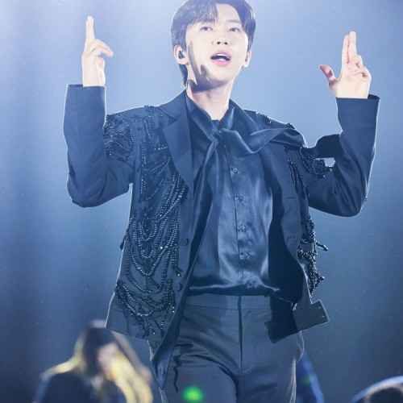

## 2025년 임영웅 콘서트 완전 정리 (일정표·예매·티켓 가격·좌석)

2025년 하반기 임영웅 콘서트 ‘IM HERO TOUR 2025’ 일정표, 예매 방법, 티켓 가격, 좌석 배치까지 한눈에 정리했습니다. 매진 전 필독해주세요.

임영웅 콘서트는 매번 오픈과 동시에 전석 매진을 기록하는 ‘피켓팅’의 대표주자죠. 이번 2025년 하반기 전국투어 IM HERO TOUR 2025도 벌써부터 팬들의 기대감이 뜨겁습니다. 이번 글에서는 공식 일정표, 예매 방법, 티켓 가격, 좌석 배치도까지 모두 정리해 드릴게요.

### 1. 전국투어 일정표 & 티켓 오픈

임영웅 2025 콘서트는 인천에서 시작해 서울, 대구, 광주, 대전, 부산까지 이어지는 대규모 전국투어입니다.

### 인천 송도컨벤시아

• 공연: 10/17(금) ~ 10/19(일)

• 티켓 오픈: 8/26(화) 20:00

### 대구 엑스코 동관

• 공연: 11/7(금) ~ 11/9(일)

• 티켓 오픈: 9/2(화) 20:00

### 서울 KSPO DOME (1주차/2주차)

• 공연: 11/21(금) ~ 11/23(일), 11/28(금) ~ 11/30(일)

• 티켓 오픈: 9/9(화) 20:00

### 광주 김대중컨벤션센터

• 공연: 12/19(금) ~ 12/21(일)

• 티켓 오픈: 9/23(화) 20:00

### 대전 대전컨벤션센터 제2전시장

• 공연: 2026/1/2(금) ~ 1/4(일)

• 티켓 오픈: 9/30(화) 20:00

### 서울 고척스카이돔

• 공연: 2026/1/16(금) ~ 1/18(일)

• 티켓 오픈: 추후 공지

### 부산 벡스코 제1전시장

• 공연: 2026/2/6(금) ~ 2/8(일)

• 티켓 오픈: 추후 공지

### 2. 예매처

• 공식 단독 예매처: NOL(인터파크) 티켓

• 구매 한도: 회차당 1인 2매 (도시 공통)

• 휠체어석: 공연 다음날 오전 9시부터 고객센터 전화 예매 가능

• 유의사항:

- 비공식 거래, 암표 구매 시 취소·환불 불가
- 매크로/비정상 예매는 사전 통보 없이 취소 가능

고객센터: NOL(인터파크) 1544-1555 / 투어 고객센터 1660-1646

### 3. 티켓 가격

아직 2025년 투어 티켓 가격은 공식적으로 공개되지 않았습니다. 다만 팬들 사이에서는 이전 투어 가격을 참고해 예상하고 있습니다.

• 이전 투어 사례 (2024년 기준)

- VIP석: 약 16만 5천 원
- R석: 약 14만 3천 원
- S석: 약 13만 2천 원
- A석: 약 12만 1천 원

올해도 비슷한 가격대가 예상되지만, 공연장 규모와 운영 정책에 따라 변동 가능성이 있습니다. 예매 전 반드시 공식 페이지 공지를 확인하세요.

### 4. 좌석 배치도 & 시야 팁

좌석배치도는 티켓 오픈 시점에 예매 페이지에서 공개됩니다. 공연장 구조에 따라 무대 위치와 시야가 달라지므로 반드시 확인해야 합니다.

• KSPO DOME: 1층 중앙 블록은 아티스트 표정까지 선명히 볼 수 있는 최적의 자리. 2층 중앙은 무대 전체 연출 감상에 탁월해 가성비가 좋습니다.

• 고척스카이돔/벡스코: 가변식 좌석 운영. 블록 구성은 예매 페이지 좌석도가 최종 기준.

• 시야 팁

• 7~15열 정도가 무대와 거리감이 가장 적당

• 2층 중앙은 무대 전체 조명과 퍼포먼스 감상에 유리

• 3층 이상은 멀리지만 현장 분위기 감상에 적합 (오페라글라스 추천)

• 난간, 조명, 스피커 등 구조물로 일부 가림 발생 가능

### 5. 예매 성공 전략

임영웅 콘서트는 ‘순간 전쟁’이라 불릴 만큼 빠르게 매진됩니다. 다음 팁을 활용하세요.

### ✅ 사전 준비

• NOL 로그인, 본인인증, 결제수단 미리 등록

• 팝업 허용 및 빠른 인터넷 환경 확보

### ✅ 예매 당일

• 오픈 시각 전에 접속해 대기열 번호 확보

• 원하는 블록과 좌석을 미리 정해두고 대체안까지 준비

### ✅ 주의사항

• 매크로 사용 시 취소 위험

• 비공식 거래는 피해 발생 가능성이 높음

2025년 하반기 IM HERO TOUR 2025는 인천을 시작으로 전국 주요 도시에서 팬들을 만날 예정입니다. 일정과 예매 정보를 꼼꼼히 확인하고, 원하는 좌석을 미리 전략적으로 준비하세요. 무엇보다도 안전한 공식 예매처를 통해 구매하는 것이 가장 중요합니다.

임영웅과 함께할 올가을·겨울, 현장에서 뜨겁게 호응할 준비 되셨나요? 이번 투어에서 잊지 못할 감동을 경험해 보시길 바랍니다.

### 6. 도시별 좌석도 특징 & 가성비 좌석 추천

### 인천 송도컨벤시아

• 컨벤션센터 특성상 전시장 구조로 좌석이 평지에 가깝게 배치됩니다.

• 앞쪽 중앙 블록이 가장 인기가 많지만, 무대가 높게 설치되므로 중간열도 시야가 안정적입니다.

• 추천 좌석: 중앙 SR석 (1020열) → 무대와의 거리·시야 균형이 좋아 만족도 높음.

### 대구 엑스코 동관

• 가로로 긴 구조라 측면 좌석은 무대 일부가 가려질 수 있음.

• 대신 정중앙 블록 15열 안팎은 무대 가까이에서 아티스트 표정을 생생하게 볼 수 있습니다.

• 추천 좌석: 중앙 R석 또는 2층 중앙 S석 → 비교적 저렴하면서도 무대 연출 전체 감상이 가능.

### 서울 KSPO DOME (올림픽체조경기장)

• 국내 공연장 중 가장 많이 사용되는 인기 장소.

• 1층 중앙: 최고의 시야 (VIP석)

• 2층 중앙: 무대 전체 연출, 조명, 퍼포먼스 감상에 최적.

• 추천 좌석: 1층 10~15열 R석 / 2층 중앙 S석 → 가격 대비 만족도가 높은 가성비 구간.

### 광주 김대중컨벤션센터

• 전시장 특성상 평면 구조 → 앞줄이 아니면 시야 방해가 생길 수 있음.

• 무대가 높게 설치되므로 너무 앞보다는 중간열이 안정적.

• 추천 좌석: 중앙 S석 (10열 전후) → 무대와 거리 적당, 가격 부담 적음.

### 대전컨벤션센터 제2전시장

• 구조가 광주와 유사해 무대 중앙 기준 블록이 베스트.

• 추천 좌석: 1층 중앙 R석, 2층 중앙 S석 → 시야·음향 모두 안정적.

### 서울 고척스카이돔

• 돔 구조 특성: 층고가 높고 좌석 수가 많아 무대와 거리가 멀어질 수 있음.

• 추천 좌석: 1층 중앙·측면 R석, 2층 중앙 S석 → 가격 대비 공연 전체를 감상하기 좋음.

• 팁: 3층 이상은 오페라글라스 필수!

### 부산 벡스코 제1전시장

• 전시장 구조라 무대와 좌석 거리가 가까운 편.

• 추천 좌석: 중앙 R석 (10열 전후), 좌우 끝보다는 중앙 블록이 만족도 높음.

### 7. 가성비 좌석 종합 추천

• 가장 몰입감 높은 좌석: 1층 중앙 10~15열

• 가격 대비 만족도 높은 좌석: 2층 중앙 블록 (무대 전체 조명과 퍼포먼스 감상 탁월)

• 예산 절약형: 2층 측면~후방 S석 (가성비 최고, 오페라글라스 필수)
