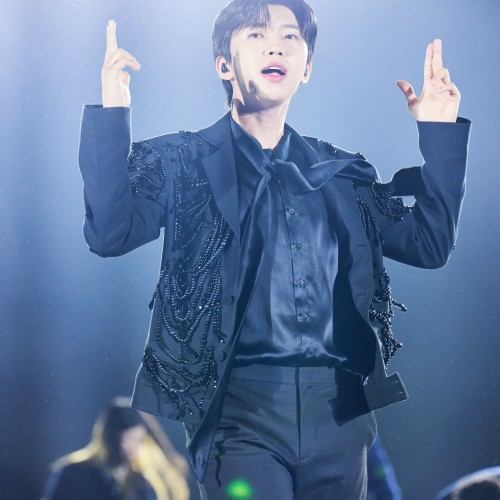

## 2025년 임영웅 콘서트 완전 정리 (일정표·예매·티켓 가격·좌석)

*업데이트: 2026년 8월 5일 기준 — 아래 'IM HERO TOUR 2025' 전국투어는 2025년 10월부터 2026년 2월까지 모든 일정이 종료되었습니다. 현재 진행 중이거나 예정된 임영웅 콘서트 정보는 하단 [최신 투어 안내] 및 공식 채널(NOL 티켓, 임영웅 공식 SNS)을 통해 확인하시길 권장합니다.*

임영웅 콘서트는 매번 오픈과 동시에 전석 매진을 기록하는 '피켓팅'의 대표주자죠. 2025년 하반기부터 2026년 초까지 진행된 전국투어 'IM HERO TOUR 2025'는 인천을 시작으로 서울·대구·광주·대전·부산까지 이어지며 성황리에 마무리되었습니다. 이 글에서는 지난 투어의 일정·예매·가격·좌석 정보를 기록용으로 정리하고, 뒤이어 열리는 신규 투어 정보도 함께 안내해 드립니다.

### 1. 전국투어 일정표 & 티켓 오픈 (종료된 일정 – 기록용)

임영웅 'IM HERO TOUR 2025'는 인천에서 시작해 서울, 대구, 광주, 대전, 부산까지 이어진 대규모 전국투어로, 아래 일정은 모두 종료되었습니다.

### 인천 송도컨벤시아 (종료)

• 공연: 2025년 10/17(금) ~ 10/19(일)

• 티켓 오픈: 8/26(화) 20:00

### 대구 엑스코 동관 (종료)

• 공연: 2025년 11/7(금) ~ 11/9(일)

• 티켓 오픈: 9/2(화) 20:00

### 서울 KSPO DOME 1주차/2주차 (종료)

• 공연: 2025년 11/21(금) ~ 11/23(일), 11/28(금) ~ 11/30(일)

• 티켓 오픈: 9/9(화) 20:00

• 마지막 회차(11/30)는 TVING을 통해 라이브 독점 중계된 바 있습니다.

### 광주 김대중컨벤션센터 (종료)

• 공연: 2025년 12/19(금) ~ 12/21(일)

• 티켓 오픈: 9/23(화) 20:00

### 대전 대전컨벤션센터 제2전시장 (종료)

• 공연: 2026년 1/2(금) ~ 1/4(일)

• 티켓 오픈: 9/30(화) 20:00

### 서울 고척스카이돔 (종료)

• 공연: 2026년 1/16(금) ~ 1/18(일)

### 부산 벡스코 제1전시장 (종료)

• 공연: 2026년 2/6(금) ~ 2/8(일)

### ▶ 최신 투어 안내: 2026 임영웅 콘서트 [IM HERO - THE STADIUM 2]

'IM HERO TOUR 2025' 종료 이후 이어지는 후속 투어로 **[IM HERO - THE STADIUM 2]**가 공개되었습니다.

• 장소: 고양종합운동장 주경기장

• 공연: 2026년 9/4(금) ~ 9/6(일), 매 회차 오후 6시 30분

• 티켓 오픈: 2026년 7/16(목) 20:00 (NOL 티켓) — 현재 시점(8/5) 기준 1차 예매는 이미 마감되었으며, 취소표·추가 좌석 오픈 여부는 NOL 티켓 공지사항에서 수시로 확인하시길 권장합니다.

• 관람 연령: 7세 이상 관람가

• 고양 외 추가 지역 편성 여부는 아직 공식 확정 전이므로, 다른 도시 일정이 궁금하다면 임영웅 공식 SNS·NOL 티켓 공지사항을 참고하세요.

### 2. 예매처

• 공식 단독 예매처: NOL(인터파크) 티켓 — 'IM HERO TOUR 2025'와 'IM HERO - THE STADIUM 2' 모두 동일하게 NOL 티켓 단독 판매로 진행되었습니다.

• 구매 한도: 회차당 1인 2매 (도시·투어 공통, 단 세부 정책은 회차마다 공지 기준으로 달라질 수 있음)

• 휠체어석: 통상 공연 예매 오픈일 다음날 오전 9시부터 고객센터 전화 예매로 운영되었으나, 정확한 방식은 회차별 공지를 따르세요.

• 유의사항:

- 비공식 거래, 암표 구매 시 취소·환불이 어려울 수 있습니다.
- 매크로 사용 등 비정상 예매는 사전 통보 없이 취소될 수 있습니다.

고객센터: NOL(인터파크) 1544-1555 / 투어별 전용 고객센터는 공연마다 별도 안내되므로 예매 페이지 공지를 확인하세요.

### 3. 티켓 가격

'IM HERO TOUR 2025'의 도시별 정확한 판매가는 회차마다 공지되었으며, 현재는 예매가 종료되어 NOL 티켓 지난 공연 정보 페이지에서 다시 확인이 가능합니다.

후속 투어인 [IM HERO - THE STADIUM 2](고양, 2026.9.4~9.6)는 스타디움 공연 특성상 좌석 등급명이 아래와 같이 구성된 것으로 보도되었습니다 (2026.08.05 기준 언론 보도 참고, 실제 가격은 예매 시점 공식 공지가 최종 기준입니다).

- 들꽃석: 약 19만 8천 원
- 무지개석: 약 17만 6천 원
- 별빛석: 약 16만 5천 원

참고로 이전 아레나급 투어(2024~2025년)에서는 VIP석 약 16만 원대, R석 약 14만 원대, S석 약 13만 원대, A석 약 12만 원대 수준으로 책정된 사례가 있었습니다. 공연장 규모(아레나 vs 스타디움)와 운영 정책에 따라 등급 구성과 가격이 달라지므로, 예매 전에는 공식 예매 페이지의 최종 공지를 확인하는 것이 안전합니다.

### 4. 좌석 배치도 & 시야 팁

좌석배치도는 통상 티켓 오픈 시점에 예매 페이지에서 공개됩니다. 공연장 구조에 따라 무대 위치와 시야가 달라지므로 예매 전 반드시 확인이 필요합니다.

• KSPO DOME(아레나): 1층 중앙 블록은 아티스트 표정까지 선명히 볼 수 있는 자리로 평가받았습니다. 2층 중앙은 무대 전체 연출 감상에 좋아 가성비 좌석으로 꼽혔습니다.

• 고척스카이돔/벡스코(가변식): 블록 구성은 예매 페이지 좌석도가 최종 기준입니다.

• 고양종합운동장(스타디움, 신규 투어): 야외 대형 경기장 특성상 무대와의 거리, 스탠딩 구역 여부 등이 아레나 공연과 다르므로 좌석도를 별도로 확인해야 합니다.

• 시야 팁

- 7~15열 정도가 무대와의 거리감이 무난하다는 평가가 많습니다.
- 2층(또는 스타디움 중단) 중앙은 무대 전체 조명과 퍼포먼스 감상에 유리한 편입니다.
- 3층 이상 또는 스타디움 상단 구역은 거리가 있어 오페라글라스가 있으면 도움이 됩니다.
- 난간, 조명, 스피커 등 구조물로 일부 시야가 가려질 수 있습니다.

### 5. 예매 성공 전략

임영웅 콘서트는 '순간 전쟁'이라 불릴 만큼 빠르게 매진되는 편입니다. 다음 팁을 참고하세요.

### ✅ 사전 준비

• NOL 로그인, 본인인증, 결제수단 미리 등록

• 팝업 허용 및 안정적인 인터넷 환경 확보

### ✅ 예매 당일

• 오픈 시각 전에 접속해 대기열 번호 확보

• 원하는 블록과 좌석을 미리 정해두고 대체안까지 준비

### ✅ 주의사항

• 매크로 등 비정상 예매 프로그램 사용 시 취소될 수 있습니다.

• 비공식 거래는 환불·입장 거부 등 피해로 이어질 가능성이 높으니 유의하세요.

'IM HERO TOUR 2025'는 전국 주요 도시에서 팬들과 만나며 마무리되었고, 이제는 스타디움급으로 규모를 키운 'IM HERO - THE STADIUM 2'가 뒤를 잇고 있습니다. 예매 일정과 공지사항은 공연마다 바뀔 수 있으므로, 항상 NOL 티켓 등 공식 채널의 최신 공지를 확인한 뒤 움직이시길 권장합니다.

### 6. 도시별 좌석도 특징 & 가성비 좌석 추천 (지난 투어 기준 참고 자료)

아래 내용은 'IM HERO TOUR 2025' 당시 관람 후기를 바탕으로 한 참고 자료이며, 향후 공연장이 달라지면 시야·구조도 달라질 수 있습니다.

### 인천 송도컨벤시아

• 컨벤션센터 특성상 전시장 구조로 좌석이 평지에 가깝게 배치되었습니다.

• 앞쪽 중앙 블록이 인기가 많았지만, 무대가 높게 설치되어 중간열도 시야가 안정적이었다는 후기가 많았습니다.

• 참고 좌석: 중앙 S·R석(10~20열) → 무대와의 거리·시야 균형이 좋았던 구간.

### 대구 엑스코 동관

• 가로로 긴 구조라 측면 좌석은 무대 일부가 가려질 수 있었습니다.

• 정중앙 블록 1~5열 안팎은 무대 가까이에서 아티스트 표정을 생생하게 볼 수 있었습니다.

• 참고 좌석: 중앙 R석 또는 2층 중앙 S석 → 비교적 저렴하면서도 무대 연출 전체 감상이 가능했던 구간.

### 서울 KSPO DOME(올림픽체조경기장)

• 국내 공연장 중 가장 많이 사용되는 인기 장소입니다.

• 1층 중앙: 시야가 가장 좋은 편(VIP석)

• 2층 중앙: 무대 전체 연출, 조명, 퍼포먼스 감상에 유리

• 참고 좌석: 1층 10~15열 R석 / 2층 중앙 S석 → 가격 대비 만족도가 높았던 구간.

### 광주 김대중컨벤션센터

• 전시장 특성상 평면 구조라 앞줄이 아니면 시야 방해가 생길 수 있었습니다.

• 무대가 높게 설치되어 너무 앞보다는 중간열이 안정적이었습니다.

• 참고 좌석: 중앙 S석(10열 전후) → 무대와 거리 적당, 가격 부담이 적은 구간.

### 대전컨벤션센터 제2전시장

• 구조가 광주와 유사해 무대 중앙 기준 블록이 좋은 평가를 받았습니다.

• 참고 좌석: 1층 중앙 R석, 2층 중앙 S석 → 시야·음향 모두 안정적이었던 구간.

### 서울 고척스카이돔

• 돔 구조 특성상 층고가 높고 좌석 수가 많아 무대와 거리가 멀어질 수 있습니다.

• 참고 좌석: 1층 중앙·측면 R석, 2층 중앙 S석 → 가격 대비 공연 전체를 감상하기 좋았던 구간.

• 팁: 3층 이상은 오페라글라스가 있으면 도움이 됩니다.

### 부산 벡스코 제1전시장

• 전시장 구조라 무대와 좌석 거리가 가까운 편이었습니다.

• 참고 좌석: 중앙 R석(10열 전후) — 좌우 끝보다는 중앙 블록의 만족도가 높았습니다.

### 7. 가성비 좌석 종합 정리 (지난 투어 기준)

• 몰입감이 높았던 좌석: 1층 중앙 10~15열

• 가격 대비 만족도가 높았던 좌석: 2층 중앙 블록(무대 전체 조명과 퍼포먼스 감상에 유리)

• 예산 절약형: 2층 측면~후방 S석(오페라글라스가 있으면 도움)

### 자주 묻는 질문 (FAQ)

**Q1. 'IM HERO TOUR 2025' 티켓을 다시 예매할 수 있나요?**
아니요. 해당 투어는 2026년 2월 부산 공연을 끝으로 전 일정이 종료되어 재예매는 불가능합니다. 다시보기(라이브 중계본 등)나 관련 콘텐츠는 방영 당시 플랫폼(예: TVING) 공지를 통해 확인해야 하며, 서비스 종료 여부는 해당 플랫폼에서 별도 확인하시길 권장합니다.

**Q2. 다음 임영웅 콘서트는 언제, 어디서 열리나요?**
2026년 8월 5일 기준으로는 9월 4일~6일 고양종합운동장에서 열리는 [IM HERO - THE STADIUM 2]가 확인된 다음 일정입니다. 이 투어의 1차 예매는 이미 마감되었으므로, 추가 좌석 오픈이나 향후 다른 지역 추가 여부는 NOL 티켓·임영웅 공식 채널의 최신 공지를 확인하는 것이 가장 정확합니다.

**Q3. 티켓 가격이 이전보다 오른 편인가요?**
공연장 규모(아레나 vs 스타디움)와 좌석 등급 구성이 투어마다 달라 단순 비교는 어렵습니다. 보도된 스타디움 투어 좌석가는 기존 아레나 투어보다 최고가 기준으로는 다소 높게 형성된 것으로 보이나, 정확한 등급별 가격은 반드시 예매 시점의 공식 공지로 확인하시길 권장합니다.
