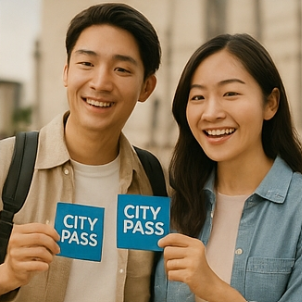

## 2025 대한민국 숙박세일 페스타 하반기 완벽 가이드

국내여행을 계획 중이라면, 올해 하반기에 열리는 2025 대한민국 숙박세일 페스타를 꼭 챙겨야 합니다.

문화체육관광부와 한국관광공사가 주관하는 이 행사는 숙박비를 크게 절약할 수 있는 대규모 할인 캠페인인데요. 단순히 정부 할인 쿠폰뿐 아니라, 각 OTA(온라인 여행사)별 추가 혜택까지 잘 활용하면 실제 체감 할인율은 두 배 이상 높아집니다. 이번 글에서는 행사 일정과 신청 방법, 주의사항, 그리고 온라인여행사별 혜택까지 꼼꼼하게 정리했습니다.

### 1. 행사 개요

• 기간

- 가을편: 2025년 8월 20일 – 10월 30일
- 겨울편: 2025년 11월 3일 – 12월 7일
- 특별재난지역편: 2025년 8월 20일 – 10월 30일

• 쿠폰 발급 규모

- 가을·겨울편: 총 80만 장
- 특별재난지역: 7만 2천 장 별도 지원

• 할인 대상 지역

- 서울·경기·인천 제외 전국
- 특별재난지역은 지정된 지역 한정

### 2. 할인 조건

• 비수도권 (가을·겨울편)

- 숙박비 7만 원 이상 → 3만 원 할인
- 숙박비 7만 원 미만(2만 원 이상) → 2만 원 할인

• 특별재난지역편

- 7만 원 이상 → 5만 원 할인
- 3만 원 초과 7만 원 미만 → 3만 원 할인

하반기에는 최대 2매(가을 또는 재난지역 1매 + 겨울편 1매)까지 사용 가능합니다.

### 3. 쿠폰 신청 방법

1. 매일 오전 10시, 참여 OTA 사이트·앱 접속
2. 본인 인증 후 쿠폰 다운로드
3. 발급된 쿠폰은 당일 오전 10시 – 익일 오전 7시까지 유효
4. 숙소 예약 결제 단계에서 자동 적용

※ 유효기간 내 미사용 시 자동 소멸 → 다음날 오전 10시부터 재도전 가능

### 4. 온라인 여행사(OTA)별 혜택

쿠폰 조건은 정부가 동일하게 적용하지만, 플랫폼별 자체 혜택을 합치면 차이가 큽니다. 어떤 OTA를 이용하느냐에 따라 할인 폭이 달라지는 만큼 전략적으로 선택하는 게 중요합니다.

### ① 야놀자

• 최대 7만 원 추가 할인 쿠폰팩 제공 사례 있음.

• 예약 시 결제 금액의 10% 포인트 적립까지 적용돼, 다음 여행에서도 활용 가능.

• 정부 쿠폰 + 자체 숙박 쿠폰팩(최대 20% 할인)을 중복하면 총 60% 이상 할인 효과.

• 빠른 예약 UX 덕분에 “10시 정각 예약” 도전에 유리하다는 후기가 많음.

### ② 여기어때

• 등급별 멤버십 혜택이 커서 VIP·플래티넘 회원은 OTA 자체 쿠폰과 정부 쿠폰을 함께 적용 가능.

• 카드사 제휴 할인(BC, 삼성, 카카오페이 등) 이벤트를 자주 진행.

• 숙소 리뷰와 사진이 풍부해 쿠폰 받자마자 빠른 비교·결정이 가능.

### ③ 네이버 여행

• 네이버페이 포인트 적립이 장점. 결제 금액의 최대 5%까지 포인트로 쌓여 장기적으로 이득.

• 검색 기능이 강력해 지역·테마별 숙소 필터링에 유리.

• 네이버 플러스 멤버십데이와 겹치면 중복 할인 가능 → “이중 할인 + 포인트 적립” 조합으로 알짜 혜택.

### ④ 인터파크투어

• 숙박세일 페스타 참여 시, 별도로 5,000원 중복 할인 쿠폰 제공.

• 제휴 카드사 결제 시 최대 1만 5천 원 추가 할인.

• 겨울철에는 18만 원 상당의 겨울여행 쿠폰팩을 따로 증정 → 항공권·렌터카·레저 예약과 결합 가능.

• 앱보다는 PC 웹에서 접속 속도가 빠르다는 후기가 있어, 쿠폰 확보 경쟁에 유리.

### ⑤ 11번가

• SK페이 결제 시 추가 할인·적립 제공.

• 정부 쿠폰 외에도 ‘타임딜’ 방식으로 숙박 특가를 함께 열어, 운이 좋으면 더 큰 할인 가능.

• 여행 카테고리 외에도 생활·가전 할인 행사와 묶어 결제 시 포인트 적립 극대화 가능.

### ⑥ 카카오

• 카카오페이 결제 시 캐시백 및 즉시 할인이 자주 진행.

• 카카오톡 알림으로 쿠폰 오픈 시간을 알려주어 놓치지 않기 좋음.

• 숙박 외에 레저·액티비티·입장권 예약도 쿠폰 적용 대상인 경우가 있어 여행 전체를 패키지로 구성 가능.

### ⑦ 트리플

• 최근 행사에서 최대 4만 원 할인 쿠폰을 선착순 제공한 사례 있음.

• 카카오페이 결제 시 추가 2만 원 할인 이벤트까지 진행해, 숙박세일 페스타와 중복 사용 가능.

• 여행 코스 추천과 일정 관리 기능이 있어, 쿠폰을 받은 뒤 바로 여행 계획에 반영하기 편리.

### 5. 유의사항

• 양도 불가: 본인만 사용 가능, 중고거래 불법.

• 연령 제한: 2005년생까지 가능 (2006년생부터 불가).

• 사용 가능 숙소: 호텔, 펜션, 리조트, 콘도 등 등록 숙소.

• 제외 대상: 대실, 캠핑장, 외국인 도시민박업, 미등록 숙소.

• 예약 취소: 유효기간 내 취소해야 쿠폰 재사용 가능. 단, 수수료 발생 시 쿠폰 소멸될 수 있음.

### 6. 실전 꿀팁

1. 10시 정각 알람 필수 – 인기 숙소 쿠폰은 몇 분 만에 매진.
2. 숙소 미리 찜하기 – 쿠폰 받은 즉시 결제 가능하도록 준비.
3. 결제수단 사전 등록 – 카드·간편결제를 미리 등록해 결제 속도 확보.
4. 여러 OTA 동시 시도 – 성공 확률 높이는 전략.
5. 플랫폼 이벤트 중복 확인 – 네이버페이 적립, 토스·카카오페이 추가 할인 등 ‘3중 할인’ 조합을 노리세요.
6. 평일 숙박 노려보기 – 주말보다 쿠폰 경쟁이 덜해 성공 확률 상승.

2025 숙박세일 페스타는 단순히 숙박비만 아끼는 이벤트가 아니라, 정부 지원과 OTA별 혜택을 동시에 누릴 수 있는 기회입니다. 각 플랫폼의 특징을 잘 살려 예약하면 할인 폭은 훨씬 커지고, 만족도 높은 여행을 즐길 수 있습니다.

이번 하반기, 숙박세일 페스타 쿠폰으로 스마트하고 알뜰한 여행을 준비해 보세요!

[민생회복지원금 맞벌이·소득기준(월 1280만원•상위 10%)과 1•2•3•4•5인가구 소득기준 확인 방법(+건강보험료)](/entry/2025-민생회복지원금-2차-맞벌이·소득-상위-10-기준과-확인-방법건강보험료)

[소상공인 부담경감 크레딧 지원금(50만원), 신청방법, 자격, 사용처 총정리](/entry/소상공인-부담경감-크레딧-신청방법·자격·사용처-총정리)
