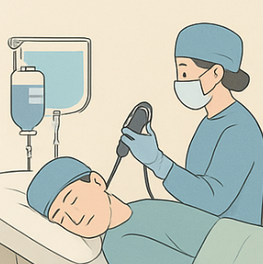
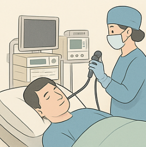
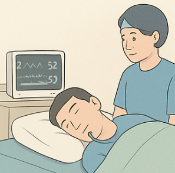
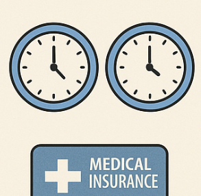
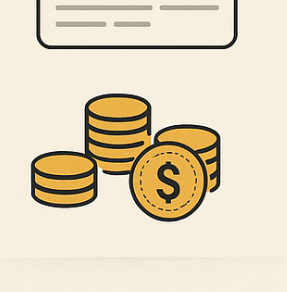
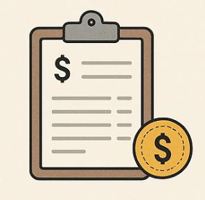
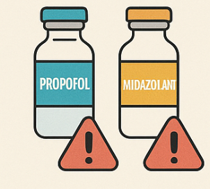
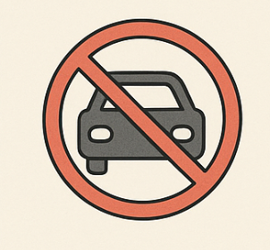
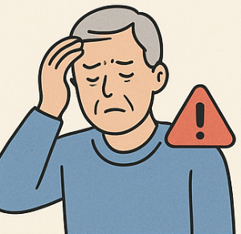
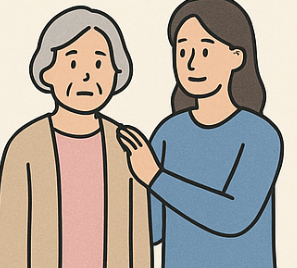

## 수면내시경 비용·부작용·보험까지 완전 정리

건강검진이나 대장내시경을 앞두고 가장 많이 하는 고민이 바로 수면내시경입니다. 편안하게 검사를 받을 수 있다는 장점이 있지만, 비용이나 부작용, 보험 적용 여부는 헷갈리는 경우가 많죠. 이번 글에서는 2025년 기준 수면내시경의 비용·부작용·시간·보험까지 한눈에 정리해드리겠습니다.

### 1. 수면내시경이란?

수면내시경은 일반 내시경과 달리 수면상태로 진정된 상황에서 진행하는 검사입니다. 전신마취가 아니며, 보통 위·대장 내시경에 사용됩니다. 환자는 검사 과정의 불편함을 거의 느끼지 않기 때문에 많은 분들이 선택하고 있습니다.

### 2. 수면내시경 비용

• 검진센터 비급여 평균

- 위내시경: 10~15만 원
- 대장내시경: 15~25만 원 (용종 제거 시 비용 추가)

• 외래(치료 목적으로 건강보험 일부 적용)

- 위: 4만~8만 원대
- 대장: 3만~8만 원대

**정리: 단순 검진은 비급여, 치료 목적일 경우 일부 건강보험과 실손보험 적용 가능**

### 3. 검사 소요·회복 시간

• 검사 준비: 위내시경은 최소 6~8시간 금식, 대장내시경은 장정결제 복용 필수

• 검사 시간: 위 510분, 대장 2030분 (치료 시 1시간 이상)

• 회복 시간: 일반 성인 30분~1시간, 고령자·만성질환자는 최소 2시간 권장

### 4. 운전과 일상 복귀 주의사항

• 검사 당일 운전 절대 금지 (최소 24시간 피하는 게 안전)

• 자전거, 중장비 조작, 음주, 중요한 결재·계약도 피해야 합니다.

• 귀가는 보호자 동행이나 대중교통 이용을 권장

### 5. 부작용 및 고위험군

수면내시경은 대체로 안전하지만 약물 특성상 부작용 가능성이 있습니다.

• 흔한 부작용: 졸림, 어지럼, 오심, 주사 부위 통증

• 드문 합병증: 호흡 저하, 저혈압, 알레르기 반응, 흡인

• 고위험군: 고령자, 비만·수면무호흡 환자, 심·폐·간·신질환자, 임신부

**이런 경우에는 얕은 진정이나 마취과 협진이 필요합니다.**

### 6. 보험 적용 여부 (실손·건강보험)

• 건강보험 급여 인정: 치료 목적 내시경, 산정특례(암·심혈관·희귀난치질환 등)

• 비급여: 단순 검진, 국가건강검진에서 선택하는 수면내시경

• 실손보험:

• 검진 목적은 보통 불가

• 치료 목적 검사(용종 제거, 조직검사 포함)는 청구 가능

• 4세대 실손은 비급여 30% 본인 부담 구조

**보험 청구 시에는 진단명 기재된 진료비 영수증, 진단서·소견서, 결과지를 챙기세요.**

### 7. 사용 약물 비교 (프로포폴 vs 미다졸람)

수면내시경에서 가장 많이 쓰이는 약물은 프로포폴과 미다졸람입니다.

• 프로포폴은 효과가 빠르고 회복도 빠르며, 환자가 편안하게 검사를 받을 수 있습니다. 다만 길항제가 없어 호흡 억제나 저혈압 같은 위험이 발생하면 의료진의 즉각적인 대처가 필요합니다.

• 미다졸람은 불안 완화와 기억 차단 효과가 있고, 필요할 경우 길항제를 사용해 안전하게 회복시킬 수 있습니다. 단점은 회복이 더뎌서 검사 후 졸림이 오래 지속될 수 있다는 점입니다.

**프로포폴은 빠른 효과·빠른 회복, 미다졸람은 안전성(길항제 보유)이 장점입니다. 환자 상태와 병원 환경에 따라 선택됩니다.**

### 8. 검사 전·후 체크할 사항

### 검사 전

• 최소 6~8시간 금식

• 항응고제·혈당약 복용 여부 반드시 상담

• 보호자 동행 준비

### 검사 후

• 운전, 중장비 조작, 음주, 중요한 의사결정 금지

• 조직검사·용종 제거 시 의료진 지시 준수

• 복통·혈변·발열 발생 시 즉시 병원 방문

### 9. 종합 요약

• 비용: 위 10~15만 원, 대장 15~25만 원(검진은 비급여, 치료 목적은 일부 보험 적용)

• 시간: 위 5~10분, 대장 20~30분 + 회복 30분~2시간

• 운전: 당일 절대 금지, 24시간 회피 권장

• 부작용: 대체로 경미하지만, 고위험군은 주의 필요

• 보험: 치료 목적이면 실손·건보 적용 가능, 검진 목적은 불가

수면내시경은 불편함을 줄여주는 유용한 검사지만, 약물 특성과 개인 건강 상태에 따라 회복 속도나 부작용 가능성이 달라집니다. 검사 당일 운전 금지, 보호자 동행, 충분한 회복 시간 확보는 필수입니다. 또한, 단순 검진은 보험 적용이 어렵지만 치료 목적 내시경은 청구 가능하니 사전에 확인해두시면 좋습니다.

[마흔, 중년, 노년 필수 건강검진 항목](/entry/40대부터-챙겨야-할-건강-검진-항목)

[중장년층 건강의 핵심, 질병 예방과 관리로 똑똑하게 건강 챙기기](/entry/중장년층-건강의-핵심-질병-예방과-관리로-똑똑하게-건강-챙기기)

[여성 갱년기 및 폐경기 이후 건강 식단 가이드](/entry/갱년기-및-폐경기-이후-여성-건강을-위한-식단-가이드)

[남성 갱년기 건강을 위한 필수 영양소와 음식](/entry/남성-갱년기-건강을-위한-필수-영양소와-음식)
