이제 조사한 내용(5세대 실손보험 2026.5.6 판매 개시, 국가건강검진 위내시경 본인부담 10% 및 수면비 비급여 구조 유지)을 반영해 본문을 갱신한 결과를 출력합니다.

## 수면내시경 비용·부작용·보험까지 완전 정리

건강검진이나 대장내시경을 앞두고 가장 많이 하는 고민이 바로 수면내시경입니다. 편안하게 검사를 받을 수 있다는 장점이 있지만, 비용이나 부작용, 보험 적용 여부는 헷갈리는 경우가 많죠. 이번 글에서는 2026년 8월 기준 수면내시경의 비용·부작용·시간·보험까지 한눈에 정리해드리겠습니다.

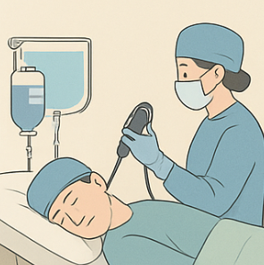

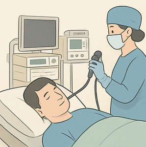

### 1. 수면내시경이란?

수면내시경은 일반 내시경과 달리 수면상태로 진정된 상황에서 진행하는 검사입니다. 전신마취가 아니며, 보통 위·대장 내시경에 사용됩니다. 환자는 검사 과정의 불편함을 상대적으로 덜 느끼는 경우가 많아 많은 분들이 선택하고 있습니다.

### 2. 수면내시경 비용

• 검진센터 비급여 평균(병원·지역별로 차이가 있으니 참고용으로만 확인하세요)

- 위내시경: 10~15만 원대
- 대장내시경: 15~25만 원대 (용종 제거 시 비용 추가)

• 외래(치료 목적으로 건강보험 일부 적용)

- 위: 4만~8만 원대
- 대장: 3만~8만 원대

• 국가건강검진(위암검진)으로 위내시경을 받는 경우, 검사 자체의 본인부담은 통상 10% 수준이며 건강보험료 하위 구간 등 조건에 따라 면제될 수 있습니다. 다만 수면(진정) 비용은 대부분 비급여로 별도 청구되며, 대략 4만~10만 원대로 안내되는 경우가 많습니다.

**정리: 단순 검진은 비급여, 치료 목적일 경우 일부 건강보험과 실손보험 적용이 가능한 편입니다. 정확한 금액은 건강보험심사평가원 '비급여 진료비 정보'(www.hira.or.kr) 또는 방문 예정인 병원에 직접 문의해 확인하시길 권합니다.**

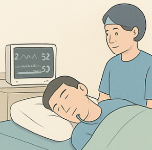

### 3. 검사 소요·회복 시간

• 검사 준비: 위내시경은 통상 6~8시간 금식, 대장내시경은 장정결제 복용이 필요합니다

• 검사 시간: 위 5~10분, 대장 20~30분 내외(치료 시 1시간 이상 소요될 수 있음)

• 회복 시간: 일반 성인 30분~1시간, 고령자·만성질환자는 2시간 이상 여유를 두는 것이 권장됩니다

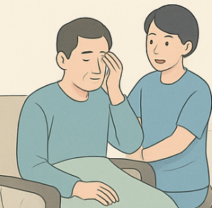

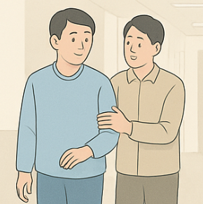

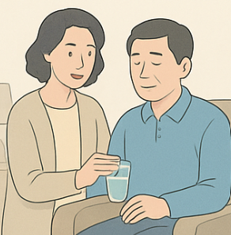

### 4. 운전과 일상 복귀 주의사항

• 검사 당일 운전은 피하는 것이 원칙입니다 (진정제 영향이 남아있을 수 있어 최소 24시간은 피하는 것이 안전합니다)

• 자전거, 중장비 조작, 음주, 중요한 결재·계약 등도 가급적 피하는 것이 좋습니다

• 귀가는 보호자 동행이나 대중교통 이용을 권장합니다

### 5. 부작용 및 고위험군

수면내시경은 대체로 안전한 검사로 알려져 있지만, 약물 특성상 부작용이 나타날 수 있습니다.

• 흔한 부작용: 졸림, 어지럼, 오심, 주사 부위 통증

• 드문 합병증: 호흡 저하, 저혈압, 알레르기 반응, 흡인

• 고위험군: 고령자, 비만·수면무호흡 환자, 심·폐·간·신질환자, 임신부

**이런 경우에는 얕은 진정이나 마취과 협진을 고려하는 것이 좋으며, 정확한 판단은 담당 의료진과 상담하시길 권합니다.**

### 6. 보험 적용 여부 (실손·건강보험)

• 건강보험 급여 인정: 치료 목적 내시경, 산정특례(암·심혈관·희귀난치질환 등)

• 비급여: 단순 검진, 국가건강검진에서 선택하는 수면(진정) 비용

• 실손보험:

- 검진 목적은 대체로 청구가 어렵습니다
- 치료 목적 검사(용종 제거, 조직검사 포함)는 청구가 가능한 경우가 많습니다
- 2026년 5월 6일부터 5세대 실손보험 판매가 시작되었습니다. 5세대는 비급여를 중증(특약1, 자기부담 30%·연간 상한 500만 원)과 비중증(특약2, 자기부담 50%·연간 한도 1천만 원 내외)으로 나누어 관리하는 구조로, 기존 4세대(비급여 자기부담 약 30%)와 부담률이 다릅니다.
- 기존 1~4세대 가입자는 별도 전환 신청을 하지 않는 한 기존 약관이 유지되는 것이 일반적입니다. 본인이 몇 세대 실손보험에 가입되어 있는지, 어떤 부담률이 적용되는지는 가입한 보험사 또는 보험다모아(e-insmark.or.kr), 금융감독원을 통해 확인하는 것을 권장합니다.

**보험 청구 시에는 진단명이 기재된 진료비 영수증, 진단서·소견서, 결과지를 챙기시는 것이 좋습니다.**

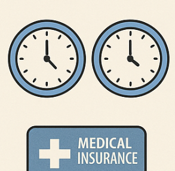

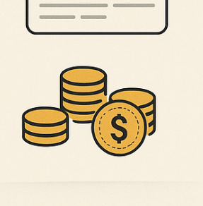

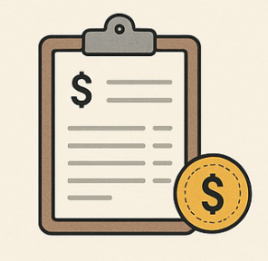

### 7. 사용 약물 비교 (프로포폴 vs 미다졸람)

수면내시경에서 널리 쓰이는 약물은 프로포폴과 미다졸람입니다.

• 프로포폴은 효과가 빠르고 회복도 빠른 편이라 환자가 비교적 편안하게 검사를 받을 수 있습니다. 다만 길항제가 없어 호흡 억제나 저혈압 같은 위험이 발생하면 의료진의 즉각적인 대처가 필요합니다.

• 미다졸람은 불안 완화와 기억 차단 효과가 있고, 필요할 경우 길항제를 사용해 회복을 도울 수 있습니다. 단점은 회복이 더뎌서 검사 후 졸림이 비교적 오래 지속될 수 있다는 점입니다.

**프로포폴은 빠른 효과·빠른 회복, 미다졸람은 길항제를 통한 안전성 확보가 장점으로 꼽힙니다. 실제 선택은 환자 상태와 병원 환경에 따라 담당 의료진이 판단합니다.**

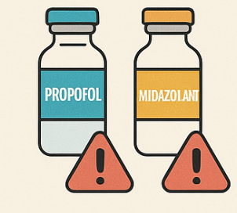

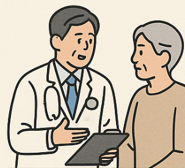

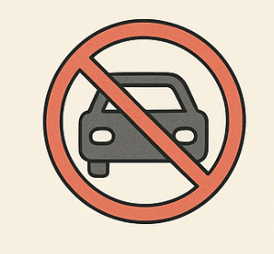

### 8. 검사 전·후 체크할 사항

### 검사 전

• 통상 6~8시간 금식이 필요합니다

• 항응고제·혈당약 등 복용 중인 약이 있다면 사전에 담당 의료진과 상담하는 것이 중요합니다

• 보호자 동행을 미리 준비해두세요

### 검사 후

• 운전, 중장비 조작, 음주, 중요한 의사결정은 피하는 것이 좋습니다

• 조직검사·용종 제거를 한 경우 의료진의 사후관리 지시를 따르세요

• 복통·혈변·발열이 발생하면 즉시 병원에 방문하시기 바랍니다

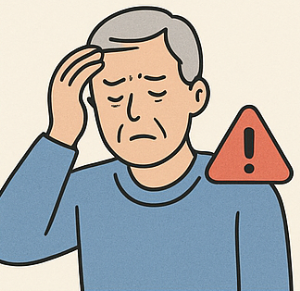

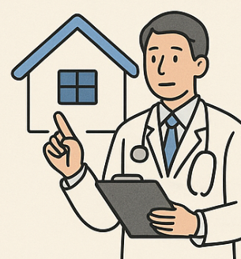

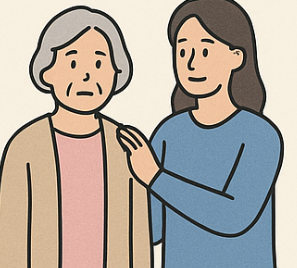

### 9. 자주 묻는 질문 (FAQ)

**Q1. 국가건강검진에서 위내시경을 받으면 수면내시경도 무료인가요?**
국가건강검진(위암검진)의 위내시경 검사 자체는 본인부담이 낮게(통상 10% 수준) 책정되어 있고 소득 구간에 따라 면제되기도 하지만, 수면(진정) 처치 비용은 대부분 비급여로 별도 청구됩니다. 기관마다 금액 차이가 있으니 예약 시 미리 확인하는 것이 좋습니다.

**Q2. 내가 가입한 실손보험이 몇 세대인지 어떻게 확인하나요?**
가입한 보험사 고객센터나 보험 증권, 또는 보험다모아·금융감독원 홈페이지에서 확인할 수 있습니다. 세대별로 비급여 자기부담률과 보장 한도가 다르므로, 청구 전에 본인의 가입 세대를 확인해두면 예상 환급액을 가늠하는 데 도움이 됩니다.

**Q3. 프로포폴 부작용이 걱정되는데 수면내시경을 꼭 받아야 하나요?**
수면내시경은 선택 사항이며, 고령이거나 심·폐 질환 등 기저질환이 있는 경우 비수면(일반) 내시경이나 얕은 진정을 선택할 수도 있습니다. 본인의 건강 상태에 맞는 방식은 검사 전 담당 의료진과 상담을 통해 결정하시는 것을 권장합니다.

### 10. 종합 요약

• 비용: 위 10~15만 원대, 대장 15~25만 원대(검진은 비급여, 치료 목적은 일부 보험 적용). 정확한 금액은 병원별 확인이 필요합니다

• 시간: 위 5~10분, 대장 20~30분 + 회복 30분~2시간

• 운전: 당일에는 피하고, 24시간 정도는 회피하는 것이 권장됩니다

• 부작용: 대체로 경미하지만, 고위험군은 사전 상담이 필요합니다

• 보험: 치료 목적이면 실손·건보 적용이 가능한 경우가 많고, 검진 목적은 어려운 편입니다. 2026년 5월부터는 5세대 실손보험이 새로 판매되고 있어 가입 세대에 따라 부담률이 달라질 수 있습니다

수면내시경은 불편함을 줄여주는 유용한 검사지만, 약물 특성과 개인 건강 상태에 따라 회복 속도나 부작용 가능성이 달라질 수 있습니다. 검사 당일 운전을 피하고, 보호자 동행과 충분한 회복 시간을 확보하는 것이 안전합니다. 또한 단순 검진은 보험 적용이 어려운 경우가 많지만 치료 목적 내시경은 청구가 가능할 수 있으니, 정확한 보장 내용은 가입한 보험사와 병원에 사전 확인해두시길 권합니다.

[마흔, 중년, 노년 필수 건강검진 항목](/entry/40대부터-챙겨야-할-건강-검진-항목)

[중장년층 건강의 핵심, 질병 예방과 관리로 똑똑하게 건강 챙기기](/entry/중장년층-건강의-핵심-질병-예방과-관리로-똑똑하게-건강-챙기기)

[여성 갱년기 및 폐경기 이후 건강 식단 가이드](/entry/갱년기-및-폐경기-이후-여성-건강을-위한-식단-가이드)

[남성 갱년기 건강을 위한 필수 영양소와 음식](/entry/남성-갱년기-건강을-위한-필수-영양소와-음식)
