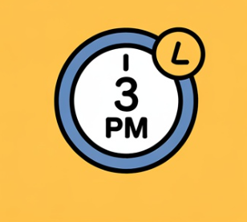

## 2025년 추석 KTX·SRT 예매 가이드

2025년 추석 연휴는 10월 6일(월) 본절을 중심으로 앞뒤 휴일이 이어져 최장 11일간의 긴 연휴가 됩니다. 그만큼 귀성·귀경길 열차표 경쟁도 치열할 수밖에 없는데요.

특히 올해는 코레일과 SRT 예매 일정이 서로 달라 헷갈리기 쉽습니다. 코레일은 일정이 연기되어 9월 15일부터 시작되고, SRT는 원래 공지대로 9월 8일부터 진행됩니다. 헷갈리지 않도록 날짜, 방법, 결제 기한까지 정리했습니다.

### 1. KTX(코레일) 예매 일정과 방법

코레일은 안전 점검을 이유로 당초 계획보다 2주 연기된 9월 15일부터 명절 승차권 예매를 진행합니다.

• 9월 15일(월)16일(화) 오전 9시~오후 3시

- 교통약자 우선 예매 (65세 이상, 등록장애인, 국가유공자)

• 9월 17일(수)18일(목) 오전 7시~오후 1시

- 일반인 예매. 노선별로 날짜가 나뉘며, 경부선·경전선·충북선 등 일부 노선은 첫날, 호남선·전라선·강릉선 등은

둘째 날에 예매가 진행됩니다.

• 결제 기한은 9월 21일 자정까지이며, 미결제 시 자동으로 취소됩니다.

교통약자 표는 9월 24일까지 결제가 가능합니다.

• 예매는 코레일 명절 전용 페이지(PC, 모바일)에서만 가능하고 회원 가입이 필수입니다. [(코레일 바로가기 클릭)](https://www.korail.com/intro)

### 2. SRT 예매 일정과 방법

SRT는 당초 계획대로 9월 8일부터 예매를 시작합니다.

• 9/8(월)~9(화) 오전 9시~오후 3시 : 교통약자 우선

• 9/10(수)~11(목) 오전 7시~오후 1시: 일반 예매

- 경부·경전·동해선은 10일, 호남·전라선은 11일에 각각 진행

결제 기간은 일반 예매분은 9월 11일 오후 5시부터 9월 14일 자정까지, 우선 예매분은 9월 11일 오후 5시부터 9월 17일 자정까지입니다.

• 잔여석 판매는 9월 11일 오후 3시부터 상시 오픈

• 현장 발매는 없으며 홈페이지, 앱, 전화 예매만 가능합니다. 1인당 최대 12매(1회 6매)까지만 구매할 수 있습니다.

[(SRT 바로가기 클릭)](https://etk.srail.kr/main.do)

### 3. 예매 성공을 위한 준비 팁

추석 승차권 예매는 몇 초 차이로도 당락이 갈립니다. 준비가 곧 성공의 비결입니다.

• 사전에 회원가입, 로그인, 본인 인증을 모두 마치고 앱을 최신 버전으로 업데이트하세요.

• 카드, 간편결제(네이버페이, 카카오페이 등)까지 미리 등록해 두는 것이 안전합니다.

• 예매는 정확한 시간에 시작되므로 서버 시간을 맞춰두는 것이 중요합니다. 네이비즘 같은 사이트에서 시간을 확인한 후 5~10분 전 대기하는 것이 좋습니다.

• PC와 모바일을 동시에 활용하는 것이 유리하나, 기기를 과도하게 늘리면 대기열이 초기화될 위험이 있습니다. 안정적으로 2대 정도 준비하는 것이 적절합니다.

• 출발역과 도착역을 미리 입력해두고, 원하는 시간대가 매진될 경우를 대비해 이른 아침·늦은 밤이나 중간역(동대구 대신 서대구, 수서 대신 동탄 등)으로 변경하는 전략도 세워두면 성공 확률이 높습니다.

### 4. 잔여석·취소표 공략법

**설령 첫날 예매에 실패하더라도 기회는 있습니다.**

• 결제 기한이 지나면 자동으로 회수되는 좌석이 풀립니다. SRT는 9/14과 9/17, KTX는 9/21 이후가 대표적인 타이밍입니다.

• 하루 중 자정 무렵, 그리고 출발 12일 전 새벽 24시 사이에도 취소표가 자주 발생합니다.

• 코레일 앱의 잔여석 알림 기능, 예약 대기 기능을 활용하면 번거롭게 새로고침하지 않고도 표를 확보할 가능성이 있습니다.

### 5. 환불·수수료 규정

명절 기간에는 환불 위약금이 일반 시기보다 다소 강화됩니다.

• 출발 2일 전까지는 400원만 공제.

• 출발 1일 전에는 5%, 당일에는 10% 이상, 출발 후에는 최대 70%까지 공제될 수 있습니다.

• 특히 출발 직전이나 출발 후 취소는 수수료가 크므로 일정이 불확실하다면 비교적 유연한 시간대 표를 확보해 두는 것이 좋습니다.

### 6. 꼭 기억해야 할 핵심 정리

**1. SRT가 먼저, KTX는 1주일 뒤에 예매를 시작합니다.**

**2. 결제 기한을 반드시 확인해야 하며, 미결제 시 자동 취소됩니다.**

**3. 잔여석 오픈 타이밍은 결제 마감 직후와 출발 직전 새벽입니다.**

**4. 한 번에 왕복을 묶지 말고 편도씩 나눠 예매하면 성공률이 높습니다.**

**5. 회원가입, 결제수단 등록, 대체 시간대까지 모두 사전 준비를 마쳐야 합니다.**

2025년 추석은 긴 연휴로 열차표 경쟁이 더 치열할 것으로 보입니다. 예매 일정과 방법을 철저히 확인하고, 잔여석 전략까지 챙겨두면 원하는 시간대 표를 확보할 가능성이 훨씬 높아집니다. 이제 달력에 날짜와 결제 기한을 표시해두고, 실전 예매 연습을 시작해 보세요. 올 추석에는 원하는 시간표로 편안한 귀성·귀경길이 되길 바랍니다.

[숙박세일 페스타 할인·쿠폰·혜택 방법 정리 (야놀자·여기어때·네이버여행 등)](/entry/숙박세일-페스타-야놀자•여기어때-등-할인-방법과-혜택-정리)

[학여울역 SETEC 주차 요금•위치, 외부 주차장(은마상가 주차 꿀팁)](/entry/🅿-학여울역-SETEC-주차-요금•위치-외부-주차장은마상가-꿀팁)
