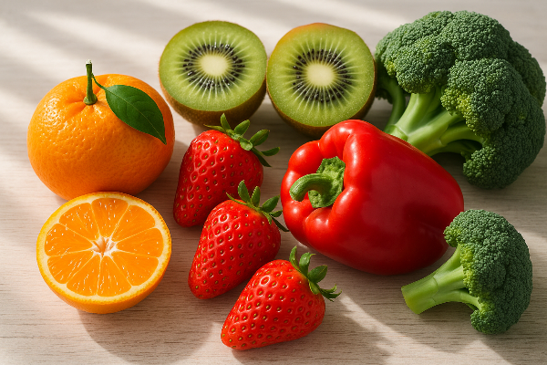
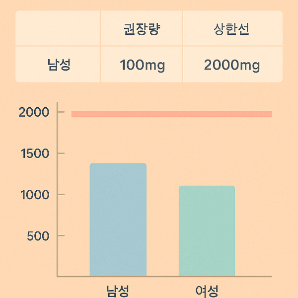
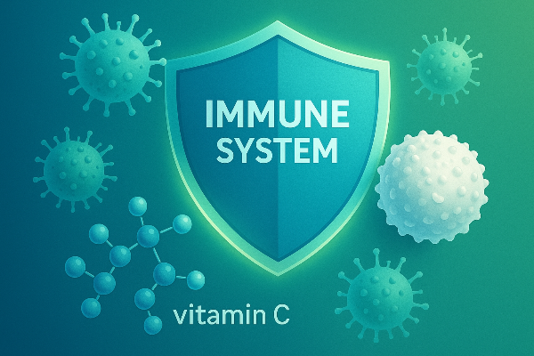
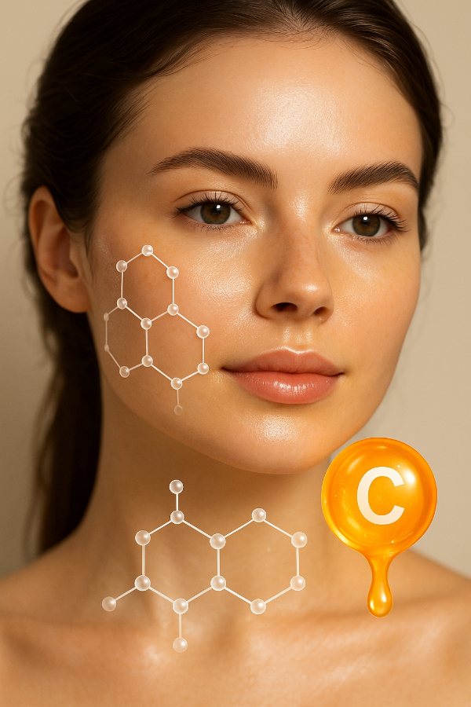
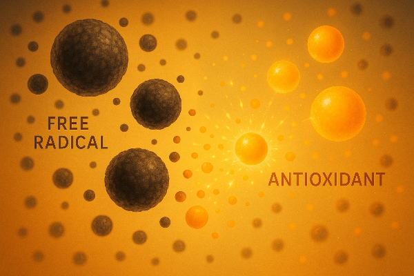
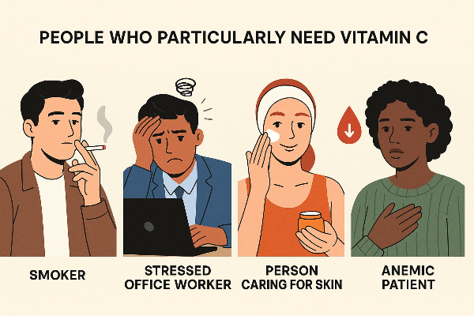
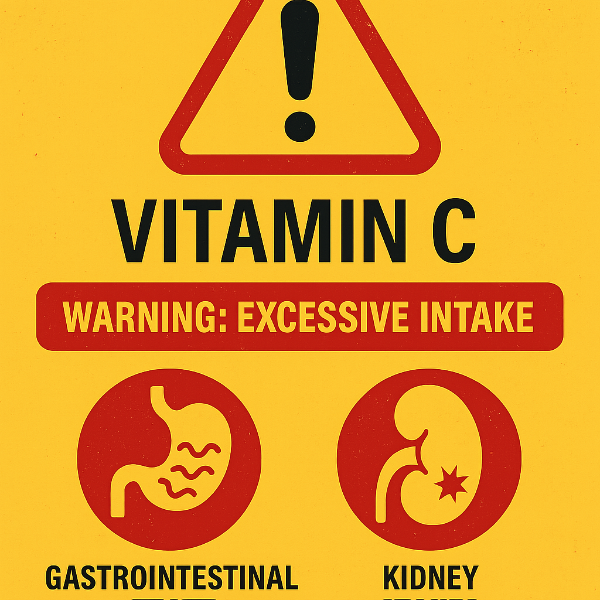
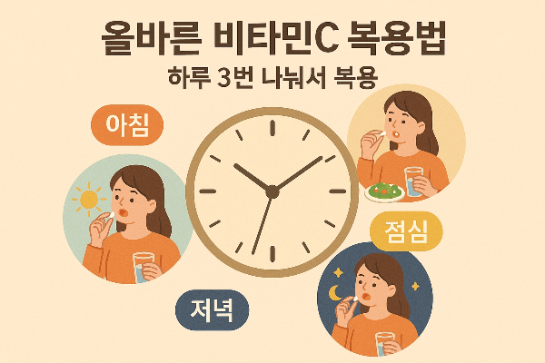

## 비타민C 효능과 올바른 복용법, 부작용까지 총정리

비타민C는 ‘면역 비타민’이라고 불릴 만큼 건강관리의 기본 영양소로 꼽힙니다. 하지만 무조건 많이 먹는다고 좋은 건 아니죠. 오늘은 비타민C의 효능, 권장 복용량, 복용 방법, 부작용까지 한 번에 알려드리겠습니다.

### 1. 비타민C, 왜 중요한가?

비타민C(아스코르빈산)는 수용성 비타민으로, 체내에서 합성되지 않아 반드시 음식이나 보충제로 섭취해야만 합니다.

주요 기능은 다음과 같습니다.

• 강력한 항산화 작용 → 활성산소 제거, 노화 지연

• 콜라겐 합성 → 피부 탄력, 상처 치유 촉진

• 철분 흡수 촉진 → 빈혈 예방

• 면역력 강화 → 감기 회복 보조, 감염 예방

• 심혈관 보호 → 혈관 건강 유지

### 2. 비타민C 효능, 과학적으로 살펴보기

### 면역력 강화

비타민C는 백혈구 기능을 돕고 항체 생성을 촉진해 감염성 질환 예방에 유리합니다. 다만 감기를 예방한다기보다는 증상 기간 단축과 완화 효과에 가깝습니다.

### 피부 미용 효과

콜라겐 합성에 관여해 주름 완화·상처 회복에 도움을 줍니다. 화장품 성분으로도 자주 쓰이는 이유입니다.

### 항산화 및 항암 연구

비타민C는 대표적인 항산화제로, 세포 손상을 줄여 노화·암 발생을 억제하는 연구 결과가 있습니다. 고용량 비타민C는 항암 보조요법으로도 연구되고 있습니다.

### 심혈관 건강

혈관 내피 기능 개선, LDL(나쁜 콜레스테롤) 산화 억제, 고혈압 위험 감소에 일부 긍정적 효과가 보고되었습니다.

### 3. 권장 복용량 & 올바른 섭취법

• 성인 권장량: 남성 100mg, 여성 85mg (한국인 영양섭취기준 기준)

• 상한선: 2,000mg/일 (과다 섭취 시 부작용 위험)

### 복용 방법 팁

1. 나누어 섭취수용성 비타민이라 한 번에 많은 양을 먹으면 소변으로 배출됩니다. 2~3회 나눠 복용하는 것이 흡수율 ↑
2. 식사 후 복용: 위가 예민한 경우 식사 후에 복용하는 것이 좋습니다.
3. 흡연자·스트레스 많은 사람: 비타민C 소모가 많아 일반인보다 더 필요할 수 있습니다.

음식으로 섭취하기

• 대표 식품: 귤, 딸기, 키위, 파프리카, 브로콜리

• 과일·채소를 신선하게 먹을수록 비타민C 손실이 적습니다.

### 4. 비타민C 부작용, 알고 먹자

비타민C는 비교적 안전한 편이지만, 과다 복용 시 부작용이 있습니다.

• 소화 장애: 속쓰림, 설사, 위장 불편감

• 신장 결석 위험: 고용량 장기 복용 시 옥살산 생성 증가 → 신장결석 위험 ↑

• 철분 과잉 흡수: 혈색소증(철 과다 질환)이 있는 경우 피해야 함

• 피부 발진·두통: 드물지만 과민반응 보고 사례 있음

하루 1,000mg 이내로 꾸준히 섭취하는 것이 가장 안전합니다.

### 5. 비타민C, 이런 사람이 특히 필요하다

• 흡연자: 담배 한 개비마다 25mg 이상 비타민C 소모

• 스트레스 많은 직장인: 스트레스 호르몬 증가 시 비타민C 소모량 ↑

• 피부 관리가 중요한 사람: 피부 탄력·미백 목적

• 철분 결핍 빈혈 환자: 철분제와 함께 섭취하면 흡수율 ↑

### 6. 비타민C 섭취 시 자주 묻는 질문(FAQ)

**Q1. 감기에 걸렸을 때 고용량 비타민C를 먹으면 낫나요?**

A1. 예방 효과는 제한적이나, 증상 기간 단축과 완화에 도움을 줄 수 있습니다.

**Q2. 비타민C는 언제 먹는 게 좋나요?**

A2. 흡수율은 공복이 더 높지만 위 자극이 있을 수 있으므로, 일반적으로 식후 섭취를 권장합니다.

**Q3. 천연 vs 합성 비타민C, 차이가 있나요?**

A3. 분자 구조가 동일해 효과는 같으며, 흡수율도 차이 없음이 과학적으로 입증되어 있습니다.

비타민C는 면역력·피부·혈관 건강을 돕는 대표 항산화 비타민입니다. 그러나 고용량은 소화 장애나 신장결석 위험을 높일 수 있으므로 권장량을 지켜 꾸준히 섭취하는 것이 중요합니다.

오늘부터는 음식과 보충제를 적절히 활용해 하루 500~1,000mg 정도를 나눠 섭취해 보세요. 꾸준한 습관이 건강을 지켜줍니다.

[뼈 건강을 위한 칼슘과 비타민 D, 어떻게 섭취해야 할까?](/entry/뼈-건강을-위한-칼슘과-비타민-D-어떻게-섭취해야-할까)

[비타민 D 효능·효과·용량·용법·부작용 총 정리](/entry/비타민-D-효능·효과·용량·용법·부작용-총-정리)

[합성비타민과 천연비타민 차이: 흡수율•효능•부작용 정리](/entry/합성•천연비타민-차이-흡수율•효능•부작용-정리)
