## 합성비타민과 천연비타민 차이: 흡수율•효능•부작용 정리

합성비타민과 천연비타민, 무엇이 더 좋을까요? 흡수율·효능·부작용까지 과학적 근거로 정리했습니다. 올바른 선택 가이드와 실전 꿀팁까지 확인하세요.

비타민 보충제를 고를 때 가장 많이 받는 질문은 “천연이냐, 합성이냐?”입니다. 천연은 무조건 좋고 합성은 나쁘다는 인식이 많지만, 실제 연구 결과는 조금 다릅니다. 이 글에서는 천연비타민과 합성비타민의 차이, 흡수율, 과다섭취 위험성, 선택 기준을 정리했습니다.

**천연비타민과 합성비타민, 정의와 기본 원리**

• 천연비타민: 과일, 채소, 곡물, 생선 등 자연 원료에서 추출

• 합성비타민: 화학 원료로 실험실에서 합성

핵심 원리: 분자 구조가 같으면 흡수와 효능도 사실상 동일합니다. 하지만 입체 구조나 형태가 다를 경우에는 차이가 생길 수 있습니다.

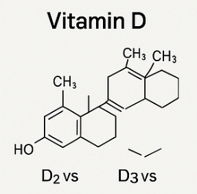

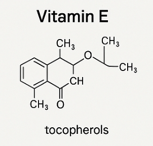

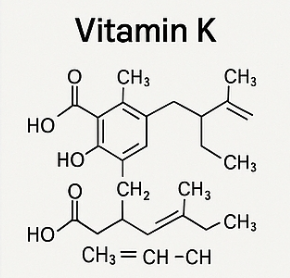

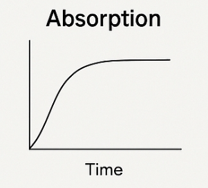

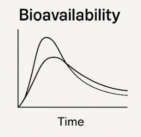

### 비타민별 차이점 비교

### 비타민 C

• 합성과 천연 모두 동일한 아스코르빈산 → 흡수율, 효능 차이 거의 없음

• 과일·채소로 섭취하면 파이토케미컬, 섬유질까지 함께 얻는 장점

팁: 위가 약하다면 완충형(버퍼드) 비타민 C 추천

### 비타민 E

• 천연형(d-α-토코페롤): 생체활성 높음

• 합성형(dl-α-토코페롤): 효과가 천연 대비 절반 수준

• 라벨에서 d-α = 천연, dl-α = 합성

### 비타민 D

• D2: 버섯 등 식물성

• D3: 동물성, 혈중 농도 유지 효과 우수

• 연구에 따르면 D3가 더 효과적

### 엽산(B9)

• 합성 엽산(폴릭애시드)이 오히려 흡수율이 더 좋음

• 그래서 DFE(식이엽산당량) 개념 사용

• 임신부는 엽산 보충제 필수

### 비타민 B12

• 시아노코발라민(합성형): 저렴, 안정성 높음

• 메틸·아데노실코발라민(활성형): 체내에서 바로 활용 가능

• 두 형태 모두 결핍 교정 효과 있음

### 비타민 K

• K1: 혈액응고

• K2(MK-7): 반감기 길어 뼈 건강에 더 오래 작용

### 비타민 A

• 프리폼(레티놀): 고용량 시 간독성·기형 위험

• 베타카로틴: 필요할 때만 비타민 A로 전환, 안전성 높음

### 천연 vs 합성, 꼭 천연이 더 좋을까?

• 비타민 C, B군: 차이 없음 → 가성비 좋은 합성도 충분

• 비타민 E, D, A, K: 형태 차이가 효과에 큰 영향

• 천연은 가격이 비싸고 함량이 일정치 않음

• 합성은 저렴하고 안정적이지만 과다섭취 주의 필요

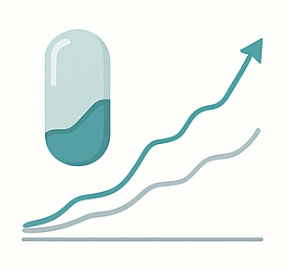

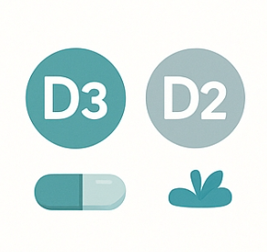

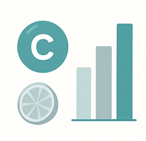

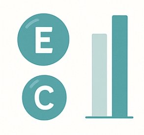

### 과다섭취 시 주의할 점

• 비타민 A, D, E: 고용량 복용 시 사망률 증가 보고

• 엽산: 과다 시 B12 결핍 증상 가릴 수 있음

• 흡연자: 베타카로틴 보충제 복용 시 폐암 위험 ↑

“필요할 때, 적정량만” 섭취가 핵심

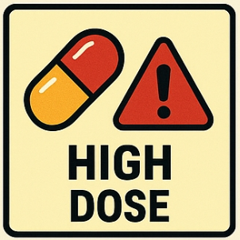

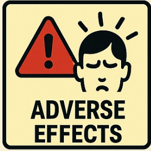

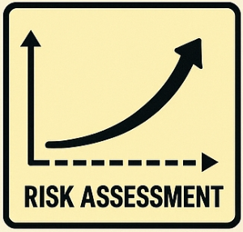

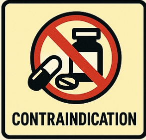

### FAQ

**Q1. 천연비타민이 합성비타민보다 무조건 좋나요?**

A. 아닙니다. 분자가 동일하면 차이가 거의 없어요. 중요한 건 형태와 용량입니다.

**Q2. 임산부는 어떤 비타민을 조심해야 하나요?**

A. 프리폼 비타민 A는 고용량 시 기형 유발 가능성이 있어 주의해야 합니다. 대신 베타카로틴 형태가 안전합니다.

**Q3. 비타민 D는 꼭 D3로 먹어야 하나요?**

A. D2도 효과는 있지만, 연구상 D3가 혈중 농도 유지에 더 뛰어납니다. 가능하다면 D3를 선택하세요.

천연과 합성 중 어느 쪽이 무조건 낫다고 말하기는 어렵습니다. 비타민별 형태와 개인의 건강 상태에 맞는 선택이 중요합니다. 음식으로 섭취하는 게 가장 이상적이고, 보충제는 부족할 때만 보완용으로 활용하세요.

[비타민C 효능·효과·용량·복용법·부작용](/entry/비타민C-효능과-올바른-복용법-부작용까지-총정리)
