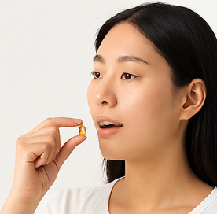
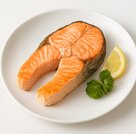
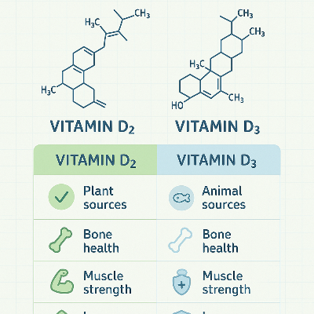
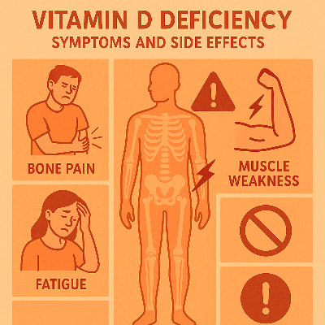
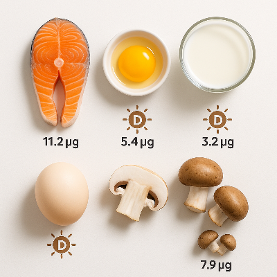
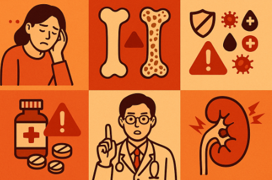
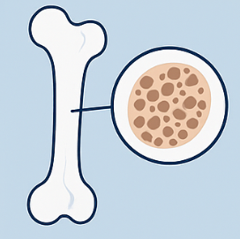
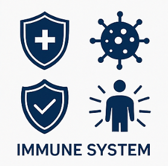

## 비타민 D, 제대로 아는 법: 효능부터 복용량까지 한 번에 정리

햇볕을 받으면 몸에서 스스로 만들어지는 비타민 D. 하지만 실내 생활이 많아지고 자외선 차단제를 꾸준히 바르다 보니 한국인 대부분은 비타민 D가 부족하다는 이야기를 자주 듣습니다. 그렇다면 비타민 D는 우리 몸에서 어떤 일을 하고, 어떻게 챙겨야 할까요? 효능·종류·복용법·부작용까지 차근차근 정리해보겠습니다.

---

## 1. 비타민 D의 주요 효능과 효과

비타민 D는 단순한 영양소를 넘어 **호르몬처럼 작용하는 영양소**입니다.

- **뼈 건강**: 칼슘과 인의 흡수를 도와 뼈를 단단하게 만들고 골다공증 예방에 중요합니다.
- **근육 기능 유지**: 근육 수축과 신경 전달에 관여해 낙상 위험을 줄이는 데 도움을 줍니다.
- **면역력 강화**: 면역 세포의 활동을 조절해 감염 예방에 관여합니다. 일부 연구에서는 호흡기 감염 감소 효과가 보고된 바 있습니다.
- **세포 성장·염증 조절**: 세포 분화와 염증 반응에도 영향을 줘, 전반적인 건강 관리에 기여합니다.

## 2. 비타민 D의 종류

비타민 D는 여러 형태가 있는데, 보충제로 접하는 건 주로 다음과 같습니다.

- **비타민 D2 (에르고칼시페롤)**: 식물성 원료에서 얻으며 효과는 있지만 혈중 농도를 유지하는 힘은 다소 약합니다.
- **비타민 D3 (콜레칼시페롤)**: 동물성 원료에서 얻으며, 대부분의 연구에서 D2보다 혈중 농도 상승에 효과적이라고 알려져 있습니다. 그래서 시중 보충제도 D3가 많습니다.
- **활성형 비타민 D (칼시트리올)**: 신장질환이나 부갑상선 질환 같은 특수 환자에서 의사가 처방하는 형태로, 일반인이 자가 복용하는 경우는 드뭅니다.

---

## 3. 비타민 D 권장량과 복용량

나라와 기관마다 권장량에 차이가 있지만 대략적인 기준은 다음과 같습니다.

- **성인 19~64세**: 하루 400~600 IU
- **65세 이상 노인**: 하루 600~800 IU
- **상한 섭취량**: 성인 기준 하루 4000 IU (지속적으로 이 이상 복용하면 부작용 위험 증가)

쉽게 말하면, **일반 성인은 하루 400~1000 IU 정도 보충**하면 충분합니다. 다만, 이미 결핍이 심한 경우(혈액검사에서 낮게 나온 경우)에는 의사가 단기간 고용량을 처방하기도 합니다.

---

## 4. 올바른 복용방법

- **식사와 함께**: 비타민 D는 지용성(기름에 녹는 성질)이므로 기름기가 약간 있는 식사와 함께 먹으면 흡수가 더 잘 됩니다.
- **매일 꾸준히**: 하루 권장량을 나눠 꾸준히 섭취하는 것이 가장 안전합니다.
- **햇볕 쬐기 병행**: 하루 15~20분 정도 햇볕을 쬐면 도움이 되지만, 계절·피부색·생활습관에 따라 합성량이 달라 보충제를 병행하는 게 현실적입니다.
- **칼슘과 함께**: 뼈 건강이 목적이라면 칼슘과 병행하면 효과가 커질 수 있으나, 신장결석 이력이 있으면 의사 상담이 필요합니다.

---

## 5. 비타민 D 부족 시 나타날 수 있는 증상

- 뼈 통증·골절 위험 증가
- 근육 약화·피로감
- 어린이의 경우 구루병(뼈 성장 이상)
- 면역력 저하

---

## 6. 부작용 및 주의사항

비타민 D도 “과유불급”입니다. 권장량을 넘는 고용량을 장기간 복용하면 문제가 생길 수 있습니다.

- **고칼슘혈증**: 구역·구토, 변비, 갈증, 잦은 소변, 무기력 등이 나타납니다.
- **신장 결석 위험 증가**: 특히 칼슘 보충제와 함께 과다 복용할 경우.
- **약물 상호작용**: 스테로이드, 특정 이뇨제(티아지드), 지방흡수 억제제(올리스타트) 등과 함께 복용할 경우 효과나 부작용이 달라질 수 있어 의사 상담이 필요합니다.

---

## 7. 음식으로 섭취 가능한 비타민 D

보충제 외에도 식품에서 얻을 수 있습니다.

- 등푸른 생선(연어, 고등어, 정어리)
- 달걀 노른자
- 강화 우유, 시리얼
- 버섯(자외선 처리된 것)

하지만 한국인의 평균 섭취량은 권장량의 30% 수준이라 식사만으로 채우기 어렵습니다. 따라서 보충제와 햇볕 노출이 현실적인 대안이 됩니다.

---

## 정리

비타민 D는 뼈와 근육 건강, 면역력 유지에 꼭 필요한 영양소입니다. **일반 성인은 하루 400~800 IU 정도를 식사와 함께 꾸준히 복용**하는 것이 가장 안전하고 효과적입니다. 너무 많이 먹으면 오히려 부작용이 생길 수 있으니, 결핍 치료가 필요한 경우에는 반드시 의사 상담 후 고용량을 사용하세요.

핵심 포인트

- 효능: 뼈·근육·면역 건강 유지
- 권장량: 성인 하루 400~800 IU
- 복용법: 기름기 있는 식사와 함께, 매일 꾸준히
- 주의: 과다 복용 시 고칼슘혈증·신장결석 위험

[합성비타민과 천연비타민 차이: 흡수율•효능•부작용 정리](/entry/합성•천연비타민-차이-흡수율•효능•부작용-정리)

[비타민C 효능·효과·용량·복용법·부작용](/entry/비타민C-효능과-올바른-복용법-부작용까지-총정리)

[골다공증 예방, 뼈 근력·강화 운동 정리](/entry/골다공증-예방을-위한-뼈-튼튼-근력-운동-루틴)
