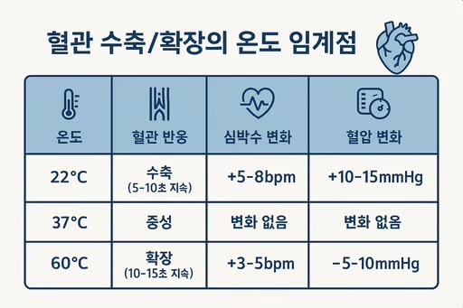
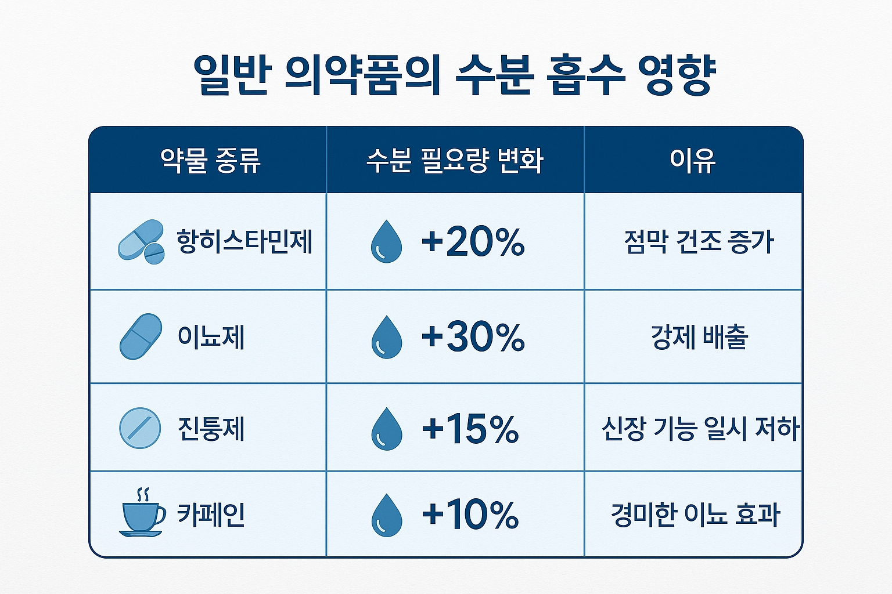

안녕하세요. ALLEX입니다.

매일 먹는 물, 다 똑같은 물이니 먹고 싶을 때 마신다고요?

최신 연구 결과들을 보면 우리가 알고 있던 물 상식 중 상당수가 완전히 틀렸거나 오해가 많습니다. 그동안 잘 몰랐던 물의 비밀들을 과학적 근거와 함께 파헤쳐보겠습니다!

### 차가운 물의 숨겨진 마법: 2°C 물의 효과

**식욕 억제의 비밀 메커니즘**

2°C의 차가운 물 500ml를 식사 1시간 전에 마시면 에너지 섭취량이 19-26% 감소한다는 연구 결과가 있습니다.

하지만 이유가 놀라워요:

- 위장 수축 빈도 감소: 차가운 물이 위의 운동을 억제해 포만감 증가
- 신경계 반응: 차가운 온도가 교감신경을 자극해 식욕 호르몬 분비 변화
- 에너지 소모: 체온으로 데우는 과정에서 약 40%의 열량 소모

**온도별 위장 반응의 차이**

온도에 따른 위장 반응 차이

### 물의 생체시계: 수분 균형의 24시간 리듬

**몸 안 수분의 일일 변화 패턴**

우리 몸의 수분 상태는 24시간 주기로 변화합니다:

- 새벽 6시: 수분 농축도 최고점 (가장 탈수된 상태)
- 오후 2시: 수분 균형 최적점
- 저녁 8시: 수분 과잉 경향
- 밤 11시: 신장 기능 저하로 수분 저장 모드

**핵심: 아침 기상 직후의 수분 섭취가 중요한 이유가 단순히 "밤새 마시지 않아서"가 아니라, 생체시계상 수분 농축도가 최고조이기 때문입니다.**

### 물 온도와 혈관 반응: 1도 차이의 위력

**혈관 수축/확장의 온도 임계점**

22°C vs 37°C vs 60°C섭취 시 혈관 반응:

주의: 심혈관 질환자는 5°C 이하의 차가운 물을 피해야 하는 이유가 여기에 있습니다.

### 수분 흡수의 놀라운 메커니즘

**실온의 물의 압도적 우월성**

흡수 속도 실험 결과:

- 실온 물 (20-25°C): 위장 통과 시간 12-15분
- 차가운 물 (5°C): 위장 통과 시간 18-22분
- 뜨거운 물 (50°C): 위장 통과 시간 20-25분

**한 번에 흡수 가능한 최대량**

인체가 한 번에 흡수할 수 있는 최대 수분량은 약 200-250ml 입니다.

이를 넘으면:

- 남은 물은 위에서 대기
- 신장에 불필요한 부담
- 전해질 불균형 위험

### 뇌와 수분: 인지 능력의 비밀

**1% 탈수의 놀라운 영향**

체중의 1% 탈수만 되어도:

- 단기 기억력 12% 감소
- 집중력 23% 감소
- 반응 속도 15% 저하

**뇌 수분 센서의 위치**

뇌의 시상하부에 있는 수분 센서는 우리에게 여러 신호를 주니 참고하세요.

- 혈액 농도 변화 0.5%만 감지해도 갈증 신호
- 목마름을 느끼기 전에 이미 탈수 시작
- 나이가 들수록 감도 30% 감소

### 약물과 수분 흡수: 잘 몰랐던 상호작용

**일반 의약품의 수분 흡수 영향**

**보충제와 수분의 상호작용**

여러 종류의 보충제를 드실텐데요. 수분 흡수율에 미치는 영향이 다릅니다.

- 마그네슘 보충제: 수분 흡수율 15% 증가
- 나트륨 보충제: 수분 저장 능력 20% 증가
- 칼슘 보충제: 수분 흡수에 중성적 영향

### 운동과 수분: 땀 성분의 개인차

**개인별 땀 성분 분석**

놀랍게도 개인별 땀 성분은 천차만별입니다:

나트륨 농도 (개인차 최대 10배):

- 저농도: 200mg/L, 고농도: 2000mg/L

수분 보충 전략도 개인별로 달라야 하는 이유입니다.

### 수면과 수분: 밤사이 일어나는 일

수면 중 수분 손실의 정확한 양은 아래와 같습니다. 생각보다 많은 양의 수분이 수면 중에 날아갑니다.

8시간 수면 중 수분 손실:

- 호흡을 통해 300-400ml 손실
- 피부를 통해 200-300ml 손실
- 총 손실량 : 500-700ml (놀랍죠)

**수면 중 신장 기능 변화**

항이뇨 호르몬 분비가 밤에 증가하여 소변 생성량은 60% 감소하고, 수분은 40% 재흡수되어 아침 소변 농도가 2-3배 증가합니다.

### 개인 맞춤형 수분 섭취 공식

기본 공식은 (체중 kg × 35ml) + (활동량 보정) + (환경 보정) 입니다. 직업과 활동량에 따라 추가 수분을 보충해야 합니다.

- 사무직: +0ml
- 경활동: +300ml
- 중활동: +500ml
- 고활동: +800ml

본인의 주변 환경에 다라 추가 보충해야할 수분도 있어요.

- 실내: +0ml
- 야외: +200ml
- 에어컨: +100ml
- 히터: +150ml

### 수분 상태 정밀 체크법

아침 기상 직후 체크:

1. 체중 측정 (전날 대비 1% 이상 감소 시 탈수)
2. 소변 색깔 (정밀 기준 적용)
3. 혀 상태 (표면 건조도)
4. 피부 탄력 (2초 이상 복원 시 탈수)

### 주의할 위험 신호들

과수분증(물 중독)의 초기 증상

1시간에 1L 이상**섭취 시, 두통 (혈중 나트륨 희석), 구토감, 손발 저림, 심하면 의식 저하도 나타날 수 있어요.**

### 물 마시기의 새로운 패러다임

지금까지 알려진 물 상식 중 상당수는 개인차와 과학적 근거를 무시한 것들이었습니다.

물은 단순한 H2O가 아니라, 우리 몸의 정교한 시스템과 상호작용하는 복잡한 물질입니다. 이제 과학적 근거에 기반한 똑똑한 수분 섭취를 시작해보세요!

본 내용은 최신 연구를 바탕으로 작성되었으며, 개인의 건강 상태에 따라 적용 방법이 달라질 수 있습니다.

이 글이 도움이 되셨다면 따봉과 댓글 부탁드려요.
