헬스장에 처음 등록하고 들어섰을 때의 그 막막함, 저도 생생하게 기억합니다. 우람한 근육을 자랑하며 무거운 쇳덩이를 들어 올리는 사람들 사이에서, 혹시나 잘못된 자세로 운동하다 다치지는 않을지, 남들이 비웃지는 않을지 걱정부터 앞서기 마련이죠.

특히 **'웨이트 트레이닝'** 구역은 초보자에게 거대한 정글처럼 느껴집니다. 하지만 걱정하지 마세요. 모든 전문 보디빌더도 빈 봉(Bar) 하나 들기 버거워하던 '헬린이' 시절이 있었습니다.

이 글은 헬스를 태어나서 한 번도 해보지 않은 완전 초보자를 위한 **가장 안전하고 현실적인 가이드**입니다. 특히 가장 어려워하시는 **'무게 설정'** 방법과 기구 사용의 기초를 상세히 다뤄, 당장 오늘부터 자신 있게 운동을 시작할 수 있도록 도와드리겠습니다.

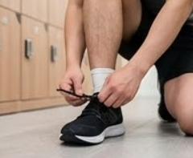

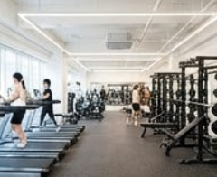

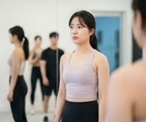

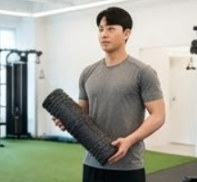

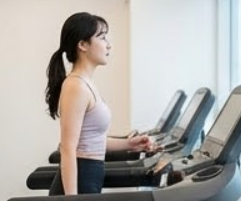

---

### 1. 준비 단계: 마음가짐과 워밍업 (0단계)

본격적인 웨이트 트레이닝에 앞서 가장 중요한 것은 올바른 마음가짐과 몸 상태를 만드는 것입니다. 초보자가 가장 많이 범하는 실수는 의욕만 앞서 준비운동 없이 바로 기구에 앉는 것입니다.

### 남과 비교하지 않는 '마이 웨이' 정신

옆 사람이 엄청난 무게를 든다고 해서 주눅 들 필요가 전혀 없습니다. 웨이트 트레이닝은 철저히 '나 자신과의 싸움'입니다. 초보 시절에는 무게 욕심을 버리고, 올바른 자세를 익히는 데 100% 집중해야 합니다. 잘못된 자세로 고중량을 드는 것보다, 가벼운 무게로 정확한 부위에 자극을 주는 것이 훨씬 성장이 빠르고 안전합니다.

### 필수적인 동적 워밍업

운동 전 스트레칭은 선택이 아닌 필수입니다. 이때 정적인 스트레칭(가만히 늘리는 것)보다는, **동적 스트레칭**(몸을 움직이며 관절을 풀어주는 것)이 좋습니다.

- **추천 방법:** 런닝머신에서 가볍게 5~10분 걷기 → 팔 벌려 뛰기, 고관절 돌리기, 어깨 돌리기 등 관절 가동범위 확보.
- 워밍업은 엔진에 시동을 걸고 예열하는 과정입니다. 예열 없이 급가속하면 엔진이 고장 나듯, 우리 몸도 마찬가지입니다.

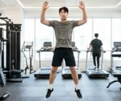

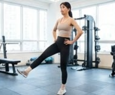

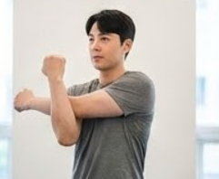

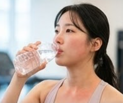

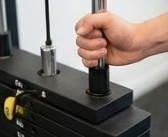

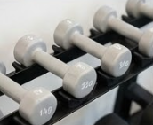

---

### 2. 가장 궁금한 질문: "도대체 몇 kg으로 시작해야 하나요?"

초보자가 가장 혼란스러워하는 부분이 바로 무게 설정입니다. 너무 가벼우면 운동 효과가 없고, 너무 무거우면 다칩니다. 그렇다면 '적당한 무게'의 기준은 무엇일까요?

### 초보자를 위한 황금 규칙: '15회 반복'의 법칙

복잡한 1RM(한 번 들 수 있는 최대 무게)과 같은 계산법은 잠시 잊으셔도 좋습니다. 초보자에게 가장 안전하고 효과적인 기준은 '정확한 자세로 12~15회를 반복할 수 있는 무게'를 찾는 것입니다.

1. **가장 가벼운 무게로 시작:** 처음 접하는 기구라면, 핀을 가장 가벼운 무게 쪽에 꽂거나 빈 봉으로 자세를 먼저 잡아봅니다.
2. **반복 횟수 테스트:** 그 무게로 15회를 수행해 봅니다. 너무 쉽다면 무게를 한 단계 올립니다.
3. **적정 무게 찾기:** 15회를 다 채웠을 때, "아, 2~3개만 더 하면 못 들겠다" 싶은 정도의 무게가 딱 좋습니다. 10개도 못 채우고 자세가 무너진다면 너무 무거운 것입니다.

### 점진적 과부하의 원리 이해하기

근육은 점차 더 강한 자극을 주어야 성장합니다. 처음 설정한 무게로 15회가 너무 쉬워졌다면(예: 20회 이상 가능), 그때 무게를 한 단계(보통 2.5kg~5kg) 올려서 다시 10~12회부터 시작하는 것이 핵심 원리인 '점진적 과부하'입니다.

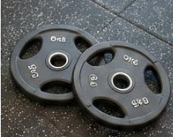

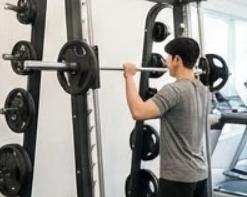

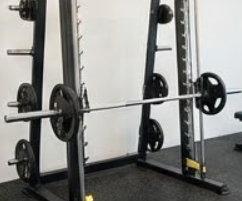

---

### 3. 머신 vs 프리웨이트: 초보자의 선택은? (Feat. 기본 무게)

헬스장에는 크게 정해진 궤적대로 움직이는 '머신 기구'와 덤벨, 바벨처럼 자유롭게 움직이는 '프리웨이트'가 있습니다.

### 초보자는 '머신'과 친해지세요

처음에는 자세를 잡고 균형을 유지하는 근육(안정근)이 발달하지 않았기 때문에, 궤적이 고정되어 있어 부상 위험이 적고 주동근(타겟 근육)에 집중하기 쉬운 **머신 위주로 운동하는 것을 강력 추천**합니다. 머신으로 기초 근력을 다진 후, 프리웨이트로 넘어가는 것이 정석 코스입니다.

### 궁금증 해결: 아무것도 안 꽂은 기계는 몇 kg인가요?

많은 초보자분이 이 부분을 궁금해하십니다. "핀을 하나도 안 꽂으면 0kg 아닌가요?"

- **핀 머신 (Pin loaded machines):** 무게 추에 핀을 꽂아 무게를 조절하는 머신입니다. 이 경우 가장 위의 첫 번째 칸(보통 5kg 또는 10파운드)에 꽂아야 무게가 시작됩니다. 핀을 꽂지 않으면 움직이지 않거나, 기구 자체의 연결 부위 무게만 느껴지는데 이는 무시해도 좋을 수준입니다. 일부 최신 머신은 기본 저항이 약간 걸려있는 경우도 있습니다.
- **스미스 머신 & 플레이트 로디드 머신:** 원판을 직접 끼우는 방식입니다. 이 경우 아무것도 끼우지 않은 **'빈 봉(Bar)'이나 '빈 기구' 자체의 무게**가 존재합니다.

**[헬스장 주요 기구 기본(빈 봉) 무게 대략적 기준]**

| 기구 종류 | 대략적인 기본 무게 | 비고 |
| --- | --- | --- |
| 올림픽 바벨 (긴 봉) | 20kg | 국제 규격. 양쪽 마구리 포함 시 약 25kg |
| 이지바 (구불구불한 봉) | 약 8~10kg | 샵마다 상이함 |
| 스미스 머신 빈 봉 | 약 7~15kg | 기계마다 편차가 큼. (도르래 무게 상쇄 때문) |
| 레그 프레스 (머신) | 약 30~50kg | 발판 자체의 무게가 꽤 나감 |
| 핀 머신 첫 번째 칸 | 보통 5kg (또는 10lb) | 기구에 부착된 스티커 확인 필수 |

*참고: 헬스장마다 기구 제조사가 다르므로, 정확한 무게는 기구에 붙어있는 정보 스티커를 확인하거나 트레이너에게 문의하는 것이 가장 정확합니다.*

---

### 4. 초보자를 위한 첫 번째 '전신 무분할' 루틴 제안

처음부터 가슴, 등, 하체를 날짜별로 나누는 '분할 운동'을 할 필요는 없습니다. 초보자는 주 3회 정도 헬스장에 나가, 하루에 전신의 주요 근육을 조금씩 다 건드려주는 '무분할 루틴'이 근신경계를 깨우는 데 효과적입니다.

다음은 머신 위주의 안전한 전신 루틴 예시입니다. (모든 운동은 워밍업 세트 제외, 본 세트 3세트 x 12~15회 기준)

**[초보자 첫걸음 루틴 체크리스트]**

1. **[하체] 레그 프레스 (Leg Press):** 스쿼트보다 안전하게 허벅지와 엉덩이 근육을 단련합니다. 발판에 발을 대고 밀어낼 때 무릎을 완전히 쫙 펴지 않도록 주의하세요.
2. **[가슴] 체스트 프레스 머신 (Chest Press Machine):** 벤치프레스의 머신 버전입니다. 손잡이가 가슴 중앙이나 약간 하단에 오도록 의자 높이를 조절하고, 어깨가 위로 들리지 않게 고정한 상태로 밀어냅니다.
3. **[등] 렛 풀 다운 (Lat Pull Down):** 턱걸이를 대신하는 대표적인 등 운동입니다. 팔로 당긴다는 느낌보다, 팔꿈치로 옆구리를 찍어 내린다는 느낌으로 등의 광배근을 사용해야 합니다. 허리를 과도하게 꺾지 마세요.
4. **[복근] 크런치 머신 또는 플랭크:** 마무리는 코어 운동입니다. 머신을 이용하거나 맨몸 플랭크로 30초~1분 버티기를 3세트 수행합니다.

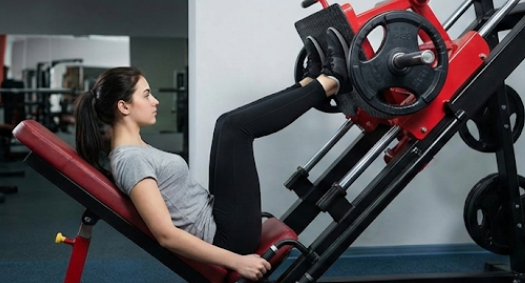

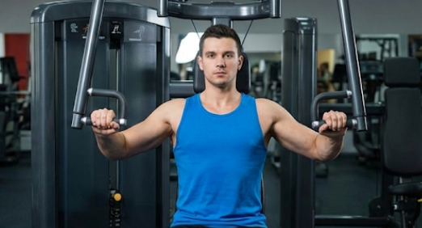

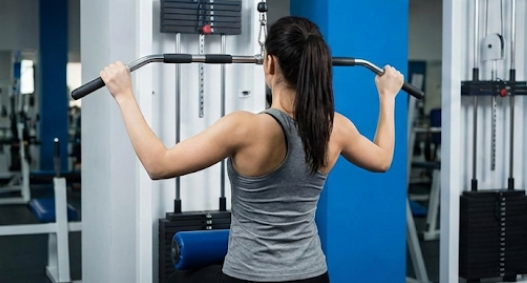

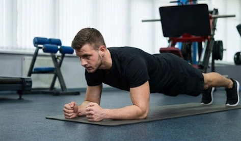

---

### 완벽함보다 꾸준함이 답이다

처음 헬스장에 가서 어색하고 낯선 기분을 느끼는 것은 너무나 당연한 과정입니다. 오늘 이 가이드에서 배운 내용을 바탕으로, 딱 한 가지 운동이라도 좋으니 일단 시작해 보세요.

- 헬스장에 가서 스마트폰은 잠시 넣어두고, 위의 머신 3가지의 위치를 파악하세요.
- 각 머신의 가장 가벼운 무게로 15회씩 자세를 연습해 보고, 나에게 맞는 '첫 무게'를 찾아 메모장에 기록해 오세요.

이 작은 시작이 3개월 뒤, 1년 뒤 완전히 달라진 당신의 몸을 만드는 가장 위대한 첫걸음이 될 것입니다.

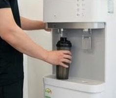

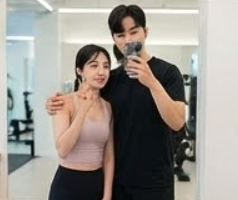

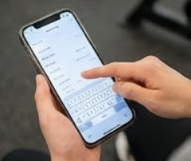

---

### FAQ: 헬스 초보자가 자주 묻는 질문 3가지

**Q1. 운동은 매일 해야 하나요? 근육통이 너무 심해요.**

A1. 초보자 때는 근육이 회복할 시간이 필요합니다. 매일 하는 것보다 **주 3~4회(하루 운동, 하루 휴식 패턴)**를 추천합니다. 운동 후 찾아오는 '지연성 근육통(알 배김)'은 자연스러운 현상이지만, 일상생활이 불가능할 정도로 아프다면 강도를 낮추거나 하루 더 휴식해야 합니다. 통증이 있을 때 가벼운 유산소나 스트레칭은 회복에 도움이 됩니다.

**Q2. 운동 끝나고 단백질 보충제 꼭 먹어야 하나요?**

A2. 필수는 아닙니다. 일반적인 식사(고기, 생선, 두부, 계란 등)로 충분한 단백질을 섭취하고 있다면 굳이 보충제를 먹을 필요는 없습니다. 하지만 바쁜 일상으로 끼니를 제대로 챙기기 어렵다면, 운동 직후 단백질 보충제가 간편한 대안이 될 수 있습니다. 초보자라면 식단을 먼저 점검해 보세요.

**Q3. 뱃살을 빼고 싶은데 복근 운동만 하면 되나요?**

A3. 안타깝게도 특정 부위의 살만 빠지는 운동은 없습니다. 뱃살을 빼려면 식단 조절과 함께 전신 운동(특히 하체와 같은 큰 근육 운동)을 병행하여 전체적인 체지방을 줄여야 합니다. 복근 운동은 배의 근육을 만들어 탄력 있게 보이게 할 뿐, 뱃살 자체를 태우는 효과는 미미합니다.

[중년 고혈압·당뇨·혈당관리, 체력·질병·예방 방법 정리](/entry/중장년층-건강의-핵심-질병-예방과-관리로-똑똑하게-건강-챙기기)

[수영, 아쿠아로빅, 관절 운동](/entry/수영-아쿠아로빅-관절에-부담-없는-최고의-전신-운동)

[허리·코어 강화 운동, 홈트레이닝·스트레칭 방법](/entry/허리-통증-완화에-효과적인-코어-강화-은동)
