운동을 꾸준히 하시는 분들이라면 누구나 한 번쯤 "식비가 운동비보다 더 많이 드네?"라는 생각을 해보셨을 겁니다. 근육을 키우기 위해 하루 권장 단백질량을 채우려다 보면, 어느새 장바구니 가격은 천정부지로 치솟아 있죠. 특히 최근처럼 물가가 불안정할 때는 똑똑하게 단백질을 선택하는 안목이 절실합니다.

무조건 비싼 보충제나 소고기가 정답일까요? 아니면 가장 싼 것만 고집하는 게 정답일까요?

오늘 이 글에서는 **1,000원당 단백질 함량**을 기준으로, 가성비가 가장 좋은 식품부터 가장 '사치스러운' 단백질까지 철저하게 분석해 드립니다. 이 글을 끝까지 읽으시면, 적은 비용으로도 효율적으로 근육을 키울 수 있는 경제적 식단 전략을 완벽히 마스터하게 되실 겁니다.

### 1. 가성비의 제왕: "계란, 두부, 그리고 콩류"

지갑이 가벼울 때 우리를 구원해 줄 가장 강력한 단백질원은 역시 **자연 식품** 중에서도 저렴한 것들입니다. 특히 계란은 '완전 단백질'이면서도 가격 대비 효율이 압도적입니다.

- **달걀:** 한 판(30알) 단위로 구매할 경우, 단백질 1g당 단가가 가장 낮은 축에 속합니다. 요리 활용도도 높죠.
- **두부 및 콩류:** 식물성 단백질은 가성비 면에서 절대적인 우위를 점합니다. 두부 한 모에는 약 20~25g의 단백질이 들어있는데, 세일 기간을 이용하면 1,000원대에 구매할 수 있는 경우도 많습니다.

**"식물성 단백질만 먹으면 아미노산이 부족하지 않나요?"라는 걱정을 하시곤 합니다. 하지만 두부와 쌀밥(곡류)을 함께 먹으면 부족한 아미노산이 서로 보완되어 동물성 단백질 못지않은 효율을 냅니다. 돈을 아끼면서 근육을 키우고 싶다면 이 '조합'을 잊지 마세요.

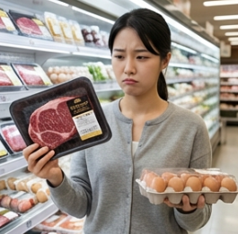

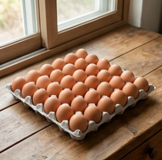

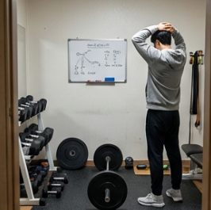

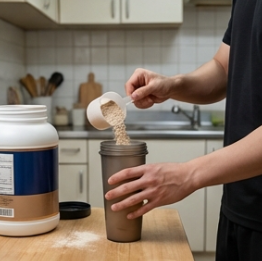

---

### 2. 가성비의 표준: "대용량 냉동 닭가슴살과 벌크 파우더"

'헬스' 하면 떠오르는 닭가슴살은 사실 가성비 면에서 매우 훌륭한 **'표준'**입니다. 하지만 여기서 핵심은 '브랜드'와 '가공 형태'입니다.

- **냉동 생 닭가슴살:** 소스가 발라져 있거나 개별 포장된 제품 대신, 5kg~10kg 단위의 대용량 냉동 생 닭가슴살을 구매하면 가성비는 2~3배 이상 좋아집니다. 조리가 다소 번거롭지만, 단백질 1g당 가격은 보충제와 견줄 만큼 저렴해집니다.
- **벌크 단백질 파우더(WPC):** 2kg 이상의 대용량 WPC 파우더는 사실상 가장 저렴하게 단백질을 섭취하는 방법 중 하나입니다. 한 번 살 때 큰돈이 들지만, 서빙당 가격으로 계산하면 편의점 음료보다 훨씬 경제적입니다.

**예시:** 편의점 단백질 음료(3,000원, 단백질 20g) vs 벌크 파우더 1회 분량(약 800~1,000원, 단백질 25g). 비교가 안 될 정도로 파우더가 저렴하죠?

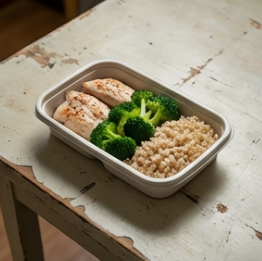

---

### 3. 가성비의 함정: "편의점 단백질 RTD (Ready To Drink)"

편의점에서 흔히 볼 수 있는 '마시는 단백질'이나 '단백질 바'는 바쁜 현대인에게 축복 같지만, **가성비 측면에서는 최악**에 가깝습니다.

- **RTD 제품 및 단백질 음료:** 휴대성과 맛은 훌륭하지만, 패키징 비용과 유통 비용이 포함되어 단백질 1g당 단가가 매우 높습니다. 매일 2~3개씩 마시기에는 지갑에 상당한 무리가 갑니다.
- **가공 육포 및 간식:** 단백질 함량은 높지만, 나트륨 함량이 높고 가격이 비싸 주력 단백질원으로 삼기에는 무리가 있습니다.

이런 제품들은 "식사를 도저히 챙길 수 없는 급박한 상황"이나 "외출 중"일 때만 선택하는 것이 경제적인 운동 생활을 위한 지름길입니다.

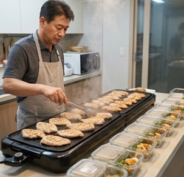

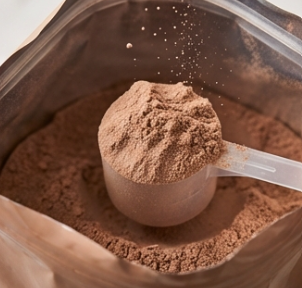

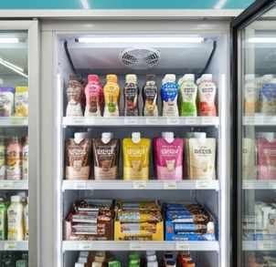

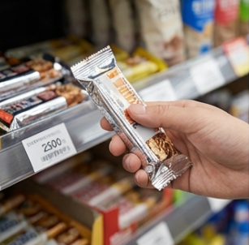

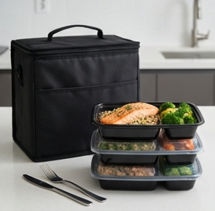

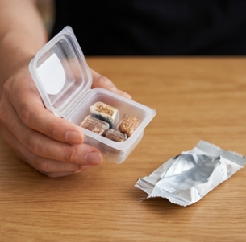

---

### 4. 사치의 영역: "소고기, 연어, 그리고 수입 보충제"

맛과 풍부한 영양소(미네랄, 오메가-3)를 제공하지만, 순수하게 '단백질 섭취 효율'만 따진다면 가장 비싼 선택지입니다.

- **소고기(우둔살 포함):** 크레아틴과 철분이 풍부해 근력 향상에 좋지만, 닭가슴살보다 2~4배가량 비쌉니다. 매일 먹기엔 부담스럽죠.
- **연어 및 신선 수산물:** 건강에는 최고지만 단백질 1g을 얻기 위해 지불해야 하는 비용이 가장 높습니다.
- **프리미엄 수입 WPI:** 특수 공법이나 유명 브랜드 로고가 박힌 수입 보충제는 가성비보다는 '심리적 만족'이나 '소화 효율'에 초점을 맞춘 제품입니다.

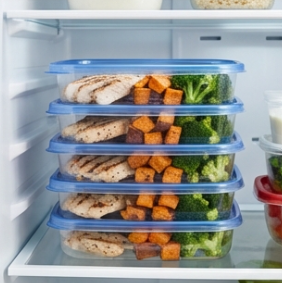

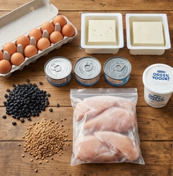

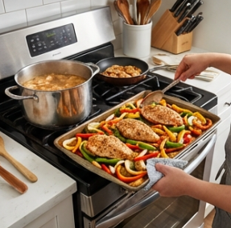

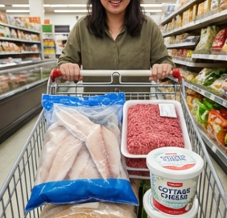

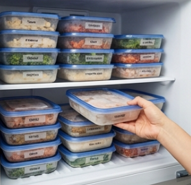

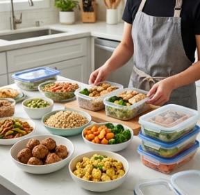

---

### 지갑과 근육을 모두 지키는 전략

가성비 좋은 단백질 섭취의 핵심은 "자연식은 벌크(Bulk)로, 보충제는 대용량으로"입니다.

### [똑똑한 소비자들을 위한 Action Item]

1. **메인 단백질:** 냉동 생 닭가슴살이나 계란을 대량 구매하여 주력으로 섭취하세요. (식비의 60% 이상 절감 가능)
2. **보충제 활용:** 바쁜 시간대나 운동 직후에는 가성비 좋은 WPC 벌크 파우더를 선택하세요.
3. **편의점 금지:** 가공된 단백질 간식이나 음료는 정말 급할 때만 이용하세요.
4. **채소와 곡류의 조합:** 두부나 콩을 식단에 섞어 동물성 단백질의 비중을 조절하면 비용과 건강 모두 챙길 수 있습니다.

돈이 없어서 근육을 못 만든다는 핑계는 이제 그만! 오늘 알려드린 가성비 순위를 참고해 스마트하게 장을 봐보시는 건 어떨까요?

---

### FAQ: 가성비 단백질, 이것도 확인하세요!

**Q1. 너무 싼 단백질 파우더는 품질이 떨어지지 않나요?**

A. 가격이 싸다고 해서 단백질 품질 자체가 낮은 것은 아닙니다.

대량 생산, 마케팅 비용 절감, 단순한 패키징 덕분에 싼 경우가 많습니다.

다만, '아미노 스파이킹(단백질 함량을 속이는 행위)'을 방지하기 위해 신뢰할 수 있는 제조사인지,

단백질 성분 분석표가 공개되어 있는지는 반드시 확인해야 합니다.

**Q2. 유통기한 임박 상품을 사도 괜찮을까요?**

A. 냉동 제품이나 파우더의 경우 유통기한 임박 상품을 파격적으로 할인할 때가 많습니다.

보관만 잘한다면 가성비를 극대화할 수 있는 최고의 기회입니다.

하지만 단백질 파우더는 습기에 취약하므로 개봉 후에는 기한 내에 빠르게 섭취하는 것이 좋습니다.

**Q3. 가성비 때문에 식물성 단백질(두부 등)만 먹어도 근육이 잘 크나요?**

A. 이론적으로 가능합니다만, 식물성 단백질은 동물성에 비해 필수 아미노산인 '류신' 함량이 적은 경우가 많습니다.

근육 합성을 극대화하려면 식물성 단백질을 섭취할 때 평소보다 양을 조금 더 늘리거나,

다양한 종류의 식물성 단백질(콩+쌀+견과류)을 섞어 먹는 전략이 필요합니다.

[웨이트 트레이닝 초보 가이드](/entry/웨이트-트레이닝-초보-가이드)

[운동 시작 전 이것만은 꼭! 중장년층 안전 운동 가이드](/entry/운동-시작-전-이것만은-꼭-중장년층-안전-운동-가이드)

[복부지방의 원인, 단백질 부족](/entry/단백질-부족이-중년-뱃살의-주범)
