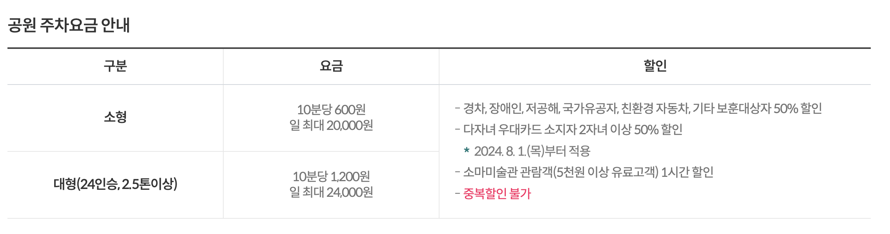
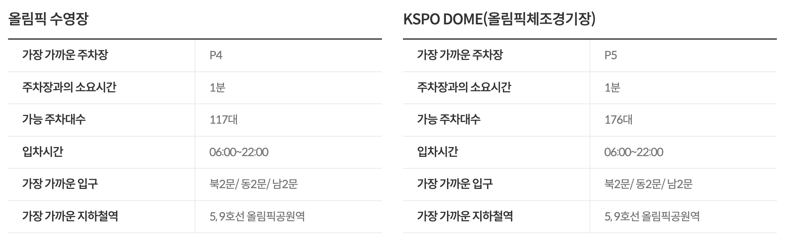
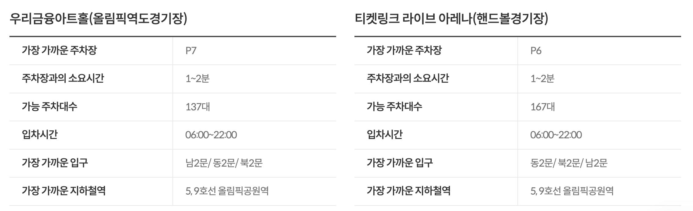

올림픽공원은 서울에서 손꼽히게 넓은 공원입니다. 둘레만 한 바퀴에 5km가 넘다 보니, 아무 문으로나 들어가서 주차하면 목적지까지 한참을 걸어야 합니다. 오늘은 공식 자료를 바탕으로 "어디에 갈 때, 어느 주차장에 대면 좋은지"를 한눈에 정리해 드립니다.

출처 : https://www.ksponco.or.kr/olympicpark/parkingInfo?mid=a20111000000

## 주차 요금부터 확인하세요

올림픽공원 주차장은 모두 후불제입니다. 소형 차량 기준 10분당 600원, 하루 최대 20,000원입니다. 10분 이내에 나오면 무료이고, 한 번 나갔다가 다시 들어오면 요금이 새로 계산되니 주의하세요.

할인도 알아두면 좋습니다. 경차·장애인·저공해·국가유공자·친환경 차량은 50% 할인되고, 다자녀 우대카드 소지자도 2자녀 이상이면 50% 할인됩니다. 소마미술관에서 5천 원 이상 관람하면 1시간 할인을 받을 수 있습니다. 다만 중복 할인은 안 되고, 공연 티켓이 있어도 주차 할인은 따로 없습니다.

## 목적지별 추천 주차장 (이것만 기억하세요)

공식 안내 기준으로 목적지에서 도보 1~2분 거리의 주차장은 다음과 같습니다.

- **KSPO DOME(체조경기장) 공연** → 북2문 쪽 **P5** (176대)
- **올림픽홀 공연** → 동2문 쪽 **P2·올림픽홀 지하주차장** (320대)
- **티켓링크 라이브 아레나(핸드볼경기장)** → 동2문 쪽 **P6** (167대)
- **우리금융아트홀** → 남2문 쪽 **P7** (137대)
- **올림픽수영장** → 북2문 쪽 **P4** (117대)
- **소마미술관·몽촌토성·한성백제박물관 산책** → **남3문 지상·지하주차장**
- **평화의 광장·세계평화의 문** → **남4문 주차장**(전기차 충전 가능한 그린존)

주차장 입차 시간은 06:00~22:00이니, 이른 새벽이나 늦은 밤 방문이라면 미리 확인하세요.

https://www.ksponco.or.kr/olympicpark/parkingInfo?mid=a20111000000

## 상황별 꿀팁: 언제, 어디가 막힐까?

**① 대형 콘서트가 있는 날(주로 KSPO DOME)** — 북2문 P4·P5는 일찌감치 만차가 됩니다. 공식 안내에서도 대형 행사 시 대중교통(5·9호선 올림픽공원역)을 권장합니다. 차를 꼭 가져가야 한다면 공연 2시간 전에는 도착하시고, 동2문 쪽 P1B·P2를 차선책으로 보세요.

**② 벚꽃·장미 시즌 주말 나들이** — 점심 무렵부터 혼잡해집니다. 오전 일찍 도착하는 것이 가장 확실하고, 전기차라면 친환경 전용 구역이 상대적으로 여유 있는 편입니다.

**③ 평일 출퇴근 정기 이용** — 월 180,000원짜리 월주차 제도가 있습니다(월~금만 적용, 주말은 일반 요금). P1A·P2, 소마미술관 지하, 남4문 주차장에서 가능합니다.

[이미지 4: 실시간 주차장 예상 이용률 화면 — 출처: 올림픽공원 온라인 주차 페이지 캡처]

## 출발 전 30초, 혼잡도 미리 보기

올림픽공원 홈페이지에서는 주차장별 혼잡도(원활/혼잡/만차)를 색깔로 보여줍니다. 출발 전에 한 번만 확인해도 공원 앞에서 헤매는 시간을 크게 줄일 수 있습니다.

정리하면, 핵심은 세 가지입니다. **목적지에 맞는 문(門)으로 진입할 것, 행사 있는 날은 2시간 여유를 둘 것, 출발 전 혼잡도를 확인할 것.** 즐거운 올림픽공원 나들이 되시길 바랍니다.

---

※ 본 글의 요금·주차장 정보는 올림픽공원 공식 홈페이지(2026년 6월 확인 기준)를 토대로 작성했습니다. 행사에 따라 주차장 운영이 통제될 수 있으니 방문 전 공식 안내를 확인하세요.

[출처]

- 올림픽공원 공식 '주차 및 혼잡도 안내': [https://www.ksponco.or.kr/olympicpark/parkingInfo?mid=a20111000000](https://www.ksponco.or.kr/olympicpark/parkingInfo?mid=a20111000000)
- 올림픽공원 주차장 예상 이용률(실시간): [https://www.ksponco.or.kr/online/main/parking.do](https://www.ksponco.or.kr/online/main/parking.do)
- 올림픽공원 월주차 안내: [https://www.ksponco.or.kr/online/parking/usage_guide.do](https://www.ksponco.or.kr/online/parking/usage_guide.do)
- 올림픽공원 자주하는 질문(주차): [https://www.ksponco.or.kr/olympicpark/customFaq/list?mid=a20701000000](https://www.ksponco.or.kr/olympicpark/customFaq/list?mid=a20701000000)

[학여울역 SETEC 주차 요금•위치, 외부 주차장(은마상가 주차 꿀팁)](/entry/🅿-학여울역-SETEC-주차-요금•위치-외부-주차장은마상가-꿀팁)

[보라매 서울 국제 정원박람회 요금, 기간, 교통, 주차 총정리 (8월 야간개장)](/entry/서울-국제-정원박람회-기간·교통·프로그램-주차-총정리)

[킨텍스 주차요금·위치·가까운 주차장](/entry/킨텍스-주차-완벽-가이드-주차요금·위치·가까운-주차자리)
