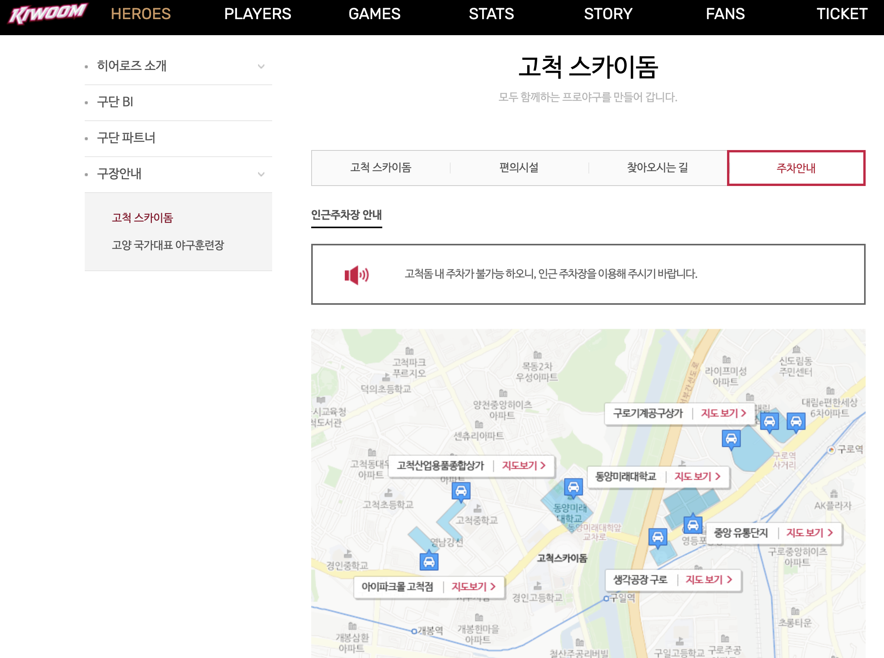
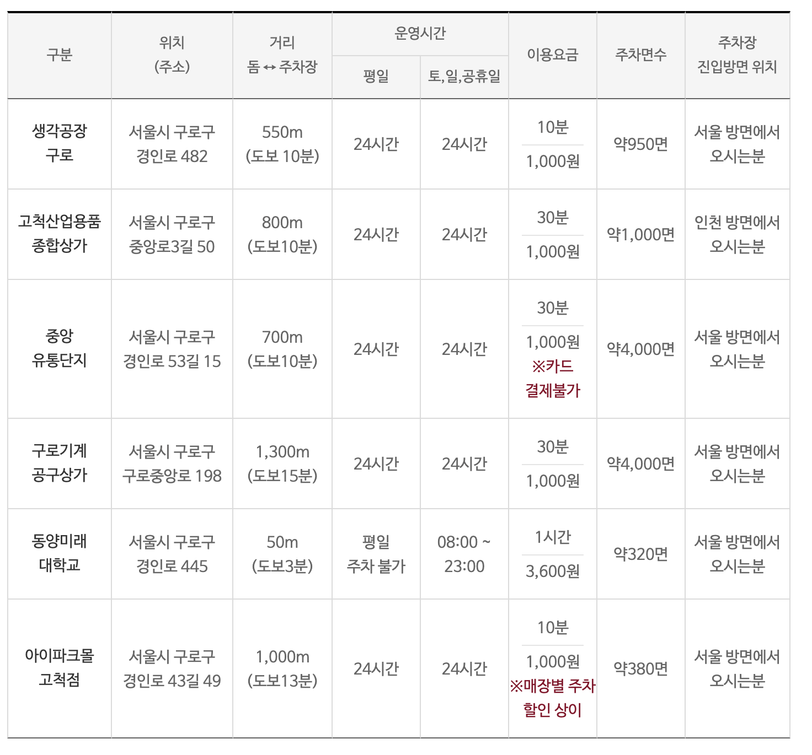

야구 직관이나 콘서트로 고척스카이돔에 처음 가시는 분들이 가장 많이 하는 실수가 있습니다. "돔에 주차장 있겠지" 하고 차를 끌고 갔다가 입구에서 돌아 나오는 것입니다. 결론부터 말씀드리면, 고척돔은 경기나 행사가 있는 날에는 일반 관람객이 돔 안에 주차할 수 없습니다. 오늘은 그 이유와 함께, 실제로 댈 수 있는 인근 주차장을 정리해 드립니다.

출처 : https://www.sisul.or.kr/open_content/skydome/introduce/location.jsp

## 왜 돔 주차장을 못 쓰나요?

고척스카이돔에는 지하에 484면 규모의 부설주차장이 있습니다. 하지만 야구 경기나 공연이 열리는 날에는 주최 측이 주차장 전체를 통째로 빌려(통대관) 선수단·관계 차량용으로 쓰기 때문에 일반 관람객 이용이 제한됩니다. 키움 히어로즈 구단 공식 안내에도 "고척돔 내 주차가 불가능하니 인근 주차장을 이용하라"고 명시되어 있습니다.

즉, 관람객 입장에서는 행사 날 기준 "고척돔 주차장은 없다"고 생각하시는 편이 마음 편합니다.

## 그럼 어디에 대야 하나? 인근 주차장 5곳

거리순으로 정리했습니다. (요금은 변동될 수 있으니 참고용으로 보세요)

- **동양미래대학교 주차장** (도보 1~3분) — 돔 바로 길 건너입니다. 가장 가깝지만 평일 개방이 제한적이고, 가까운 만큼 경쟁이 가장 치열합니다.
- **중앙유통단지 주차장** (약 700m, 도보 10분) — 상가 주차장이라 자리가 비교적 넉넉합니다.
- **고척산업용품종합상가 주차장** (약 800m, 도보 10분) — 24시간 운영, 30분 1,000원 수준으로 저렴한 편입니다.
- **아이파크몰 고척점** (약 1km) — 쇼핑·식사를 겸하면 매장별 주차 할인을 받을 수 있습니다.
- **구로기계공구상가 주차장** (약 1.3km, 도보 15분) — 약 4,000면으로 가장 넓습니다. "확실하게 대고 좀 걷겠다"는 분께 추천합니다.

출처 : https://heroesbaseball.co.kr/heroes/stadium/parking.do

## 상황별 전략

**① 키움 홈경기·매진 경기** — 가까운 주차장부터 차례로 만차가 됩니다. 경기 시작 2시간 전 도착을 기본으로 잡으시고, 내비게이션에 2~3곳을 미리 즐겨찾기해 두세요.

**② 대형 콘서트** — 야구보다 혼잡합니다. 공단에서도 입·출차에 시간이 많이 걸린다며 대중교통을 공식 권장합니다. 1호선 고척스카이돔역(구 구일역)에서 도보 약 5분이니, 이 날만큼은 지하철이 정답에 가깝습니다.

**③ 경기 없는 평일 방문(수영장·축구장 등)** — 행사가 없는 날에는 부설주차장 이용이 가능합니다. 다만 운영 여부가 행사 일정에 따라 달라지니 방문 전 공단(02-2128-2300)에 확인하시는 게 안전합니다.

마지막 꿀팁 하나. 경기·공연이 끝나면 수천 대가 한꺼번에 빠져나가 출차에만 30분 이상 걸리기도 합니다. 끝나기 10분쯤 먼저 나오거나, 근처에서 차 한잔하고 여유 있게 출발하시는 것도 방법입니다.

---

※ 본 글은 서울시설공단·키움 히어로즈 공식 안내(2026년 6월 확인 기준)와 방문자 정보를 토대로 작성했습니다. 인근 주차장 요금·운영시간은 업체 사정에 따라 바뀔 수 있으니 방문 전 주차 앱(아이파킹·모두의주차장 등)으로 확인을 권합니다.

[출처]

- 서울시설공단 고척스카이돔 주차장 안내: [https://www.sisul.or.kr/open_content/skydome/guidance/parking.jsp](https://www.sisul.or.kr/open_content/skydome/guidance/parking.jsp)
- 서울시설공단 찾아오시는 길(승용차): [https://www.sisul.or.kr/open_content/skydome/introduce/location_car.jsp](https://www.sisul.or.kr/open_content/skydome/introduce/location_car.jsp)
- 키움 히어로즈 공식 주차안내: [https://heroesbaseball.co.kr/heroes/stadium/parking.do](https://heroesbaseball.co.kr/heroes/stadium/parking.do)
- 인근 주차장 정보 참고: [https://sportstrends.co.kr/고척스카이돔-주차장/](https://sportstrends.co.kr/고척스카이돔-주차장/)

[올림픽공원 주차장 총정리, 목적지별 추천 주차장과 요금, 헷갈리지 않는 법](/entry/올림픽공원-주차장-총정리-목적지별-추천-주차장과-요금-헷갈리지-않는-법)

[학여울역 SETEC 주차 요금•위치, 외부 주차장(은마상가 주차 꿀팁)](/entry/🅿-학여울역-SETEC-주차-요금•위치-외부-주차장은마상가-꿀팁)
